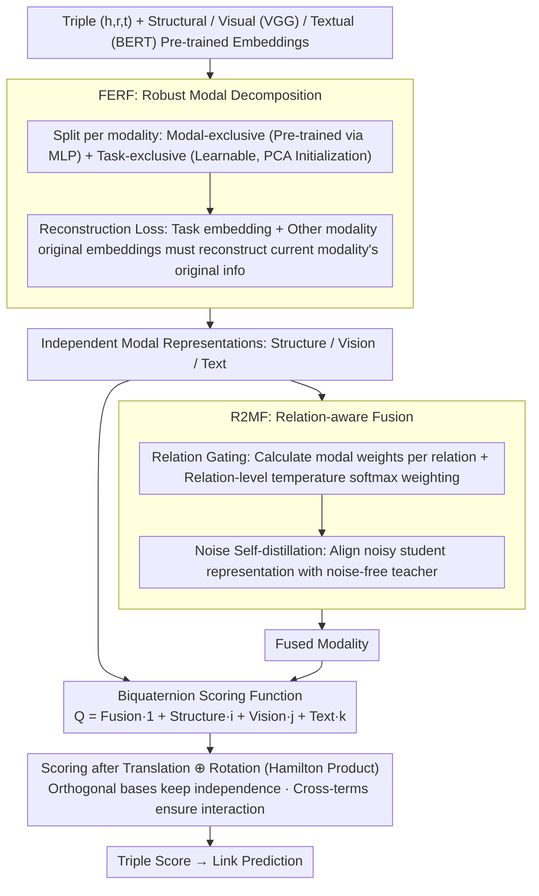

# Collaboration of Fusion and Independence: Hypercomplex-driven Robust Multi-Modal Knowledge Graph Completion

**Conference**: ACL 2026  
**arXiv**: [2509.23714](https://arxiv.org/abs/2509.23714)  
**Code**: https://github.com/zjukg/M-Hyper (Available)  
**Area**: Multi-modal Fusion / Knowledge Graph Completion / Representation Learning  
**Keywords**: Multi-modal Knowledge Graphs, Hypercomplex Space, Biquaternion, Modal Fusion, Link Prediction

## TL;DR
M-Hyper encodes multi-modal knowledge graph entities into four orthogonal bases of a biquaternion, carrying three independent modalities (Structure/Visual/Textual) and one fused modality respectively. Through the Hamilton product, it simultaneously achieves "modal independence preservation" and "pairwise sufficient interaction," outperforming 18 baselines on DB15K, MKG-W, and MKG-Y datasets with minimal memory usage and training time.

## Background & Motivation
**Background**: Multi-modal Knowledge Graph Completion (MMKGC) currently follows two mainstream paths: fusion-based (IKRL, OTKGE, AdaMF, MyGO, etc.), which compress multi-modality into a unified representation using explicit fusion modules or cross-modal losses; and ensemble-based (MoSE, IMF, MoMoK, etc.), which train independent sub-models for each modality and make joint decisions.

**Limitations of Prior Work**: Fusion-based methods rely on fixed fusion strategies, inevitably losing modality-unique information and failing to adjust modal weights dynamically according to different relations. Ensemble-based methods retain modal independence but lack deep cross-modal interaction mechanisms, making it difficult to model subtle dependencies between modalities under complex relations.

**Key Challenge**: Modality contributions in MMKGs are dynamic, context-aware, and task-dependent. There is a need to both maintain modal independence (avoiding fusion loss) and ensure sufficient cross-modal interaction (capturing modal synergy). These two requirements are nearly impossible to satisfy simultaneously in traditional Euclidean vector spaces.

**Goal**: Design a representation space where "independent modalities" and "fused modalities" co-exist, naturally supporting pairwise modal interactions while possessing the translation and rotation capabilities for relation modeling.

**Key Insight**: The authors notice that quaternion algebra has 4 linearly independent orthogonal bases $\{\mathbf{1}, \mathbf{i}, \mathbf{j}, \mathbf{k}\}$, and the Hamilton product naturally generates all pairwise cross-terms—this perfectly accommodates "3 independent modalities + 1 fused modality." Furthermore, using biquaternions (quaternions with complex coefficients) allows for the simultaneous modeling of both translation and rotation relation transformations.

**Core Idea**: Map structural, visual, textual, and fused modalities onto the four orthogonal bases of a biquaternion. Use the Hamilton product as the scoring function, where independence is guaranteed by the orthogonality of the bases, and interaction is provided by the cross-terms of the product.

## Method

### Overall Architecture
M-Hyper seeks a representation space where "independent modalities" and "fused modalities" co-exist while naturally supporting pairwise interaction—neither losing unique information like fusion-based methods nor lacking deep interaction like ensemble-based methods. It leverages the four linearly independent orthogonal bases of quaternion algebra to place structural, visual, and textual modalities, along with a fused modality, onto the four bases of a biquaternion. After inputting the triple $(h,r,t)$ and pre-trained structural embeddings $\mathbf{e}^s$, visual embeddings $\mathbf{e}^v$ (VGG), and textual embeddings $\mathbf{e}^t$ (BERT), the FERF module decomposes each independent modality into more robust representations. Then, the R2MF module performs relation-aware fusion to obtain the fused modality $\hat{\mathbf{e}}^j$. These are assembled into $Q = \hat{\mathbf{e}}^j + \hat{\mathbf{e}}^s \mathbf{i} + \hat{\mathbf{e}}^v \mathbf{j} + \hat{\mathbf{e}}^t \mathbf{k}$, followed by a biquaternion scoring function involving both translation and rotation. Orthogonality ensures modality independence, while Hamilton product cross-terms ensure modality interaction.

### Key Designs

**1. FERF: Decomposing modalities into "Modal-exclusive + Task-exclusive" to denoise without losing pre-trained semantics**

Simply using pre-trained encoder outputs can be contaminated by modal noise and cross-modal semantic ambiguity; simply using learnable embeddings loses the semantics from pre-training. FERF splits the representation for each modality $m$ into two paths: modal-exclusive $\mathbf{e}^m_m$ (pre-trained encoder output through an MLP, carrying original modal information) and task-exclusive $\mathbf{e}^m_t$ (learnable embeddings, initialized by PCA on visual/textual data to extract coarse-grained information). The final representation is $\hat{\mathbf{e}}^m = \mathbf{e}^m_m + \mathbf{e}^m_t$. A reconstruction loss $\mathcal{L}_{recon} = \sum_m \|\mathcal{E}^m(\mathbf{e}^m_t; \{\mathbf{e}^{\hat{m}}_m: \hat{m} \neq m\}) - \mathbf{e}^m_m\|^2$ constrains the system: "task embeddings + original embeddings of other modalities" must reconstruct the original information of the current modality. This forces the task embedding to retain its own modal characteristics while collaborating with others, resulting in a denoised and semantically complete independent modal representation.

**2. R2MF: Relation-aware gating fusion + Noise self-distillation for relation-adaptive and noise-resistant fusion**

Fixed fusion strategies fail to adapt to the reality that "different relations rely on different modalities" (e.g., *born_in* depends more on text, *has_color* on vision). R2MF first performs relation-aware gating: an MLP computes modal weights $w^m$ based on $[\hat{\mathbf{e}}^m; \mathbf{r}^T; \mathbf{r}^R]$, then relation-level learnable temperatures $\tau_r$ produce softmax weights $\hat{w}^m(e,r) = \exp(w^m/\tau_r) / \sum_i \exp(w^i/\tau_r)$. A weighted sum is taken and supplemented with a fusion-exclusive task embedding $\mathbf{e}^j_t$. Furthermore, noise self-distillation is applied: Gaussian noise $\tilde{\mathbf{e}}^m \sim \mathcal{N}(\bm{\varphi}^m, \bm{\mu}^m)$ is added to original embeddings to get a student fused representation $\hat{\mathbf{e}}^{j'}$, with the noise-free $\hat{\mathbf{e}}^j$ acting as a teacher via $\mathcal{L}_{distill} = \frac{1}{n}\sum \|\hat{\mathbf{e}}^j_i - \hat{\mathbf{e}}^{j'}_i\|^2$. This approach is similar to noise enhancement in AdaMF/MoMoK but adds task embeddings and distillation supervision for better stability against missing or perturbed modalities.

**3. Biquaternion Scoring Function: Accommodating "Independence + Interaction + Translation + Rotation" in one algebraic structure**

Ensemble methods only calculate intra-modal scores, while fusion methods lose independence; neither is comprehensive. M-Hyper places $\hat{\mathbf{e}}^j, \hat{\mathbf{e}}^s, \hat{\mathbf{e}}^v, \hat{\mathbf{e}}^t$ onto the $\mathbf{1}, \mathbf{i}, \mathbf{j}, \mathbf{k}$ bases of a biquaternion (coefficients remain complex numbers). Relations learn two sets of embeddings $Q_r^T, Q_r^R$ for translation and rotation. The scoring first performs translation $Q_{h'} = Q_h \oplus Q_r^T$, then rotation $Q_{h''} = Q_{h'} \otimes Q_r^R$ via Hamilton product, and finally takes the inner product with $Q_t$: $\phi(h,r,t) = \langle (Q_h \oplus Q_r^T) \otimes Q_r^R, Q_t \rangle$. The Hamilton product expansion naturally produces all pairwise cross-terms $\hat{\mathbf{e}}^m_h \cdot \hat{\mathbf{e}}^{m'}_t$ (Theorem 2 provides the algebraic proof), ensuring sufficient modal interaction, while the linear independence of orthogonal bases ensures modality information does not overlap. Information Bottleneck analysis (Theorem 1) proves this representation is strictly superior to pure fusion $T_f$ and pure ensemble $T_{ens}$: $\mathcal{L}_{IB}(Q) < \min(\mathcal{L}_{IB}(T_f), \mathcal{L}_{IB}(T_{ens}))$.

### Loss & Training
The total loss is $\mathcal{L}_{total} = \mathcal{L}_{recon} + \mathcal{L}_{distill} + \mathcal{L}_{triple} + \mathcal{L}_{reg}$, where $\mathcal{L}_{triple}$ is standard cross-entropy (using 1-vs-all candidate entities) and $\mathcal{L}_{reg}$ is N3 regularization. The optimizer is Adagrad with batch size 1000, $d=128$, $\lambda=0.005$, noise rate $\beta=0.2$, and learning rate $\alpha=0.1$. Training includes reverse triples $(t, r^{-1}, h)$ for every $(h,r,t)$.

## Key Experimental Results

### Main Results
On DB15K, MKG-W, and MKG-Y benchmarks, M-Hyper is compared against 18 baselines (6 uni-modal KGE and 12 MMKGC methods):

| Dataset | Metric | M-Hyper | Prev. SOTA (MoMoK) | Gain |
|---------|--------|---------|-------------------|------|
| DB15K | MRR | **41.25** | 39.57 | +1.68 |
| DB15K | Hit@10 | **56.09** | 54.14 | +1.95 |
| MKG-W | MRR | **37.02** | 36.10 (MyGO) | +0.92 |
| MKG-W | Hit@10 | **48.84** | 47.75 (MyGO) | +1.09 |
| MKG-Y | MRR | **39.46** | 38.44 (MyGO) | +1.02 |
| MKG-Y | Hit@10 | 45.22 | 45.48 (AdaMF) | -0.26 |

Average MRR increased by approx. 4.25%, and Hit@10 by approx. 3.89%. Efficiency analysis shows M-Hyper has the **shortest training time per epoch** among the six compared methods and near-optimal GPU memory usage—reaching 40.75% MRR in just 1160 seconds.

### Ablation Study

| Configuration | DB15K MRR | MKG-W MRR | MKG-Y MRR | Description |
|---------------|-----------|-----------|-----------|-------------|
| M-Hyper (Full) | **41.25** | **37.02** | **39.46** | — |
| w/o Fused modality $\hat{\mathbf{e}}^j$ | 36.36 | 35.09 | 36.71 | Most severe drop, proving fusion is core |
| w/o Visual $\hat{\mathbf{e}}^v$ | 35.09 | 36.46 | 37.95 | Visual info is critical for DB15K |
| w/o Structure $\hat{\mathbf{e}}^s$ | 39.77 | 34.62 | 38.03 | Structure info is critical for MKG-W |
| w/o FERF | 39.24 | 35.93 | 37.93 | Robust decomposition contributes significantly |
| w/o Noise Distill | 39.64 | 36.10 | 38.16 | Distillation helps ~1.6 MRR |
| w/o Relation Gating | 40.18 | 36.18 | 38.21 | Dynamic fusion provides moderate gain |
| w/o Rotation $\mathbf{r}^R$ | 38.91 | 36.46 | 37.78 | Drop after degrading to quaternion; proves complex rotation power |
| M-Hyper-fusion variant | 39.23 | 35.54 | 37.52 | Significant loss with pure fusion |
| M-Hyper-ensemble variant | 39.31 | 34.75 | 37.58 | Significant loss with pure ensemble |

### Key Findings
- Removing the **fused modality $\hat{\mathbf{e}}^j$** causes the largest performance drop (-4.89 MRR on DB15K), proving that the real part of the biquaternion carries critical cross-modal synergy signals; fusion is necessary, not redundant.
- Removing **rotation $\mathbf{r}^R$** (degrading from biquaternion to quaternion) results in drops across all datasets, indicating that rotation in the complex domain genuinely increases expressive power.
- M-Hyper outperforms AdaMF and MoMoK in scenarios with missing modalities, modal noise, and link sparsity. Specifically, the combination of task embeddings and self-distillation is notably more stable than simple noise enhancement in missing modality scenarios.
- t-SNE visualization shows that the fused modality has the highest discriminative power for city-country relations, and the separability of independent modalities improves significantly after FERF + R2MF.

## Highlights & Insights
- **Algebraic Structure as Representation Constraint**: Using the 4 orthogonal bases of biquaternions to encode "3 Independent + 1 Fused" is an elegant design. Orthogonality automatically ensures independence, and the Hamilton product automatically generates pairwise interactions, eliminating the need for extra regularization terms. This idea of letting mathematical structures rather than loss functions bear representation constraints can be transferred to any multi-view co-existence tasks.
- **FERF's "Modal-exclusive + Task-exclusive" Decomposition**: Effectively uses reconstruction loss to distinguish "information that must be contributed by the current modality" from "information that can be obtained via cross-modal collaboration"—a more refined approach than pure decoupling.
- **Three-in-one Scoring Function**: Integrating dual transformations (rotation + translation) with multi-modal semantics in the biquaternion space is a culmination of KGE scoring function evolution.
- The theoretical proof from the Information Bottleneck perspective (Theorem 1) provides a formal explanation for why biquaternions outperform pure fusion/ensemble, rather than relying solely on MRR metrics.

## Limitations & Future Work
- The authors acknowledge the limitation to **transductive** static MMKGC, unable to handle dynamic scenarios with new entities, relations, or modalities. Future work requires an online learning or incremental adaptation framework.
- Observation: The 8d dimensionality of the biquaternion space naturally doubles the parameter count compared to quaternions. While it claims optimal efficiency, this is due to concise model design rather than the space itself; advantages may diminish as $d$ increases.
- Robustness experiments only consider random noise/omissions, not adversarial attacks; the gain from noise distillation (~1.6 MRR) is not overwhelmingly large.
- Potential to explore transferring "Co-existence and Collaboration" ideas to entity alignment, KGQA, and NER.

## Related Work & Insights
- **vs MoMoK (ICLR 2025)**: MoMoK uses MoE to decouple modalities and minimizes mutual information for independence but lacks explicit interaction between sub-models. M-Hyper uses biquaternion algebra for both, achieving +1.68 MRR on DB15K.
- **vs MyGO (AAAI 2025)**: MyGO uses fine-grained multi-modal tokenization via fusion, losing modal independence. M-Hyper retains independent modalities as imaginary parts, slightly outperforming it on MKG-W/MKG-Y.
- **vs BiQUE (EMNLP 2021)**: BiQUE embeds uni-modal KGs into biquaternion space for rotation + translation but only handles structure. M-Hyper is the first to extend biquaternions to multi-modal scenarios.
- **vs AdaMF (LREC-COLING 2024)**: AdaMF uses adversarial training for noise enhancement. M-Hyper uses self-distillation + task embeddings for "gentler" robustification, avoiding the instability of adversarial training.

## Rating
- Novelty: ⭐⭐⭐⭐⭐ First to introduce biquaternions to MMKGC; mapping modalities to algebraic bases is a highly original design.
- Experimental Thoroughness: ⭐⭐⭐⭐⭐ 3 Datasets × 18 Baselines × 3D Ablation + Robustness + Efficiency + Visualization; very solid.
- Writing Quality: ⭐⭐⭐⭐ Methodology and theory are clear, though biquaternion algebra derivations have a high barrier for non-mathematical readers.
- Value: ⭐⭐⭐⭐ New SOTA in MMKGC; the "algebraic structure as constraint" idea is insightful for multi-view/multi-modal fields, though application value outside KG needs further validation.

<!-- RELATED:START -->

## Related Papers

- [\[ACL 2026\] GS-Quant: Granular Semantic and Generative Structural Quantization for Knowledge Graph Completion](gs-quant_granular_semantic_and_generative_structural_quantization_for_knowledge_.md)
- [\[ICLR 2026\] Learning with Dual-level Noisy Correspondence for Multi-modal Entity Alignment](../../ICLR2026/graph_learning/learning_with_dual-level_noisy_correspondence_for_multi-modal_entity_alignment.md)
- [\[AAAI 2026\] MyGram: Modality-aware Graph Transformer with Global Distribution for Multi-modal Entity Alignment](../../AAAI2026/graph_learning/mygram_modality-aware_graph_transformer_with_global_distribution_for_multi-modal.md)
- [\[ACL 2026\] ComplianceNLP: Knowledge-Graph-Augmented RAG for Multi-Framework Regulatory Gap Detection](compliancenlp_knowledge-graph-augmented_rag_for_multi-framework_regulatory_gap_d.md)
- [\[NeurIPS 2025\] RAD: Towards Trustworthy Retrieval-Augmented Multi-modal Clinical Diagnosis](../../NeurIPS2025/graph_learning/rad_towards_trustworthy_retrieval-augmented_multi-modal_clinical_diagnosis.md)

<!-- RELATED:END -->
