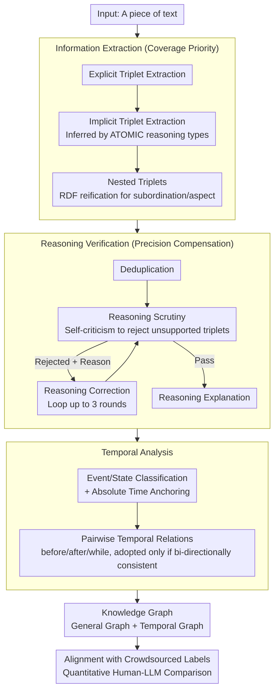

# Comparing Human and Large Language Model Interpretation of Implicit Information

**Conference**: ACL 2026 Findings  
**arXiv**: [2604.17085](https://arxiv.org/abs/2604.17085)  
**Code**: Yes (Link provided in the paper)  
**Area**: Knowledge Graphs / Implicit Information Understanding  
**Keywords**: Implicit information extraction, Knowledge graphs, Human-LLM comparison, Reasoning verification, Temporal analysis

## TL;DR

This paper proposes the Implicit Information Extraction (IIE) task and an LLM-based three-stage extraction pipeline (Information Extraction → Reasoning Verification → Temporal Analysis). It constructs structured knowledge graphs to represent the implicit meanings of text. Through comparisons with crowdsourced human judgments, it finds that LLMs are more conservative than humans in socially rich contexts, while humans are more conservative in short factual contexts.

## Background & Motivation

**Background**: While LLMs excel in various NLP tasks, human communication is based on the "interpretive cooperation" framework—where text meaning is collaboratively created by authors and readers, and readers actively interpret implicit meanings. It remains unclear whether this framework applies to interactions involving LLM-generated text.

**Limitations of Prior Work**: (1) Existing information extraction research focuses on explicit information, neglecting implicit information; (2) Open Information Extraction (OIE) does not distinguish between explicit and implicit triplets; (3) There is a lack of a systematic framework for comparing human and LLM understanding of implicit information.

**Key Challenge**: LLM-generated text is superficially indistinguishable from human text, but do LLMs understand and infer implicit information like humans do? If they differ, where do the discrepancies lie?

**Goal**: (1) Design an automated implicit information extraction pipeline; (2) Systematically compare the similarities and differences between humans and LLMs in implicit inference; (3) Analyze the primary factors driving reasoning and context dependency.

**Key Insight**: Modeling the understanding of implicit information as a knowledge graph construction task—extracting relational triplets, verifying reasoning validity, and analyzing temporal relations—attaining quantitative comparisons with human crowdsourced judgments.

**Core Idea**: The differences between LLMs and humans in implicit reasoning are context-dependent—LLMs are more conservative in social scenarios, whereas humans are more conservative in factual scenarios.

## Method

### Overall Architecture

The paper formalizes "understanding the implicit meaning of a text" as a knowledge graph construction problem: given an input text, it outputs a set of structured triplets containing both explicitly stated relations and implicit relations inferred by the reader. A three-stage LLM pipeline was designed: the **Information Extraction** stage extracts as many entities and relational triplets as possible (prioritizing coverage); the **Reasoning Verification** stage uses model self-criticism to filter out implicit inferences lacking textual support (compensating for precision); the **Temporal Analysis** stage determines the sequential structure between events. The final graph is output in two parts: a "General Graph + Temporal Graph," which is then aligned with crowdsourced human annotations for quantitative comparison. The entire pipeline is driven by few-shot prompting without fine-tuning, making it applicable to black-box LLMs.

### Key Designs

**1. Structuring "Implicit Inference" using ATOMIC reasoning types.** Asking a model to "infer all implicit meanings" is too vague and results in inconsistent coverage. This paper adopts the ATOMIC commonsense reasoning taxonomy, breaking down inferable implicit relations into fixed categories such as preconditions, postconditions, participant intent, emotional reactions, and perceived attributes. The model is guided to systematically brainstorm what premises, consequences, or intents are implied, ensuring better coverage of the implicit layer.

**2. Nested triplets for complex syntax.** Not all information fits into a flat (subject, relation, object) structure, particularly subordinate clauses and aspectual verbs. Inspired by RDF reification, the paper allows the object of a triplet to be another complete triplet, forming recursive nesting—e.g., "Jordan heard Bob was looking for her" is encoded as (JORDAN, HEARD, (BOB, WASLOOKINGFOR, JORDAN)). The inner triplet is treated as an independent implicit relation, significantly improving expressiveness without sacrificing formalization.

**3. Reasoning Verification: Iterative self-criticism.** To ensure recall, the first stage may over-generate speculative triplets. The verification stage first performs deduplication (removing entries semantically redundant with explicit triplets), then has the model scrutinize whether each implicit triplet is strictly supported by the text. Rejected triplets are returned with a rationale for the model to attempt a correction without altering the original intent. To avoid infinite loops, triplets are discarded after three failed attempts. Validated triplets also provide "Reasoning Explanations" to reveal the model's inferential basis.

**4. Temporal Analysis: Distinguishing events/states and validating pairwise relations.** The first two stages ignore time to keep triplets isomorphic. This stage classifies triplets as either events (situations that happen) or states (conditions that persist) and extracts absolute time anchors. It then performs pairwise checks for temporal relations (before / after / while / none). To combat hallucinations, each pair is queried in both orders; a relation is only accepted if the two judgments are consistent (e.g., before-after), otherwise, they are deemed unrelated.

### Loss & Training

The approach is entirely based on few-shot prompting and does not involve fine-tuning, making it suitable for any black-box LLM. Evaluations are conducted on two datasets using crowdsourced human judgments as a baseline, utilizing direct triplet matching and consistency questions for quantitative analysis.

## Key Experimental Results

### Main Results

**Comparison of Implicit Information Extraction: LLM vs. Human**

| Metric | GPT-4o | Claude 3.5 | Human |
|------|--------|-----------|------|
| Explicit Triplet Coverage | High | High | Baseline |
| Implicit Triplet Coverage | Limited | Limited | Significantly More |
| Human Agreement with Model Triplets | High | High | - |
| Extra Triplets Suggested by Humans | Many | Many | - |

### Ablation Study

| Context Type | LLM Conservativeness | Human Conservativeness | Description |
|----------|-----------|-----------|------|
| Socially Rich | **More Conservative** | More Open | LLMs struggle with nuanced social reasoning |
| Short Factual | More Open | **More Conservative** | Humans are cautious with factual inferences |

### Key Findings

- Humans agree with most triplets extracted by LLMs but consistently suggest many additions, indicating that LLM implicit reasoning coverage is limited.
- LLMs are more conservative than humans in socially rich contexts, reflecting a deficiency in social reasoning depth.
- Humans are more conservative than LLMs in short factual contexts, likely because humans recognize the risks of over-inferring from limited data.
- Consensus among humans regarding implicit information is moderate, highlighting the inherent subjectivity of implicit meaning.
- Temporal reasoning remains an LLM weakness, with relatively low accuracy in determining event sequences.

## Highlights & Insights

- Formalizing implicit information understanding as a knowledge graph construction task provides a measurable framework for human-LLM comparison.
- The finding that "LLMs are conservative in social scenarios while humans are conservative in factual scenarios" offers a new perspective on the cognitive differences between humans and AI.
- The design of nested triplets handles complex grammatical structures while maintaining formal rigor.

## Limitations & Future Work

- Triplet formats cannot fully capture all implicit nuances such as irony, subtext, or deep cultural background.
- Reasoning verification relies on self-criticism, which may harbor systemic biases.
- Crowdsourced annotations might not match the precision of expert linguists.
- The study is limited to English text; cross-linguistic differences in implicit understanding remain unexplored.

## Related Work & Insights

- **vs ATOMIC**: ATOMIC provides structured commonsense categories; this work adapts them into a guided framework for IIE.
- **vs Open Information Extraction (OIE)**: OIE lacks the explicit/implicit distinction that this work focuses on.
- **vs NLI**: While NLI deals with discrete entailment labels, this work extracts open-set structured triplets.

## Rating

- Novelty: ⭐⭐⭐⭐ First systematic definition and evaluation of LLM implicit information extraction capabilities.
- Experimental Thoroughness: ⭐⭐⭐⭐ Two datasets, crowdsourced evaluation, and multi-dimensional analysis.
- Writing Quality: ⭐⭐⭐⭐ Clear pipeline design and well-defined research questions.
- Value: ⭐⭐⭐⭐ Provides empirical evidence for the depth of LLM linguistic understanding.

<!-- RELATED:START -->

## Related Papers

- [\[ACL 2025\] FiDeLiS: Faithful Reasoning in Large Language Model for Knowledge Graph Question Answering](../../ACL2025/graph_learning/fidelis_faithful_reasoning_in_large_language_model_for_knowledge_graph_question_.md)
- [\[ACL 2026\] Graph-Based Alternatives to LLMs for Human Simulation](graph-based_alternatives_to_llms_for_human_simulation.md)
- [\[CVPR 2026\] Mario: Multimodal Graph Reasoning with Large Language Models](../../CVPR2026/graph_learning/mario_multimodal_graph_reasoning_with_large_language_models.md)
- [\[ICML 2026\] Finding the Minimal Parameter Budget for Implicit Reasoning: A Data Complexity Driven Scaling Law for Language Models](../../ICML2026/graph_learning/finding_the_minimal_parameter_budget_for_implicit_reasoning_a_data_complexity_dr.md)
- [\[ICML 2025\] From RAG to Memory: Non-Parametric Continual Learning for Large Language Models](../../ICML2025/graph_learning/from_rag_to_memory_non-parametric_continual_learning_for_large_language_models.md)

<!-- RELATED:END -->
