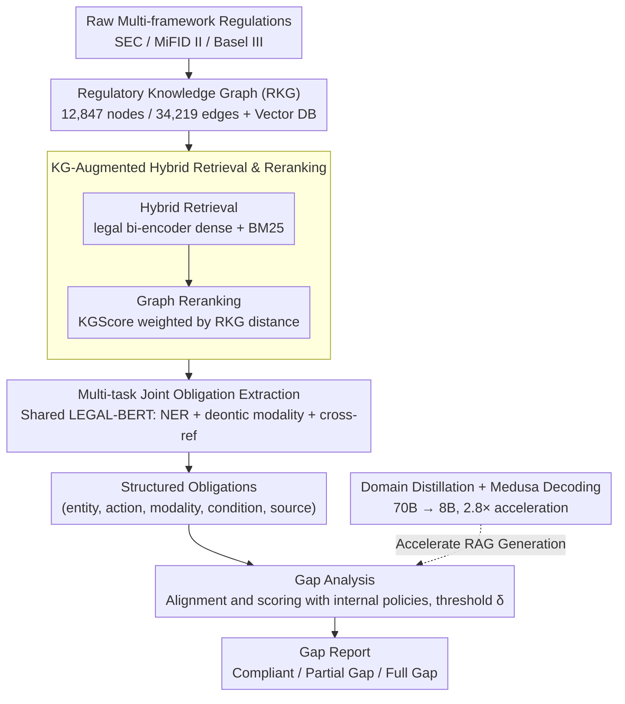

# ComplianceNLP: Knowledge-Graph-Augmented RAG for Multi-Framework Regulatory Gap Detection

**Conference**: ACL 2026  
**arXiv**: [2604.23585](https://arxiv.org/abs/2604.23585)  
**Code**: Not provided by the paper (None)  
**Area**: Graph Learning / RAG / Compliance NLP  
**Keywords**: Regulatory Compliance, Knowledge-Graph-Augmented RAG, Multi-task Obligation Extraction, Medusa Speculative Decoding, Production Deployment

## TL;DR
ComplianceNLP is an end-to-end financial regulatory compliance system that constructs a knowledge graph from 12,847 SEC / MiFID II / Basel III regulations to enhance RAG retrieval. Combined with LEGAL-BERT-based multi-task obligation extraction and threshold-scored gap analysis, it outperforms GPT-4o+RAG by 3.5 points on RegObligation / GapBench with an 87.7 F1. It achieves $2.8\times$ inference acceleration via domain-specific knowledge distillation + Medusa speculative decoding. Over four months of parallel operation, it processed 9,847 updates, reaching a 96.0% recall rate and a 3.1× increase in analyst efficiency.

## Background & Motivation
**Background**: Financial institutions track 60,000+ regulatory events across dozens of jurisdictions annually; global banks have paid over $300B in fines and settlements since the 2008 financial crisis. Existing commercial GRC platforms (Ascent RegTech / Wolters Kluwer OneSumX) still rely on rule-based systems and manual curation, while academic Legal NLP primarily focuses on benchmarks (LegalBench / LexGLUE / CUAD) and single-framework QA (ObliQA / DERECHA), lacking end-to-end production-ready compliance systems.

**Limitations of Prior Work**: (1) LLMs suffer from severe hallucinations on long regulatory texts, requiring trustworthy grounding; (2) existing obligation extraction systems target single frameworks (e.g., GDPR), failing to process multiple regulatory regimes simultaneously; (3) deontic modality (shall/must/may not) and nested cross-references in regulations are difficult to handle uniformly; (4) real-time compliance monitoring requires sub-second p50 latency, but 70B teacher models are too slow for inference.

**Key Challenge**: The requirements for "high precision + interpretable grounding + cross-framework unified extraction + production-level latency" are mutually conflicting—deeper models are more accurate but slower, unified frameworks are more general but prone to over-generalization, and stricter grounding can stifle creative generation.

**Goal**: (1) Construct a Regulatory Knowledge Graph (RKG) covering SEC / MiFID II / Basel III simultaneously; (2) train a multi-task obligation extractor for joint NER + deontic modality classification + cross-reference resolution; (3) design an end-to-end compliance gap analysis pipeline; (4) compress a 70B teacher model into an 8B student via domain-specific distillation + Medusa while maintaining accuracy.

**Key Insight**: The authors observe that regulatory text entropy is extremely low ($H=2.31$ bit vs. 3.87 for general text), which is the optimal condition for high "draft token acceptance rates" in Medusa speculative decoding. This gives the combination of small-model distillation and speculative decoding an inherent advantage in this domain.

**Core Idea**: Use knowledge graph "structural reranking" to overcome RAG's multi-hop reasoning weaknesses, multi-task joint training with shared LEGAL-BERT representations to overcome single-head extraction limitations, and domain entropy characteristics to maximize inference efficiency via the distillation + Medusa combination.

## Method

### Overall Architecture

ComplianceNLP addresses the challenge of automatically converting disorganized multi-framework regulatory texts into reconcilable structured obligations and comparing them with internal policies to identify compliance gaps with production-level latency. The system is a three-stage pipeline: First, regulations from SEC / MiFID II / Basel III are ingested and indexed to construct a Regulatory Knowledge Graph (RKG) with 12,847 nodes and 34,219 edges while populating a vector database. Second, a multi-task extractor sharing a LEGAL-BERT backbone extracts financial entities, deontic modality, and cross-provision references from the clauses. Finally, the structured obligations $\langle$entity, action, modality, condition, source_provision$\rangle$ are aligned and scored against internal policy clauses; based on a threshold $\delta$, they are categorized as Compliant / Partial Gap / Full Gap to generate a gap report. The LLM responsible for RAG generation (Gap Analysis and RegQA) is compressed from a 70B teacher to an 8B student using domain-specific distillation + Medusa speculative decoding.

### Key Designs

**1. KG-Augmented Hybrid Retrieval and Reranking.** Regulations are replete with multi-hop cross-references (e.g., "Provision X depends on Y, which cites Z"). Pure vector retrieval fails to capture these structural relationships. This work employs hybrid retrieval $s(q, d) = \alpha \cdot \text{sim}_{\text{dense}}(q, d) + (1-\alpha) \cdot \text{BM25}(q, d)$ ($\alpha=0.7$, where the dense encoder is a legal bi-encoder fine-tuned from MiniLM-L6-v2 on 50k regulatory paragraph pairs), followed by graph reranking on the top-5 segments: $s_{KG}(q, d) = \beta \cdot \text{KGScore}(q, d, \mathcal{G}) + (1-\beta) \cdot s(q, d)$ ($\beta=0.3$). KGScore measures the graph distance between the query source provision and the candidate segment in the RKG. This soft reranking avoids destroying first-stage recall while introducing structural priors; removing it drops gap detection F1 by 4.6 points, making it the most significant single-point contributor.

**2. Multi-task Joint Obligation Extraction.** Three attributes of regulatory obligations—who does what (Entity), the mandatory level (Deontic Modality), and citation relationships—are naturally coupled. Training three independent models wastes representation capacity and amplifies errors. This work uses a shared LEGAL-BERT encoder (further pre-trained on Pile of Law) with three heads: a CRF layer for 23 financial NER categories (e.g., Regulated_Entity / Capital_Requirement, extending FiNER types to distinguish domain semantics like "Investment Firm" vs. "Registered Entity"), a sentence-level deontic classifier (Obligation / Permission / Prohibition / Recommendation), and a span-pair bilinear classifier for cross-reference resolution. The joint loss is $\mathcal{L} = 0.4\mathcal{L}_{NER} + 0.3\mathcal{L}_{deontic} + 0.3\mathcal{L}_{xref}$, trained on 8,742 sentences (SEC 3,211 / MiFID II 2,987 / Basel III 2,544) with an inter-annotator agreement of $\kappa=0.84$.

**3. Domain-Specific Distillation + Medusa Speculative Decoding.** Real-time compliance requires sub-second p50 latency, but 70B teachers are too slow. This work first uses MiniLLM reverse KL distillation $\mathcal{L}_{KD} = \text{KL}(p_{student} \| p_{teacher}) + 0.5\mathcal{L}_{SFT}$ to compress the 70B model to 8B on 15k compliance instruction pairs, yielding $2.2\times$ acceleration from distillation alone. Subsequently, $M=3$ Medusa prediction heads are added to the student and trained on 2.1M regulatory tokens. A key insight is that the low entropy of regulatory text ($H=2.31$ bit vs. 3.87 in C4) boosts the Medusa draft token acceptance rate from 82.7% in general text to 91.3%. The combination of distillation and speculative decoding achieves a $2.8\times$ total acceleration (659ms p50). Linking "domain statistical properties" directly to "inference optimization gains" is a core innovation of this design.

### Loss & Training

The multi-task extraction loss is defined as above; the distillation phase uses weight $\gamma=0.5$ to balance KL and SFT. Post-processing includes MiniCheck for fact-checking, improving grounding accuracy from 86.7% to 94.2%. The evaluation threshold is $\delta=0.6$, while deployment utilizes $\delta=0.45$ to favor higher recall.

## Key Experimental Results

### Main Results (RegObligation + GapBench)

| System | NER F1 | Deon F1 | Gap Det F1 | RegQA EM | RegQA F1 |
|------|--------|---------|-----------|----------|----------|
| GPT-4o (5-shot) | 85.9 | 88.1 | 81.4 | 43.7 | 61.3 |
| GPT-4o + RAG | 88.6 | 90.5 | 84.2 | 48.1 | 66.8 |
| LLaMA-3-8B + RAG | 87.9 | 89.8 | 83.5 | 47.4 | 65.9 |
| LLaMA-3-70B (teacher) | 90.2 | 91.8 | 86.3 | 49.1 | 67.4 |
| **ComplianceNLP** | **91.3**†‡ | **92.7**†‡ | **87.7**†‡ | **52.8**†‡ | **71.9**†‡ |
| RIRAG (regulatory QA SOTA) | — | — | — | 38.9 | 54.2 |
| LEGAL-BERT (domain SOTA) | 82.1 | 84.6 | 71.3 | — | — |

ComplianceNLP improves over GPT-4o+RAG by +2.7 NER / +2.2 Deontic / **+3.5 Gap F1** / +5.1 QA F1, all statistically significant (p < 0.05). Grounding accuracy reached 94.2% (vs. 85.1% for GPT-4o+RAG), correlating with human judgment at $r = 0.83$.

### Ablation Study and Latency Analysis

| Configuration | NER F1 | Gap F1 | RegQA F1 | Notes |
|------|--------|--------|----------|------|
| ComplianceNLP (Full) | **91.3** | **87.7** | **71.9** | — |
| w/o KG reranking | 88.4 | 83.1 (−4.6) | 66.2 | **KG reranking is the largest contributor** |
| w/o multi-task | 89.1 (−2.2) | 84.9 | 69.1 | NER most affected |
| w/o MiniCheck | 91.0 | 87.2 | 71.0 | F1 stable, but grounding drops 94.2% → 86.7% |
| End-to-end (inc. error propagation) | — | 83.4 | — | 12.3% samples affected by extraction errors |

| Inference Config | p50 (ms) | Speedup | NER Retention | Gap Retention |
|---------|---------|------|-----------|-----------|
| 70B Teacher | 1847 | $1.0\times$ | 100 | 100 |
| 8B SFT only | 897 | $2.1\times$ | 95.1 | 95.4 |
| 8B KD only | 824 | $2.2\times$ | 96.8 | 97.0 |
| 8B + Medusa (general heads) | 793 | $2.3\times$ | 96.4 | 96.7 |
| **8B + Medusa (domain heads)** | **659** | **$2.8\times$** | **98.6** | **98.1** |

### Key Findings
- **KG Reranking = Single Most Impactful Module**: Its removal drops gap detection F1 by 4.6 points, far exceeding the impact of removing multi-task (-2.8) or MiniCheck (-0.5), proving that structural citation relationships are the most informative priors in regulations.
- **Domain Medusa Head Acceptance Rate 91.3% vs. 82.7% (General)**: This difference is attributed to the regulatory text entropy $H=2.31$ vs. 3.87 for general text, validating the synergy between "low-entropy domains" and "speculative decoding."
- **End-to-End Error Propagation**: F1 only dropped from 87.7 to 83.4, resulting in approximately 2.1 missed obligations per 100 pages and 1.3 daily false alarms, which analysts found acceptable. This suggests multi-stage pipelines do not require zero error at each stage if errors do not cascade.
- **Four Months of Production Operation**: Processed 9,847 updates with an estimated 96.0% recall, 90.7% precision, and a $3.1\times$ increase in analyst efficiency—providing rare real-world evidence for an academic system.
- **Cross-Framework Variance**: SEC (NER F1 93.1) > MiFID II (91.4) > Basel III, reflecting cleaner standardized XML parsing for SEC EDGAR and the difficulty of Basel III's nested conditional obligations.

## Highlights & Insights
- **The "Low-Entropy Domain + Speculative Decoding + Distillation" Trifecta**: Linking domain statistical properties (entropy) directly to engineering optimization (Medusa acceptance rate) is a rare example of "domain-inference joint optimization." This approach is transferable to other low-entropy domains like code generation, medical reports, and legal contracts.
- **Multi-task Shared LEGAL-BERT vs. Stacked Models**: A single encoder with three heads shares semantics and reduces cascaded errors, providing inherent advantages in extraction consistency over traditional "NER → Modality → Cross-ref" pipelines.
- **KG Distance as a Soft RAG Reranking Signal**: Compared to hard rule filtering or pure embedding similarity, using graph hop distance for weighting introduces structural priors while maintaining recall.
- **MiniCheck's Impact on Grounding**: Improving grounding by 8 points without affecting F1 highlights the importance of evaluating "output trustworthiness" separately from "task correctness."
- **Production Experience Review**: Detailed discussions on trust calibration, GRC integration, and distribution drift monitoring provide valuable references for industrial NLP system deployment.

## Limitations & Future Work
- The system currently only covers SEC / MiFID II / Basel III (approximately half of annual updates). Expanding to other jurisdictions (e.g., CBIRC / MAS) requires new format parsers and NER annotations.
- The 23 NER and 4 deontic schemas are manually designed and may require restructuring for different frameworks; the annotator agreement $\kappa = 0.78$ for cross-references is lower than NER/deontic, indicating ambiguity in nested citation boundaries.
- KG construction relies on regex + learned linkers (91.8% accuracy), but 87.3% recall means ~13% of citations are missed, creating a ceiling for deep multi-hop reasoning.
- The 18-hour "blind spot" for real-time synchronization (e.g., urgent SEC notices) falls back to an embedding-only mode (-4.6 F1).
- While the student model retains 98% performance on NER/Gap tasks, losses might be higher on deep interpretive tasks (e.g., multi-step clause interpretation), which were not fully evaluated.

## Related Work & Insights
- **vs. DERECHA (Cejas et al. 2023)**: DERECHA focuses on single-framework GDPR compliance with pre-structured input (89.1% precision); ComplianceNLP handles three frameworks from raw text with 90.7% production precision.
- **vs. RIRAG / ObliQA (Bayer et al. 2025)**: These focus solely on regulatory QA without obligation extraction or gap analysis. ComplianceNLP improves RegQA F1 by +17.7 (71.9 vs. 54.2).
- **vs. Sun et al. (2025) Eventic Graph Compliance Checker**: Similar approach but ComplianceNLP avoids limitations such as single corpus, lack of typed KG, and assumed structured input.
- **vs. Zagyva et al. (2025) Booking.com Medusa+KD**: Applies general Medusa+KD; ComplianceNLP identifies and exploits "low entropy → high acceptance rate" for regulatory domains.
- **vs. MiniCheck (Tang et al. 2024)**: ComplianceNLP systemized MiniCheck as a grounding post-processor and quantified its impact on grounding vs. F1.

## Rating
- Novelty: ⭐⭐⭐⭐ While individual techniques (KG-RAG / Multi-task / Medusa-KD) are established, the system-level integration and the insight linking low entropy to Medusa acceleration are innovative.
- Experimental Thoroughness: ⭐⭐⭐⭐⭐ Comprehensive evaluation across academic benchmarks, error propagation analysis, and four months of production data.
- Writing Quality: ⭐⭐⭐⭐ Clear structure and deployment insights, though technical details are heavily relegated to the Appendix.
- Value: ⭐⭐⭐⭐⭐ A rare combination of academic SOTA and industrial evidence, providing methodological and engineering insights for RegTech and LLM deployment.

<!-- RELATED:START -->

## Related Papers

- [\[CVPR 2026\] M3KG-RAG: Multi-hop Multimodal Knowledge Graph-enhanced Retrieval-Augmented Generation](../../CVPR2026/graph_learning/m3kg_rag_multi_hop_multimodal_knowledge_graph_enhanced_retrieval_augmented_genera.md)
- [\[ACL 2026\] MegaRAG: Multimodal Knowledge Graph-Based Retrieval Augmented Generation](megarag_multimodal_knowledge_graph-based_retrieval_augmented_generation.md)
- [\[ACL 2026\] LegalGraphRAG: Multi-Agent Graph Retrieval-Augmented Generation for Reliable Legal Reasoning](legalgraphrag_multi-agent_graph_retrieval-augmented_generation_for_reliable_lega.md)
- [\[ICML 2026\] DTKG: Dual-Track Knowledge Graph-Verified Reasoning Framework for Multi-Hop QA](../../ICML2026/graph_learning/dtkg_dual-track_knowledge_graph-verified_reasoning_framework_for_multi-hop_qa.md)
- [\[ACL 2026\] Collaboration of Fusion and Independence: Hypercomplex-driven Robust Multi-Modal Knowledge Graph Completion](collaboration_of_fusion_and_independence_hypercomplex-driven_robust_multi-modal_.md)

<!-- RELATED:END -->
