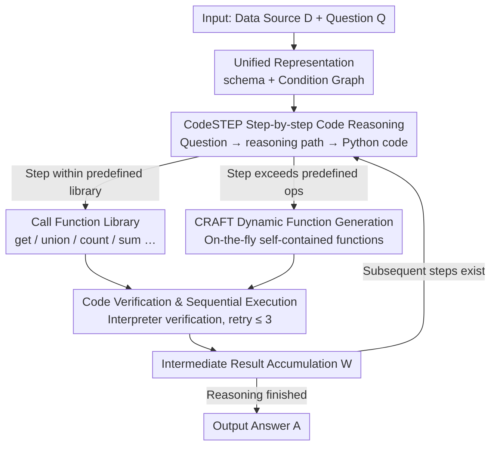

# CRAFTQA: A Code-Driven Adaptive Framework for Complex Structured Data Reasoning

**Conference**: ACL2026 Findings  
**arXiv**: [2606.02170](https://arxiv.org/abs/2606.02170)  
**Code**: Not specified  
**Area**: Structured Data Reasoning / Knowledge Graph Question Answering  
**Keywords**: Structured Data QA, Code Reasoning, Dynamic Function Generation, Table QA, KG Reasoning  

## TL;DR
CRAFTQA utilizes CodeSTEP to generate executable step-by-step Python reasoning code and employs CRAFT to dynamically generate custom functions when predefined operators are insufficient. This significantly enhances complex structured data QA capabilities across tables, KGs, and Temporal KGs (TKG), with the GPT-4o version achieving 76.6% in Overall complex reasoning.

## Background & Motivation
**Background**: Structured data QA requires models to access tables, KGs, or Temporal KGs based on natural language questions and output verifiable answers. Recently, unified structured data QA methods (e.g., StructGPT, Readi, and TrustUQA) have attempted to handle multiple data types within a single framework.

**Limitations of Prior Work**: Unified frameworks typically rely on a fixed set of functions, such as query, set operations, counting, summation, and min/max. Once a problem requires complex operations exceeding these predefined functions, the system is restricted, making it difficult to complete multi-step numerical reasoning, complex conditional combinations, or customized calculations.

**Key Challenge**: A fixed function set ensures controllability and interpretability but limits reasoning expressivity; conversely, allowing LLMs to generate free-text answers is flexible but difficult to verify and execute. Complex structured data QA requires both "executability" and "dynamic expansion capability."

**Goal**: The authors aim to build a unified framework capable of performing reasoning via code execution across different structured data types while automatically generating specialized functions when encountering out-of-predefined operations.

**Key Insight**: This paper decomposes reasoning into two levels: CodeSTEP handles the backbone of step-by-step code reasoning, while CRAFT dynamically generates custom functions for steps exceeding the library during execution, returning results to the main execution flow.

**Core Idea**: Instead of only calling fixed tools, the LLM generates an executable and verifiable function on the fly when a new tool is needed, then proceeds with structured reasoning.

## Method
CRAFTQA addresses the issue where unified structured data QA is constrained by fixed function sets. While tables, KGs, and TKGs can be accessed via a single framework, the system fails whenever a reasoning step exceeds predefined operators (e.g., custom sorting, combined conditions, special format conversions). The solution is to ground reasoning entirely in executable code and generate new functions in real-time when a step cannot be written with existing tools.

### Overall Architecture
The input consists of a data source $\mathcal{D}$ and a question $\mathcal{Q}$. The system first unifies heterogeneous data into a schema $\mathcal{D}_{schema}$ and a Condition Graph $\mathcal{D}_{cg}$, allowing tables, KGs, and TKGs to be accessed via the same graph query interface. Subsequently, the LLM translates the question into a step-by-step Python code sequence $\mathcal{C}=\{c_i\}_{i=1}^n$ under a few-shot prompt. An executor runs these codes sequentially, accumulates intermediate results, and finally obtains the answer $\mathcal{A}$. Formally, $\mathcal{M}_{\theta}(\mathcal{D}_{schema}, \mathcal{Q}, \mathcal{P}) \rightarrow \mathcal{C}$ followed by $\textsc{Exec}(\mathcal{C}, \mathcal{D}_{cg}) \rightarrow \mathcal{A}$. Crucially, this code does not need to use only predefined functions: standard steps call the library, while operations missing from the library invoke a "generate function" interface fulfilled by the CRAFT module.

### Key Designs

**1. CodeSTEP Step-by-step Code Reasoning: Decoupling Reasoning and Computation into Executable Code**

Directly allowing LLMs to generate free-text answers often leads to calculation errors and lack of verification in multi-hop numerical or complex conditional problems. CodeSTEP prompts the model to write a natural language reasoning path first, then translates each step into corresponding code: basic query functions $get$ retrieve entities from the Condition Graph based on relations, entities, and attributes, while set and numerical operators cover union, intersection, difference, min, max, mean, count, and sum. By externalizing reasoning as code, every calculation step becomes executable and reviewable, constraining the model's numerical operations and multi-hop logic within code semantics, which reduces error rates.

**2. CRAFT Dynamic Function Generation: On-the-fly Function Creation for Unmet Operations**

Fixed function sets have a clear ceiling—once a problem requires an out-of-predefined operation, CodeSTEP cannot write valid code. CRAFT handles this by having CodeSTEP generate a placeholder call $f_{craft}(\mathcal{T}_i, W_i, F_{exp,i})$ when a step cannot be implemented via $\mathcal{F}_{pred}$. This call passes the task description $\mathcal{T}_i$, historical intermediate results $W_i$, and expected function signature $F_{exp,i}$ to CRAFT. CRAFT then generates a self-contained function $\hat{f}_i$ based on the original question and code sequence, returning result $w_i$ to the main flow. This transforms "library expansion" from an offline task into online, on-demand code generation, offering much higher flexibility than pre-enumerating all possible operators.

**3. Code Verification and Sequential Execution: Blocking Errors with Pre-execution Validation and Retries**

The primary risk of code-driven methods is unrunnable code. Both CodeSTEP's main code and CRAFT's custom functions are sent to a Python interpreter for executability verification. If verification fails, it retries with the same input for a maximum of $T=3$ times. Verified code is executed sequentially, and results are merged into the intermediate set $W_{i+1}=W_i \cup \{w_i\}$ for subsequent reference. This process filters out syntax and runtime errors before answer generation, ensuring the stability of the code chain.

### Key Experimental Results

#### Main Results
| Method | Backbone | TableBench-FC DA | TableBench-NR DA | WikiSQL-E DA | Overall |
|------|----------|------------------|------------------|--------------|---------|
| PoT | GPT-4o | 51.0 | 43.7 | 27.4 | 32.6 |
| StructGPT | GPT-4o | 63.5 | 42.2 | 43.5 | 44.3 |
| Readi | GPT-4o | 62.5 | 49.5 | 51.3 | 51.5 |
| TrustUQA | GPT-4o | 62.5 | 29.6 | 80.1 | 67.2 |
| CRAFTQA | Qwen2.5-7B | 57.9 | 35.4 | 65.9 | 58.3 |
| CRAFTQA | LLaMA-3.1-8B | 57.3 | 31.1 | 76.0 | 64.4 |
| CRAFTQA | GPT-4o-mini | 64.6 | 40.7 | 79.0 | 69.2 |
| CRAFTQA | GPT-4o | 68.8 | 51.3 | 85.6 | 76.6 |

Under the same GPT-4o backbone, CRAFTQA's Overall score of 76.6 significantly outperforms TrustUQA (67.2), Readi (51.5), and StructGPT (44.3). Notably, CRAFTQA-LLaMA-3.1-8B (64.4 Overall) surpasses several traditional baselines using GPT-4o.

#### Ablation Study
| Configuration | FC DA/F1 | NR DA/F1 | WikiSQL-E DA/F1 | Description |
|------|----------|----------|-----------------|------|
| CRAFTQA | 68.8 / 71.6 | 51.3 / 51.9 | 87.3 / 87.6 | Full Framework |
| w/o CRAFT | 65.3 / 67.7 | 45.9 / 46.3 | 84.5 / 84.6 | Remove dynamic functions |
| w/o CRAFT & CodeSTEP | 59.4 / 63.2 | 18.4 / 19.7 | 79.8 / 80.0 | Remove code reasoning backbone |

#### Key Findings
- CRAFT contributes significantly to complex numerical reasoning. Numerical Reasoning DA drops from 51.3 in the full model to 45.9 without CRAFT, and down to 18.4 without the code backbone.
- Out-of-predefined scenarios are the primary source of CRAFTQA's advantage. On WikiSQL-E, the Calling Denotation Accuracy for GPT-4.1 is 53.57%, compared to only 6.98% for TrustUQA.
- On Numerical Reasoning, the GPT-4.1 version of CRAFTQA achieves a DA of 56.06%, which is a gain of 26.77 percentage points over TrustUQA's 29.29%.
- Basic capabilities are preserved on standard reasoning tasks: WebQSP Hit@1 is 85.20, WikiSQL DA is 86.10, and CronQuestions Hit@1 is 97.10.
- The framework improves as backbone capabilities increase. Fact Checking DA rises from 61.5 (GPT-3.5) to 68.8 (GPT-4o) and 83.3 (o4-mini).

## Highlights & Insights
- The key insight of this paper is that "toolsets need not be predefined statically." In structured data QA, fixed function sets are controllable but rigid; CRAFT opens the tool space via dynamic code generation.
- There is a clear division of labor between CodeSTEP and CRAFT. The backbone steps maintain unified execution logic, while only special steps are delegated to dynamic functions, preventing the issues associated with unconstrained code generation for every problem.
- Calling Denotation Accuracy is a valuable diagnostic metric. By specifically evaluating questions that require out-of-predefined functions, it directly verifies whether the CRAFT module addresses the intended pain point.
- Small model results are encouraging. A robust reasoning framework can enable 7B/8B models to approach or even exceed larger closed-source models using older frameworks in complex structured reasoning.

## Limitations & Future Work
- Gains are smaller on simple standard reasoning tasks because these rarely require out-of-predefined operations, leaving little room for CRAFT's dynamic capabilities.
- The framework depends heavily on the backbone's code generation ability. For LLMs with weak programming skills, both dynamic functions and main code sequences may fail or be low quality.
- Code execution necessitates security and sandboxing. The paper focuses on executability, but real-world deployment requires restricting file system, network, and resource access.
- Future work could extend to more data formats, such as semi-structured documents, graph databases, and multi-table relational databases, incorporating stronger static analysis or unit-test-style verification.

## Related Work & Insights
- **vs PoT / PAL**: PoT/PAL proven that code enhances numerical reasoning, but mostly for general math or text problems; CRAFTQA connects code reasoning to unified structured data access.
- **vs StructGPT / Readi**: These methods access structured data through iterative reading or path editing, but expressivity is limited by operator design; CRAFTQA generates functions as needed.
- **vs TrustUQA**: TrustUQA offers strong Condition Graphs and unified queries but relies on fixed functions; CRAFTQA extends this unified representation with dynamic execution capabilities.
- **Insights for Future Systems**: Structured data agents do not need to predefine all tools; they can provide a controlled dynamic tool generation interface with execution verification to ensure reliability.

## Rating
- Novelty: ⭐⭐⭐⭐ Dynamic custom functions are naturally integrated into structured data QA, addressing a precise problem.
- Experimental Thoroughness: ⭐⭐⭐⭐ Covers complex, standard, and out-of-predefined scenarios across different backbones with complete evidence.
- Writing Quality: ⭐⭐⭐⭐ Methodology is clearly formalized, and experiments are organized by Research Questions; however, discussions on code security are brief.
- Value: ⭐⭐⭐⭐ Highly insightful for table/KG QA, enterprise data agents, and complex structured reasoning.

<!-- RELATED:START -->

## Related Papers

- [\[AAAI 2026\] Self-Correction Distillation for Structured Data Question Answering](../../AAAI2026/graph_learning/self-correction_distillation_for_structured_data_question_answering.md)
- [\[ACL 2026\] EA-Agent: A Structured Multi-Step Reasoning Agent for Entity Alignment](ea-agent_a_structured_multi-step_reasoning_agent_for_entity_alignment.md)
- [\[ICML 2026\] Finding the Minimal Parameter Budget for Implicit Reasoning: A Data Complexity Driven Scaling Law for Language Models](../../ICML2026/graph_learning/finding_the_minimal_parameter_budget_for_implicit_reasoning_a_data_complexity_dr.md)
- [\[AAAI 2026\] PathMind: A Retrieve-Prioritize-Reason Framework for Knowledge Graph Reasoning with Large Language Models](../../AAAI2026/graph_learning/pathmind_a_retrieve-prioritize-reason_framework_for_knowledge_graph_reasoning_wi.md)
- [\[AAAI 2026\] RFKG-CoT: Relation-Driven Adaptive Hop-count Selection and Few-Shot Path Guidance for Knowledge-Aware QA](../../AAAI2026/graph_learning/rfkg-cot_relation-driven_adaptive_hop-count_selection_and_few-shot_path_guidance.md)

<!-- RELATED:END -->
