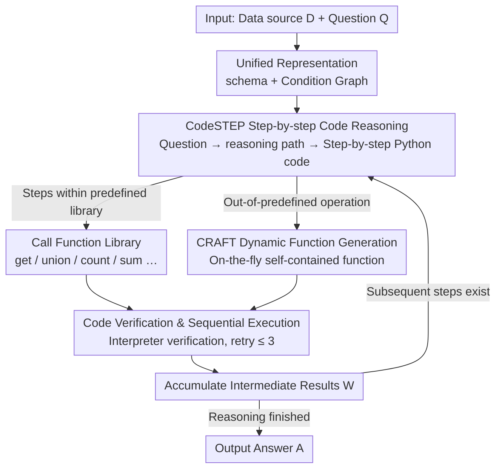

# CRAFTQA: A Code-Driven Adaptive Framework for Complex Structured Data Reasoning

**Conference**: ACL2026 Findings  
**arXiv**: [2606.02170](https://arxiv.org/abs/2606.02170)  
**Code**: Not specified  
**Area**: Structured Data Reasoning / Knowledge Graph Question Answering  
**Keywords**: Structured data QA, code reasoning, dynamic function generation, table QA, knowledge graph reasoning  

## TL;DR
CRAFTQA uses CodeSTEP to generate executable step-by-step Python reasoning code. When predefined operations are insufficient, CRAFT dynamically generates custom functions, significantly enhancing complex structured data QA capabilities across tables, knowledge graphs (KGs), and temporal knowledge graphs (TKGs). The GPT-4o version achieves 76.6% on the complex reasoning Overall metric.

## Background & Motivation
**Background**: Structured data QA requires models to access tables, KGs, or TKGs based on natural language questions and output verifiable answers. Recently, unified structured data QA methods have attempted to handle multiple data types within a single framework, such as StructGPT, Readi, and TrustUQA.

**Limitations of Prior Work**: Unified frameworks typically rely on a fixed set of functions, such as queries, set operations, counting, summation, and min/max. Once a problem requires complex operations beyond predefined functions, systems become restricted, failing at multi-step numerical reasoning, complex conditional combinations, or customized calculations.

**Key Challenge**: A fixed function set ensures controllability and interpretability but limits reasoning expressiveness. Directly letting LLMs generate free-text answers is more flexible but difficult to verify and execute. Complex structured data QA requires both "executability" and "dynamic expansion capabilities."

**Goal**: The authors aim to build a unified framework capable of performing reasoning via code execution across different structured data types while automatically generating specialized functions when encountering out-of-predefined operations.

**Key Insight**: The paper divides reasoning into two levels: CodeSTEP handles the backbone of step-by-step code reasoning, while CRAFT dynamically generates custom functions for steps that exceed the function library during execution, returning the results to the main execution flow.

**Core Idea**: Instead of merely calling fixed tools, the LLM writes an executable, verifiable function on-the-fly when a new tool is needed, then continues the structured reasoning.

## Method
CRAFTQA aims to solve the problem where "unified structured data QA is stalled by fixed function sets": tables, KGs, and TKGs can all be accessed with one framework, but the system fails as soon as a reasoning step exceeds predefined operators (e.g., custom sorting, combinatorial conditions, special format conversions). Its solution is to ground reasoning entirely in executable code and generate a new function on-the-fly for the step where code cannot be written using existing functions.

### Overall Architecture
The input consists of a data source $\mathcal{D}$ and a question $\mathcal{Q}$. The system first unifies heterogeneous data into a schema $\mathcal{D}_{schema}$ and a Condition Graph $\mathcal{D}_{cg}$, allowing tables, KGs, and TKGs to be accessed via the same graph query interface. Next, the LLM translates the question into a step-by-step Python code sequence $\mathcal{C}=\{c_i\}_{i=1}^n$ under a few-shot prompt. An executor runs this code sequentially, accumulating intermediate results to obtain the final answer $\mathcal{A}$. Formally, $\mathcal{M}_{\theta}(\mathcal{D}_{schema}, \mathcal{Q}, \mathcal{P}) \rightarrow \mathcal{C}$, then $\textsc{Exec}(\mathcal{C}, \mathcal{D}_{cg}) \rightarrow \mathcal{A}$. The key is that this code does not have to use predefined functions exclusively: conventional steps call the library, while operations missing from the library call an interface to "please help me write a function," which is fulfilled by the CRAFT module.

### Key Designs

**1. CodeSTEP Step-by-step Code Reasoning: Decoupling reasoning and calculation into executable, checkable code**

Directly allowing LLMs to generate free-text answers often leads to calculation errors and a lack of verifiability in multi-hop numerical or complex conditional problems. CodeSTEP requires the model to first write a natural language reasoning path and then translate each step into corresponding code: the basic query function $get$ retrieves entities from the Condition Graph based on relations, head/tail entities, comparison operators, and attribute conditions; set and numerical operators cover standard operations like union, intersection, difference, min, max, mean, count, and sum. By externalizing the reasoning process as code, every calculation step becomes executable and reviewable. The model's "creative" freedom in numerical and multi-hop operations is constrained by code semantics, naturally reducing error rates.

**2. CRAFT Dynamic Function Generation: Writing a new function on-the-fly when predefined functions cannot express a step**

The ceiling for fixed function sets is obvious—CodeSTEP cannot write valid code once a problem requires out-of-predefined operations. CRAFT handles this by: when a step cannot be implemented with $\mathcal{F}_{pred}$, CodeSTEP does not force a fit but generates a placeholder call $f_{craft}(\mathcal{T}_i, W_i, F_{exp,i})$, passing the current task description $\mathcal{T}_i$, historical intermediate results $W_i$, and the expected function signature $F_{exp,i}$ to CRAFT. CRAFT then generates a self-contained function $\hat{f}_i$ based on the original question and the full code sequence, returning the result $w_i$ to the main execution flow after execution. This transforms "expanding the tool library" from an offline task into an online, on-demand code generation process, which is far more flexible than pre-enumerating all possible operators and is the source of CRAFTQA's advantage in complex scenarios.

**3. Code Verification & Sequential Execution: Blocking syntax/runtime errors with pre-execution verification + limited retries**

The biggest risk of code-driven methods is that the generated code might not run. Therefore, both CodeSTEP's main code and CRAFT's temporary custom functions are sent to a Python interpreter for executability verification. If verification fails, it retries with the same input for a maximum of $T=3$ times. Verified code is executed sequentially, and the output of each step is merged into the intermediate result set $W_{i+1}=W_i \cup \{w_i\}$ for reference in subsequent steps. This gatekeeper blocks a portion of syntax and runtime errors before answer generation, making the entire code chain more stable.

### A Complete Example
Take a question requiring custom calculation on WikiSQL-E: CodeSTEP first writes a reasoning path. The initial steps use $get$ to extract candidate rows from the Condition Graph and count/sum for standard aggregation; these fall within the predefined functions, execute directly, and store results in $W$. When reaching a step like "sort by a custom rule and then take a conditional value," where no operator exists in the library, CodeSTEP generates an $f_{craft}$ call. It passes the task description "sort entries according to rule X and return those satisfying Y," current intermediate results, and the expected signature to CRAFT. CRAFT writes a self-contained sorting function, which passes interpreter verification (retrying within 3 times if errors occur). Once verified, it executes and the result is filled back into $W$. The main execution flow uses this value to continue subsequent steps, eventually outputting a verifiable answer. In this chain, only the truly stuck step utilized dynamic generation, while the rest remained controlled library function executions.

### Loss & Training
CRAFTQA is an inference framework rather than a trained model. Experiments use various LLMs as reasoning engines, including GPT, LLaMA, DeepSeek, Gemini, and Qwen series. Inference strategies include 5-sample self-consistency, a maximum of $T=3$ retries, and Sentence-BERT semantic entity alignment to map entity names in code to candidate entities in the Condition Graph.

## Key Experimental Results

### Main Results

| Method | Backbone | TableBench-FC DA | TableBench-NR DA | WikiSQL-E DA | Overall |
|------|----------|------------------|------------------|--------------|---------|
| PoT | GPT-4o | 51.0 | 43.7 | 27.4 | 32.6 |
| StructGPT | GPT-4o | 63.5 | 42.2 | 43.5 | 44.3 |
| Readi | GPT-4o | 62.5 | 49.5 | 51.3 | 51.5 |
| TrustUQA | GPT-4o | 62.5 | 29.6 | 80.1 | 67.2 |
| CRAFTQA | Qwen2.5-7B | 57.9 | 35.4 | 65.9 | 58.3 |
| CRAFTQA | LLaMA-3.1-8B | 57.3 | 31.1 | 76.0 | 64.4 |
| CRAFTQA | GPT-4o-mini | 64.6 | 40.7 | 79.0 | 69.2 |
| CRAFTQA | GPT-4o | 68.8 | 51.3 | 85.6 | 76.6 |

Under the same GPT-4o backbone, CRAFTQA's Overall score of 76.6 is significantly higher than TrustUQA's 67.2, Readi's 51.5, and StructGPT's 44.3. Interestingly, CRAFTQA-LLaMA-3.1-8B's Overall of 64.4 already surpasses several traditional baselines using GPT-4o.

### Ablation Study

| Configuration | FC DA/F1 | NR DA/F1 | WikiSQL-E DA/F1 | Description |
|------|----------|----------|-----------------|------|
| CRAFTQA | 68.8 / 71.6 | 51.3 / 51.9 | 87.3 / 87.6 | Full framework |
| w/o CRAFT | 65.3 / 67.7 | 45.9 / 46.3 | 84.5 / 84.6 | Remove dynamic custom function |
| w/o CRAFT & CodeSTEP | 59.4 / 63.2 | 18.4 / 19.7 | 79.8 / 80.0 | Remove code reasoning backbone |

### Key Findings
- CRAFT contributes significantly to complex numerical reasoning. Numerical Reasoning DA drops from 51.3 in the full model to 45.9 without CRAFT, and further to 18.4 without the code backbone.
- Out-of-predefined scenarios are the primary source of CRAFTQA's advantage. On WikiSQL-E, GPT-4.1's Calling Denotation Accuracy is 53.57%, while TrustUQA is only 6.98%.
- On Numerical Reasoning, the GPT-4.1 version of CRAFTQA achieved a DA of 56.06% compared to TrustUQA's 29.29%, a gain of 26.77 percentage points.
- CRAFTQA does not sacrifice basic capabilities on standard reasoning tasks: WebQSP Hit@1 is 85.20, WikiSQL DA is 86.10, and CronQuestions Hit@1 is 97.10. The first two are slightly higher than TrustUQA, while CronQuestions is close to TrustUQA's 97.20.
- The framework improves as backbone capability increases. Fact Checking DA increased from 61.5 with GPT-3.5 to 68.8 with GPT-4o, and reached 83.3 with o4-mini.

## Highlights & Insights
- The key insight of this paper is that "toolsets do not need to be locked in advance." In structured data QA, fixed function sets are controllable but rigid; CRAFT opens up the tool space with dynamic code generation.
- There is a clear division of labor between CodeSTEP and CRAFT. The backbone steps maintain uniform execution logic, while only special steps are delegated to dynamic functions, avoiding uncontrolled free generation for every problem.
- Calling Denotation Accuracy is a very useful diagnostic metric. By evaluating "questions that actually required out-of-predefined function calls" separately, it directly tests whether the CRAFT module resolves the target pain points.
- Insights from small models are enlightening. A well-designed reasoning framework can enable 7B/8B models to approach or even exceed larger closed-source models using older frameworks for complex structured reasoning.

## Limitations & Future Work
- Small gains on simple standard reasoning tasks. Since these tasks rarely require out-of-predefined operations, CRAFT's dynamic function capability has little room to function.
- The framework depends on the backbone's code generation ability. For LLMs with weaker programming skills, both dynamic function generation and the main code sequence may fail or produce low-quality code.
- Code execution necessitates security and sandboxing. The paper mainly discusses executability verification, but actual deployment also requires restricting file system, network, and resource access.
- Future work could extend to more data formats, such as semi-structured documents, graph databases, and multi-table relational databases, while incorporating stronger static analysis or unit-test-style code verification.

## Related Work & Insights
- **vs PoT / PAL**: PoT/PAL proved code improves numerical reasoning but focuses mostly on general math or text problems; CRAFTQA connects code reasoning to unified structured data access.
- **vs StructGPT / Readi**: These methods access structured data through iterative reading or path editing, restricted by pre-designed operations; CRAFTQA can generate functions when new operations are needed.
- **vs TrustUQA**: TrustUQA's Condition Graph and unified queries are strong but still rely on fixed functions; CRAFTQA continues the unified representation while filling the gap in dynamic operation capabilities.
- **Insights for subsequent systems**: Structured data agents do not necessarily need all tools predefined; they can provide a controlled dynamic tool generation interface and ensure basic reliability through execution verification.

## Rating
- Novelty: ⭐⭐⭐⭐ Dynamic custom functions are naturally combined with structured data QA, addressing a precise problem.
- Experimental Thoroughness: ⭐⭐⭐⭐ Covers complex, standard, out-of-predefined, cross-backbone, and ablation experiments with comprehensive evidence.
- Writing Quality: ⭐⭐⭐⭐ Method formalization is clear, and experiments are organized by RQ; however, discussion on code security and runtime environments is limited.
- Value: ⭐⭐⭐⭐ Highly practical for table/KG QA, enterprise data agents, and complex structured reasoning.

<!-- RELATED:START -->

## Related Papers

- [\[AAAI 2026\] Self-Correction Distillation for Structured Data Question Answering](../../AAAI2026/graph_learning/self-correction_distillation_for_structured_data_question_answering.md)
- [\[ACL 2026\] EA-Agent: A Structured Multi-Step Reasoning Agent for Entity Alignment](ea-agent_a_structured_multi-step_reasoning_agent_for_entity_alignment.md)
- [\[ICML 2026\] Finding the Minimal Parameter Budget for Implicit Reasoning: A Data Complexity Driven Scaling Law for Language Models](../../ICML2026/graph_learning/finding_the_minimal_parameter_budget_for_implicit_reasoning_a_data_complexity_dr.md)
- [\[ICLR 2026\] Latent Geometry-Driven Network Automata for Complex Network Dismantling](../../ICLR2026/graph_learning/latent_geometry-driven_network_automata_for_complex_network_dismantling.md)
- [\[AAAI 2026\] PathMind: A Retrieve-Prioritize-Reason Framework for Knowledge Graph Reasoning with Large Language Models](../../AAAI2026/graph_learning/pathmind_a_retrieve-prioritize-reason_framework_for_knowledge_graph_reasoning_wi.md)

<!-- RELATED:END -->
