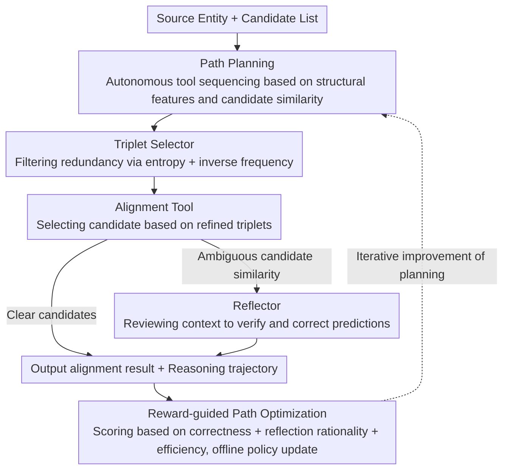

# EA-Agent: A Structured Multi-Step Reasoning Agent for Entity Alignment

**Conference**: ACL 2026  
**arXiv**: [2604.11686](https://arxiv.org/abs/2604.11686)  
**Code**: [GitHub](https://github.com/YXNan0110/EA-Agent)  
**Area**: LLM Agent  
**Keywords**: Entity Alignment, Knowledge Graph, Multi-step Reasoning, Tool Planning, Reward-guided Optimization

## TL;DR
This paper proposes EA-Agent, which decomposes Entity Alignment (EA) into a structured multi-step reasoning process. By planning and executing a tool pool (triplet selector + alignment tool + reflector), it achieves interpretable alignment decisions. Combined with reward-guided offline policy optimization to continuously improve planning capabilities, it achieves a Hits@1 improvement of up to 3.17% on DBP15K while mitigating efficiency issues caused by redundant triplets.

## Background & Motivation

**Background**: Entity alignment is a fundamental technology for knowledge fusion, aiming to identify nodes in different knowledge graphs (KGs) that point to the same real-world entity. Traditional methods are based on knowledge representation learning (e.g., TransE, GCN-Align), but their performance is limited in noisy or sparsely supervised scenarios. Recent LLM-based methods (e.g., ChatEA, LLMEA) leverage semantic understanding to improve performance.

**Limitations of Prior Work**: (1) Existing LLM-based EA methods treat LLMs as black-box decision-makers, lacking interpretability—making it difficult to determine which information is critical for alignment; (2) Directly inputting a large number of attribute and relation triplets leads to excessively long prompts and high inference costs; (3) Many triplets are redundant or even noisy, which interferes with the judgment.

**Key Challenge**: There is a need to utilize the powerful semantic understanding of LLMs while addressing the issues of black-box non-interpretability and the efficiency of processing large-scale triplets.

**Goal**: Design a reasoning-driven Agent framework to achieve interpretable, controllable, and efficient entity alignment through multi-step tool planning and execution.

**Key Insight**: Treat EA as a multi-step decision-making problem—first selecting the most informative triplets, then making alignment decisions, and finally performing reflection for verification when uncertainty is high.

**Core Idea**: A tool pool (attribute/relation triplet selector + alignment tool + reflector) + path planning + reward-guided offline policy optimization.

## Method

### Overall Architecture

EA-Agent reorganizes "judging whether entities in two KGs refer to the same object" into an interpretable multi-step decision-making process. Given a source entity and its candidate list, the Agent first autonomously plans a tool invocation path based on structural features and candidate similarity. It then executes the path sequentially: using the triplet selector to filter redundant information, the alignment tool to make decisions, and the reflector to review when uncertain. Finally, it outputs the alignment result along with a complete reasoning trajectory. The entire Agent is wrapped in a closed-loop optimization: a reward function scores each path, and offline policy updates are used to improve planning capabilities through iterations.

### Key Designs

**1. Attribute/Relation Triplet Selector.** Feeding all attribute and relation triplets of candidate entities into the prompt increases inference cost and introduces noise. The selector performs information bottleneck filtering before LLM reasoning. For attributes, an entropy-based criterion $H(a) = -\sum p(v)\log p(v)$ is used; a more uniform distribution of attribute values among candidates (low entropy) indicates stronger discriminative power. For relations, inverse frequency weighting $I(r) = \log(N/(\text{freq}(r)+1))$ is used, as rare relations are more discriminative. A set of pre-defined important attributes is also retained for stability. This significantly reduces token usage while maintaining or even improving performance.

**2. Reflector (Conditional Activation).** Not all alignments require review—direct decisions are more efficient for simple cases, and mandatory reflection might slow down the process or introduce new errors. The reflector is an LLM-based module activated only when candidate similarities are ambiguous. Once activated, it re-evaluates candidates based on the prior context and provides a corrected prediction. This achieves a balance between efficiency and accuracy by only verifying truly uncertain samples.

**3. Reward-guided Path Optimization.** A single round of planning may produce redundant or inefficient tool invocation paths. A closed-loop is needed for self-improvement. The reward function $\gamma = \gamma_\mu + c \cdot \gamma_{\text{ref}} + \gamma_e$ consists of three parts: alignment correctness $\gamma_\mu$ (core term); reflection rationality $\gamma_{\text{ref}}$ (reward for successful correction, penalty for incorrect modification, and light penalty for redundant reflection); and path efficiency $\gamma_e = e^{-\beta \cdot l}$ (exponential penalty for excessive path length $l$). Under reward guidance, paths are rewritten via offline SFT, forming a "plan → execute → evaluate → update" loop to converge the planning policy.

### Full Example

Given a source entity "Paris" and candidates {Paris (France), Paris (Texas, USA), ...}: The Agent first observes high similarity among top candidates and plans a short path "Triplet Selector → Alignment Tool." The selector calculates that the "Country" attribute has the lowest entropy and the strongest discriminative power, so only this type of triplet is fed to the alignment tool. The alignment tool then selects Paris (France). If the top two candidates have very close similarity, the path automatically extends to trigger the reflector, which confirms or corrects the prediction based on context. Afterward, the reward function scores the path's correctness, reflection gain, and length, feeding back into the offline policy update.

## Key Experimental Results

### Main Results (DBP15K)

| Method | FR-EN Hits@1 | JA-EN Hits@1 | ZH-EN Hits@1 |
|------|-------------|-------------|-------------|
| GCN-Align | ~40 | ~40 | ~40 |
| TEA | ~90 | ~90 | ~85 |
| ChatEA | ~92 | ~91 | ~88 |
| **Ours** | **~95** | **~94** | **~91** |

### Ablation Study

| Configuration | Description |
|------|------|
| W/o Triplet Selection | Token consumption increases significantly, performance drops slightly |
| W/o Reflector | Error rate for uncertain cases increases |
| W/o Path Optimization | Planning strategy is unstable, with more redundant tool calls |
| **Full EA-Agent** | Optimal performance + highest efficiency |

### Key Findings
- **EA-Agent achieves SOTA on all datasets**, with Hits@1 improvements up to 3.17% and consistent MRR gains.
- **The triplet selector significantly reduces token consumption** while maintaining or improving performance, proving that a large portion of triplets is indeed redundant.
- **Path optimization significantly improves planning quality**: Path efficiency and alignment accuracy steadily improve after 3 iterations.
- **Conditional activation of the reflector is the optimal strategy**: Demand-driven activation outperforms constant activation.
- **Interpretability**: Each alignment decision can be traced back to a specific tool invocation path and key triplets.

## Highlights & Insights
- **Modeling EA as a multi-step tool planning problem** opens up the application space for the Agent paradigm in KG tasks.
- **The three-component design of the reward function** is highly practical, balancing correctness, reflection rationality, and efficiency to avoid biased optimization.
- **Utilizing information theory criteria** (entropy and inverse frequency) for the triplet selector is a simple yet effective solution that can be directly transferred to other KG tasks.

## Limitations & Future Work
- It relies on TEA to generate initial candidate lists; the quality of candidates limits the upper bound.
- Path optimization requires multiple iterations, leading to high training costs.
- It has only been validated on cross-lingual EA; mono-lingual or cross-domain EA remains to be explored.
- The tool pool is manually designed; can new tools be discovered automatically?
- The reflector's judgment may introduce new hallucinations.

## Related Work & Insights
- **vs ChatEA**: ChatEA uses code to format KG structures but remains a black-box decision-maker. EA-Agent achieves interpretable decisions through tool planning.
- **vs LLMEA**: LLMEA directly inputs all triplets, whereas EA-Agent is more efficient by selecting before aligning.
- **vs General Agent Frameworks**: EA-Agent specializes the Agent paradigm for KG tasks, with task-specific tool designs and reward functions.

## Rating
- Novelty: ⭐⭐⭐⭐ Introducing the Agent paradigm to EA is new, though components (tool planning, LoRA fine-tuning) are established.
- Experimental Thoroughness: ⭐⭐⭐⭐⭐ 3 datasets + 10 baselines + ablation + efficiency analysis + interpretability cases.
- Writing Quality: ⭐⭐⭐⭐ RQ-driven with clear formalization.
- Value: ⭐⭐⭐⭐ Provides methodological inspiration for LLM applications in the KG field.

<!-- RELATED:START -->

## Related Papers

- [\[ACL 2026\] LegalGraphRAG: Multi-Agent Graph Retrieval-Augmented Generation for Reliable Legal Reasoning](legalgraphrag_multi-agent_graph_retrieval-augmented_generation_for_reliable_lega.md)
- [\[AAAI 2026\] S-DAG: A Subject-Based Directed Acyclic Graph for Multi-Agent Heterogeneous Reasoning](../../AAAI2026/graph_learning/s-dag_a_subject-based_directed_acyclic_graph_for_multi-agent.md)
- [\[AAAI 2026\] MyGram: Modality-aware Graph Transformer with Global Distribution for Multi-modal Entity Alignment](../../AAAI2026/graph_learning/mygram_modality-aware_graph_transformer_with_global_distribution_for_multi-modal.md)
- [\[ICLR 2026\] Pairwise is Not Enough: Hypergraph Neural Networks for Multi-Agent Pathfinding](../../ICLR2026/graph_learning/pairwise_is_not_enough_hypergraph_neural_networks_for_multi-agent_pathfinding.md)
- [\[ICLR 2026\] Learning with Dual-level Noisy Correspondence for Multi-modal Entity Alignment](../../ICLR2026/graph_learning/learning_with_dual-level_noisy_correspondence_for_multi-modal_entity_alignment.md)

<!-- RELATED:END -->
