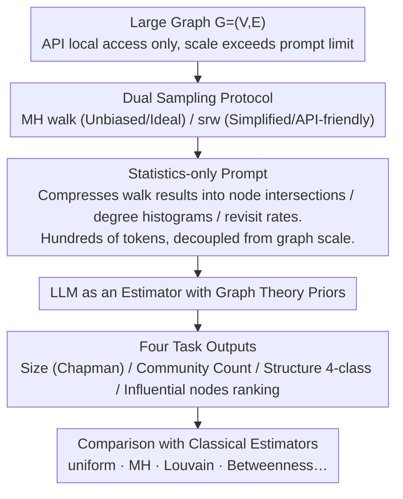

# Evaluating LLMs on Large-Scale Graph Property Estimation via Random Walks

**Conference**: ACL 2026  
**arXiv**: [2605.01484](https://arxiv.org/abs/2605.01484)  
**Code**: https://zenodo.org/records/19632942  
**Area**: Graph Learning / LLM Evaluation / Estimation Algorithms  
**Keywords**: large graph reasoning, random walk, LLM benchmark, graph property estimation, partial access

## TL;DR
Existing LLM graph reasoning benchmarks are limited to small graphs (20–50 nodes) and assume full visibility. This paper compresses real-world graphs (up to 2.39M nodes) into prompts using "random walk statistics." It proposes EstGraph to evaluate LLMs on four estimation tasks: node/edge count, community count, graph structure, and influential nodes. Findings show that LLMs achieve $< 20\%$ relative error on medium-scale graphs and effectively identify graph structures.

## Background & Motivation

**Background**: Almost all LLM graph reasoning benchmarks, such as NLGraph, GraphQA, GraphArena, and GraphPattern, encode the entire graph as an edgelist or adjacency list within the prompt. These benchmarks primarily focus on "algorithm execution" tasks like shortest path, connectivity, or Hamiltonian paths.

**Limitations of Prior Work**: (1) **Context window limits**: Typical benchmarks are capped at 20–50 nodes, which is 4–6 orders of magnitude smaller than real-world graphs. (2) **Full visibility assumption**: Real-world graphs (e.g., social networks, Web, P2P) are often accessible only via local API queries, making it impossible to acquire the full graph at once. (3) **Performance collapse on large graphs**: Empirical tests show that even for simple tasks like converting an edgelist to an adjacency list, LLMs suffer from missing edges or hallucinations as node counts increase (Fig. 1). (4) **Misaligned task focus**: Large-scale graph analysis usually prioritizes global statistics like community structure, degree distribution, and influential nodes rather than exact algorithm execution.

**Key Challenge**: As graph scale grows, the number of required tokens increases linearly, hitting the context window limit. Even if the graph fits, LLMs struggle to maintain a "consistent global perspective." Furthermore, traditional estimation algorithms (e.g., MH-walk, max-degree walk) require either unbiased sampling (unfeasible via standard APIs) or global information like the maximum degree.

**Goal**: (1) Move beyond the "full visibility" assumption and introduce a "partial access via random walks" setting. (2) Design four estimation tasks for large graphs: size, community, structure, and influential nodes. (3) Construct task-specific "walk statistics prompts" where length is independent of graph scale. (4) Systematically compare LLMs against classical estimators on synthetic (up to 100k nodes) and real graphs (up to 2.39M nodes).

**Key Insight**: Classical graph estimation literature (e.g., capture-recapture, Chapman estimators) infers global properties from local random walks. By compressing walk results into statistics (degree distribution, revisit rates, node overlap) before feeding them to LLMs, the models can leverage graph theory priors for reasoning, bypassing context limits and utilizing world knowledge.

**Core Idea**: Replace "full graph encoding" with "task-specific random-walk statistics," treating the LLM as an "estimator with graph theory common sense" rather than an "algorithm executor."

## Method

### Overall Architecture

EstGraph targets realistic scenarios where graphs are too large for prompts and accessible only through local APIs. Instead of encoding the full graph, it performs several random walk samplings on the large graph $G=(V,E)$. These are compressed into scale-independent statistics (node intersections, degree histograms, revisit rates) for the prompt. The LLM then acts as an estimator with graph theory priors to output scalar estimates or rankings. The four tasks share a pipeline of "Sampling $\rightarrow$ Statistics $\rightarrow$ LLM Reasoning $\rightarrow$ Comparison," varying only in walk strategy and statistic type.

### Key Designs

**1. Statistics-only Prompt: Compressing prompt length from $\Theta(n+m)$ to $\Theta(\log n)$**

Real-world graphs (e.g., ego-Twitter, wiki-Talk) require $10^5$–$10^7$ tokens for edgelist encoding, exceeding LLM windows. EstGraph feeds only aggregated statistics. For size estimation, it uses the Chapman estimator concept: $\hat{N}=\frac{(|\mathcal{S}_1|+1)(|\mathcal{S}_2|+1)}{|\mathcal{C}|}-1$, where $\mathcal{S}_1, \mathcal{S}_2$ are node sets from independent MH walks and $\mathcal{C}$ is their intersection. The prompt contains only scalars like $|\mathcal{S}_1|, |\mathcal{S}_2|, |\mathcal{C}|, \bar{d}$. This reduces tokens by up to **559×**, making evaluation on 2.39M node graphs feasible.

**2. Four-task Benchmark: Covering core estimation needs for large-scale graphs**

Tasks are chosen based on having ground truths and mature classical estimators. **Size estimation** (nodes/edges) is tested on BA/ER/GRP synthetic graphs and 5 SNAP real graphs against uniform/MH/max-degree estimators. **Community count** uses 20 LFR graphs compared against Louvain/Greedy algorithms. **Graph structure recognition** is a 4-class classification (BA/ER/LFR/Grid). **Influential node ranking** predicts top-20 nodes for Betweenness/Closeness/PageRank on LFR graphs, evaluated by Precision@20.

**3. MH vs. srw Dual Sampling Protocol: Focusing on real-world constraints**

MH-walk (Metropolis-Hastings) is the gold standard for unbiased estimation but requires reject sampling and global knowledge, often unavailable via APIs. Simple Random Walk (srw) transfers uniformly via neighbors and is API-friendly but degree-biased. This paper reports results for both, using † to distinguish "ideal but unfeasible" (unbiased) from "actually feasible" (srw) methods.

### Loss & Training

This is an evaluation-only work with no training involved. LLMs (Gemini-1.5-Pro, o3, Claude-3.5-Sonnet, DeepSeek-V3.1) are queried via APIs. Hyperparameters for walks (steps, starting points) are fixed, and results are reported as medians/means over 5 independent runs.

## Key Experimental Results

### Main Results

Node count estimation on synthetic BA/ER/GRP graphs, median relative error % (Large: 10k–100k nodes):

| Graph Type | uniform† | MH† | o3 (MH)† | o3 (srw) | Gemini-1.5-Pro (srw) | DeepSeek-V3.1 (srw) |
|------------|----------|-----|----------|----------|----------------------|----------------------|
| BA Large   | 0.60     | 12.17 | 13.08    | 25.47    | 52.56                | 26.97                |
| ER Large   | 0.77     | 2.39  | 3.41     | 5.57     | 8.08                 | 6.87                 |
| GRP Large  | 0.56     | 2.51  | 2.81     | 4.94     | 16.84                | 4.94                 |

Node count estimation on real million-scale graphs, median relative error %:

| Dataset (Scale) | MH†    | Gemini-1.5-Pro (MH) | o3 (srw) | DeepSeek-V3.1 (srw) |
|-----------------|--------|---------------------|----------|---------------------|
| ego-Twitter     | 51.02  | 66.04               | 51.85    | 51.83               |
| twitch-gamers   | 59.62  | 36.64               | 52.41    | 52.41               |
| email-EuAll     | 136.20 | 19.06               | 28.84    | 29.99               |
| as-skitter      | 75.21  | 30.01               | 49.84    | 50.21               |
| wiki-Talk       | 181.04 | 64.37               | 33.03    | 34.38               |

On real graphs, LLMs frequently **outperform the classical MH baseline**.

Structure Recognition Accuracy (4-class):

| Model          | BA     | ER     | LFR    | Grid   |
|----------------|--------|--------|--------|--------|
| Gemini-1.5-Pro | 33.3%  | 73.3%  | 80.0%  | 100%   |
| o3             | 93.3%  | 93.3%  | 26.7%  | 100%   |
| DeepSeek-V3.1  | 80.0%  | 66.67% | 66.67% | 100%   |

Influential Node Ranking Precision@20 (%):

| Model          | Betweenness     | Closeness       | PageRank        |
|----------------|-----------------|-----------------|-----------------|
| o3             | **31.5 ± 14.2** | **35.0 ± 11.7** | **81.0 ± 19.9** |
| DeepSeek-V3.1  | 23.0 ± 13.6     | 20.0 ± 16.4     | 28.5 ± 23.0     |

### Ablation Study

| Dimension | Observation |
|-----------|-------------|
| srw vs MH (BA Large) | srw error is 78% higher than MH (synthetic) but only 9% higher (real). |
| Walk Budget | Increasing budget monotonically decreases size estimation error. |
| Median vs Mean | Median is much lower than mean, suggesting frequent extreme over-estimations. |
| Token Compression | Statistics prompt vs edgelist: up to 559× reduction. |

### Key Findings

- **Small vs. Large Graphs**: On medium-scale synthetic graphs, LLM median error is $< 20\%$. On million-node real graphs, LLMs are more stable than the MH baseline.
- **Feasibility of srw**: LLM error using srw is only a few percentage points higher than MH, proving API-friendly sampling is viable.
- **Median Importance**: LLMs occasionally over-estimate significantly, necessitating multiple runs to obtain a robust median.
- **Task Nuance**: PageRank is easier to estimate than Betweenness/Closeness because it aligns naturally with revisit frequencies in random walks.

## Highlights & Insights

- **Estimation as a New Entry Point**: While exact execution fails on large graphs, estimation tasks provide an "approximation-friendly" buffer that suits LLM reasoning, scaling evaluations from 50 to 2M nodes.
- **Statistics-based Prompt Paradigm**: Decoupling prompt length from graph scale offers a blueprint for processing other large-scale structured data (logs, streaming data, massive tables) via LLMs.
- **Explicit Deployment Constraints**: Labeling baselines by real-world feasibility (†) provides a more honest comparison of how LLMs perform in production environments.
- **Implicit Regularization**: LLMs leverage world knowledge to provide more stable estimates than unsupervised estimators when data is noisy (e.g., wiki-Talk).

## Limitations & Future Work

- **Narrow Task Coverage**: Focuses on only 4 estimation tasks, omitting paths, flow, link prediction, or anomaly detection.
- **Hyperparameter Sensitivity**: High API costs for reasoning models prevented a full grid search on walk budget and burn-in parameters.
- **High Variance**: Large gaps between mean and median suggest single-shot estimates are unreliable.
- **Weakness on Scale-Free Graphs**: LLMs struggle with the heavy-tailed degree distributions of BA graphs compared to MH estimators.

## Related Work & Insights

- **vs. NLGraph/GraphQA**: These assume full visibility and target algorithm execution on $\le 50$ nodes. EstGraph shifts to partial access and global statistics on $2M+$ nodes.
- **vs. Walk&Retrieve**: While earlier works used walks for knowledge graph RAG, EstGraph uses them for "graph property estimation."
- **Paradigm Shift**: EstGraph moves from "describing the graph" to "describing the experiment results on the graph" in the prompt.

## Rating
- Novelty: ⭐⭐⭐⭐ (First to evaluate million-scale graphs via compressed statistics).
- Experimental Thoroughness: ⭐⭐⭐ (Broad coverage, but lacks hyperparameter search).
- Writing Quality: ⭐⭐⭐⭐ (Clear motivation and strong comparative visualizations).
- Value: ⭐⭐⭐⭐ (Provides a practical framework for large-scale structure reasoning).

<!-- RELATED:START -->

## Related Papers

- [\[ICLR 2026\] Actions Speak Louder than Prompts: A Large-Scale Study of LLMs for Graph Inference](../../ICLR2026/graph_learning/actions_speak_louder_than_prompts_a_large-scale_study_of_llms_for_graph_inferenc.md)
- [\[ACL 2026\] Graph-Based Alternatives to LLMs for Human Simulation](graph-based_alternatives_to_llms_for_human_simulation.md)
- [\[ACL 2026\] AgentGL: Towards Agentic Graph Learning with LLMs via Reinforcement Learning](agentgl_towards_agentic_graph_learning_with_llms_via_reinforcement_learning.md)
- [\[ACL 2026\] From Nodes to Narratives: Explaining Graph Neural Networks with LLMs and Graph Context](from_nodes_to_narratives_explaining_graph_neural_networks_with_llms_and_graph_co.md)
- [\[ACL 2026\] LLMs Underperform Graph-Based Parsers on Supervised Relation Extraction for Complex Graphs](llms_underperform_graph-based_parsers_on_supervised_relation_extraction_for_comp.md)

<!-- RELATED:END -->
