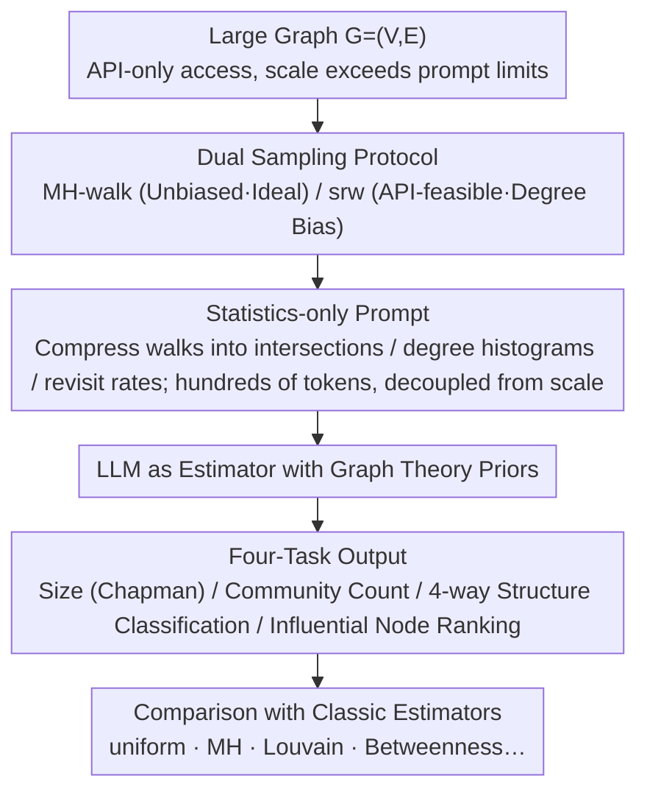

# Evaluating LLMs on Large-Scale Graph Property Estimation via Random Walks

**Conference**: ACL 2026  
**arXiv**: [2605.01484](https://arxiv.org/abs/2605.01484)  
**Code**: https://zenodo.org/records/19632942  
**Area**: Graph Learning / LLM Evaluation / Estimation Algorithms  
**Keywords**: large graph reasoning, random walk, LLM benchmark, graph property estimation, partial access

## TL;DR
Existing LLM graph reasoning benchmarks are limited to small graphs (20–50 nodes) and require full graph visibility. This paper compresses real-world graphs (up to 2.39M nodes) into prompts using "random walk statistics" and proposes EstGraph to evaluate LLMs on four estimation tasks: nodes/edges count, community count, graph structure, and influential nodes. Findings show LLMs achieve < 20% relative error on medium-scale graphs and can effectively distinguish graph structures.

## Background & Motivation

**Background**: Almost all existing LLM graph reasoning benchmarks, such as NLGraph, GraphQA, GraphArena, and GraphPattern, encode the entire graph as an edgelist or adjacency list within the prompt. These benchmarks focus on "algorithm execution" problems like shortest paths, connectivity, and Hamiltonian paths.

**Limitations of Prior Work**: (1) **Context Constraints**: Typical benchmarks cap at 20–50 nodes, lagging 4–6 orders of magnitude behind real-world graphs. (2) **Invalid Full-Visibility Assumption**: Real-world graphs (Social Nets/Web/P2P) are often accessed via APIs with only local queries available. (3) **Performance Collapse on Large Graphs**: Empirical tests show LLMs fail at simple local tasks (e.g., converting edgelist to adjacency list) as node counts increase, leading to missing edges or hallucinations (Fig. 1). (4) **Misaligned Task Focus**: Analysis of large graphs cares more about global statistics like community structure, degree distribution, and influential nodes rather than micro-algorithm execution.

**Key Challenge**: As graph size grows, the number of tokens for encoding increases linearly, hitting context window limits. Even if forced into the prompt, LLMs struggle to maintain a "consistent global perspective." Meanwhile, traditional graph estimation algorithms (MH-walk, max-degree walk, return-time) either require unbiased sampling (often impossible via APIs) or global information like the maximum degree.

**Goal**: (1) Abandon the "full visibility" assumption and introduce a "partial access via random walks" setting. (2) Design four estimation tasks for large graphs: size, community, structure, and influential nodes. (3) Construct task-specific "walk-statistics prompts" where prompt length is independent of graph scale. (4) Systematically compare LLMs against classic estimators on synthetic (up to 100k nodes) and real-world graphs (up to 2.39M nodes).

**Key Insight**: Traditional graph estimation literature (capture-recapture, Chapman estimator) infers global properties from local random walks. By compressing walk results into statistics (degree distribution, revisit rates, co-occurrence) before feeding them to LLMs, the model can leverage graph theory priors for reasoning, bypassing context limits and utilizing LLM world knowledge.

**Core Idea**: Replace "full graph encoding" with "task-specific random-walk statistics," treating the LLM as an "estimator with graph theory commonsense" rather than an "algorithm executor."

## Method

### Overall Architecture

EstGraph targets real-world scenarios where "graphs are too large for prompts and only partially accessible via APIs." Instead of encoding the entire graph, it performs random walk sampling on $G=(V,E)$, compresses derived statistics (node intersections, degree histograms, revisit rates) into a scale-decoupled prompt, and tasks the LLM—acting as an estimator with graph theory priors—with outputting scalar estimates or rankings. The four tasks share a pipeline of "Sampling $\rightarrow$ Statistics $\rightarrow$ LLM Reasoning $\rightarrow$ Comparison with Classic Estimators," differing only in walking strategy, statistics type, and output format.

### Key Designs

**1. Statistics-only Prompt: Reducing Prompt Length from $\Theta(n+m)$ to $\Theta(\log n)$**

Encoding real graphs (ego-Twitter, twitch-gamers, email-EuAll, as-skitter, wiki-Talk) as edgelists requires $10^5$–$10^7$ tokens, exceeding context limits. EstGraph feeds only aggregated walk statistics into the prompt. For size estimation, it applies Chapman's capture-recapture estimator: $\hat{N}=\frac{(|\mathcal{S}_1|+1)(|\mathcal{S}_2|+1)}{|\mathcal{C}|}-1$, where $\mathcal{S}_1, \mathcal{S}_2$ are sets sampled from independent MH-walks and $\mathcal{C}$ is their intersection. The prompt contains only scalars like $|\mathcal{S}_1|, |\mathcal{S}_2|, |\mathcal{C}|, \bar{d}$, from which $\hat{M}=\bar{d}\hat{N}/2$ is derived. For structure recognition, it uses degree histograms; for community estimation, it uses revisit and jump patterns within walk subgraphs. This reduces prompts to hundreds of tokens (Fig. 4), a reduction of up to **559×** compared to edgelists, making evaluation of 2.39M nodes possible.

**2. Four-Task Benchmark: Covering Core Estimation Needs for Large Graph Analysis**

The authors selected four tasks with ground truths and established classic estimators for comparison. **Size estimation** (nodes + edges) is conducted on BA/ER/GRP synthetic graphs and 5 SNAP real-world datasets, compared against uniform, MH, max-degree, and return-walk estimators. **Community count** uses 20 LFR synthetic graphs, compared against Louvain, Greedy, and Label Propagation. **Graph structure recognition** involves 4-way classification (BA / ER / LFR / Grid). **Influential node ranking** predicts top-20 nodes for Betweenness, Closeness, and PageRank on LFR graphs, evaluated by Precision@20. These tasks map to scale $\rightarrow$ modularity $\rightarrow$ global topology $\rightarrow$ node importance.

**3. MH vs. srw Dual Sampling Protocol: Highlighting Real-World Constraints**

Two sampling methods are used: MH-walk (Metropolis-Hastings, including burn-in) is the gold standard for unbiased estimation but requires reject samples and global info, making it difficult to implement via restricted APIs. Simple Random Walk (srw) moves uniformly among neighbors and is purely API-feasible but introduces degree bias. Unlike previous works that report only optimistic MH results, this paper reports both, explicitly marking "unbiased sampling (API-inaccessible)" with $\dagger$ to show which results are idealized vs. realistic.

### Loss & Training

This is a pure evaluation study with no training involved. All LLMs (gemini-2.5-pro, o3, sonnet-4, deepseek-v3.1) are inferred via APIs. Walk hyperparameters (steps, starting points, burn-in) are fixed, and results are reported as median/mean/std over 5 independent walk sets.

## Key Experimental Results

### Main Results

Median Relative Error (%) for node counts on synthetic graphs (Large: 10k–100k nodes):

| Graph Type | uniform† | MH† | o3 (MH)† | o3 (srw) | gemini-2.5-pro (srw) | deepseek-v3.1 (srw) |
|------------|----------|-----|----------|----------|----------------------|----------------------|
| BA Large   | 0.60     | 12.17 | 13.08    | 25.47    | 52.56                | 26.97                |
| ER Large   | 0.77     | 2.39  | 3.41     | 5.57     | 8.08                 | 6.87                 |
| GRP Large  | 0.56     | 2.51  | 2.81     | 4.94     | 16.84                | 4.94                 |

Median Relative Error (%) for node counts on large real-world graphs (Millions of nodes):

| Dataset (Scale) | MH† | gemini-2.5-pro (MH) | o3 (srw) | deepseek-v3.1 (srw) |
|-----------------|-----|----------------------|----------|----------------------|
| ego-Twitter     | 51.02 | 66.04               | 51.85    | 51.83                |
| twitch-gamers   | 59.62 | 36.64               | 52.41    | 52.41                |
| email-EuAll     | 136.20 | 19.06              | 28.84    | 29.99                |
| as-skitter      | 75.21  | 30.01              | 49.84    | 50.21                |
| wiki-Talk       | 181.04 | 64.37              | 33.03    | 34.38                |

LLMs **outperform classic MH baselines** in most real-world scenarios; gemini-2.5-pro reduced error from 136% to 19% on email-EuAll.

Structure Recognition Accuracy (4 classes):

| Model          | BA    | ER    | LFR   | Grid  |
|----------------|-------|-------|-------|-------|
| gemini-2.5-pro | 33.3% | 73.3% | 80.0% | 100%  |
| o3             | 93.3% | 93.3% | 26.7% | 100%  |
| sonnet-4       | 100%  | 13.3% | 6.7%  | 100%  |
| DeepSeek-V3.1  | 80.0% | 66.67%| 66.67%| 100%  |

Influential Node Ranking Precision@20 (%):

| Model          | Betweenness     | Closeness       | PageRank        |
|----------------|-----------------|-----------------|-----------------|
| gemini-2.5-pro | 6.5 ± 7.4       | 9.3 ± 8.4       | 27.5 ± 18.4     |
| o3             | **31.5 ± 14.2** | **35.0 ± 11.7** | **81.0 ± 19.9** |
| sonnet-4       | 15.3 ± 10.1     | 23.8 ± 16.1     | 42.8 ± 28.4     |
| DeepSeek-V3.1  | 23.0 ± 13.6     | 20.0 ± 16.4     | 28.5 ± 23.0     |

### Ablation Study

| Dimension | Observation |
|-----------|-------------|
| srw vs MH (BA Large) | srw error is 78% higher than MH (synthetic) but only 9% higher (real-world). |
| LLM vs Baseline (BA Large, MH) | o3 13% vs uniform 0.6% (uniform requires full nodelist, which is often unavailable). |
| Walk Budget (Fig. 6) | Budget $\uparrow$ $\rightarrow$ size estimation error decreases monotonically. |
| Median of Multiple Runs | Median is significantly lower than the mean, indicating long-tail over-estimations. |
| Community Count (5–12 range) | LLM MAE is 1.9–2.6; Louvain $\approx$ 0. |
| Token Compression Ratio | Statistics prompt vs edgelist: up to 559× reduction. |

### Key Findings

- **Small vs. Large Graphs**: On synthetic medium-scale graphs, LLM median error is < 20%, comparable to MH baselines. On real-world million-node graphs, LLMs are more stable, with gemini/o3 showing lower errors than MH.
- **srw Sufficiency**: Most importantly for deployment, the srw-based LLM route error is only a few percentage points behind MH, proving API-friendly solutions without burn-in are feasible.
- **Median $\neq$ Mean**: LLMs occasionally over-estimate drastically (e.g., deepseek-v3.1 srw BA Large mean 35.38 vs median 26.97), suggesting that multiple runs are needed for robust median estimation.
- **Significant Model Variance**: o3 is strongest in structure recognition and influential node ranking; gemini-2.5-pro is most stable for size estimation on real graphs; sonnet-4 tends to classify any graph as BA.
- **PageRank > Betweenness/Closeness**: LLMs approximate PageRank well based on degree distribution as it aligns with srw frequency. Shortest-path metrics (Betweenness) are harder to infer from walks.
- **Massive Token Compression**: For graphs like wiki-Talk, edgelist encoding requires millions of tokens, while statistics prompts require only hundreds ($\ge 500\times$ reduction).

## Highlights & Insights

- **"Estimation Tasks" as the Correct Entry Point for Large Graphs**: Precise algorithm execution makes sense for small graphs but fails at scale. Estimation tasks tolerate approximation, matching LLMs' probabilistic reasoning and jumping the benchmark scale from 50 to 2M nodes.
- **Prompt = Task-specific Statistical Summary**: Using graph theory priors to design prompts as "statistical summaries + task prompts" decouples prompt length from data scale. This paradigm is valuable for any scenario requiring large data input to LLMs (log analysis, stream monitoring, massive tables).
- **Explicit Deployment Constraints ($\dagger$)**: Labeling baselines as API-feasible or not is a best practice. It prevents unfair comparisons and clarifies how well LLMs perform in real-world deployment.
- **"Implicit Regularization" Effect**: When data is noisy, LLMs' world knowledge leads to more stable estimates than unsupervised estimators, as seen in wiki-Talk where LLM error was fold-levels lower than MH.

## Limitations & Future Work

- **Narrow Task Scope**: Only 4 estimation tasks were covered, excluding paths, traffic, link prediction, or anomaly detection.
- **Insufficient Hyperparameter Ablation**: Due to reasoning LLM API costs, walk steps and burn-in were not fully grid-searched.
- **High Output Variance**: Means are often 2–10x higher than medians, requiring multiple runs. There is no confidence interval output.
- **Weakness on BA Graphs**: LLMs struggle with the extremely long-tailed degree distributions of BA graphs compared to MH.
- **Low Precision for Betweenness (< 35%)**: Shortest-path info cannot be directly inferred from random walks; specialized approximation algorithms + LLM synergy are needed.
- **No Textual Attribute Graphs**: Real-world graphs (papers, user profiles) have text attributes where LLMs should have a greater advantage, but this was not evaluated.
- **No Training Data Provided**: The study relies on prompt-based reasoning; fine-tuning a "graph-stat-LLM" remains unexplored.

## Related Work & Insights

- **vs. NLGraph / GraphQA / GraphArena**: These benchmarks assume full visibility, $\le 50$ nodes, and test algorithm execution. EstGraph assumes partial access, up to 2.39M nodes, and tests estimation.
- **vs. GraphPattern (Dai et al. 2025)**: GraphPattern focuses on motif recognition in local/small graphs; EstGraph addresses global properties in large graphs.
- **vs. Talk like a Graph (Fatemi et al. 2024)**: Fatemi compares encoding styles (edgelist, adjacency) for small graphs; this paper shifts to "encoding sampling statistics" as a new paradigm for large graphs.
- **vs. Classic capture-recapture / MH / max-degree**: Instead of replacing them, this paper uses their components (intersection size, mean degree) as LLM input features.

## Rating
- Novelty: ⭐⭐⭐⭐ First to expand LLM graph evaluation from "full visibility small graphs" to "partial access million-node graphs" using a "sampling statistics + LLM" framework.
- Experimental Thoroughness: ⭐⭐⭐ Covers 4 tasks across 4 LLMs on 8 datasets, but lacks full hyperparameter ablation and more diverse baselines for some tasks.
- Writing Quality: ⭐⭐⭐⭐ Clear motivation and strong comparative visualizations; prompt design details are mostly in the appendix.
- Value: ⭐⭐⭐⭐ Provides a new dataset, deployment-ready prompt patterns, and 6 practical insights for practitioners using LLMs on large-scale graphs.

<!-- RELATED:START -->

## Related Papers

- [\[ACL 2026\] Graph-Based Alternatives to LLMs for Human Simulation](graph-based_alternatives_to_llms_for_human_simulation.md)
- [\[AAAI 2026\] GT-SNT: A Linear-Time Transformer for Large-Scale Graphs via Spiking Node Tokenization](../../AAAI2026/graph_learning/gt-snt_a_linear-time_transformer_for_large-scale_graphs_via_spiking_node_tokeniz.md)
- [\[ACL 2026\] AgentGL: Towards Agentic Graph Learning with LLMs via Reinforcement Learning](agentgl_towards_agentic_graph_learning_with_llms_via_reinforcement_learning.md)
- [\[ICLR 2026\] GraphUniverse: Synthetic Graph Generation for Evaluating Inductive Generalization](../../ICLR2026/graph_learning/graphuniverse_synthetic_graph_generation_for_evaluating_inductive_generalization.md)
- [\[ACL 2026\] From Nodes to Narratives: Explaining Graph Neural Networks with LLMs and Graph Context](from_nodes_to_narratives_explaining_graph_neural_networks_with_llms_and_graph_co.md)

<!-- RELATED:END -->
