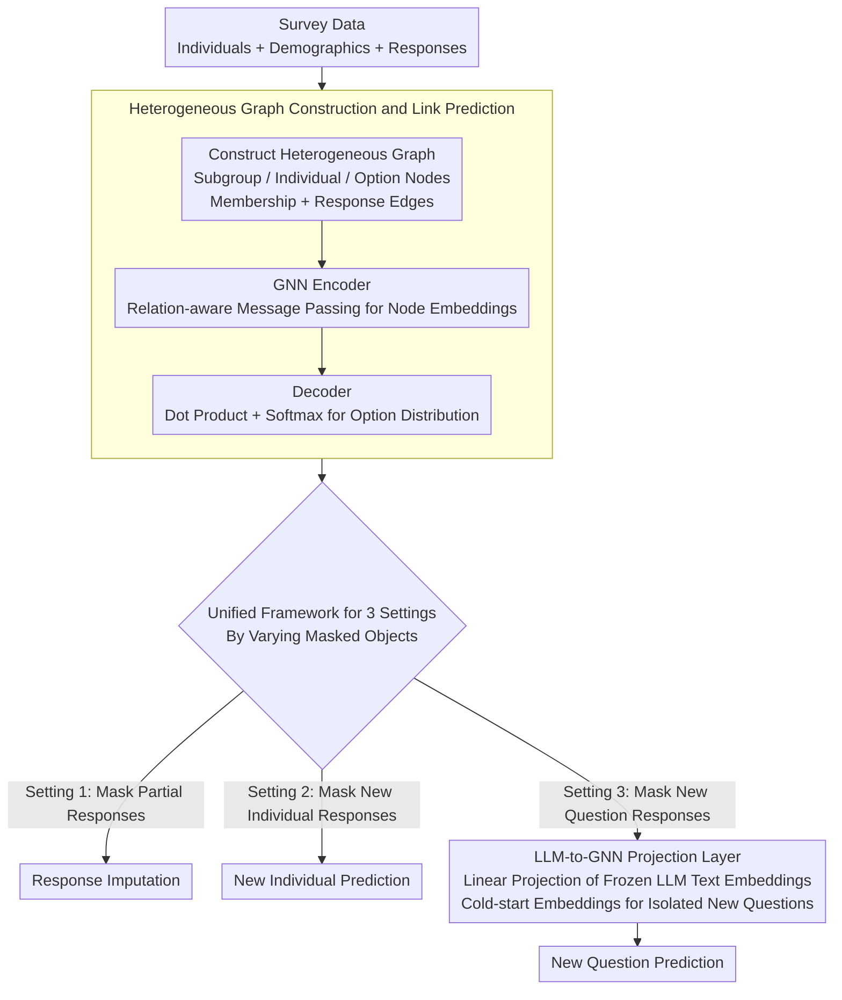

# Graph-Based Alternatives to LLMs for Human Simulation

**Conference**: ACL 2026  
**arXiv**: [2511.02135](https://arxiv.org/abs/2511.02135)  
**Code**: [GitHub](https://github.com/schang-lab/gems)  
**Area**: Graph Learning / Human Behavior Simulation  
**Keywords**: Graph Neural Networks, Human Simulation, Link Prediction, Heterogeneous Graphs, Questionnaire Prediction

## TL;DR

This paper proposes GEMS (Graph-basEd Models for Human Simulation), which models closed-form human behavior simulation tasks as link prediction problems on heterogeneous graphs. It matches or exceeds strong LLM baselines across three datasets and three evaluation settings while reducing the number of parameters by three orders of magnitude.

## Background & Motivation

**Background**: Human behavior simulation has attracted significant attention recently, with LLMs serving as the nearly exclusive mainstream approach. Extensive work utilizes LLMs to predict questionnaire responses, social science experiment outcomes, voting results, and test scores in closed-form tasks.

**Limitations of Prior Work**: (1) LLMs are expensive to run and train; (2) opaque pre-training processes raise concerns regarding data leakage and social bias; (3) for closed-form tasks where answers are selected from fixed options, the advantages of open-ended text generation in LLMs may not be fully utilized.

**Key Challenge**: The essence of closed-form simulation tasks is predicting an individual's choice from limited options. This is closer to link prediction in recommendation systems than to natural language generation tasks; however, the field has largely overlooked this relational structure modeling perspective.

**Goal**: To explore whether smaller, more transparent model categories (GNNs) can compete with LLMs in closed-form human simulation tasks.

**Key Insight**: Represent individuals and options as nodes in a heterogeneous graph and observed choices as edges. Leverage the relational inductive bias of GNNs to learn representations of individuals, sub-groups, and options.

**Core Idea**: Replace LLM token prediction with graph neural network link prediction, utilizing the relational structure of human choices rather than language understanding to simulate behavior.

## Method

### Overall Architecture

GEMS reformulates the closed-form human simulation task of "predicting which option an individual selects from a limited set" as a link prediction problem common in recommendation systems. It constructs a heterogeneous graph containing three types of nodes: sub-group nodes $\mathcal{S}$ (demographic groups such as age/gender), individual nodes $\mathcal{U}$, and option nodes $\mathcal{C}$ (all answers for each question). These are connected by two types of bidirectional relations: membership edges (Individual $\to$ Sub-group) and response edges (Individual $\to$ Option). A GNN encoder learns node embeddings through relation-aware message passing, and a decoder predicts the distribution of options for an individual on a specific question using dot products followed by a softmax. The system simulates human choices via graph structure rather than language. Three evaluation settings share the same graph by varying the "masked objects," with the new question scenario utilizing an additional LLM-to-GNN projection layer to provide cold-start embeddings.

### Key Designs

**1. Heterogeneous Graph Construction and Link Prediction: Replacing Language Understanding with "Similar Individuals Make Similar Choices" Relational Inductive Bias**

GEMS intentionally ensures individual nodes carry only a uniform, non-identifiable feature, offloading discriminative power entirely to learnable sub-group and option embedding tables. This forces the model to learn patterns from relational structures rather than identity memorization. After several layers of message passing, the GNN aggregates neighborhood information to obtain the output embedding $z_w^O$. The decoder provides the probability of individual $u$ selecting options for question $q$ as $p(c|u,q) = \text{softmax}(\text{Dot}(z_u^O, z_c^O) / \tau)$. The training objective is self-supervised link prediction—randomly masking partial response edges and reconstructing them. This is essentially a collaborative filtering approach (people with similar tastes make similar choices) systematically applied to human behavior simulation.

**2. Unified Framework for Three Evaluation Settings: A Single Graph Model Covering Three Reality Scenarios**

Using the same graph and message-passing mechanism, GEMS addresses three core human simulation scenarios by varying the masking targets. Setting 1 (Response Imputation) randomly masks responses from existing individuals, corresponding to survey completion. Setting 2 (New Individual Prediction) completely hides all responses for a subset of individuals during training, keeping only demographic features, corresponding to predicting new populations. Setting 3 (New Question Prediction) completely hides all responses for a subset of questions during training, corresponding to new questionnaire design. These three settings encompass generalizations across "existing users/existing questions," "new users/existing questions," and "existing users/new questions," providing a unified evaluation dimension for different methods.

**3. LLM-to-GNN Projection Layer (Setting 3 Only): Providing Cold-start Embeddings for Isolated New Question Nodes**

The challenge in Setting 3 is that option nodes for new questions are isolated in the graph without response edges, preventing message passing from generating embeddings. GEMS compensates by learning a linear projection $z_c' = \mathbf{W}_{\text{proj}} h_{\text{LLM}}(c)$, which maps the hidden states of a frozen LLM for the option text into the GNN embedding space. During training, the MSE between the projection result and the actual GNN output embedding is minimized on observed option nodes. This adds only $d_{\text{LLM}} \times d_{\text{GNN}}$ parameters, making it much more efficient than fine-tuning an LLM. Furthermore, text is only utilized in Setting 3; the first two settings do not require any linguistic representations or LLM queries at runtime.

### Loss & Training

Link prediction utilizes cross-entropy loss, where masked response edges serve as positive samples and other options for the same question serve as implicit negative samples after softmax normalization. The LLM-to-GNN projection layer is trained separately using ridge regression.

## Key Experimental Results

### Main Results

**Setting 1: Response Imputation (Accuracy)**

| Method | OpinionQA | Twin-2K | Dunning-Kruger |
|------|-----------|---------|----------------|
| Zero-shot (Qwen3-8B) | 39.38 | 52.06 | 41.82 |
| Few-shot FT (8, best LLM) | 55.98 | 66.36 | 57.21 |
| **GEMS (SAGE)** | **57.00** | **66.62** | **57.89** |

### Ablation Study

**Setting 2: New Individual Prediction (Accuracy)**

| Method | OpinionQA | Twin-2K | Dunning-Kruger |
|------|-----------|---------|----------------|
| SFT (best LLM) | 50.56 | 61.85 | 56.66 |
| **GEMS (RGCN)** | **50.50** | **62.39** | **56.76** |

### Key Findings

- In Settings 1 and 2, GEMS matches or exceeds the strongest LLM fine-tuning methods using only graph structures without linguistic representations.
- Setting 3 (New Questions) requires LLM-to-GNN projection, but still does not require LLM queries at runtime.
- GEMS has approximately $10^3$ times fewer parameters than LLMs and reduces computational overhead by up to $10^2$ times.
- Three GNN architectures (RGCN, GAT, GraphSAGE) perform similarly, with SAGE being slightly superior.
- On OpinionQA, GEMS consistently outperforms Agentic CoT and SFT, indicating that relational structure is more critical than language understanding.

## Highlights & Insights

- The core insight is remarkably concise and powerful: closed-form human simulation is essentially a recommendation system problem, where relational structure is more important than language understanding.
- The experimental design is rigorous, comparing 5 LLM methods $\times$ 3 models $\times$ 3 datasets $\times$ 3 settings under equal conditions.
- GEMS can be trained from scratch on domain data, circumventing data leakage and bias issues inherent in LLM pre-training.

## Limitations & Future Work

- Evaluation is limited to closed-form tasks and cannot currently extend to open-ended human simulation (e.g., dialogue generation, behavioral narratives).
- Setting 3 still requires a frozen LLM to extract text features, indicating it is not entirely independent of LLMs.
- Graph construction relies on predefined sub-groups (e.g., demographic variables); methods for automated sub-group discovery have not been explored.
- Systemic comparisons with classic discrete choice models (e.g., MNL, mixed logit) were not conducted.

## Related Work & Insights

- **vs LLM Fine-tuning (Suh et al., 2025)**: The latter fine-tunes LLMs on the same data but with 1000x more parameters; GEMS performs comparably in Setting 1.
- **vs Recommendation System GNNs**: Technically similar to graph recommendation (e.g., PinSage), but this marks the first systematic application to the field of human behavior simulation.
- **vs Agentic CoT**: The latter uses reflection and prediction in dual-agent chain-of-thought reasoning, yet it underperforms compared to simple SFT and GEMS in most settings.

## Rating

- Novelty: ⭐⭐⭐⭐ First systematic demonstration that GNNs can match LLMs in human simulation; the shift in perspective is insightful.
- Experimental Thoroughness: ⭐⭐⭐⭐⭐ Extremely comprehensive comparison across 3 datasets, 3 settings, 5 LLM methods, and 3 LLM models.
- Writing Quality: ⭐⭐⭐⭐ Clear problem definitions and logical experimental flow.
- Value: ⭐⭐⭐⭐ Provides an efficient and transparent alternative for the human simulation field.

<!-- RELATED:START -->

## Related Papers

- [\[ACL 2026\] AgentGL: Towards Agentic Graph Learning with LLMs via Reinforcement Learning](agentgl_towards_agentic_graph_learning_with_llms_via_reinforcement_learning.md)
- [\[ICML 2025\] EvoMesh: Adaptive Physical Simulation with Hierarchical Graph Evolutions](../../ICML2025/graph_learning/evomesh_adaptive_physical_simulation_with_hierarchical_graph_evolutions.md)
- [\[ACL 2026\] From Nodes to Narratives: Explaining Graph Neural Networks with LLMs and Graph Context](from_nodes_to_narratives_explaining_graph_neural_networks_with_llms_and_graph_co.md)
- [\[ACL 2026\] Comparing Human and Large Language Model Interpretation of Implicit Information](comparing_human_and_large_language_model_interpretation_of_implicit_information.md)
- [\[ACL 2026\] Evaluating LLMs on Large-Scale Graph Property Estimation via Random Walks](evaluating_llms_on_large-scale_graph_property_estimation_via_random_walks.md)

<!-- RELATED:END -->
