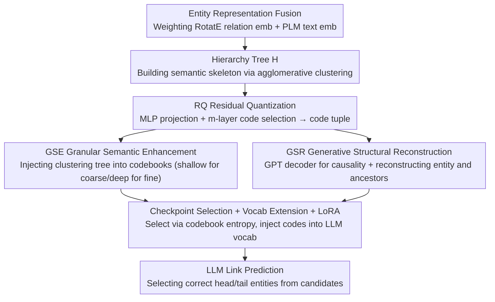

# GS-Quant: Granular Semantic and Generative Structural Quantization for Knowledge Graph Completion

**Conference**: ACL 2026  
**arXiv**: [2604.21649](https://arxiv.org/abs/2604.21649)  
**Code**: https://github.com/mikumifa/GS-Quant (Available)  
**Area**: Graph Learning / Knowledge Graph Completion / Quantization  
**Keywords**: KGC, RQ-VAE, hierarchical clustering, codebook, LLM vocabulary expansion

## TL;DR
GS-Quant quantizes Knowledge Graph (KG) entities into "coarse-to-fine" discrete code sequences. By constraining RQ-VAE with a hierarchical clustering tree, shallow codes encode global categories (e.g., "Person") while deep codes encode fine-grained attributes (e.g., "Artist"). A GPT-style decoder reconstructs both the entity and its ancestors to enforce causal dependencies among codes. These codes are subsequently added to the LLM vocabulary for LoRA fine-tuning, achieving a Hits@1 improvement of 2.2-2.4 points over the SOTA SSQR on WN18RR and FB15k-237.

## Background & Motivation

**Background**: Knowledge Graph Completion (KGC) has branched into two main directions following the introduction of LLMs: (1) **text-based** methods linearize triples into natural language prompts (KICGPT, DIFT, KG-FIT, MKGL), which are readable but suffer from token explosion and disrupted graph topology; (2) **embedding-based** methods inject KG embeddings into the LLM latent space (TransE/RotatE + adapter), which is efficient but suffers from a **modality mismatch between continuous embeddings and discrete tokens**.

**Limitations of Prior Work**: (1) Text-based methods often consume hundreds of tokens per triple, making inference prohibitive on datasets like FB15k-237; (2) Embedding-based methods force holistic dense vectors into the LLM, but LLMs are essentially next-token sequence models that cannot leverage their autoregressive strengths on single-point embeddings; (3) Recent quantization methods (SSQR, ReaLM) target this by encoding entities into code sequences, yet **codes remain flat numerical compressions**—projecting an entity into 4 codes with no semantic hierarchical relationship, behaving more like hash signatures than a "language."

**Key Challenge**: Human reasoning and LLM generation both follow a **coarse-to-fine** hierarchical structure (classification followed by refinement). Existing quantization methods flatten all codes and retrieve them via Euclidean nearest neighbors, resulting in **no hierarchy or causality among codes**—preventing the LLM from distinguishing "categories" from "instances" within a sequence.

**Goal**: (1) Ensure that the quantized code sequences are semantically **hierarchical**—where shallow codes encode coarse-grained categories and deep codes encode fine-grained attributes; (2) Establish **generative causal dependencies** between codes rather than treating them as independent; (3) Demonstrate that such "structured codes" are more effective when integrated into the LLM vocabulary for KGC.

**Key Insight**: This work builds on RQ-VAE (Residual Quantization naturally possesses a numerical recursive hierarchy $\mathbf{r}_{l+1} = \mathbf{r}_l - \mathbf{v}_{c_l}^l$), but argues that numerical hierarchy alone is insufficient. It is necessary to **explicitly inject semantic hierarchy**. This is achieved by first building a hierarchy tree $\mathcal{H}$ via agglomerative clustering on entity embeddings and then aligning each layer of RQ to the corresponding level of this tree.

**Core Idea**: **Granular Semantic Enhancement (GSE)** injects the hierarchical clustering tree into codebook learning; **Generative Structural Reconstruction (GSR)** utilizes a GPT-style decoder to reconstruct entities and their ancestors to introduce causal dependencies. Both are jointly trained with the RQ commitment loss.

## Method

### Overall Architecture

The objective of GS-Quant is to compress each KG entity into a discrete code sequence that is "language-like, hierarchical, and causal" to serve as input for LLM-based link prediction. The pipeline starts by weight-fusing RotatE relation embeddings with PLM text embeddings to form entity representations $\mathbf{s}_x = \rho \mathbf{s}_x^{\mathcal{G}} + (1-\rho) \mathbf{s}_x^T$. Agglomerative clustering is performed offline on these representations to construct a hierarchy tree $\mathcal{H}$ as the semantic skeleton. Subsequently, $\mathbf{s}$ is projected via MLP into $\mathbf{r}_0 = \mathbf{z}$, and Residual Quantization ($m$ layers, selecting $c_l = \arg\min_k \|\mathbf{r}_l - \mathbf{v}_k^l\|_2$ with residual recursion $\mathbf{r}_{l+1} = \mathbf{r}_l - \mathbf{v}_{c_l}^l$) is applied to obtain the code tuple $\mathcal{I} = \{c_i\}_{i=0}^{m-1}$. Two constraints, GSE and GSR, inject the tree's hierarchical semantics and causal dependencies into these codes. Finally, all codes from the codebook are added as new tokens to the LLM vocabulary. LoRA fine-tuning is performed on the code embeddings and adapters while freezing the LLM backbone, enabling the LLM to select the correct head/tail entity from a candidate list.

### Key Designs

**1. Granular Semantic Enhancement (GSE): Integrating the clustering tree into every codebook layer**

In vanilla RQ-VAE, "hierarchy" is merely numerical recursion without semantic meaning; "Person" (coarse) and "Artist" (fine) could be clustered in the same codebook layer (Fig 4b). GSE treats the offline hierarchy tree $\mathcal{H}$ as a supervisory signal, forcing codes in the $i$-th layer of RQ to align with cluster centers $\boldsymbol{\mu}_e$ of the $i$-th level of the tree—shallow layers learn coarse categories, while deep layers learn fine details. Since code selection is discrete and non-differentiable, a straight-through surrogate $\tilde{\mathbf{v}}_i = \mathbf{r}_i + \operatorname{sg}[\mathbf{v}_{c_i}^i - \mathbf{r}_i]$ is used to propagate gradients. Two opposing contrastive constraints are applied: Coarse-to-Fine Alignment $\mathcal{L}_1$ pulls $\tilde{\mathbf{v}}_i$ towards its center $\boldsymbol{\mu}_e$ at layer $i$, with an exponentially decaying weight $\lambda_1^{i+1}/m$ ($\lambda_1\in(0,1)$) giving priority to coarse categories in shallow layers. Hierarchical Separability $\mathcal{L}_2$ pushes $\tilde{\mathbf{v}}_i$ away from neighboring centers $\mathbf{n}\in\mathcal{N}_e$ in the tree, with a reverse-decaying weight $\lambda_2^{m-i}/m$ emphasizing discriminative separation in deep layers. This dual constraint results in a codebook structure (Fig 4a) where shallow codes are sparse/uniform and deep codes are dense/discriminative, matching the "classify then refine" intuition of language.

**2. Generative Structural Reconstruction (GSR): Adding causal dependencies via GPT decoder**

Hierarchy alone is insufficient; if $m$ codes are independent, the LLM cannot distinguish conditional dependencies within the sequence. GSR reconstructs the code tuple into an "ordered semantic sentence." A learnable query sequence $\mathcal{Q}=\{\mathbf{q}_i\}_{i=0}^L$ is concatenated with $\tilde{\mathbf{v}}$ and fed into a Transformer decoder with causal self-attention. This forces the $l$-th code to depend only on codes $<l$, creating an "ordered coarse-to-fine" autoregressive dependency isomorphic to LLM generation dynamics. The decoder outputs are assigned to different targets: $\mathbf{o}_0$ reconstructs the entity $\mathbf{s}$, and $\{\mathbf{o}_i\}_{i\ge 1}$ reconstruct the entity's ancestors $\{\mathbf{h}_i\}$ in $\mathcal{H}$. The loss is $\mathcal{L}_{\text{GSR}} = \|\tilde{\mathbf{o}}_0 - \mathbf{s}\|_2^2 + \lambda_s \|\tilde{\mathbf{o}}_1 - \mathbf{h}_0\|_2^2 + \lambda_h \sum_{i=2}^L \|\tilde{\mathbf{o}}_i - \mathbf{h}_{i-1}\|_2^2$, where $\lambda_s \ll \lambda_h$ (since $\mathbf{h}_0$ is already constrained by GSE). Reconstructing ancestors enforces that the code sequence retains multi-granularity information, preventing collapse into "only encoding the entity." Removing GSR drops Hits@1 by 0.8% on WN18RR and 1.1% on FB15k-237, validating that causal dependency makes codes more "language-like."

**3. Codebook Entropy Selection + Vocab Extension + LoRA: Integrating codes into LLMs**

RQ-VAE training often suffers from "collapse," where a few codes monopolize all activations while others remain "dead." To address this, codebook entropy $\mathcal{Y} = -\frac{1}{M}\sum_m \sum_k p_k^m \log p_k^m$ is used as a model selection signal. $\mathcal{Y}$ is maximized when all codes are equally activated ($p_k^m = 1/K$), which is equivalent to maximizing codebook expressiveness. Table 3 shows that $\mathcal{Y}$ correlates positively with downstream MRR/Hits@K, allowing checkpoint selection purely based on this self-supervised metric without per-epoch downstream evaluation. Once the codebook is fixed, all $M\times K$ codes are injected into the LLM vocabulary as new tokens. The LLM backbone is frozen, and only the new token embeddings and LoRA adapters (on attention/FFN) are trained, preserving general capabilities while learning KG knowledge. During inference, the LLM directly selects from candidate entities, using templates aligned with DIFT for fairness.

### Loss & Training
- **Quantization Phase**: $\mathcal{L}_{\text{total}} = \mathcal{L}_Q + \mathcal{L}_{\text{GSE}} + \mathcal{L}_{\text{GSR}}$ ($\mathcal{L}_Q$ is standard commitment loss). Checkpoints are selected based on codebook entropy $\mathcal{Y}$.
- **LLM Phase**: Freeze backbone parameters; update only new code embeddings and LoRA adapters using language modeling loss for candidate selection.
- **Key Hyperparameters**: $\lambda_1 = 0.8$, $\lambda_2 = 0.4$, $\lambda_s$ is small while $\lambda_h$ is large; $\rho$ controls the graph/text fusion ratio.
- **Overhead**: GSE and GSR add only approximately 4%-18% additional training time, which is not a prohibitive overhead compared to vanilla RQ-VAE.

## Key Experimental Results

### Main Results

KGC performance on WN18RR and FB15k-237 (candidates and templates aligned with DIFT):

| Method | WN18RR MRR | WN18RR H@1 | WN18RR H@3 | WN18RR H@10 | FB15k-237 MRR | FB15k-237 H@1 | FB15k-237 H@3 | FB15k-237 H@10 |
|---|---|---|---|---|---|---|---|---|
| TransE | 0.243 | 0.043 | 0.441 | 0.532 | 0.279 | 0.198 | 0.376 | 0.441 |
| RotatE | 0.476 | 0.428 | 0.492 | 0.571 | 0.338 | 0.241 | 0.375 | 0.533 |
| CompGCN | 0.479 | 0.443 | 0.494 | 0.546 | 0.355 | 0.264 | 0.390 | 0.535 |
| MEM-KGC | 0.557 | 0.475 | 0.604 | 0.704 | 0.346 | 0.253 | 0.381 | 0.531 |
| CoLE | 0.593 | 0.538 | 0.616 | 0.701 | 0.389 | 0.294 | 0.429 | 0.572 |
| KICGPT | 0.564 | 0.478 | 0.612 | 0.677 | 0.412 | 0.327 | 0.448 | 0.581 |
| DIFT (Strong LLM-base baseline) | 0.617 | 0.569 | 0.638 | 0.708 | 0.439 | 0.364 | 0.468 | 0.586 |
| MKGL | 0.552 | 0.500 | 0.577 | 0.656 | 0.415 | 0.325 | 0.454 | 0.591 |
| SSQR (Prior quantization) | 0.603 | 0.553 | 0.627 | 0.692 | 0.428 | 0.349 | 0.459 | 0.583 |
| **GS-Quant (Ours)** | **0.635** | **0.594** | **0.649** | **0.712** | **0.455** | **0.386** | **0.479** | **0.592** |

vs DIFT: WN18RR Hits@1 +2.5, FB15k-237 Hits@1 +2.2. vs SSQR: WN18RR Hits@1 +4.1, FB15k-237 Hits@1 +3.7.

### Ablation Study

| Configuration | FB15k-237 MRR | FB15k-237 H@1 | WN18RR MRR | WN18RR H@1 | Description |
|---|---|---|---|---|---|
| **Ours (Full)** | **0.455** | **0.386** | **0.635** | **0.594** | Baseline |
| w/o $\mathcal{L}_1$ (Remove coarse-to-fine alignment) | 0.450 (-0.5%) | 0.377 (-0.9%) | 0.629 (-0.5%) | 0.587 (-0.6%) | GSE partially disabled |
| w/o $\mathcal{L}_2$ (Remove hierarchical separability) | 0.450 (-0.5%) | 0.379 (-0.7%) | 0.625 (-0.9%) | 0.577 (-1.6%) | GSE partially disabled |
| w/o $\mathcal{L}_{\text{GSR}}$ | 0.448 (-0.7%) | 0.375 (-1.1%) | 0.627 (-0.7%) | 0.585 (-0.8%) | No causality in codes |
| **w/o Code (No quantization, LLM+LoRA only)** | **0.404 (-5.1%)** | **0.303 (-8.3%)** | **0.607 (-2.7%)** | **0.541 (-5.2%)** | Quantized tokens are the main contribution |

### Key Findings
- **Quantized code is the primary contribution**: Removing codes (w/o Code) causes an 8.3-point drop in Hits@1 on FB15k-237, proving that encoding KG knowledge into discrete tokens is the core mechanism.
- **GSE and GSR each contribute ~1 point**: Individually, each loss contributes 0.5-1.6 points, but their synergy results in a +4 point Hits@1 gain over SSQR, suggesting that structural inductive bias is more critical than LLM brute force.
- **Hyperparameter robustness**: Performance remains stable within $\lambda_1 \in [0.6, 0.9]$ and $\lambda_2 \in [0.2, 0.5]$; $\lambda_s < \lambda_h$ is consistently optimal—verifying the design intuition against redundant constraints on $\mathbf{h}_0$.
- **Codebook entropy is an effective selection signal**: Positive correlation between $\mathcal{Y}$ and downstream MRR/Hits@K means self-supervised metrics can identify optimal checkpoints.
- **Disentanglement verified via visualization**: Fig 4a (ours) shows sparse, uniform nodes in shallow layers and dense, discriminative nodes in deep layers; Fig 4b (vanilla RQ-VAE) shows three overlapping layers—proving GSE successfully learns hierarchical semantics.
- **Efficiency-friendly**: Removing individual losses only saves 4-18% training time, indicating no prohibitive overhead compared to vanilla RQ-VAE.

## Highlights & Insights
- **The core idea is "making codes structured like language"**: This redefines KGC quantization from "embedding compression" to "creating a new sub-language for LLMs." This framing is deeper than simply stacking losses; it requires code sequences to satisfy linguistic properties: hierarchy (coarse→fine), causality (left→right), and compositionality.
- **Hierarchical tree as a differentiable inductive bias**: Using offline agglomerative clustering to generate a hierarchy tree and then forcing RQ alignment via contrastive loss decouples structural discovery from end-to-end quantization. This avoids training instability and is transferable to any domain requiring "hierarchical quantization" (image tokens, audio codecs, recommendation items).
- **Codebook entropy for supervision**: A highly portable trick for any VQ-VAE/RQ-VAE work to perform model selection and mitigate codebook collapse.
- **GSR ancestor reconstruction target**: Unlike traditional GPT decoders that reconstruct the next token, this reconstructs ancestor embeddings across tree levels—elegantly unifying sequence generation and hierarchical abstraction in a single decoder.
- **Vocab expansion with frozen backbone**: Learning only new token embeddings and LoRA adapters preserves general LLM capabilities while enabling fast domain adaptation—a reusable recipe for injecting quantized representations of structured data (molecules, protein, code) into LLMs.

## Limitations & Future Work
- **Dependency on external KG embeddings**: Using RotatE for $\mathbf{s}^{\mathcal{G}}$ sets a performance ceiling; a weaker backbone would likely hinder results.
- **Static hierarchy tree**: Agglomerative clustering is performed once before training and cannot adapt dynamically; inaccurate initial clustering may lead to suboptimal GSE optimization.
- **Limited benchmark verification**: Tested only on WN18RR and FB15k-237 (40k/15k entities). Scalability to industrial KGs with millions of entities is unverified, and trade-offs between codebook size $K$ and layers $m$ remain unexplored.
- **Lack of concrete comparison on token costs**: While efficiency is claimed over text-based methods, the exact gap in token usage is not quantified.
- **Future Directions**: (i) End-to-end joint learning of the hierarchy tree and codebook (differentiable clustering); (ii) Scaling studies on larger KGs (Wikidata/NELL); (iii) Applying quantized codes to downstream QA/reasoning rather than just link prediction; (iv) Exploring cross-KG transferability of a single codebook.

## Related Work & Insights
- **vs SSQR (Prior vector quantization)**: SSQR uses flat VQ + multiple FFN projections without hierarchy; GS-Quant uses RQ + GSE for hierarchy + GSR for causality, outperforming it by 4.1 points in Hits@1 on WN18RR, proving structured quantization > flat.
- **vs ReaLM**: ReaLM uses residual quantization without semantic hierarchy; GS-Quant demonstrates that codebook design is key to quantization effectiveness in KGC.
- **vs DIFT (SOTA embedding injection)**: DIFT injects continuous embeddings via prompts (Hits@1 0.569 on WN18RR); GS-Quant uses discrete codes (0.594), suggesting discrete representations align better with LLM generative dynamics.
- **vs RQ-VAE Original**: Originally for image generation without semantic hierarchy; GS-Quant adapts it to structured KG data with hierarchical alignment, expanding its application boundaries.
- **vs MKGL / KG-FIT (Text-based)**: Text methods use hundreds of tokens per triple; GS-Quant compresses entities into $m$ (typically 4-8) codes, significantly improving efficiency while achieving superior results—confirming that "structuring the graph as an LLM sub-language" is more effective than "describing the graph in natural language."

## Rating
- Novelty: ⭐⭐⭐⭐ The "code-as-language" framing with GSE + GSR is a clear, novel combination.
- Experimental Thoroughness: ⭐⭐⭐⭐ Excellent ablation, parameter sensitivity, and visualization; lacks large-scale scalability.
- Writing Quality: ⭐⭐⭐⭐ Clear motivation, well-illustrated Fig 4; slight redundancy in text.
- Value: ⭐⭐⭐⭐ Open-sourced SOTA performance; high transfer potential to other quantized structured data tasks.

<!-- RELATED:START -->

## Related Papers

- [\[AAAI 2026\] Beyond Fact Retrieval: Episodic Memory for RAG with Generative Semantic Workspaces](../../AAAI2026/graph_learning/beyond_fact_retrieval_episodic_memory_for_rag_with_generative_semantic_workspace.md)
- [\[ACL 2026\] Collaboration of Fusion and Independence: Hypercomplex-driven Robust Multi-Modal Knowledge Graph Completion](collaboration_of_fusion_and_independence_hypercomplex-driven_robust_multi-modal_.md)
- [\[ACL 2025\] Beyond Completion: A Foundation Model for General Knowledge Graph Reasoning](../../ACL2025/graph_learning/beyond_completion_a_foundation_model_for_general_knowledge_graph_reasoning.md)
- [\[AAAI 2026\] Hyperbolic Continuous Structural Entropy for Hierarchical Clustering](../../AAAI2026/graph_learning/hyperbolic_continuous_structural_entropy_for_hierarchical_clustering.md)
- [\[ICML 2026\] Generative Representation Learning on Hyper-relational Knowledge Graphs via Masked Discrete Diffusion](../../ICML2026/graph_learning/generative_representation_learning_on_hyper-relational_knowledge_graphs_via_mask.md)

<!-- RELATED:END -->
