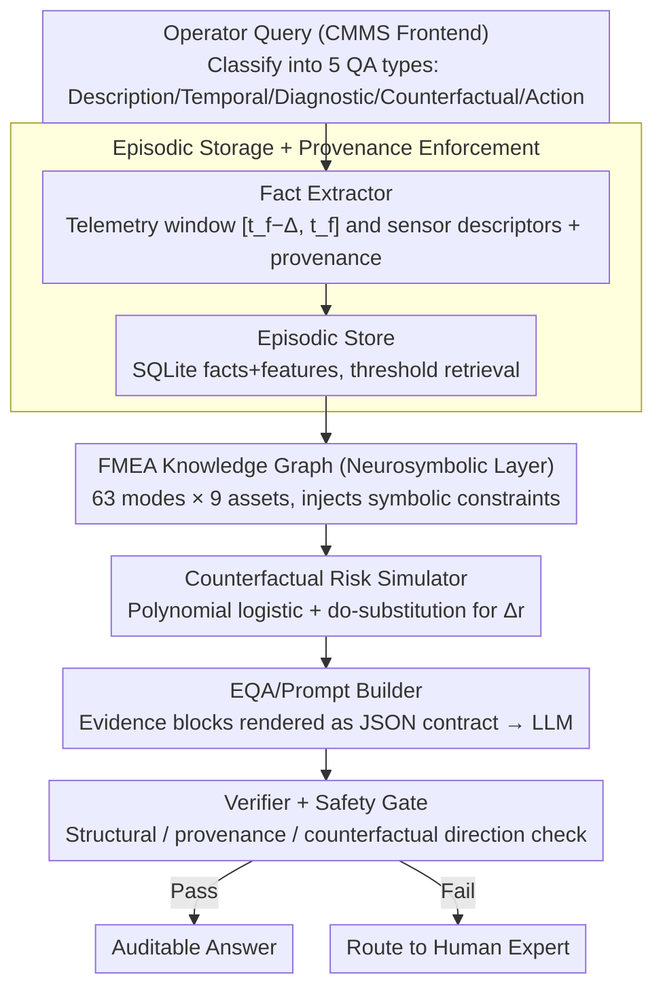

# IndustryAssetEQA: A Neurosymbolic Operational Intelligence System for Embodied Question Answering in Industrial Asset Maintenance

**Conference**: ACL 2026  
**arXiv**: [2604.23446](https://arxiv.org/abs/2604.23446)  
**Code**: https://github.com/IBM/AssetOpsBench/tree/IndustryAssetEQA/IndustryAssetEQA (Available)  
**Area**: Knowledge Graph / Industrial / Neurosymbolic / Embodied QA  
**Keywords**: FMEA Knowledge Graph, Embodied QA, Counterfactual Risk, Provenance, Industrial Maintenance

## TL;DR
This paper remodels industrial asset maintenance QA as an "embodied decision-making" task. It proposes IndustryAssetEQA, a neurosymbolic system composed of episodic telemetry, FMEA knowledge graphs, parameterized counterfactual risk simulators, provenance verification, and safety gates. On four industrial datasets, it improves structural validity, counterfactual direction accuracy, and explanation entailment by up to 0.51 / 0.47 / 0.64 respectively, while reducing expert-judged severe over-assertions from 28% to 2%.

## Background & Motivation

**Background**: Modern factories rely on operational intelligence systems to interpret multivariate telemetry, alarm streams, and maintenance records. The current mainstream approach is to wrap an LLM over documents and dashboards to answer questions like "Why did it fail? / How to handle it? / What happens after intervention?" via a natural language interface.

**Limitations of Prior Work**: In actual deployment, LLM maintenance assistants exhibit three types of consistency issues: (i) providing generic textbook explanations of failures without binding them to specific episodic sensor readings and contexts; (ii) lacking verifiable provenance, where answers do not reference corresponding time windows, sensors, or work order records, making them unauditable; (iii) providing only qualitative conclusions for counterfactuals and action recommendations without explicit risk models that can be tested.

**Key Challenge**: Framing maintenance QA as a "language generation" task, whereas it is essentially a "sensor + risk" decision task. The misalignment between the objective function of the former (fluency and corpus distribution) and the requirements of the latter (temporal localization, evidence chains, and testable intervention effects) is the root cause of generalization failure.

**Goal**: To construct an industrial EQA system that simultaneously satisfies four requirements: temporal localization, evidence traceability, risk constraint, and domain knowledge alignment, and to design an evaluation protocol measuring "deployment reliability" rather than "language fluency."

**Key Insight**: The authors observe that the perception $\to$ reasoning $\to$ prediction $\to$ decision loop of Embodied AI is structurally isomorphic to the industrial maintenance workflow (perceiving telemetry $\to$ diagnosing failures $\to$ planning interventions $\to$ executing maintenance). Thus, maintenance QA is explicitly modeled as an embodied decision problem, using neurosymbolic fusion to anchor LLM free text with both FMEA KGs and episodic stores.

**Core Idea**: Use episodic facts + FMEA-KG + polynomial logistic counterfactual simulator + provenance enforcement + safety gates to wrap the LLM into an embodied QA service that can only "answer based on provided evidence."

## Method

### Overall Architecture

The system receives natural language queries from operator CMMS frontends and executes industrial maintenance QA as a perception-diagnostic-planning-execution embodied decision loop. LLM free text is anchored throughout by symbolic knowledge and episodic facts. Queries are classified into five QA categories (Description / Temporal / Diagnostic / Counterfactual / Action Recommendation), then flow through a six-module pipeline: the Fact Extractor slices telemetry into fixed windows $[t_f-\Delta, t_f]$ anchored at failure time $t_f$, extracts summary descriptors $\mathcal{F}_s = \{\mu_s, \sigma_s, \min_s, \max_s, \text{trend}_s\}$ for each sensor $s$, and appends context like error counts and hours since last maintenance to output episodic JSONL with full provenance. These episodes enter the Episodic Store (SQLite facts+features tables, indexed by `fact_id`) for threshold retrieval $\{f_i \mid x_{i,j} \bowtie \tau\}$. The FMEA-KG (63 failure modes × 9 asset types, with edges like `affects / component_of / indicated_by / mitigated_by`) injects symbolic constraints. The Causal Simulator estimates $P(y\mid\bm{x})$ using polynomial logistic regression and models interventions as do-substitutions to calculate risk $r_{\text{before}} = 1 - P(y=\text{healthy}\mid\bm{x})$, $r_{\text{after}} = 1 - P(y=\text{healthy}\mid\bm{x}^{\text{do}})$, and direction $\Delta r$. Finally, the EQA/Prompt Builder renders evidence into strict JSON contracts for the LLM, and the Verifier + Safety Gate perform structural, provenance, and counterfactual direction consistency checks, routing failed outputs to human review.

### Key Designs

**1. FMEA Knowledge Graph as a Neurosymbolic Fusion Layer: Providing an Auditable Symbolic Anchor for Free Text**

Pure LLM explanations often cite incorrect failure modes or hallucinate sensors, lacking auditable semantic constraints. This paper encodes failure modes, sensor signatures, and allowed interventions—verified by experts according to ISO documents—into a machine-interpretable graph. Nodes cover the loop of asset class $\to$ sub-component $\to$ failure mode $\to$ sensor abstraction $\to$ maintenance action. Edges represent `affects / component_of / indicated_by / mitigated_by` relations, with rdflib injecting symbolic constraints into pipeline nodes. Failure modes output by the LLM must find corresponding nodes in the KG; otherwise, they are rejected by the Verifier.

**2. Episode-centric + Provenance Enforcement: Linking Every Answer to a Specific Time Window**

The biggest reliability gap in LLM deployment is the lack of verifiable sources. This paper anchors all QA to discrete episodes of "specific asset + specific window." The Fact Extractor produces JSONL with provenance (source file, time range, counts). Prompt instructions strictly require "using only provided evidence" and returning auditable `fact_id / window / referenced sensors` in JSON. The Verifier checks referenced `fact_id` and feature values against the Episodic Store. Removing this enforcement causes Full Pass rates to collapse from 0.89 to 0.19.

**3. Parameterized Counterfactual Risk Simulator: Converting What-if Guesses into Testable Risk Calculations**

For counterfactuals like "What if the bearing is replaced?", LLMs relying on language priors achieve only 0.45 direction accuracy (near random). The simulator uses a unified polynomial logistic estimator $P(y\mid\bm{x})$ to support both diagnosis and counterfactuals. For counterfactuals, it performs explicit do-substitutions $\bm{x}\mapsto\bm{x}^{\text{do}}$ on relevant feature components to calculate health probability and risk direction $\Delta r$. This simple proxy pulls counterfactual direction accuracy from 0.45 to 0.88-0.91.

### Loss & Training

Only the Causal Simulator requires training: fitting a polynomial logistic regression on episode feature vectors $\bm{x}$ to learn $P(y \mid \bm{x})$, where $y$ is "healthy" or a failure mode name, using standard multi-class cross-entropy. Healthy episodes are sampled by selecting time $t$ where no failure occurs in $[t, t+H]$ and looking back at $[t-\Delta, t]$. The LLM components use black-box API calls (GPT-4o-mini and Claude Sonnet 4) without fine-tuning.

## Key Experimental Results

### Main Results

Four industrial datasets: Microsoft PdM (Rotating machinery, 5716 episodes), C-MAPSS (Turbofan engines, 4842), Genesis CPS (Cyber-physical systems, 478), and Hydraulic (Hydraulic test rig, 2205). Total 13k+ episodes and 12k+ Description / 11k Diagnostic / 3k Counterfactual / 3k Action QA pairs. Expert verification serves as ground truth.

Incremental improvements from LLM-only to Full IndustryAssetEQA on GPT-4o-mini:

| Configuration | Struct.OK | Prov.OK | Label Cons. | CF Acc. | Entail.Pass | Claim Prec. |
|------|-----------|---------|-------------|---------|-------------|-------------|
| LLM-only | 0.42 | 0.47 | 0.62 | 0.45 | 0.08 | 0.12 |
| + Episodic | 0.52 | 0.62 | 0.71 | 0.45 | 0.23 | 0.25 |
| + Episodic + KG | 0.52 | 0.62 | 0.73 | 0.45 | 0.56 | 0.51 |
| + Provenance | 0.82 | 0.83 | 0.89 | 0.45 | 0.63 | 0.59 |
| **Full IndustryAssetEQA** | **0.88** | **0.89** | **0.94** | **0.88** | **0.72** | **0.67** |

### Ablation Study (GPT-4o-mini)

| Configuration | Entail.Pass | Full Pass | CF Acc. |
|------|-------------|-----------|---------|
| Full IndustryAssetEQA | 0.72 | 0.89 | 0.88 |
| w/o Risk simulator | 0.59 | 0.72 | **0.49** |
| w/o Provenance enforcement | 0.42 | **0.19** | 0.81 |
| w/o FMEA-KG | 0.59 | 0.35 | 0.61 |
| w/o Episodic memory | **0.27** | 0.36 | 0.34 |

### Key Findings

- Provenance enforcement is the highest-impact component; without it, Full Pass drops from 0.89 to 0.19, meaning numerical predictions without reference checks are undeployable "hallucinated numbers."
- The Risk simulator is the primary source of counterfactual reasoning: without it, CF Acc. drops from 0.88 to 0.49.
- Episodic memory is the foundation: removing it causes all metrics to collapse, indicating that episodization is the prerequisite for other modules.
- Expert blind review of 22 QA pairs: IndustryAssetEQA achieved an answerability rate of 97% (vs 46% for LLM-only) and a data grounding score of 4.5/5 (vs 3.0/5). Severe over-assertion dropped to 2% vs 28%.

## Highlights & Insights

- Redefining industrial QA from "language generation" to "embodied decision-making" is a clear paradigm shift. The four desiderata (time-situated / evidence-grounded / risk-constrained / knowledge-grounded) directly address typical LLM-only failure modes.
- The combination of Provenance enforcement + JSON contracts is highly transferable to other domains like legal or medical QA where "hallucinated numbers" must be blocked by post-hoc Verifiers.
- Using polynomial logistic regression as a "lightweight proxy causal model" is pragmatic. It demonstrates that as long as tool outputs constrain the LLM's key decision dimensions, heavy causal discovery may not be necessary.

## Limitations & Future Work

- The counterfactual module is a parameterized proxy estimator rather than an identifiable structural causal model; outputs are surrogate risks rather than proven causal effects.
- FMEA-KG has high coverage for semantic relations like `description/involves` but noise in structure for `sample/example` relations ( <10% validation rate).
- Episodes use fixed windows, potentially missing multi-scale precursors; adaptive windowing remains unexplored. Evaluation is also entirely offline.

## Related Work & Insights

- **vs LLM-only Maintenance QA**: Prior works let LLMs read documents directly. This paper enforces an episode + KG + simulator closed loop, elevating "verifiability" to a system-level hard constraint.
- **vs Temporal QA (MTBench / FailureSensorIQ)**: While they feed time series to LLMs for reasoning, this paper extracts episodic descriptors and risk proxies, making counterfactual and action questions testable.
- **vs Embodied QA (MindPalace / OpenEQA)**: Traditional EQA focuses on 3D perception-language alignment. This work moves the framework to industrial assets and temporal signals, where decisions must pass through explicit risk models.

## Rating
- Novelty: ⭐⭐⭐⭐ Framework redefinition (language $\to$ embodied decision) and 4-factor decomposition are clear, though individual components (KG/provenance) are established.
- Experimental Thoroughness: ⭐⭐⭐⭐⭐ 4 datasets × 5 QA types × 2 LLMs, plus expert blind review and significance testing.
- Writing Quality: ⭐⭐⭐⭐ Strong motivational narrative and clear organization.
- Value: ⭐⭐⭐⭐⭐ Provides a deployable blueprint for industrial LLMs; AssetOpsBench is already integrated within IBM.

<!-- RELATED:START -->

## Related Papers

- [\[AAAI 2026\] Self-Correction Distillation for Structured Data Question Answering](../../AAAI2026/graph_learning/self-correction_distillation_for_structured_data_question_answering.md)
- [\[ACL 2025\] Agent Steerable Search for Knowledge Graph Question Answering](../../ACL2025/graph_learning/agent_steerable_search_for_knowledge_graph_question_answering.md)
- [\[ICML 2026\] KBQA-R1: Reinforcing Large Language Models for Knowledge Base Question Answering](../../ICML2026/graph_learning/kbqa-r1_reinforcing_large_language_models_for_knowledge_base_question_answering.md)
- [\[ACL 2025\] The Role of Exploration Modules in Small Language Models for Knowledge Graph Question Answering](../../ACL2025/graph_learning/the_role_of_exploration_modules_in_small_language_models_for_knowledge_graph_que.md)
- [\[ACL 2025\] FiDeLiS: Faithful Reasoning in Large Language Model for Knowledge Graph Question Answering](../../ACL2025/graph_learning/fidelis_faithful_reasoning_in_large_language_model_for_knowledge_graph_question_.md)

<!-- RELATED:END -->
