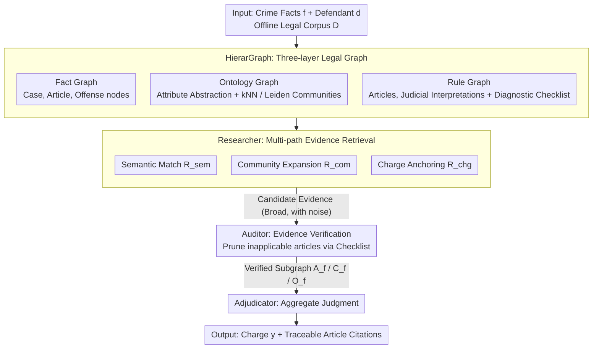

# LegalGraphRAG: Multi-Agent Graph Retrieval-Augmented Generation for Reliable Legal Reasoning

**Conference**: ACL2026  
**arXiv**: [2605.28120](https://arxiv.org/abs/2605.28120)  
**Code**: https://github.com/XMUDeepLIT/LegalGraphRAG  
**Area**: GraphRAG / Legal Reasoning  
**Keywords**: Legal RAG, Hierarchical Knowledge Graph, Multi-Agent, Evidence Verification, Traceable Reasoning  

## TL;DR
LegalGraphRAG constructs a hierarchical legal graph using fact, ontology, and rule graphs, and utilizes a Researcher-Auditor-Adjudicator multi-agent workflow for retrieval, verification, and adjudication, improving accuracy and evidence traceability in legal judgment generation.

## Background & Motivation
**Background**: RAG is a common method for transferring general LLMs to specialized domains. GraphRAG further organizes documents into relational graphs to support multi-hop retrieval and more coherent reasoning. Legal reasoning relies heavily on external knowledge due to complex dependencies between case facts, statutes, and judicial interpretations.

**Limitations of Prior Work**: Standard RAG treats text chunks as independent retrieval units, often fetching contexts based merely on surface semantic similarity. Although traditional GraphRAG provides structure, many implementations remain flat, making it difficult to distinguish between case facts, abstract statutes, and application conditions. More critically, retrieve-then-generate usually lacks explicit evidence verification; models might provide seemingly correct but untraceable judgments using irrelevant materials.

**Key Challenge**: Legal tasks must simultaneously satisfy "retrieving all relevant evidence" and "using only valid evidence." Broader retrieval introduces more noise, while narrower retrieval may miss critical statutes or similar cases. Without hierarchical organization and verification mechanisms, it is difficult for LLMs to determine which evidence truly supports a ruling.

**Goal**: The authors aim to build a GraphRAG framework for legal reasoning that organizes legal knowledge by different abstraction levels, verifies evidence applicability before generating judgments, and outputs traceable statutory bases.

**Key Insight**: A preliminary study proves that flat retrieval possesses granularity bias and standard RAG is highly sensitive to irrelevant documents. The proposed solution splits the framework into two components: HierarGraph to resolve knowledge granularity issues and a multi-agent workflow to address evidence verification.

**Core Idea**: Decompose legal knowledge into Fact/Ontology/Rule graphs and employ a Researcher to retrieve candidate evidence, an Auditor to verify statute applicability, and an Adjudicator to generate judgments after synthesizing verified evidence.

## Method
The key of LegalGraphRAG is not simply "putting legal documents into a graph" but structuring the legal reasoning process: organizing legal knowledge by abstraction levels, finding evidence in the hierarchical graph based on case facts, verifying them using checklists and judicial interpretations in the rule graph, and finally generating traceable judgments based only on the verified subgraph.

### Overall Architecture
Given a description of crime facts $f$ and a defendant $d$, the system first constructs a legal knowledge graph $KG=\Phi(\mathcal{D})$ based on an offline legal corpus $\mathcal{D}$. During querying, the retriever fetches context $\mathcal{C}=\mathcal{R}(f,d,KG)$ from the graph, and the generator infers the charge $y$. The entire pipeline is divided into two stages: (1) Hierarchical Knowledge Construction, which organizes historical cases, statutes, judicial interpretations, case features, and charges into a layered HierarGraph; (2) Evidence-based Legal Reasoning, orchestrated by three agents—the Researcher retrieves candidate cases and statutes from the ontology/fact graphs, the Auditor verifies statute applicability using the rule graph, and the Adjudicator synthesizes confirmed articles, cases, and offense nodes to generate a final judgment with citations.

### Key Designs

**1. HierarGraph: A three-layer legal graph to avoid granularity confusion in flat graphs**

Legal judgments often depend on whether factual details satisfy the application conditions of a statute. However, flat graphs retrieve based on semantic similarity, which easily finds "narratively similar" cases while missing abstract rules that determine the charge. HierarGraph explicitly divides knowledge into three layers: the Fact Graph connects Cases, Articles, and Offense nodes to carry specific facts; the Ontology Graph abstracts raw cases into dimensions like defendant attributes, criminal behavior, victim characteristics, and subjective intent, using kNN and Leiden communities to cluster similar cases; the Rule Graph connects articles with judicial interpretations and attaches a Diagnostic Checklist to each article. Each layer serves its purpose, allowing retrieval to hit similar facts, abstract concepts, and application conditions separately rather than mixing them together.

**2. Researcher: Multi-path retrieval to cover different types of candidate evidence**

A single retrieval path either biases toward high-frequency facts or gets trapped in locally similar cases, resulting in incomplete coverage. The Researcher defines the retrieval results as the union of three operators:

$$\mathcal{R}(q)=\mathcal{R}_{sem}(q)\cup\mathcal{R}_{com}(q)\cup\mathcal{R}_{chg}(q)$$

These correspond to semantic match retrieval, community expansion retrieval, and charge-anchored retrieval. $\mathcal{R}_{sem}$ captures directly similar cases, $\mathcal{R}_{com}$ completes relevant context following communities in the Ontology Graph, and $\mathcal{R}_{chg}$ anchors potentially applicable statutes backward from candidate charges. The union of these paths ensures the evidence pool covers direct similarities, community contexts, and potential statutory bases, reducing the risk of missing key articles.

**3. Auditor and Adjudicator: Evidence closed-loop for verification and traceability**

In legal scenarios, "correct answer but unsupported by evidence" is unacceptable. When retrieve-then-generate lacks verification, models may use irrelevant materials to give seemingly correct judgments. Here, the Auditor checks each candidate statute one by one against the case facts using the Diagnostic Checklist and judicial interpretations, pruning inapplicable statutes and their related nodes. The Adjudicator then generates the judgment using only verified statutes $\mathcal{A}^f$, cases $\mathcal{C}^f$, and ontology nodes $\mathcal{O}^f$:

$$\mathcal{J}=Adjudicator(q\oplus\mathcal{A}^f\oplus\mathcal{C}^f\oplus\mathcal{O}^f)$$

This step transforms black-box generation into an auditable evidence chain: every conclusion can be traced back to verified statutes and cases, significantly reducing unsupported correctness.

### Loss & Training
This paper primarily focuses on the framework and system evaluation and does not propose an end-to-end training loss. Implementation-wise, GPT-4o-mini is used for graph construction, BGE-m3 generates embeddings, and different backbones can be used during inference (Qwen3-8B is the default in the main experiments). Evaluation metrics include Accuracy and Micro-F1. Datasets include CAIL2018 and CMDL, covering sub-domains such as Public Safety, Economic Offenses, Social Order, and Person Rights.

## Key Experimental Results

### Main Results
The preliminary study quantifies two issues with standard RAG: flat retrieval cannot handle knowledge granularity, and the lack of verification makes it extremely sensitive to noise. Below is the decline in generation quality during retrieval noise experiments:

| Method | Charge ACC | Articles ACC | Term MAE (Months) | Compared to Correct Context |
| :--- | :--- | :--- | :--- | :--- |
| RAG (Correct Context) | 42.8 | 74.7 | 24.3 | Baseline |
| RAG + 2 Irrelevant Docs | 34.9 | 57.2 | 27.7 | Charge -7.9, Articles -17.5, MAE +3.4 |
| RAG + 4 Irrelevant Docs | 32.9 | 51.1 | 28.4 | Charge -9.9, Articles -23.6, MAE +4.1 |
| RAG + 6 Irrelevant Docs | 29.8 | 46.8 | 31.7 | Charge -13.0, Articles -27.9, MAE +7.4 |

In formal evaluations, LegalGraphRAG achieved gains of 6.3% to 19.1% over strong baselines on CAIL and CMDL. Compared to LegalDelta and ADAPT, the average gains were 7.1% and 6.7%, respectively. It also reached a peak performance of 78.7% on CMDL when paired with different backbones.

### Ablation Study

| Configuration | CAIL ACC | Δ | Description |
| :--- | :--- | :--- | :--- |
| **LegalGraphRAG (Full)** | 40.9 | - | Full hierarchical graph + multi-agent workflow |
| w/o HierarGraph | 33.7 | -7.2 | Largest drop, indicating hierarchical organization is critical |
| w/o Researcher | 36.9 | -4.0 | Insufficient coverage from multi-path retrieval |
| w/o Semantic Match | 39.1 | -1.8 | Direct semantic retrieval still contributes |
| w/o Community Exp. | 38.5 | -2.4 | Community expansion helps supplement structural context |
| w/o Charge-Anchored | 39.3 | -1.6 | Charge anchoring supplements legal basis |
| w/o Auditor | 37.5 | -3.4 | Lack of verification reduces judgment reliability |

### Key Findings
- Flat retrieval suffers from granularity bias. The preliminary study shows that a naive hierarchical strategy improves retrieval performance by 25.3% over a flat strategy.
- Irrelevant documents quickly degrade standard RAG: with 6 irrelevant docs, statute prediction accuracy drops from 74.7 to 46.8, and sentencing MAE rises from 24.3 to 31.7 months.
- HierarGraph is the most critical component; its removal causes a 7.2 drop in CAIL ACC. The Researcher and Auditor contribute 4.0 and 3.4 drops respectively, showing that retrieval coverage and evidence verification are both essential.
- The paper emphasizes that LegalGraphRAG increases the proportion of "Traceable Correct" cases while reducing "unsupported correctness" (correct answer but unsupported by the evidence chain).

## Highlights & Insights
- This paper accurately identifies the core problem of legal RAG: it's not about "whether there is retrieval," but whether the retrieved information is at the correct legal granularity and has been verified.
- The three-layer split of HierarGraph is highly reasonable for the domain. Case facts, legal concepts, and rule conditions are distinct types of nodes; forcing them into a flat structure causes the model to lose focus amidst noise.
- The Researcher-Auditor-Adjudicator division of labor mirrors the legal workflow: gathering materials, auditing materials, and reaching a conclusion. This structure is more auditable than having an LLM read context and answer directly.
- The emphasis on "unsupported correctness" is vital. High-risk domains like law and medicine should not only look at final accuracy but also whether answers are grounded in valid evidence.

## Limitations & Future Work
- The authors explicitly state that the current framework only processes unimodal textual legal evidence. Real judicial scenarios include non-textual evidence like photos, surveillance videos, scanned handwritten documents, and courtroom recordings.
- Currently, non-textual evidence requires transcription or description, which may lose visual/auditory details (e.g., judging intent vs. negligence often relies on visual cues).
- Graph construction depends on GPT-4o-mini and embedding models; errors in document parsing, ontology extraction, or checklist generation will be inherited by subsequent agents.
- Future directions include incorporating multimodal nodes into the Fact Graph to allow cross-verification between testimony, visual evidence, and audio evidence, moving closer to a complete evidence chain for smart courts.

## Related Work & Insights
- **vs Naive RAG**: Naive RAG passes retrieved context directly to the LLM, lacking hierarchical structure and verification. LegalGraphRAG organizes legal knowledge first and verifies evidence applicability.
- **vs standard GraphRAG**: General GraphRAG uses relational structures but often fails to distinguish between facts, ontology, and rule layers; our hierarchical graph aligns better with legal ontologies.
- **vs legal-specific LLM / SFT**: Specialized models internalize knowledge in parameters, which is costly and prone to forgetting; LegalGraphRAG enhances reasoning with external knowledge and evidence chains, offering better updatability.
- **Inspiration for future work**: RAG for professional domains should explicitly model "evidence granularity" and "evidence verification" rather than just optimizing top-k retrieval or reranking.

## Rating
- Novelty: ⭐⭐⭐⭐☆ Hierarchical legal graphs combined with a three-agent verification process is naturally aligned with the domain.
- Experimental Thoroughness: ⭐⭐⭐⭐☆ Includes preliminary study, main experiments, reliability analysis, case studies, and ablation; multimodal and cross-jurisdiction generalization remain to be validated.
- Writing Quality: ⭐⭐⭐⭐☆ Motivation and system structure are clear, though some tables are large and complex.
- Value: ⭐⭐⭐⭐⭐ Highly valuable for legal RAG, trustworthy QA, and evidence-grounded generation in high-risk domains.

<!-- RELATED:START -->

## Related Papers

- [\[ACL 2026\] EA-Agent: A Structured Multi-Step Reasoning Agent for Entity Alignment](ea-agent_a_structured_multi-step_reasoning_agent_for_entity_alignment.md)
- [\[ACL 2026\] MegaRAG: Multimodal Knowledge Graph-Based Retrieval Augmented Generation](megarag_multimodal_knowledge_graph-based_retrieval_augmented_generation.md)
- [\[ACL 2026\] STEM: Structure-Tracing Evidence Mining for Knowledge Graphs-Driven Retrieval-Augmented Generation](stem_structure-tracing_evidence_mining_for_knowledge_graphs-driven_retrieval-aug.md)
- [\[ACL 2026\] TagRAG: Tag-guided Hierarchical Knowledge Graph Retrieval-Augmented Generation](tagrag_tag-guided_hierarchical_knowledge_graph_retrieval-augmented_generation.md)
- [\[CVPR 2026\] M3KG-RAG: Multi-hop Multimodal Knowledge Graph-enhanced Retrieval-Augmented Generation](../../CVPR2026/graph_learning/m3kg_rag_multi_hop_multimodal_knowledge_graph_enhanced_retrieval_augmented_genera.md)

<!-- RELATED:END -->
## Related Papers

- [\[ACL 2026\] EA-Agent: A Structured Multi-Step Reasoning Agent for Entity Alignment](ea-agent_a_structured_multi-step_reasoning_agent_for_entity_alignment.md)
- [\[ACL 2026\] MegaRAG: Multimodal Knowledge Graph-Based Retrieval Augmented Generation](megarag_multimodal_knowledge_graph-based_retrieval_augmented_generation.md)
- [\[ACL 2026\] STEM: Structure-Tracing Evidence Mining for Knowledge Graphs-Driven Retrieval-Augmented Generation](stem_structure-tracing_evidence_mining_for_knowledge_graphs-driven_retrieval-aug.md)
- [\[ACL 2026\] TagRAG: Tag-guided Hierarchical Knowledge Graph Retrieval-Augmented Generation](tagrag_tag-guided_hierarchical_knowledge_graph_retrieval-augmented_generation.md)
- [\[CVPR 2026\] M3KG-RAG: Multi-hop Multimodal Knowledge Graph-enhanced Retrieval-Augmented Generation](../../CVPR2026/graph_learning/m3kg_rag_multi_hop_multimodal_knowledge_graph_enhanced_retrieval_augmented_genera.md)

<!-- RELATED:END -->
