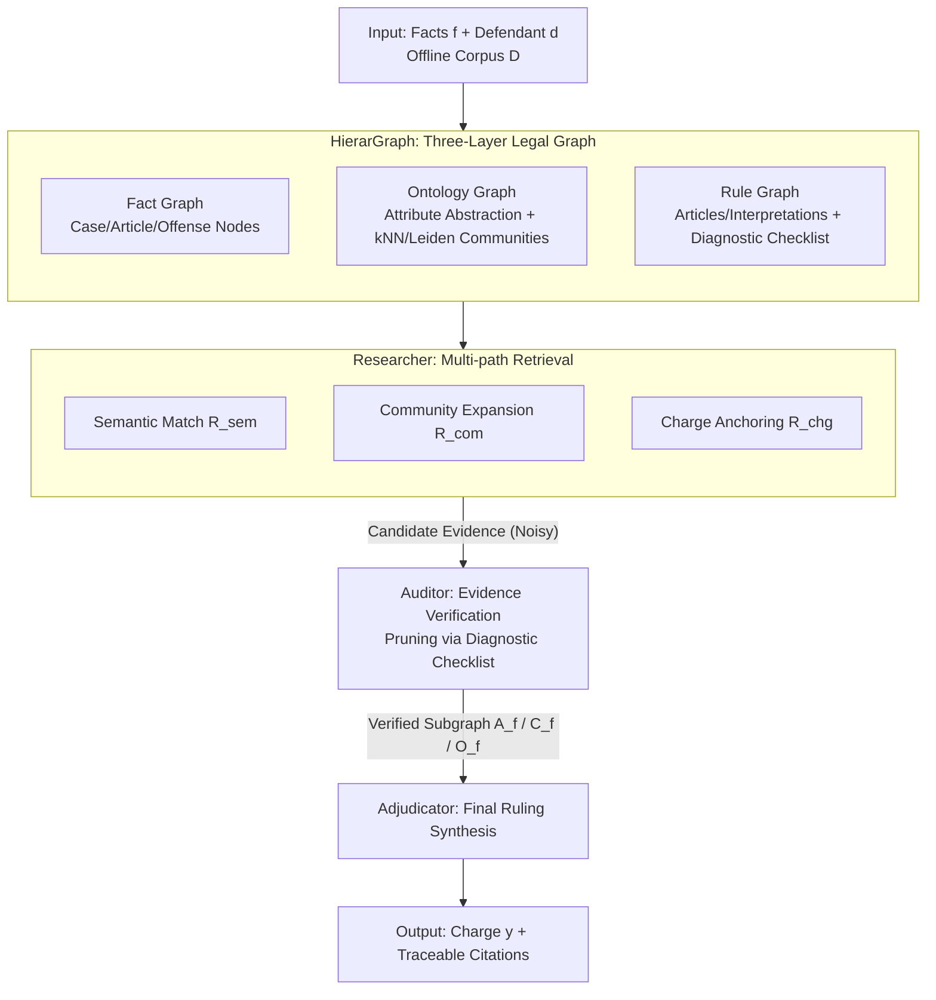

# LegalGraphRAG: Multi-Agent Graph Retrieval-Augmented Generation for Reliable Legal Reasoning

**Conference**: ACL2026  
**arXiv**: [2605.28120](https://arxiv.org/abs/2605.28120)  
**Code**: https://github.com/XMUDeepLIT/LegalGraphRAG  
**Area**: GraphRAG / Legal Reasoning  
**Keywords**: Legal RAG, Hierarchical Knowledge Graph, Multi-Agent, Evidence Verification, Traceable Reasoning  

## TL;DR
LegalGraphRAG constructs a hierarchical legal graph consisting of Fact, Ontology, and Rule graphs. It utilizes a Researcher-Auditor-Adjudicator multi-agent workflow for retrieval, verification, and adjudication, improving accuracy and evidence traceability in legal judgment generation.

## Background & Motivation
**Background**: RAG is a common method for adapting general LLMs to specialized domains. GraphRAG further organizes documents into relational graphs to support multi-hop retrieval and coherent reasoning. Legal reasoning relies heavily on external knowledge due to complex dependencies between case facts, statutes, and judicial interpretations.

**Limitations of Prior Work**: Standard RAG treats text chunks as independent retrieval units, often fetching contexts based purely on surface semantic similarity. Although traditional GraphRAG provides structure, many implementations remain flat, struggling to distinguish between case facts, abstract statutes, and application conditions. Crucially, retrieve-then-generate processes often lack explicit evidence verification, leading models to produce seemingly correct but untraceable judgments using irrelevant materials.

**Key Challenge**: Legal tasks must simultaneously achieve "comprehensive retrieval of relevant evidence" and "exclusive use of valid evidence." Broader retrieval introduces noise, while narrower retrieval may miss critical statutes or similar cases. Without hierarchical organization and verification, LLMs struggle to determine which evidence truly supports a ruling.

**Goal**: The authors aim to build a GraphRAG framework for legal reasoning that organizes legal knowledge across levels of abstraction, verifies evidence applicability before generation, and outputs traceable statutory bases.

**Key Insight**: A preliminary study demonstrates that flat retrieval suffers from granularity bias and that standard RAG is highly sensitive to irrelevant documents. The solution is split into two components: HierarGraph to address knowledge granularity, and a multi-agent workflow to handle evidence verification.

**Core Idea**: Decompose legal knowledge into Fact/Ontology/Rule graphs. Employ a Researcher to retrieve candidate evidence, an Auditor to verify statutory applicability, and an Adjudicator to synthesize verified evidence into a final judgment.

## Method
The key to LegalGraphRAG is not merely "placing legal documents in a graph," but structuring the legal reasoning process: organizing knowledge by abstraction levels, finding evidence in the hierarchy based on case facts, verifying using checklists and interpretations from the Rule Graph, and generating traceable judgments based only on the verified subgraph.

### Overall Architecture
Given a fact description $f$ and a defendant $d$, the system constructs a legal knowledge graph $KG=\Phi(\mathcal{D})$ from an offline legal corpus $\mathcal{D}$. During query time, the retriever extracts context $\mathcal{C}=\mathcal{R}(f,d,KG)$, and the generator infers the charge $y$. The pipeline is divided into two phases: Hierarchical Knowledge Construction, which organizes cases, articles, interpretations, characteristics, and charges into a layered HierarGraph; and Evidence-based Legal Reasoning, executed by three agents—the Researcher retrieves candidates from the ontology/fact graphs, the Auditor verifies applicability using the rule graph, and the Adjudicator synthesizes the final judgment with citations.

### Key Designs

**1. HierarGraph: Layering Facts, Concepts, and Rules to Avoid Granularity Confusion**

Legal judgments depend on whether factual details meet specific statutory conditions. Flat graphs based on semantic similarity often retrieve "narratively similar" cases while missing abstract rules that determine the charge. HierarGraph explicitly separates knowledge into three layers: the Fact Graph connects Cases, Articles, and Offense nodes; the Ontology Graph abstracts facts into dimensions like defendant attributes, criminal acts, and victim characteristics, using kNN and Leiden communities to cluster similar cases; and the Rule Graph connects statutes with interpretations and attaches a Diagnostic Checklist to each article. This separation ensures retrieval hits similar facts, abstract concepts, and specific conditions independently.

**2. Researcher: Multi-path Evidence Retrieval**

A single retrieval path often favors high-frequency facts or gets stuck in local similarity. The Researcher defines retrieval as the union of three operators:

$$\mathcal{R}(q)=\mathcal{R}_{sem}(q)\cup\mathcal{R}_{com}(q)\cup\mathcal{R}_{chg}(q)$$

These correspond to semantic matching, community expansion, and charge anchoring. $\mathcal{R}_{sem}$ captures direct factual similarity, $\mathcal{R}_{com}$ traverses Ontology Graph communities to complete structural context, and $\mathcal{R}_{chg}$ anchors potentially applicable statutes from candidate charges. This union ensures the evidence pool covers direct similarities, community contexts, and potential legal bases, mitigating the risk of missing critical statutes.

**3. Auditor & Adjudicator: Evidence Loop for Traceability**

In legal scenarios, a "correct answer without evidentiary support" is unacceptable. The Auditor checks each candidate statute against case facts using the Diagnostic Checklist and judicial interpretations, pruning inapplicable statutes and their associated nodes. The Adjudicator then generates the judgment using only the verified statutes $\mathcal{A}^f$, cases $\mathcal{C}^f$, and ontology nodes $\mathcal{O}^f$:

$$\mathcal{J}=Adjudicator(q\oplus\mathcal{A}^f\oplus\mathcal{C}^f\oplus\mathcal{O}^f)$$

This transforms black-box generation into an auditable evidence chain, significantly reducing "unsupported correctness."

### Loss & Training
This paper focuses on framework and system evaluation; no end-to-end training loss is proposed. Implementation uses GPT-4o-mini for graph construction and BGE-m3 for embeddings. The reasoning phase can use various backbones; Qwen3-8B is the default in main experiments. Evaluation metrics include Accuracy and Micro-F1 across CAIL2018 and CMDL datasets.

## Key Experimental Results

### Main Results
The preliminary study quantifies two issues: flat retrieval's inability to handle granularity and standard RAG's sensitivity to noise. The table below shows quality degradation under noise.

| Method | Charge ACC | Articles ACC | Term MAE (Months) | vs. Correct Context |
| :--- | :---: | :---: | :---: | :--- |
| RAG (Correct Context) | 42.8 | 74.7 | 24.3 | Baseline |
| RAG + 2 Irrelevant Docs | 34.9 | 57.2 | 27.7 | Charge -7.9, Articles -17.5 |
| RAG + 4 Irrelevant Docs | 32.9 | 51.1 | 28.4 | Charge -9.9, Articles -23.6 |
| RAG + 6 Irrelevant Docs | 29.8 | 46.8 | 31.7 | Charge -13.0, Articles -27.9 |

In formal evaluations, LegalGraphRAG achieves gains of 6.3% to 19.1% over strong baselines on CAIL and CMDL. Average improvements over LegalDelta and ADAPT are 7.1% and 6.7%, respectively.

### Ablation Study

| Configuration | CAIL ACC | $\Delta$ | Description |
| :--- | :---: | :---: | :--- |
| LegalGraphRAG (Full) | 40.9 | - | Full hierarchy + 3-agent pipeline |
| w/o HierarGraph | 33.7 | -7.2 | Largest drop; hierarchy is critical |
| w/o Researcher | 36.9 | -4.0 | Insufficient retrieval coverage |
| w/o Semantic Match | 39.1 | -1.8 | Direct semantic search still contributes |
| w/o Community Exp. | 38.5 | -2.4 | Helps supplement structural context |
| w/o Charge-Anchored | 39.3 | -1.6 | Supplying legal basis anchors |
| w/o Auditor | 37.5 | -3.4 | Lack of verification reduces reliability |

### Key Findings
- Flat retrieval suffers from granularity bias; the hierarchical strategy improves retrieval performance by 25.3% over flat strategies.
- Irrelevant documents rapidly degrade RAG: with 6 irrelevant docs, article prediction accuracy drops from 74.7 to 46.8.
- HierarGraph is the most vital component. Removing it causes a 7.2 drop in CAIL ACC.
- LegalGraphRAG increases the ratio of "Traceable Correct" results, reducing "unsupported correctness."

## Highlights & Insights
- The paper accurately identifies the core problem in legal RAG: it is not about the existence of retrieval, but whether the retrieved information is at the correct granularity and properly verified.
- The three-layer separation of HierarGraph is logically sound for the domain. Case facts, concepts, and rules are distinct types of nodes.
- The Researcher-Auditor-Adjudicator division mirrors the actual legal workflow: research, verification, and ruling.
- Emphasis on "unsupported correctness" is crucial for high-stakes domains like law and medicine.

## Limitations & Future Work
- The framework currently handles only single-modality text evidence. Real judicial scenarios include photos, surveillance video, and audio.
- Non-text evidence presently requires transcription/description, which may lose critical visual or auditory nuances (e.g., intent vs. negligence).
- Graph construction depends on GPT-4o-mini; errors in source parsing or checklist generation will propagate.
- Future work could integrate multimodal nodes into the Fact Graph for a more complete evidence chain.

## Related Work & Insights
- **vs. Naive RAG**: Naive RAG lacks hierarchical structure and verification; Ours organizes knowledge first and verifies applicability later.
- **vs. Standard GraphRAG**: Standard versions may not distinguish between facts, ontology, and rules; this hierarchical graph fits legal ontologies better.
- **vs. Legal-specific LLM/SFT**: SFT models internalize knowledge at high cost and with potential for forgetting; Ours uses external evidence for better updateability.

## Rating
- **Novelty**: ⭐⭐⭐⭐☆ Natural combination of hierarchical graphs and multi-agent verification.
- **Experimental Thoroughness**: ⭐⭐⭐⭐☆ Includes preliminary studies, main results, reliability analysis, and ablations.
- **Writing Quality**: ⭐⭐⭐⭐☆ Clear motivation and structure.
- **Value**: ⭐⭐⭐⭐⭐ Highly relevant for legal RAG and evidence-grounded generation in high-stakes fields.

<!-- RELATED:START -->

## Related Papers

- [\[ACL 2026\] EA-Agent: A Structured Multi-Step Reasoning Agent for Entity Alignment](ea-agent_a_structured_multi-step_reasoning_agent_for_entity_alignment.md)
- [\[ACL 2026\] MegaRAG: Multimodal Knowledge Graph-Based Retrieval Augmented Generation](megarag_multimodal_knowledge_graph-based_retrieval_augmented_generation.md)
- [\[ACL 2026\] STEM: Structure-Tracing Evidence Mining for Knowledge Graphs-Driven Retrieval-Augmented Generation](stem_structure-tracing_evidence_mining_for_knowledge_graphs-driven_retrieval-aug.md)
- [\[ACL 2026\] TagRAG: Tag-guided Hierarchical Knowledge Graph Retrieval-Augmented Generation](tagrag_tag-guided_hierarchical_knowledge_graph_retrieval-augmented_generation.md)
- [\[CVPR 2026\] M3KG-RAG: Multi-hop Multimodal Knowledge Graph-enhanced Retrieval-Augmented Generation](../../CVPR2026/graph_learning/m3kg_rag_multi_hop_multimodal_knowledge_graph_enhanced_retrieval_augmented_genera.md)

<!-- RELATED:END -->
