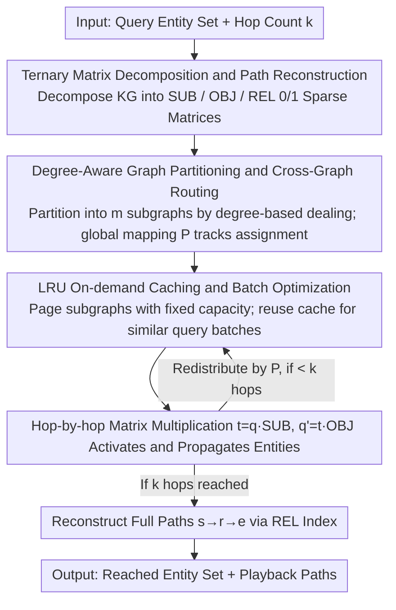

# LogosKG: Hardware-Optimized Scalable and Interpretable Knowledge Graph Retrieval

**Conference**: ACL 2026  
**arXiv**: [2604.18913](https://arxiv.org/abs/2604.18913)  
**Code**: [GitHub](https://github.com/LARK-NLP-Lab/LogosKG)  
**Area**: Graph Learning/Knowledge Graphs  
**Keywords**: Knowledge Graph Retrieval, Hardware-Aligned Optimization, Multi-hop Traversal, Sparse Matrix Operations, KG-LLM Interaction

## TL;DR

This paper proposes LogosKG, a hardware-aligned knowledge graph retrieval framework. By transforming graph traversal into multiplication operations of ternary sparse matrices (SUB/OBJ/REL), combined with degree-aware graph partitioning, cross-graph routing, and on-demand caching, it achieves scalable and interpretable high-hop retrieval on billion-edge scale KGs using a single device. Downstream KG-LLM interaction experiments reveal the impact of graph topology on LLM diagnostic reasoning.

## Background & Motivation

**Background**: The integration of Knowledge Graphs (KG) and LLMs is increasingly important—KGs provide structured, verifiable reasoning support, particularly in high-risk domains like medical diagnosis. Multi-hop retrieval is a fundamental KG operation, but traditional graph traversal algorithms (DFS/BFS) have a computational cost of $O(|V|+|E|)$ on large-scale KGs, and reachable entities grow exponentially with the number of hops.

**Limitations of Prior Work**: (1) Biomedical KGs (e.g., UMLS 407K nodes/3.4M edges, PubMedKG 54.4M nodes/86.5M edges) consume 1.5–23.5 GB of memory just for loading, and 2-hop expansion can involve $10^9$ reachable edges. (2) Existing systems can only optimize one or two dimensions among matrix representation, scalability, and path reconstruction—GraphBLAS supports matrices but is not scalable and lacks path reconstruction, while Neo4j is scalable and provides path reconstruction but is non-matrix-based. (3) GPU frameworks (DGL, PyG) prioritize training over retrieval.

**Key Challenge**: High-hop retrieval requires satisfying three attributes simultaneously—matrix-based operations (leveraging hardware parallelism), scalability (handling large graphs exceeding memory), and path reconstruction (supporting interpretable reasoning)—but existing systems cannot achieve all three.

**Goal**: Construct a unified framework that simultaneously satisfies these three attributes on single-device hardware and utilize its high-hop retrieval capability to systematically study the impact of KG topology on LLM reasoning.

**Key Insight**: Decompose the KG into three sparse association matrices (SUB, OBJ, REL), transforming graph traversal into sparse matrix multiplication, which naturally fits the parallel computing architectures of CPUs/GPUs.

**Core Idea**: By combining KG ternary matrix decomposition, degree-aware partitioning, cross-graph routing, and LRU on-demand caching, the theoretical formulation is transformed into a practical large-scale retrieval system, achieving a partitioning complexity of $\mathcal{O}(|\mathcal{E}| \log |\mathcal{E}| + |\mathcal{T}|)$.

## Method

### Overall Architecture

LogosKG reformulates "multi-hop retrieval on large-scale KGs" as a continuous sparse matrix multiplication problem. First, the entire KG is decomposed into three $0/1$ sparse association matrices: SUB (entity $\to$ triplet), OBJ (triplet $\to$ entity), and REL (triplet $\to$ relation). Thus, a 1-hop traversal is equivalent to multiplying a query vector by $\mathbf{SUB}\cdot\mathbf{OBJ}$. For $k$ hops, this iteration is repeated $k$ times, allowing CPU/GPU parallel hardware to handle the entire traversal directly. For ultra-large graphs that cannot fit in memory, the framework adds "degree-aware partitioning + cross-graph routing + LRU on-demand caching" for memory management. The input consists of query entities and hop counts; matrix multiplication is performed on partitioned subgraphs hop-by-hop with on-demand paging, outputting the set of reached entities and full paths for step-by-step playback.

### Key Designs

**1. Ternary Matrix Decomposition and Path Reconstruction: Transforming Traversal into Multiplication Without Losing Edge Origins**

The primary advantage of matrix-based retrieval is hardware friendliness, but the cost is "aggregation and loss"—multiplying adjacency matrices like in GraphBLAS merges edge information, making path reconstruction impossible. LogosKG splits an edge into three independent matrices: $\mathbf{SUB}\in\{0,1\}^{|\mathcal{E}|\times|\mathcal{T}|}$ tracks which triplets an entity activates, $\mathbf{OBJ}\in\{0,1\}^{|\mathcal{T}|\times|\mathcal{E}|}$ tracks which objects a triplet points to, and $\mathbf{REL}\in\{0,1\}^{|\mathcal{T}|\times|\mathcal{R}|}$ preserves the mapping from triplets to relations. Each hop $h$ uses $\mathbf{t}^{(h)}=\mathbf{q}^{(h-1)}\cdot\mathbf{SUB}$ to activate triplets, and then subject, relation, and object are read from the three matrices to reconstruct $s_h\xrightarrow{r_h}e_h$.

Crucially, the REL matrix is excluded from the multiplication chain; it does not participate in propagation but is simply queried by triplet index when needed. This makes path reconstruction a zero-overhead byproduct—interpretabilty is achieved without sacrificing matrix efficiency.

**2. Degree-Aware Graph Partitioning and Cross-Graph Routing: Dealing-Style Partitioning to Avoid Hub Bottlenecks**

Random partitioning risks clustering high-degree nodes (hubs) in the same subgraph, causing load imbalances. LogosKG uses a "shuffle and deal" approach: entities are sorted by subject degree and distributed cyclically across $m$ subgraphs to balance hubs. All triplets of a single subject are bound to the same subgraph to maintain structural integrity. The preprocessing complexity is $\mathcal{O}(|\mathcal{E}|\log|\mathcal{E}|+|\mathcal{T}|)$, which is negligible compared to retrieval.

Cross-graph routing is maintained by a global metadata mapping $P:\mathcal{E}\to\{1,\ldots,m\}$. After localized computation in each subgraph, results are merged into a global query vector and redistributed according to $P$ for the next hop. This allows billion-edge scale traversal on a single device by processing subgraphs on demand.

**3. LRU On-Demand Caching and Batch Optimization: Paging Based on Real Demand rather than Query Jitter**

Partitioning alone is insufficient; disk I/O would be frequent if subgraphs were loaded per query. LogosKG maintains a memory cache of fixed capacity $n$, using an LRU strategy to manage subgraph loading and eviction. The expected retrieval cost is $\mathbb{E}[\tau_{\text{retrieval}}]=h\cdot\tau_{\text{mm}}+(1-h)\cdot(\tau_{\text{mm}}+\tau_{\text{io}})$. Higher cache hit rates $h$ minimize the $\tau_{\text{io}}$ penalty, bringing latency closer to pure in-memory speeds.

Furthermore, the framework groups queries with similar subgraph requirements into batches to increase temporal locality. This allows multiple queries to reuse the same cached subgraph, amortizing the cost of cache misses by leveraging the subgraph sharing common in real-world query workloads.

### Loss & Training

LogosKG is a deterministic retrieval system; the entire pipeline contains no learnable parameters and requires no training. Retrieval fidelity is identical to traditional traversal. Engineering-wise, it provides backends for Numba, SciPy, and Torch (supporting CPU/GPU) to facilitate deployment on various hardware.

## Key Experimental Results

### Main Results

**UMLS KG Retrieval Efficiency (Query Time ms, Timeout Rate %)**

| Method | 1-hop QT | 3-hop QT | 5-hop QT | 5-hop Timeout Rate |
|------|---------|---------|---------|-----------|
| NetworkX | 0.21 | 93.92 | 1511.28 | 0.00 |
| igraph | 1.15 | 309.90 | - | - |
| LogosKG (CPU) | ~0.1 | ~10 | ~100 | 0.00 |
| LogosKG (GPU) | ~0.05 | ~5 | ~50 | 0.00 |

### Ablation Study

**PubMedKG (100×UMLS) Scalability**

| Configuration | Description |
|------|------|
| W/o Partitioning | Out of Memory (23.5 GB raw data) |
| Partitioning + On-demand Cache | Successfully completed 5-hop retrieval on single device |
| Partitioning + Batch Optimization | Further reduced I/O overhead |

### Key Findings

- LogosKG is approximately an order of magnitude faster than NetworkX on UMLS, with the performance gap widening as hop depth increases (leveraging matrix parallelism).
- On PubMedKG (54.4M nodes/86.5M edges), while other single-machine systems failed high-hop retrieval, LogosKG succeeded through partitioning and caching.
- KG-LLM interaction experiments revealed a structural gap—systematic biases exist between KG topology (hop distribution, connectivity) and LLM diagnostic reasoning.
- Retrieval fidelity is 100%—LogosKG's deterministic matrix operations yield results identical to traditional traversal.

## Highlights & Insights

- The approach of transforming KG traversal into sparse matrix multiplication is simple yet highly effective, shifting the system bottleneck from graph traversal to memory management while leveraging modern hardware (SIMD, GPU tensor cores).
- The preservation of the REL matrix is a key innovation for path reconstruction—other matrix methods (like GraphBLAS) lose edge information during multiplication, whereas LogosKG achieves interpretability with zero additional overhead.
- The "dealing" strategy for degree-aware partitioning is concise and efficient, with $\mathcal{O}(|\mathcal{E}|\log|\mathcal{E}|+|\mathcal{T}|)$ complexity making preprocessing costs negligible.

## Limitations & Future Work

- Experiments focus primarily on biomedical KGs; although the framework is domain-agnostic, it lacks validation in other fields.
- LRU caching may decrease in efficiency when query distributions are highly non-uniform.
- The KG-LLM interaction experiment is a preliminary exploration; the choice of downstream reasoning components (learned vs. non-learned) requires deeper investigation.
- No fair comparison was made with distributed systems (e.g., TigerGraph clusters) in extreme large-scale scenarios.

## Related Work & Insights

- **vs Neo4j/TigerGraph**: Database engines provide rich query languages but require distributed infrastructure; LogosKG achieves comparable scalability on a single device through matrix operations.
- **vs GraphBLAS**: Matrix-based but lacks path reconstruction and scalability; LogosKG fills these gaps via the REL matrix and partitioning.
- **vs DGL/PyG**: GPU frameworks prioritize training over retrieval; LogosKG focuses specifically on retrieval efficiency.

## Rating

- Novelty: ⭐⭐⭐⭐ The combination of ternary matrix decomposition and degree-aware partitioning is a novel system design.
- Experimental Thoroughness: ⭐⭐⭐⭐ Includes multi-baseline comparisons, scalability verification, and KG-LLM interaction, though domains are limited.
- Writing Quality: ⭐⭐⭐⭐ The system paper is clearly written, with complete algorithmic pseudo-code and complexity analysis.
- Value: ⭐⭐⭐⭐ Addresses practical system bottlenecks for large-scale multi-hop KG retrieval; open-source and reusable.

<!-- RELATED:START -->

## Related Papers

- [\[ACL 2026\] MegaRAG: Multimodal Knowledge Graph-Based Retrieval Augmented Generation](megarag_multimodal_knowledge_graph-based_retrieval_augmented_generation.md)
- [\[ACL 2026\] Autonomous Knowledge Graph Exploration with Adaptive Breadth-Depth Retrieval](autonomous_knowledge_graph_exploration_with_adaptive_breadth-depth_retrieval.md)
- [\[ACL 2026\] TagRAG: Tag-guided Hierarchical Knowledge Graph Retrieval-Augmented Generation](tagrag_tag-guided_hierarchical_knowledge_graph_retrieval-augmented_generation.md)
- [\[ICLR 2026\] HGNet: Scalable Foundation Model for Automated Knowledge Graph Generation from Scientific Literature](../../ICLR2026/graph_learning/hgnet_scalable_foundation_model_for_automated_knowledge_graph_generation_from_sc.md)
- [\[ICLR 2026\] Graph Random Features for Scalable Gaussian Processes](../../ICLR2026/graph_learning/graph_random_features_for_scalable_gaussian_processes.md)

<!-- RELATED:END -->
