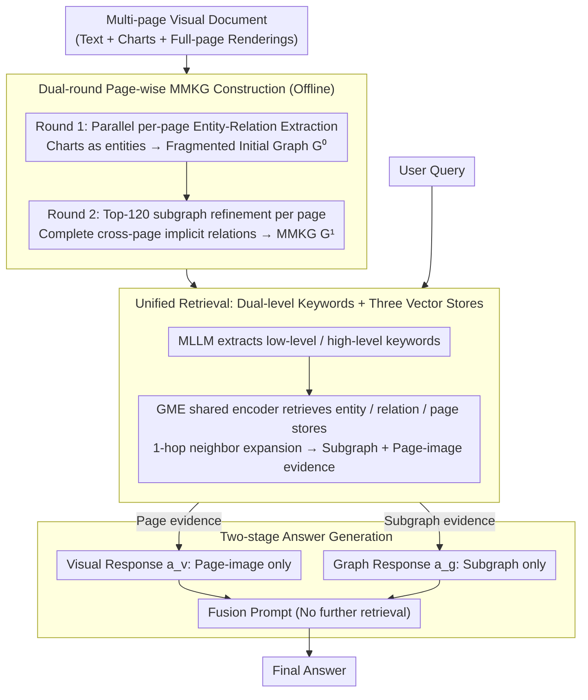

# MegaRAG: Multimodal Knowledge Graph-Based Retrieval Augmented Generation

**Conference**: ACL 2026  
**arXiv**: [2512.20626](https://arxiv.org/abs/2512.20626)  
**Code**: https://github.com/AI-Application-and-Integration-Lab/MegaRAG (Yes)  
**Area**: Multimodal RAG / Knowledge Graph  
**Keywords**: Multimodal Knowledge Graph, RAG, Cross-modal Reasoning, Visual Document QA, MLLM

## TL;DR
MegaRAG utilizes MLLMs to perform parallel entity-relation extraction from each page of long documents, merging them into a Multimodal Knowledge Graph (MMKG). It uses a "subgraph-guided" refinement round to complete cross-modal and cross-page relations. Combined with dual-path retrieval and two-stage answer generation, it significantly outperforms GraphRAG/LightRAG/VisRAG, achieving 64.85% accuracy on SlideVQA(2k) (compared to the best baseline of 27.66%).

## Background & Motivation
**Background**: Feeding external knowledge into LLMs via RAG has become the de facto standard for long-document question answering. Among these, KG-based RAG models like GraphRAG and LightRAG introduce "entity-relation graphs," which are better at multi-hop reasoning and maintain scalability across million-token scale corpora compared to chunk-level sparse/dense retrieval.

**Limitations of Prior Work**: 1) Existing KG-based RAG models are almost entirely **text-only**, discarding visual information such as tables, flowcharts, and maps, which are often the core information in visual documents like slide decks and technical reports. 2) Existing multimodal RAG models (VisRAG, ColPaLi, GME) performed dense retrieval at the page-image level but lack **structural abstraction**, failing to support cross-page multi-hop reasoning. 3) Limited by MLLM context windows, GraphRAG/LightRAG perform extraction independently within chunks and then merge, causing **cross-chunk/cross-page relations** to be severed, resulting in naturally fragmented initial graphs.

**Key Challenge**: Achieving "structural abstraction" requires page/chunk-wise extraction, while "global coverage" requires seeing the entire document—these are mutually exclusive under the constraints of MLLM context windows. Furthermore, "utilizing images" requires inserting images into prompts, but too many images can cause the model to be dominated by text, leading to modal bias.

**Goal**: (i) Automatically and scalably construct MMKGs from visual documents; (ii) Allow each page to "see" the global graph within a limited context window; (iii) Enable answer generation to absorb both graph structure and visual evidence without bias.

**Key Insight**: The authors observed that although the initial KG is fragmented, it already serves as a "compressed version of global knowledge." By injecting the **subgraph corresponding to the current page** back as a hint during a second round of refinement, global long-range dependencies are preserved without exceeding the prompt limit.

**Core Idea**: Use two rounds of construction—"page-wise parallel initial construction + subgraph-guided global refinement"—to break the trade-off between "local extraction vs. global coverage." Then, eliminate modal bias using a two-stage generation process with dual streams (graph-based answer + visual-based answer) followed by fusion.

## Method

### Overall Architecture

MegaRAG addresses "visual long-document QA": the input is a multi-page document with mixed text and images (e.g., slide decks, technical reports) and a natural language query, and the output is an answer that integrates both graph structure and visual evidence. The overall approach is to construct an offline MMKG from the document, then perform dual-path evidence retrieval and two-stage generation during query time. Map construction is split into two rounds: the first round performs parallel page-wise entity-relation extraction to obtain a fragmented initial graph; the second round feeds the "top-120 most relevant subgraph" for each page back into the MLLM to complete cross-page implicit relations. At query time, the system retrieves both KG and page-image evidence. Finally, it generates intermediate conclusions from both graph and visual paths and fuses them to prevent modal bias during joint text-image input.

### Key Designs

**1. Dual-round page-wise MMKG construction: Breaking the dilemma of local extraction vs. global coverage via "subgraph back-injection"**

Limited by MLLM context windows, an entire book cannot be fed at once, forcing page-wise extraction. However, this severs cross-page relations, leaving the initial graph fragmented—a common weakness of GraphRAG/LightRAG. In MegaRAG’s first round, $(E,R)_i^0 = G(P_i)$ is extracted independently for each page, where the input $P_i=\{T_i,F_i,B_i,I_i\}$ includes text, figures, tables, and full-page renderings. Local charts are treated as entities (e.g., a "Annual Sales by Vehicle Type" bar chart is a node). The full-page image $I_i$ provides spatial reasoning context but does not produce entities. During merging, entities are deduplicated by name and (source, target, type) triplets with aggregated descriptions, resulting in a fragmented but "compressed global knowledge" base $\mathcal{G}^0$.

The second round of refinement is $(E,R)_i^1 = R(P_i, \mathcal{G}_i^0)$: using the entity names and relation keywords from the first round as queries, a lightweight subgraph $\mathcal{G}_i^0$ consisting of the semantic top-120 nodes and their 1-hop neighbors is retrieved (capped at 32K tokens). This is fed back into the same MLLM along with the original $P_i$ to "check against the global view" and complete missing entities and implicit relations (e.g., linking the text "Electric vehicle sales increased in 2023" to a chart node via an `illustrates` relation). The ingenuity lies in seeing only a "subgraph" rather than the entire $\mathcal{G}^0$ in the prompt: this saves tokens, maintains parallel processing, and enables the recovery of links between cross-page line charts and text entities. Unlike chunk-internal gleaning in GraphRAG/LightRAG, this is a cross-page global information flow, and the authors found one round highly effective.

**2. Dual-level keywords + Unified retrieval: Local entities, global structure, and visual page evidence for a single query**

Using only entity retrieval misses relation context, while using only relation retrieval misses isolated entities. Furthermore, "finding a specific name" and "finding a chapter theme" require different granularities. MegaRAG first uses an MLLM to extract both low-level and high-level keywords from the query. These are sent together to an entity vector store to retrieve the top-$k=60$ nodes, and in parallel to a relation vector store (where each relation also pulls its source/target entities). A 1-hop neighbor expansion is performed on the hit entities. Simultaneously, the query is encoded to retrieve the top-$m=6$ page-images as visual evidence.

The three types of vectors (entity, relation, and page) share a single GME (Qwen2-VL-2B) encoder and are mapped into the same dense space. This enables cross-modal retrieval (text→entity / text→relation / text→page) within a single encoder framework. This is the pivot point where MegaRAG balances two ends: VisRAG/ColPaLi have visual retrieval but no KG, while GraphRAG/LightRAG have KGs but cannot retrieve images. MegaRAG collects both using a shared encoder.

**3. Two-stage answer generation: Decoupling graph and visual paths to remove modal bias**

The authors discovered that when an MLLM is provided with both subgraphs (text) and page-images (images) in a single prompt, it "overly focuses on text"—a typical modal bias where visual details are ignored. MegaRAG therefore decouples generation into two stages. In the first stage, two prompts are run in parallel: (a) $a_v$, based solely on retrieved page-images; and (b) $a_g$, based solely on structural knowledge from subgraphs.

In the second stage, a fusion prompt synthesizes $(a_v, a_g)$ into the final answer. The fusion stage only performs integration and does not trigger further retrieval. Essentially, this is a low-cost "chain-of-experts/ensemble": two independent paths provide comparable intermediate conclusions, and the fusion stage takes the best of both. This significantly improves Diversity and Empowerment metrics at the cost of only one additional MLLM call.

### A Complete Example

Consider a question from a SlideVQA financial deck: "Why did electric vehicle sales increase in 2023?". During construction, the page containing the sales bar chart is first extracted into fragmented entities like "Electric Vehicle," "2023," and "Annual Sales by Vehicle Type (Chart Node)." In the second round, that page uses its entity names to retrieve a subgraph of the adjacent energy procurement line chart from $\mathcal{G}^0$. The MLLM then adds cross-page relations such as "Sales chart illustrates text conclusion" and "Related to renewable energy procurement" into $\mathcal{G}^1$. During querying, the query is split into low-level ("EV sales") and high-level ("New energy trends") keywords, hitting the entity/relation stores with 1-hop expansion and simultaneously retrieving the sales and energy page-images. During generation, the visual answer $a_v$ reads the bar trend from the images, the graph answer $a_g$ reads the "policy-procurement-sales" chain from the subgraph, and the fusion prompt combines both into a final answer containing both numbers and causality.

### Loss & Training

MegaRAG is entirely training-free. All LLM calls (GPT-4o-mini for construction/generation, GPT-4.1-mini as judge) use zero-shot prompting with temperature=0. GME-Qwen2-VL-2B uses a pre-trained multimodal encoder, with encoding run on a single RTX 3090. Document parsing uses MinerU to extract text/figure/table. Retrieval uses $k=60$ and $m=6$, and one round of refinement is sufficient. This "engineering assembly" makes it highly reusable for any new document immediately.

## Key Experimental Results

### Main Results

**UltraDomain text-only global QA (vs. LightRAG, win rate %, higher is better)**:

| Domain | Comprehensiveness | Diversity | Empowerment | Overall |
|------|-------------------|-----------|-------------|---------|
| Agriculture | 65.6 vs 4.0 | 70.4 vs 10.4 | 76.0 vs 4.8 | **75.2 vs 4.8** |
| CS | 68.8 vs 3.2 | 72.0 vs 12.8 | 75.2 vs 10.4 | **76.8 vs 4.8** |
| Legal | 54.4 vs 9.6 | 69.6 vs 14.4 | 73.6 vs 12.0 | **72.0 vs 11.2** |
| Mix | 76.8 vs 3.2 | 76.8 vs 11.2 | 80.8 vs 4.0 | **80.0 vs 7.2** |

**Multimodal local QA (Accuracy %)**:

| Method | SlideVQA(2k) | FinReport | FinSlides | TechReport | TechSlides |
|------|--------------|-----------|-----------|------------|------------|
| NaiveRAG | 11.34 | 29.66 | 14.64 | 36.63 | 32.94 |
| GraphRAG (L) | 6.80 | 24.50 | 11.98 | 29.60 | 26.81 |
| LightRAG | 27.66 | 31.30 | 13.02 | 42.74 | 31.39 |
| **MegaRAG** | **64.85** | **39.51** | **58.37** | **51.51** | **60.86** |

On SlideVQA(2k), MegaRAG is **2.3x** better than the strongest baseline, LightRAG. On FinSlides, the absolute improvement is as high as **+45 pt**.

### Ablation Study (DLCV / World History multimodal global QA, win rate %)

| Configuration | DLCV Overall | World History Overall | Description |
|------|--------------|-----------------------|------|
| MegaRAG (full) | — | — | Full Model |
| A1: text-only graph | 14.4 / 57.6 / 28.0 | 1.6 / 78.4 / 20.0 | No visual inputs during graph construction |
| **A2: Page-only retrieval (No MMKG)** | **0.0 / 100.0 / 0.0** | **0.8 / 91.2 / 8.0** | No KG retrieval, relies only on page retrieval |
| A3: Single-stage fusion generation | 1.6 / 61.6 / 36.8 | 0.8 / 75.2 / 24.0 | No decoupling of visual/graph answers |

Format is "A_x Win / MegaRAG Win / Tie".

**MMKG construction overhead (World History, 788 pages)**:

| Item | Init | Refinement | Total | GraphRAG |
|---|------|------------|-------|----------|
| Time (min) | 19.0 | 12.0 | 31.0 | 23.0 |
| KG Tokens (M) | 22.9 | 15.3 | 38.2 | 1.2 |

The indexing time is approximately $1.4\times$ that of GraphRAG, but it extracts 473–538 visual entities that text baselines miss entirely. Inference latency on a single RTX 3090 is ~42s/q (GME takes 26.4s), which can be significantly reduced with stronger GPUs.

### Key Findings
- **MMKG retrieval is the most beneficial module**: In A2, without KG, MegaRAG wins almost 100% of the time, indicating that multi-hop reasoning in visual documents depends almost entirely on the structured graph. Page retrieval alone is insufficient.
- **Visual entity construction is the second most critical factor**: In A1, removing visual inputs loses chart semantics; for data like DLCV (which is slide-heavy), performance drops drastically—proving chart nodes are not decorative but provide essential grounding.
- **Two-stage generation contributes most to Diversity/Empowerment**: In A3, with single-prompt fusion, the MLLM tends toward text bias, leading to answers that lack the diversity provided by visual evidence.
- **Low judge model bias**: Rerunning experiments with Gemini-3-Flash yielded the same win-rate rankings as GPT-4.1-mini, with a Cohen's $\kappa = 0.72$.

## Highlights & Insights
- **"Subgraph-as-prompt" is a universal design**: Instead of shoving the whole graph back, MegaRAG dynamically retrieves the "global structure most relevant to the current page." This tactic can be transferred to any "global information + local chunk" refinement scenario, such as long-document summarization, code repo analysis, or long-video understanding.
- **Charts as a category of entity**: Traditional KGs restrict nodes to named entities (people/places/orgs). This paper treats a bar chart or map as an entity linked to text nodes. This "visual-as-entity" ontology extension provides a simple and feasible schema for MMKG.
- **Two-stage generation = Cheap ensemble**: Graph/visual parallel paths + fusion is essentially an expert ensemble, but the cost is just one extra MLLM call. It is more stable than single multimodal prompts and much cheaper than training true multi-expert models.
- **Achieving SOTA while training-free**: All components use zero-shot prompting and off-the-shelf encoders. This "engineering synthesis" makes it extremely easy to deploy to any new document.

## Limitations & Future Work
- **Author Acknowledgments**: Experiments were conducted within single books/reports; multi-document cross-document QA was not addressed. Image processing is expensive, and multimodal data scale is limited. Treating each figure as a single entity might miss fine-grained objects. MLLM extraction can still hallucinate, and there is currently no verification mechanism.
- **Critique**: Refinement only ran for one round; the authors claim convergence but did not provide comparison curves for rounds 2-3. Evaluation relies heavily on LLM-as-judge (GPT-4.1-mini / Gemini-3-Flash), which has systematic biases in win-rate metrics; more reference-based metrics like BLEU/ROUGE/F1 are missing. The 42s/q latency on a single GPU is still high for online scenarios.
- **Future Directions**: (1) Decompose figures into multiple sub-entities (bars, axes, legends) using set-of-mark tools for fine-grained extraction; (2) Introduce self-consistency voting during refinement to suppress hallucinated relations; (3) Incorporate entity linking/canonicalization to merge MMKGs from different books in cross-document scenarios; (4) Distill the generation stage into a single model to eliminate two-stage latency.

## Related Work & Insights
- **vs. GraphRAG (Edge et al., 2024)**: GraphRAG performs community-level global summarization + multi-query aggregation, with costs scaling linearly with community count. MegaRAG uses page-wise subgraph refinement, avoiding redundant global LLM calls and natively supporting multimodality.
- **vs. LightRAG (Guo et al., 2025)**: This work adopts LightRAG's dual-level keyword retrieval but swaps the backbone (text to multimodal) and adds refinement. Construction costs are slightly higher, but QA quality wins across all benchmarks.
- **vs. VisRAG / ColPaLi / GME**: These are purely visual RAG models that perform page-image retrieval without structural abstraction. MegaRAG reuses GME as an encoder but adds an MMKG layer for cross-page reasoning.
- **vs. MR-MKG / Query-driven MMKG**: MR-MKG relies on manual MMKG construction, which is not scalable. Query-driven MMKG builds graphs dynamically online, suitable for short queries. MegaRAG builds offline global graphs, better for repeated queries on long documents.
- **Insight**: Automated KG construction using LLMs is mature; the key is "how to let local extraction see the global view within context limits"—subgraph back-injection is a simple, reusable paradigm. For visual documents, "charts-as-entities" is a high-ROI ontology design.

## Rating
- Novelty: ⭐⭐⭐⭐ "Page-wise parallel + subgraph-guided refinement" is a clean, elegant solution for MMKG, and the "visual-as-entity" ontology extension is a genuine step toward multimodality.
- Experimental Thoroughness: ⭐⭐⭐⭐⭐ 8 datasets (4 text + 4 multimodal) + 5 baselines (NaiveRAG / GraphRAG / LightRAG / VisRAG / GME / ColQwen / Query-driven) + complete 3-stage ablation + two-judge model cross-validation + overhead analysis.
- Writing Quality: ⭐⭐⭐⭐ Method diagrams are clear and notation is consistent. The appendix provides full prompts and case studies. Some repetition in the text, but overall very readable.
- Value: ⭐⭐⭐⭐⭐ Training-free + open-source code + significant performance gains (over 2x) in the high-value industrial scenario of visual document QA makes this very deployment-friendly.

<!-- RELATED:START -->

## Related Papers

- [\[CVPR 2026\] M3KG-RAG: Multi-hop Multimodal Knowledge Graph-enhanced Retrieval-Augmented Generation](../../CVPR2026/graph_learning/m3kg_rag_multi_hop_multimodal_knowledge_graph_enhanced_retrieval_augmented_genera.md)
- [\[ACL 2026\] STEM: Structure-Tracing Evidence Mining for Knowledge Graphs-Driven Retrieval-Augmented Generation](stem_structure-tracing_evidence_mining_for_knowledge_graphs-driven_retrieval-aug.md)
- [\[ACL 2026\] TagRAG: Tag-guided Hierarchical Knowledge Graph Retrieval-Augmented Generation](tagrag_tag-guided_hierarchical_knowledge_graph_retrieval-augmented_generation.md)
- [\[ACL 2025\] Knowledge Graph Retrieval-Augmented Generation for LLM-based Recommendation (K-RagRec)](../../ACL2025/graph_learning/kg_rag_recommendation.md)
- [\[ACL 2026\] LegalGraphRAG: Multi-Agent Graph Retrieval-Augmented Generation for Reliable Legal Reasoning](legalgraphrag_multi-agent_graph_retrieval-augmented_generation_for_reliable_lega.md)

<!-- RELATED:END -->
