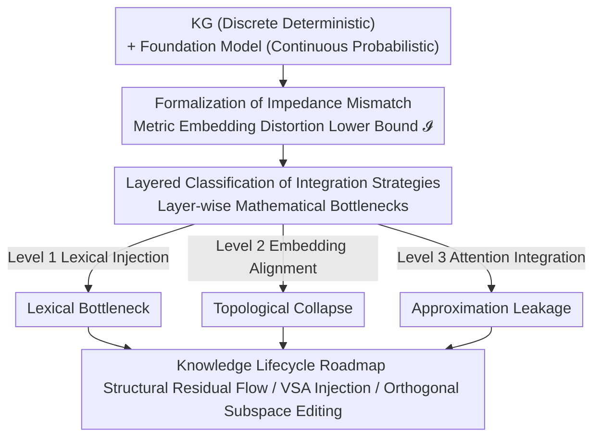

# Overcoming the Impedance Mismatch: A Theoretical Roadmap for Fusing Foundation Models and Knowledge Graphs

**Conference**: ACL2026  
**arXiv**: [2606.15656](https://arxiv.org/abs/2606.15656)  
**Code**: None (Pure theoretical paper)  
**Area**: Graph Learning / Neuro-symbolic / Knowledge Graphs  
**Keywords**: Impedance Mismatch, Neuro-symbolic fusion, Knowledge Graphs, Multi-hop reasoning, Vector Symbolic Architecture  

## TL;DR
This is a purely theoretical position paper: the authors formalize the phenomenon where foundation models (continuous probability spaces) and knowledge graphs (discrete deterministic structures) are difficult to truly integrate as **Impedance Mismatch**. Using metric embedding theory, they prove mathematical failure upper bounds for three mainstream categories of solutions—ranging from lexical injection to attention-level integration—and propose a theoretical roadmap for the full knowledge lifecycle: "Emergence—Injection—Editing."

## Background & Motivation
**Background**: Integrating Knowledge Graphs (KG) into Large Language Models (LLMs) currently relies on RAG as the industrial standard—retrieving relevant subgraphs, serializing discrete triples into natural language text, and prepending them to the context window. Academia has gone further, using GNNs or translational embeddings to align graphs with a shared latent space, or directly modifying the attention matrix to inject graph priors.

**Limitations of Prior Work**: The authors argue these approaches are merely "surface patches." Compressing a multi-dimensional graph into a linear token stream destroys the relational geometric structure required for multi-hop logical reasoning, directly leading to high non-retrieval rates, subgraph fragmentation, and hallucinations. Furthermore, when serialized graph information conflicts with the continuous weights of a pre-trained model, the model often ignores the prompt and relies on its own statistical priors (knowledge conflict).

**Key Challenge**: The root cause is the incompatibility between two knowledge representation paradigms—KGs are discrete, deterministic, and $O(1)$ editable topological structures; foundation models are continuous, probabilistic, and distributed entangled parametric memories. Forcing deterministic graph structures into probabilistic self-attention latent spaces inevitably results in mathematical degradation. Borrowing the concept of "object-relational impedance mismatch" from the database field, the authors term this degradation **Impedance Mismatch**.

**Goal**: (1) Formalize this structural friction and provide measurable lower bounds; (2) Classify existing integration strategies into layers and prove their respective mathematical bottlenecks; (3) Provide a theoretical roadmap to solve the problem at the Transformer architecture layer, bypassing "lexical bridging."

**Key Idea**: Knowledge fusion is not a text retrieval problem; it is a problem of geometric friction between discrete determinism and continuous probability. It requires "mathematical mediation" at the architectural level rather than expecting continuous weights to seamlessly absorb discrete facts.

## Method
As a theoretical paper without experiments, the "Method" consists of the **Formalized Framework + Layered Critique + Roadmap**. The logical chain is: define the "scale" of impedance mismatch $\mathcal{I}$, use it to measure the failure upper bounds of three layers of integration strategies, and finally propose a three-stage remedy based on "where knowledge comes from, how it enters, and how it is modified."

### Overall Architecture
The paper centers on a core quantity $\mathcal{I}$ (Impedance Mismatch) and is divided into three parts: **Diagnosis** (defining $\mathcal{I}$ and its composite error in multi-hop reasoning) → **Layered Conviction** (categorizing existing methods into Level 1/2/3 and assigning mathematical bottlenecks and asymptotic failure modes to each) → **Prescription** (an emergence/injection/editing roadmap). The transitions are strictly progressive: the diagnosis provides the scale, the layering uses it to measure why current methods fail, and the roadmap provides countermeasures for each bottleneck.

### Key Designs

**1. Formalizing Impedance Mismatch: Using Metric Embedding Distortion to Define a Lower Bound for Fusion Difficulty**

Addressing the pain point that "everyone says KG and LLMs are hard to fuse, but no one specifies why," the authors transform it into a computable quantity. Let a KG be defined as a discrete topological space $\mathcal{K}=(\mathcal{V},\mathcal{E})$ with a shortest-path metric $d_{\mathcal{K}}$, and the foundation model latent space as a continuous metric space $\mathcal{M}\subseteq\mathbb{R}^h$ with geometric distance $d_{\mathcal{M}}$. Any integration requires a mapping $f:\mathcal{V}\to\mathcal{M}$. Impedance mismatch is defined as the minimum distortion across all mappings:

$$\mathcal{I}=\inf_{f}\left(\sup_{u\neq v}\frac{d_{\mathcal{M}}(f(u),f(v))}{d_{\mathcal{K}}(u,v)}\times\sup_{u\neq v}\frac{d_{\mathcal{K}}(u,v)}{d_{\mathcal{M}}(f(u),f(v))}\right)$$

In purely discrete deterministic systems, $\mathcal{I}=1$ (perfect structural isometry), while in dense Transformer representations, $\mathcal{I}\gg 1$. The value lies in proving that continuous spaces cannot faithfully preserve graph motifs like closed loops or hierarchical trees as a provable lower bound. The authors further note that multi-hop relations are deterministic algebraic compositions in graphs, whereas they are only geometric approximations in models via layered attention $\prod_{l=1}^{L}A^{(l)}$. The error $\epsilon=\lVert f(v_3)-\prod_{l=1}^{L}A^{(l)}f(v_1)\rVert$ accumulates **multiplicatively** with the number of hops—the root cause of failure for text retrieval in multi-hop reasoning.

**2. Three-layer Integration Classification: Assigning Mathematical Failure Upper Bounds to Mainstream Solutions**

Addressing the lack of comparable failure characterization, the authors categorize methods by "how deep the discrete graph penetrates the continuous architecture." Level 1 (Lexical/Prompt Injection, e.g., RAG) is constrained by the **Lexical Bottleneck**: a subgraph with depth $k$ and branching factor $b$ has $\mathcal{O}(b^k)$ reasoning paths; serialization requires $c\cdot\mathcal{O}(b^k)$ tokens. Once this exceeds context window $L$, truncation is inevitable by the pigeonhole principle, and in classical logic, removing one premise invalidates the entire deductive chain. Level 2 (Embedding Alignment) is constrained by **Topological Collapse**: by Bourgain’s Embedding Theorem, embedding a finite metric space with $|\mathcal{V}|$ points into Euclidean space results in at least $\Omega(\log|\mathcal{V}|)$ distortion, thus $\mathcal{I}\geq\Omega(\log|\mathcal{V}|)$. Larger ontologies lead to larger distortion; zero distortion is mathematically impossible. Level 3 (Attention-level Integration) is constrained by **Approximation Leakage**: softmax only outputs positive probabilities. Approximating a hard zero (no edge) requires infinite negative logits; thus, every non-adjacent node contributes a positive residual $\delta>0$. Multi-hop $(A_{\text{soft}})^k$ causes $\delta$ to accumulate exponentially, leading to over-smoothing where discrete signals are drowned by noise.

**3. Three Core Bottlenecks: Why "True Fusion" is Theoretically Blocked**

The authors extract three deeper irreconcilable contradictions. **A. The Curse of Differentiable Logic**: Relaxing Boolean connectives to $[0,1]$ t-norms/s-norms results in non-linear loss surfaces and gradient saturation—gradients vanish once a formula is "almost satisfied," stopping optimization prematurely. Soft truth values also destroy classical equivalences like De Morgan's or contrapositive laws, forcing a choice between "Boolean faithfulness" and "optimization feasibility." **B. Structural and Geometric Interference**: In a discrete graph, editing an edge has zero impact on adjacent edges. In continuous residual flows, facts overlap; modifying one fact distorts local geometry and causes catastrophic interference with unrelated knowledge. Retention rates collapse as the number of sequential edits increases. **C. Asymmetry of Symbol Grounding**: KGs use unique entity identifiers to maintain referential integrity across contexts, while models use contextualized distributed representations of subwords. Aligning immutable symbols to fluid linguistic patterns lacks a dynamic "Role-Filler" binding mechanism, causing hybrid models to perform shallow pattern matching rather than true compositional generalization.

### Loss & Training
This paper does not train a model; the "Prescription" part is a three-stage theoretical roadmap corresponding to the knowledge lifecycle:

- **Emergence (Pre-training) · Structural Residual Flow**: Current pre-training is unconstrained geometric optimization, leading to overlapping facts. Ours advocates for graph-theoretic inductive biases, using orthogonal subspace regularization to force different knowledge domains into mutually orthogonal directions, allowing discrete relational structures to emerge natively with mathematical "insulation" within weights.
- **Injection (Inference) · VSA-based Implicit Subgraph Injection**: Abandon external text prompts in favor of Vector Symbolic Architectures (VSA). VSA uses binding/bundling/permutation to encode discrete graphs into fixed-dimensional hypervectors, which naturally align with Transformer embeddings. This allows direct injection of explicit "Role-Filler" bindings into intermediate attention layers, forcing generation to be conditioned on strict mathematical bindings rather than probabilistic text.
- **Editing · Orthogonal Subspace Editing**: To solve the decline in retention rate during continuous editing, Ours advocates projecting target fact edits strictly onto orthogonal feature directions that do not activate unrelated semantic concepts. This makes an update mathematically equivalent to a "local edge insertion" in a discrete graph, bringing the reliable editability of symbol bases into neural parameter space.

## Key Experimental Results
There are **no experiments**; the authors admit in the Limitations that the framework is a theoretical blueprint. The "results" consist of a taxonomy table mapping strategies and bottlenecks, and the correspondence between the roadmap and the bottlenecks.

### Main Results: Mathematical Bottlenecks of Three Integration Levels

| Integration Level | Mechanism | Formalized Bottleneck | Asymptotic Failure Mode |
|----------|------|------------|--------------|
| Level 1: Surface | Lexical/Prompt Injection (RAG) | Lexical Bottleneck: $\mathcal{O}(b^k)>L$ | Context truncation; failure to encode exponential path complexity |
| Level 2: Embedding | Latent Vector Alignment (GNNs) | Topological Collapse: $\mathcal{I}\geq\Omega(\log\lvert\mathcal{V}\rvert)$ | Semantic node confusion; distortion of discrete relational boundaries |
| Level 3: Architecture | Graph-guided Attention | Approximation Leakage: Error $\delta$ compounds in $(A_{\text{soft}})^k$ | Representation over-smoothing; discrete signal drowned by noise |

### Correspondence between Bottlenecks and Roadmap

| Core Bottleneck | Essential Contradiction | Roadmap Countermeasure |
|----------|----------|------------|
| A. Curse of Differentiable Logic | Gradient Saturation + Broken Logic Equivalence | Structural Residual Flow (Graph bias in pre-training) |
| B. Structural/Geometric Interference | Continuous Overlap → Edit Interference | Orthogonal Subspace Editing (Localized updates) |
| C. Asymmetry of Symbol Grounding | Unique Symbols vs Fluid Subword Reps | VSA Implicit Subgraph Injection (Role-Filler binding) |

### Key Findings
- The three failure modes are **provable lower bounds**, not engineering hurdles: lexical injection is limited by the pigeonhole principle, embedding alignment by Bourgain's Theorem, and attention integration by the inability of softmax to output hard zeros.
- Multi-hop reasoning is the litmus test: error accumulates **multiplicatively/exponentially** with hop count $k$ across all levels, explaining why RAG suffers from severe hallucinations in multi-hop problems.
- The authors emphasize that a true solution must make graph structures **native and internalized** (via Structural Residual Flow + VSA) rather than treating them as "external plugins" for every query.

## Highlights & Insights
- **Turning Intuition into a Provable Quantity**: By defining $\mathcal{I}$ via metric embedding distortion, the difficulty of fusion evolves from a slogan into a mathematical proposition with lower bounds. This framework can evaluate the theoretical limits of any KG+LLM method.
- **Categorizing Failures via Diverse Math Tools**: Using the pigeonhole principle for Level 1, Bourgain’s theorem for Level 2, and the positivity of softmax for Level 3 provides an elegant and independent layered critique.
- **VSA and Orthogonal Subspaces as Transferable Ideas**: Treating VSA as a bridge for injecting discrete structures into latent layers and orthogonal projection as a tool for localized knowledge editing provides direct inspiration for research in knowledge editing, retrieval-augmented generation, and interpretability.

## Limitations & Future Work
- **Lack of Empirical Evidence**: The paper is strictly formal analysis. Structural residual flow, VSA injection, and orthogonal subspace editing are blueprints whose scalability in training remains unverified.
- **Assumption of Perfectly Deterministic KGs**: Geometric constraints assume noise-free, non-contradictory KGs. How these bounds adapt to noisy, real-world knowledge bases is unclear.
- **Tightness of Bounds**: The bounds (e.g., $\Omega(\log|\mathcal{V}|)$) are asymptotic. The paper does not provide operational criteria to determine how close actual systems are to these bounds or if they can be bypassed via task-specific structural properties.

## Related Work & Insights
- **vs RAG / KG-Augmented Generation**: Mainstream methods serialize subgraphs into context, which this paper proves is trapped by the Lexical Bottleneck as $\mathcal{O}(b^k)$ eventually exceeds the window length. This work suggests injection at the latent layer via VSA.
- **vs Embedding Alignment (TransE, GNN+LLM)**: These compress graphs into a shared latent space. This work uses Bourgain's Theorem to show this is a lossy compression ($\mathcal{I}\geq\Omega(\log|\mathcal{V}|)$) that inevitably confuses semantic nodes.
- **vs Graph-Guided Attention**: Even advanced attention integration suffers from exponential leakage due to softmax; the paper argues that continuous attention cannot sustainably approximate discrete routing.
- **vs Knowledge Editing (ROME, MEND)**: Existing continuous editing methods suffer from declining retention over time. This paper attributes this to a lack of orthogonality in residual flows and proposes orthogonal subspace editing as the mathematical equivalent of discrete edge insertion.

## Rating
- Novelty: ⭐⭐⭐⭐ Formalizing neuro-symbolic fusion as provable lower bounds is a clear and original perspective.
- Experimental Thoroughness: ⭐ Pure theory; zero experiments.
- Writing Quality: ⭐⭐⭐⭐ Tight logical chain (Scale → Layering → Roadmap) with clean mathematical arguments.
- Value: ⭐⭐⭐⭐ Provides a reusable theoretical framework and research agenda for KG+LLM fusion, though short-term feasibility is low.

<!-- RELATED:START -->

## Related Papers

- [\[ICML 2025\] Towards Graph Foundation Models: Learning Generalities Across Graphs via Task-Trees](../../ICML2025/graph_learning/towards_graph_foundation_models_learning_generalities_across_graphs_via_task-tre.md)
- [\[ICML 2026\] When Do Graph Foundation Models Transfer? A Data-Centric Theory](../../ICML2026/graph_learning/when_do_graph_foundation_models_transfer_a_data-centric_theory.md)
- [\[ACL 2026\] What Makes AI Research Replicable? Executable Knowledge Graphs as Scientific Knowledge Representations](what_makes_ai_research_replicable_executable_knowledge_graphs_as_scientific_know.md)
- [\[NeurIPS 2025\] Deliberation on Priors: Trustworthy Reasoning of Large Language Models on Knowledge Graphs](../../NeurIPS2025/graph_learning/deliberation_on_priors_trustworthy_reasoning_of_large_language_models_on_knowled.md)
- [\[NeurIPS 2025\] Reasoning Meets Representation: Envisioning Neuro-Symbolic Wireless Foundation Models](../../NeurIPS2025/graph_learning/reasoning_meets_representation_envisioning_neuro-symbolic_wireless_foundation_mo.md)

<!-- RELATED:END -->
