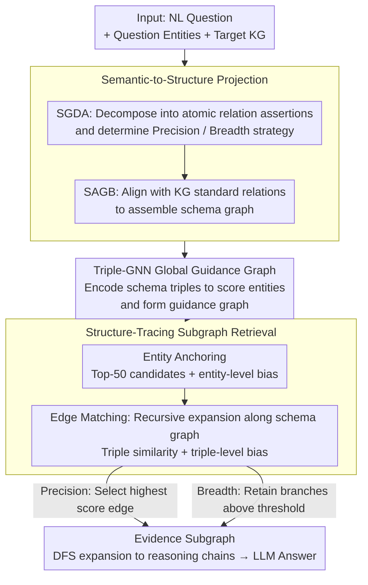

# STEM: Structure-Tracing Evidence Mining for Knowledge Graphs-Driven Retrieval-Augmented Generation

**Conference**: ACL2026  
**arXiv**: [2604.22282](https://arxiv.org/abs/2604.22282)  
**Code**: https://github.com/PennyYu123/STEM_RAG  
**Area**: Graph Learning / Knowledge Graph Question Answering / KG-RAG  
**Keywords**: KGQA, Multi-hop Reasoning, Structured Retrieval, GNN, RAG

## TL;DR
STEM reformulates multi-hop KGQA from step-by-step path searching to a two-stage process: "generating a query schema graph first, then tracing the evidence subgraph by structure." Through semantic-to-structure projection, Triple-GNN global guidance, and structure-matching retrieval, it significantly improves answer accuracy and evidence coverage on WebQSP and CWQ.

## Background & Motivation
**Background**: Knowledge Graph-enhanced RAG aim to convert natural language questions into verifiable structured evidence for LLMs to generate answers. Existing KGQA methods are generally categorized into three types: LLMs generating reasoning plans before fetching evidence chains, step-by-step beam search path exploration, and structure matching after constructing schema graphs.

**Limitations of Prior Work**: There is a significant misalignment between natural language questions and KG schemas. Relation names generated by LLMs may be semantically plausible but non-existent in the target KG. Local path searches are easily misled by hub nodes, pseudo-relevant edges, and local similarities. Furthermore, evidence for complex questions is often a connected subgraph rather than a single path.

**Key Challenge**: Multi-hop KG-RAG requires the language model to understand question semantics while ensuring the retrieval process respects the authentic topology of the KG. Relying solely on natural language plans leads to schema hallucinations, while relying solely on local graph searches lacks a global structural blueprint.

**Goal**: The authors aim to integrate question decomposition, schema alignment, candidate entity anchoring, and evidence subgraph retrieval into a structured pipeline. This ensures retrieval results cover the complete reasoning path while controlling the cost of interactive LLM calls.

**Key Insight**: Multi-hop questions can be projected onto an abstract query schema graph. As long as this graph is structurally isomorphic to the real evidence subgraph in the KG, retrieval can transition from "guessing the next hop" to "matching by structure."

**Core Idea**: Use KG schemas to constrain LLM query decomposition and employ a Triple-GNN to generate a global guidance graph, ensuring every entity and triple match carries a global structural prior.

## Method

### Overall Architecture

STEM reformulates multi-hop KGQA from "letting the LLM guess the next hop step-by-step" to "drawing a structural blueprint first, then following the map." The inputs are the natural language question, question entities, and the target KG; the output is a query-specific evidence subgraph, which is linearized into reasoning chains for the LLM. The process advances through three layers: first projecting the question into a KG-executable schema graph, then using a lightweight graph model to generate a global guidance graph to inject structural priors, and finally allowing the retriever to perform structure tracing on the real KG to transform "guessing" into "matching."

### Key Designs

**1. Semantic-to-Structure Projection: Learning question patterns before symbolic grounding to suppress schema hallucinations.**

Directly asking LLMs to generate relation names often results in edges that are semantically reasonable but non-existent in the target KG, which misleads local path searches. STEM splits projection into two steps: SGDA decomposes complex questions into "atomic relation assertions" (sentences sharing intermediate variables) and determines the retrieval strategy (Precision vs. Breadth); SAGB then aligns these assertions with standard KG relation names and triple formats to assemble the schema graph. By abstracting the required relational structure before grounding it to specific symbols, this "schema-first, grounding-second" approach filters out non-existent paths before retrieval, significantly reducing schema hallucinations.

**2. Triple-GNN Global Guidance Graph: Injecting the global structural requirement before local search.**

Traditional path searches rely on local similarity of the current edge, which is easily misled by hub nodes or synonymous relations. STEM first encodes schema triples into a query representation to initialize node vectors for question entities. The Triple-GNN then propagates these across the candidate subgraph to generate probability scores for each entity, selecting high-scoring nodes to form a guidance graph. This graph acts as a global prior, informing each subsequent matching step about which entities and triples are globally relevant, thereby suppressing interference from hub nodes.

**3. Structure-Tracing Subgraph Retrieval: Dual biases for entity anchoring and edge matching.**

Retrieval occurs in two stages, both incorporating biases from the guidance graph. In the entity anchoring stage, Top-50 candidates are selected for each question entity, with entity-level global biases magnifying preferred nodes. In the edge matching stage, recursive expansion follows the schema graph edges, where the score for each candidate edge is determined by the combination of triple semantic similarity and triple-level bias. To handle complex questions requiring multiple answers, the retriever switches between Precision (greedy selection for low latency/high confidence) and Breadth (retaining all edges above a threshold to cover multiple answers) based on SGDA's decision.

### Loss & Training

STEM constructs specialized training data for SGDA, SAGB, and Triple-GNN. SGDA/SAGB utilize Structure-to-Query Reverse Generation for data augmentation: first generating question patterns from KG structures, then training the model to project natural language questions back to schema graphs. Triple-GNN learns to predict high-value entities within query-specific subgraphs to ensure the guidance graph covers true reasoning paths. The final answer generation does not require LLM fine-tuning; instead, the evidence subgraph is expanded via DFS into reasoning chains and fed into the LLM with instructions, allowing the method to be combined with various models like GPT-4o or Llama-3.1.

## Key Experimental Results

### Main Results
The main experiments evaluate Hit@1 and F1 on WebQSP and CWQ datasets. STEM maintains a significant advantage over strong baselines, indicating that gains primarily stem from the structured retrieval rather than just LLM parametric knowledge.

| Method | Reasoning Model | WebQSP Hit@1 | WebQSP F1 | CWQ Hit@1 | CWQ F1 |
|------|----------|--------------|-----------|-----------|--------|
| GPT-4o | GPT-4o | 61.80 | 43.60 | 38.20 | 32.90 |
| RoG | GPT-4o | 88.09 | 70.12 | 69.61 | 61.97 |
| FiDeLiS | GPT-4-turbo | 84.39 | 78.32 | 71.47 | 64.32 |
| STEM | Llama-3.1-8B | 86.63 | 71.05 | 68.76 | 60.81 |
| STEM | Llama-3.1-70B | 88.08 | 74.62 | 72.53 | 62.09 |
| STEM | GPT-4o | 90.94 | 76.18 | 74.09 | 65.33 |

STEM + GPT-4o achieves the best results across three metrics, particularly on CWQ, which contains more compositional questions.

### Ablation Study

| Configuration | WebQSP Hit@1 | WebQSP F1 | CWQ Hit@1 | CWQ F1 | Description |
|------|--------------|-----------|-----------|--------|------|
| STEM + GPT-4o | 90.94 | 76.18 | 74.09 | 65.33 | Full Model |
| w/o Entity & Triple Bias | 86.31 | 70.80 | 63.91 | 55.59 | Remove guidance graph |
| w/o Entity Bias | 86.45 | 75.81 | 66.35 | 57.35 | Triple-level correction only |
| w/o Triple Bias | 86.95 | 73.45 | 64.90 | 56.42 | Entity-level correction only |

| Query Planning Pipeline | WebQSP Hit@1 | WebQSP F1 | CWQ Hit@1 | CWQ F1 |
|--------------------|--------------|-----------|-----------|--------|
| Llama-3.1-70B few-shot | 77.74 | 61.21 | 46.68 | 41.83 |
| GPT-4o few-shot | 83.14 | 65.77 | 50.43 | 43.20 |
| STEM Self-trained Pipeline | 90.94 | 76.18 | 74.09 | 65.33 |

### Key Findings
- Triple-level structural bias is more critical than entity-level bias; removing it leads to a sharp decline on CWQ, indicating that global consistency of relations is the bottleneck in multi-hop retrieval.
- On multi-answer questions, STEM's F1 on WebQSP subsets with $\ge 10$ answers reaches 62.46, outperforming RoG (58.33) and GNN-RAG (56.28).
- Evidence coverage decreases as the number of answers increases, but single-answer coverage remains high (81.90 for WebQSP, 74.28 for CWQ), showing the retrieval graph covers real reasoning paths well.

## Highlights & Insights
- The paper defines the core challenge of KG-RAG as structure alignment rather than simply "letting the LLM think more." This perspective explains why interactive path searches can be slow and unstable.
- The two-stage projection (SGDA/SAGB) separates NL semantics from KG symbol space, reducing the "black box" nature of end-to-end matching and making errors easier to trace.
- The Precision/Breadth strategy is a practical design: Precision for low latency/high confidence in single-answer cases, and Breadth for diverse structural branches in multi-answer cases.
- The Triple-GNN provides retrieval priors rather than direct answers. This "lightweight GNN assisting LLM retrieval" paradigm is highly transferable to enterprise, legal, or medical KGs.

## Limitations & Future Work
- STEM depends on the schema and training data of the target KG; current experiments focus on Freebase. Adapting to new KGs requires regenerating projection and GNN training data.
- If the initial schema graph generated by SGDA/SAGB deviates from the true structure, it is difficult to rectify during matching, leading to error propagation.
- The Breadth strategy increases retrieval latency; real-world systems may need adaptive thresholds based on question difficulty.
- While evidence is more complete, the faithfulness of the LLM's final generation to the evidence subgraph still requires separate evaluation.

## Related Work & Insights
- **vs. RoG**: RoG generates reasoning plans via LLM and retrieves evidence chains; STEM generates schema graphs and performs structure tracing, making it more sensitive to KG topology and better for multi-answer branching.
- **vs. GNN-RAG**: GNN-RAG uses GNNs for entity retrieval; STEM's Triple-GNN uses query triple structures as conditions to emphasize triple-level consistency.
- **vs. GraphRAG**: GraphRAG focuses on community summaries and global text retrieval; STEM is tailored for entity-relation level KGQA.
- **Insight**: For structured KBs, the RAG bottleneck is often not about recalling more text, but about making the retrieval path isomorphic to the question logic. Schema graph generation could be extended to SQL, API graphs, or tool-calling plans.

## Rating
- Novelty: ⭐⭐⭐⭐☆ The combination of structure tracing and Triple-GNN guidance is distinct, though built upon established KGQA and GNN-RAG frameworks.
- Experimental Thoroughness: ⭐⭐⭐⭐☆ Comprehensive main results and ablations, though more validation on diverse business KGs would be beneficial.
- Writing Quality: ⭐⭐⭐⭐☆ The methodology is clear, but the numerous components require careful tracking of dependencies between SGDA, SAGB, and Triple-GNN.
- Value: ⭐⭐⭐⭐⭐ Highly practical for KG-RAG systems, especially in scenarios requiring interpretable evidence subgraphs.

<!-- RELATED:START -->

## Related Papers

- [\[ACL 2026\] MegaRAG: Multimodal Knowledge Graph-Based Retrieval Augmented Generation](megarag_multimodal_knowledge_graph-based_retrieval_augmented_generation.md)
- [\[NeurIPS 2025\] GFM-RAG: Graph Foundation Model for Retrieval Augmented Generation](../../NeurIPS2025/graph_learning/gfm-rag_graph_foundation_model_for_retrieval_augmented_generation.md)
- [\[ACL 2025\] Knowledge Graph Retrieval-Augmented Generation for LLM-based Recommendation (K-RagRec)](../../ACL2025/graph_learning/kg_rag_recommendation.md)
- [\[ACL 2025\] SimGRAG: Leveraging Similar Subgraphs for Knowledge Graphs Driven Retrieval-Augmented Generation](../../ACL2025/graph_learning/simgrag_leveraging_similar_subgraphs_for_knowledge_graphs_driven_retrieval-augme.md)
- [\[ACL 2026\] LegalGraphRAG: Multi-Agent Graph Retrieval-Augmented Generation for Reliable Legal Reasoning](legalgraphrag_multi-agent_graph_retrieval-augmented_generation_for_reliable_lega.md)

<!-- RELATED:END -->
