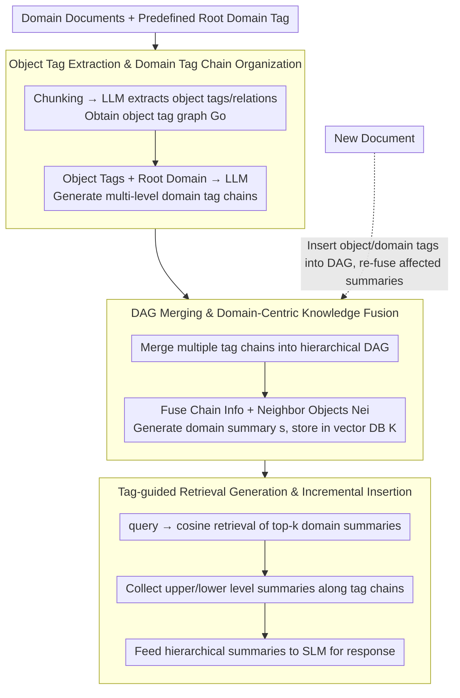

# TagRAG: Tag-guided Hierarchical Knowledge Graph Retrieval-Augmented Generation

**Conference**: ACL 2026 Findings  
**arXiv**: [2601.05254](https://arxiv.org/abs/2601.05254)  
**Code**: None  
**Area**: Graph Learning / Graph RAG  
**Keywords**: GraphRAG, Hierarchical Tag Chain, Knowledge Graph Retrieval, Incremental Update, Lightweight RAG

## TL;DR
TagRAG replaces expensive entity community partitioning and global graph summarization in GraphRAG with "object tags + domain tag chains." While significantly reducing construction and retrieval costs, it maintains global knowledge integration capabilities and achieves higher win rates than NaiveRAG, GraphRAG, LightRAG, and MiniRAG on four UltraDomain datasets using the small model Qwen3-4B.

## Background & Motivation
**Background**: RAG has become the core paradigm for connecting LLMs to external knowledge. Traditional RAG relies mostly on chunk-level vector retrieval, suitable for local fact queries. GraphRAG utilizes entity extraction, relationship mapping, community partitioning, and community summarization to elevate knowledge to the global graph structure level, making it suitable for query-focused summarization and cross-document synthesis.

**Limitations of Prior Work**: The cost of GraphRAG is high. It requires extensive LLM calls for extracting entities and relations and for community summarization, leading to slow construction and high resource consumption. Incremental updates to the knowledge base may necessitate rebuilding communities or re-summarizing. Lightweight methods like LightRAG and MiniRAG reduce costs but often sacrifice the global perspective, frequently losing comprehensive reasoning capabilities when using small models as a backbone.

**Key Challenge**: GraphRAG pursues global knowledge but suffers from expensive global mapping and summarization; lightweight RAG pursues efficiency but struggles to retain hierarchical semantics and cross-document integration. Practical deployment requires a compromise: global organization combined with low-cost construction, retrieval, and incremental maintenance using small models.

**Goal**: Ours aims to design a hierarchical Graph RAG framework that reduces dependency on large LLMs and complex community detection while retaining domain-level global knowledge fusion capabilities and inherently supporting incremental knowledge insertion.

**Key Insight**: This paper shifts the basic unit of the knowledge graph from "entities" to "tags." Object tags carry specific knowledge from documents, while domain tag chains organize these objects into hierarchical paths from root domains to sub-domains. Thus, the graph structure itself possesses thematic induction and retrieval navigation capabilities.

**Core Idea**: Use a predefined root domain to guide the generation of hierarchical domain tag chains from object tags, then pre-fuse chain knowledge and adjacent object knowledge into domain-centric summaries. During inference, only relevant tags and tag chains need to be retrieved to obtain global context.

## Method
TagRAG modifies the "extract entities then cluster communities" approach of GraphRAG into "extract tags then attach to domain chains." Instead of relying on graph algorithms for post-hoc community discovery, it uses a predefined root domain and LLM-generated hierarchical tag chains during construction to place knowledge into a DAG. During querying, the model avoids traversing the entire entity graph, retrieving only the most relevant domain tags and following the chains to obtain upper and lower-level summaries. This preserves the global perspective desired of GraphRAG while avoiding expensive community detection and global summarization.

### Overall Architecture
The input consists of domain documents and a predefined root domain tag (e.g., Agriculture, Computer Science, Legal, or All disciplines). The output is a hierarchical tag knowledge graph containing object tags, domain tags, domain-domain edges, and object-domain connections. Construction follows four steps: first, documents are chunked to extract object tags and relations; next, object tags and the root domain are provided to the LLM to generate multi-level domain tag chains; then, multiple chains are merged into a DAG; finally, for each domain tag, chain information and adjacent object tag information are fused to generate a vector-retrievable domain-centric summary. During inference, relevant domain tag summaries are retrieved, upper/lower level summaries are collected along the chains, and these hierarchical summaries are fed to the LLM to generate the answer.

### Key Designs

**1. Object Tag Extraction & Domain Tag Chain Organization: Organizing knowledge via domain concepts rather than entities**

Entity extraction tends to fragment knowledge, and community detection is expensive—these are two major pain points of GraphRAG. TagRAG uses tags as the basic unit: document collection $D$ is cut into overlapping chunks $T$. The LLM extracts domain-specific keywords, descriptions, and relations from each chunk, forming an object tag graph $G_o$. These object tags, along with the root domain $\hat{v}$, are sent to the LLM to generate multi-level domain tag chains. Each chain moves from general domains to specific sub-domains with edges representing "has subdomain" semantics. Tags are more abstract and less fragmented than entities, and more controllable than community summaries (domain concepts are explicitly given rather than clustered), making them naturally suited for navigating global Q&A.

**2. DAG Merging & Domain-Centric Knowledge Fusion: Advancing global knowledge fusion to the construction stage**

Traditional RAG aggregates context temporarily at query time, and GraphRAG may even aggregate communities at query time, placing the heavy workload on online inference. TagRAG merges multiple tag chains into a hierarchical graph beforehand. The algorithm traverses each tag chain from the root; existing nodes are reused, while new ones are created and attached with parent-child relations to avoid redundancy and cycles. For each domain tag $v_d$, the LLM fuses two types of information: the chain $\text{Chain}(v_d)$ providing a high-level domain perspective, and adjacent object tags $\text{Nei}(v_d)$ providing concrete knowledge, resulting in a summary:

$$s=\text{LLM}(\text{Chain}(v_d),\text{Nei}(v_d))$$

This is stored in a vector library $K=\{v_i,s_i,\text{Emb}(s_i)\}$. Thus, each tag summary retrieved during inference is an "already synthesized" knowledge unit, eliminating query-time graph traversal and multi-round aggregation.

**3. Tag-guided Retrieval Generation & Incremental Insertion: Retrieval and new knowledge follow the hierarchy**

Querying requires locating relevant sub-domains while obtaining hierarchical global context and accommodating new documents. Given a query $q$, TagRAG first performs cosine similarity in the domain-centric library to retrieve top-k tags and summaries (top-k is set to 3 in experiments). It then retrieves parent and sibling summaries along the relevant tag chains, placing directly relevant tag summaries first, followed by chain summaries until the context window limit is reached. This ensures sub-domain specificity while adding high-level cross-domain perspectives. Incremental updates are efficient: new object or domain tags are inserted into the existing DAG, descriptions are appended to same-named tags, and affected old and new summaries are re-synthesized. The tag chain provides clear mounting points, allowing new knowledge to merge along the domain hierarchy more stably than re-partitioning communities.

### A Complete Example
Consider a cross-subdomain global question: when query $q$ enters, TagRAG first retrieves top-3 domain tag summaries via cosine similarity in the domain-centric library (e.g., hitting two or three sub-domains under a root domain). These summaries have already fused chain and object knowledge during construction. Next, it collects parent domain summaries and sibling summaries along these tag chains, filling the context window according to the priority of "directly relevant tag summaries → chain summaries." Finally, these hierarchical summaries are provided to the small model (Qwen3-4B) to generate the answer. The entire process avoids traversing the underlying entity graph or real-time community aggregation; the global perspective comes from pre-compressed hierarchical domain summaries. If new documents arrive, newly extracted object/domain tags are attached to the corresponding positions in the DAG, and affected summaries are re-fused. Future queries can use the new knowledge without rebuilding the entire library.

### Loss & Training
Ours does not train a new model; it is primarily a construction and retrieval framework. The backbone used is Qwen3-4B with "thinking" disabled. Embedding uses bge-large-en-v1.5. Chunk size is 1200 with an overlap of 100. The top-k for domain-centric retrieval is 3. The vector library uses nano-vectordb. Evaluation is conducted by GPT-4o-mini, Gemini-2.5-Pro, and Claude Sonnet 4.5 as judges for pairwise comparisons, with answer order swapping to reduce position bias.

## Key Experimental Results

### Main Results
Experiments use four corpora from UltraDomain: Agriculture, CS, Legal, and Mix. The data scales are: Agri (12 docs / 1,756 chunks / 2.02M tokens), CS (10 docs / 1,858 chunks / 2.31M tokens), Legal (94 docs / 4,294 chunks / 5.08M tokens), and Mix (61 docs / 579 chunks / 0.62M tokens). 125 global questions were generated for each dataset using GPT-4o-mini.

| Comparison Target | Comprehensiveness Avg | Diversity Avg | Empowerment Avg | Overall Avg | Interpretation |
|--------|------------------------|---------------|-----------------|-------------|------|
| vs Qwen3-4B zero-shot | 71.2 | 64.8 | 58.2 | 61.4 | Tag map significantly strengthens SLM global knowledge |
| vs Qwen3-30B-A3B zero-shot | 71.5 | 66.6 | 53.9 | 58.0 | 4B + TagRAG outperforms direct generation of larger models |
| vs Llama-3.3-70B zero-shot | 49.2 | 51.2 | 37.5 | 45.5 | Competitive advantage even against 70B models |
| vs NaiveRAG | 89.3 | 94.1 | 85.6 | 85.8 | Global tag fusion significantly better than local retrieval |
| vs GraphRAG | 75.6 | 80.2 | 75.9 | 75.7 | Better than community graph summaries at lower cost |
| vs LightRAG | 87.0 | 91.0 | 88.7 | 87.0 | Retains efficiency while filling high-level semantics |
| vs MiniRAG | 63.0 | 73.2 | 66.4 | 64.9 | MiniRAG is the strongest baseline but still lags behind |

### Ablation Study
Ablation compares full TagRAG with variants removing chain information or fusion information. Numbers represent TagRAG's win rate against the ablation version; higher values indicate higher criticality of the module.

| Ablation Target | Agri Overall | CS Overall | Legal Overall | Mix Overall | Conclusion |
|------|--------------|------------|---------------|-------------|------|
| vs w/o chain | 87.2 | 87.5 | 80.1 | 75.2 | High-level context from tag chains significantly improves answer completeness |
| vs w/o fusion | 96.9 | 89.7 | 88.0 | 78.4 | Domain tag descriptions alone are insufficient; fusing object knowledge is core |
| vs w/o chain / Diversity | 84.7 | 87.3 | 85.6 | 76.3 | Chain structure improves perspective richness |
| vs w/o fusion / Comprehensiveness | 97.3 | 95.5 | 95.5 | 85.9 | Pre-fused summaries are most important for detail coverage |

| Incremental Setup | Comprehensiveness | Diversity | Empowerment | Overall | Time-C | Time-I |
|----------|-----------------|-----------|-------------|---------|--------|--------|
| GraphRAG | 41.7 | 42.8 | 43.2 | 44.0 | 30.47h | 36.81h |
| LightRAG | 53.5 | 54.5 | 52.9 | 52.9 | 2.28h | 4.01h |
| MiniRAG | 53.9 | 53.2 | 52.9 | 54.1 | 9.83h | 8.80h |
| TagRAG | 56.1 | 56.1 | 56.8 | 58.0 | 6.37h | 2.47h |

### Key Findings
- TagRAG's average win rate against major RAG baselines is high, with the abstract reporting an average of 78.36%, achieving ~14.6x construction efficiency and 1.9x retrieval efficiency relative to GraphRAG.
- The "w/o fusion" variant shows the most significant degradation, indicating that TagRAG succeeds not just through tag names but by pre-merging chain info and object knowledge into domain tag summaries.
- When switching to bge-base or bge-small retrievers, TagRAG remains consistently ahead, showing that DAG tag clustering reduces dependency on high-precision embedding recall.
- In incremental experiments, TagRAG maintains an average win rate above 80% as document rounds increase; MiniRAG is close initially but its advantage declines as documents accumulate.

## Highlights & Insights
- A key insight of this paper is that the "global perspective" of GraphRAG does not necessarily require expensive community detection; it can come from explicit domain hierarchies. The domain tag chain essentially injects the flavor of an ontology into RAG, but in a more automated way.
- Domain-centric fusion is a practical engineering design. By pre-compressing high-level chain information and low-level object tags into retrievable summaries, it reduces query-time graph traversal and multi-round LLM calls, making it suitable for low-resource and online services.
- The design for incremental updates is vital for enterprise knowledge bases. The biggest issue for many RAG systems is not initial construction, but how to avoid rebuilding when new documents arrive; TagRAG’s chain-based mounting offers a clear solution.
- The method also suggests that the retrieval unit in RAG does not have to be a chunk, entity, or community, but "pre-fused domain tag summaries." This granularity may be more stable than raw chunks for global Q&A.

## Limitations & Future Work
- TagRAG still relies on LLMs for extracting object tags, generating domain tag chains, and fusing summaries, so cost and reproducibility are not entirely independent of LLMs.
- The root domain requires pre-definition, and the quality of the domain tag chain depends on the prompt and source model capabilities; hierarchical errors may occur in cross-domain, open-domain, or conceptually vague corpora.
- Experiments focused on text; there is no support for multi-modal materials like images, videos, or tables, limiting application in real-world enterprise documents.
- Evaluation relies on pairwise LLM judge win rates, lacking human verification and fine-grained error analysis of factual consistency; future work could include citation-level grounding checks.

## Related Work & Insights
- **vs GraphRAG**: GraphRAG uses entity graphs, community partitioning, and community summaries for a global perspective. TagRAG replaces communities with domain tag chains and pre-fused summaries, offering higher efficiency and more natural increments.
- **vs LightRAG**: LightRAG uses lightweight graphs and dual-level text indexing for speed, but high- and low-level semantics are disjointed; TagRAG's tag chains connect high-level domains with low-level objects.
- **vs MiniRAG**: MiniRAG performs well on small models but relies on semantic-aware graph indexing and topological retrieval; TagRAG emphasizes hierarchical domain organization, making it superior in global summarization and incremental scenarios.
- **Inspiration for RAG Systems**: For professional long-document domains, constructing an interpretable domain tag hierarchy before summary fusion may be more suitable for global Q&A and knowledge updates than direct vector retrieval of chunks.

## Rating
- Novelty: ⭐⭐⭐⭐☆ The tag-chain Graph RAG design is clear and addresses the pain points of GraphRAG's high cost and incremental difficulites.
- Experimental Thoroughness: ⭐⭐⭐⭐☆ Main experiments, ablation, retriever adaptation, incremental, and cross-domain incremental are all covered, though human evaluation and more real-world corpora could further strengthen it.
- Writing Quality: ⭐⭐⭐⭐☆ Methodology figures and workflows are clear; some formula and algorithm descriptions are slightly coarse but the core mechanism is easy to understand.
- Value: ⭐⭐⭐⭐⭐ High practical value for low-cost Graph RAG, incremental maintenance of enterprise knowledge bases, and small model RAG deployment.

<!-- RELATED:START -->

## Related Papers

- [\[ACL 2026\] MegaRAG: Multimodal Knowledge Graph-Based Retrieval Augmented Generation](megarag_multimodal_knowledge_graph-based_retrieval_augmented_generation.md)
- [\[ACL 2026\] STEM: Structure-Tracing Evidence Mining for Knowledge Graphs-Driven Retrieval-Augmented Generation](stem_structure-tracing_evidence_mining_for_knowledge_graphs-driven_retrieval-aug.md)
- [\[ACL 2026\] LegalGraphRAG: Multi-Agent Graph Retrieval-Augmented Generation for Reliable Legal Reasoning](legalgraphrag_multi-agent_graph_retrieval-augmented_generation_for_reliable_lega.md)
- [\[CVPR 2026\] M3KG-RAG: Multi-hop Multimodal Knowledge Graph-enhanced Retrieval-Augmented Generation](../../CVPR2026/graph_learning/m3kg_rag_multi_hop_multimodal_knowledge_graph_enhanced_retrieval_augmented_genera.md)
- [\[ACL 2025\] Knowledge Graph Retrieval-Augmented Generation for LLM-based Recommendation (K-RagRec)](../../ACL2025/graph_learning/kg_rag_recommendation.md)

<!-- RELATED:END -->
