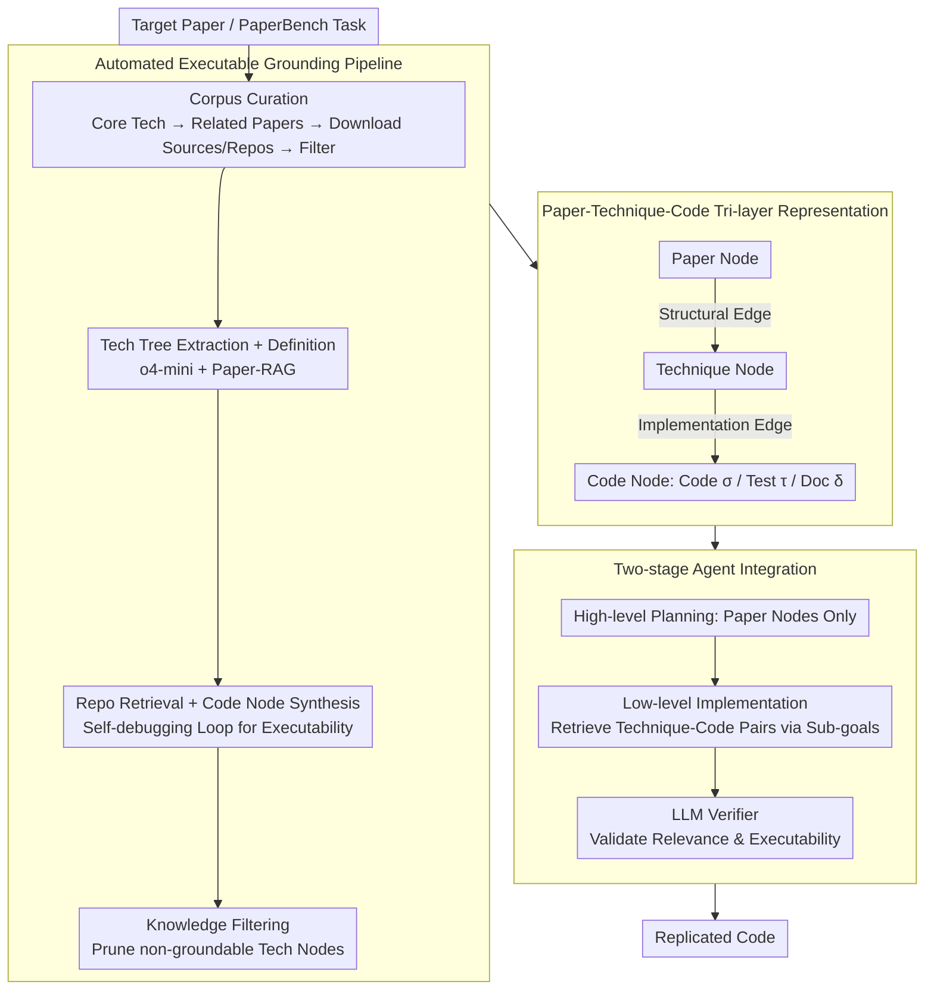

# What Makes AI Research Replicable? Executable Knowledge Graphs as Scientific Knowledge Representations

**Conference**: ACL2026  
**arXiv**: [2510.17795](https://arxiv.org/abs/2510.17795)  
**Code**: https://github.com/zjunlp/xKG  
**Area**: Graph Learning  
**Keywords**: Executable Knowledge Graphs, Paper Replication, Code Retrieval, Research Agent, PaperBench

## TL;DR
This paper proposes Executable Knowledge Graphs (xKG), which organize technical concepts and executable code snippets from papers into a tri-layer structure (Paper-Technique-Code). Served as a plug-and-play knowledge base, xKG assists research replication agents, leading to a replication score improvement of up to 10.90 percentage points on the PaperBench Code-Dev task across different agents.

## Background & Motivation
**Background**: LLM agents are increasingly utilized to automate scientific research tasks, such as paper reading, code writing, experiment replication, and method extension. Benchmarks like PaperBench, MLE-Bench, and LMR-Bench evaluate whether agents can effectively translate methodologies from papers into actual code implementations.

**Limitations of Prior Work**: Replicating AI papers is challenging not merely due to paper length, but because critical knowledge is fragmented across the main text, appendices, cited works, official codebases, configurations, and implementation details. Conventional RAG can retrieve text fragments but struggles to map a "technical concept" to its corresponding executable code. Relying solely on the paper often ignores hidden implementation details, while looking only at the repository makes it difficult to understand the conceptual structure behind the code.

**Key Challenge**: Scientific replication requires "executable scientific knowledge," yet most existing knowledge representations remain at the level of text, summaries, or coarse-grained concepts. Agents typically get stuck on low-level implementation details: how to write loss functions, how to assemble modules, how to configure hyperparameters, and how to call code interfaces. If a knowledge base cannot bridge concepts and executable code, it provides only vague background information rather than supporting repo-level implementation.

**Goal**: The authors aim to construct a paper-centric, automatically updatable, and pluggable knowledge base for various agent frameworks. It provides both high-level methodological structures and low-level executable references during coding, thereby enhancing the reliability of AI research replication.

**Key Insight**: The paper extends "scientific knowledge" from traditional textual knowledge graphs to Executable Knowledge Graphs. Nodes in the graph are not just concepts but include verified code units; edges represent not only semantic relations but also technical structural dependencies and implementation mappings from concepts to code.

**Core Idea**: Decompose a paper into reusable technical nodes and ground each node to a rewritten, debugged, and verified Code Node. This allows research agents to view the methodological structure during the planning phase and retrieve executable code during the implementation phase.

## Method
xKG is a hierarchical knowledge graph oriented towards AI paper replication. it encompasses structured graph representations, an automated construction pipeline, and agent integration methods. The system centers on a target paper: it identifies related papers and official repositories, extracts technical concepts and code implementations, and integrates this knowledge into replication agents as tools or modules.

### Overall Architecture
The formal representation of xKG is $xKG=(N,E)$. The node set $N$ consists of three categories: Paper Nodes, Technique Nodes, and Code Nodes. The edge set $E$ includes Structural Edges and Implementation Edges. A Paper Node represents a paper with its metadata and associated technique/code nodes; a Technique Node represents a self-contained scholarly concept or method component; a Code Node represents an executable unit containing implementation code, test scripts, and documentation.

The construction pipeline consists of two main stages. The first is paper-aware corpus curation: identifying core techniques for a target PaperBench task, selecting highly relevant cited papers and web search results, downloading arXiv sources and official GitHub repositories, and filtering out papers without official implementations. The second is hierarchical KG construction: extracting technical trees from papers, retrieving code snippets from repositories, generating and verifying Code Nodes, and pruning technical nodes that cannot be grounded to code. The constructed xKG is then integrated into replication agents via a two-stage process: providing only method skeletons during planning and retrieving executable code during implementation.

### Key Designs

**1. Paper-Technique-Code Tri-layer Representation: Explicit Alignment of "What the paper says" and "How the code implements it"**

Standard RAG returns stacks of text or code fragments, leaving the agent to determine which fragments belong to the methodology and which are actually executable. The tri-layer structure offloads this burden: Paper Nodes store metadata and collections of technique/code nodes; Technique Nodes store self-contained definitions (representing either entire frameworks or reusable modules); Code Nodes store a triplet of implementation $\sigma$, test script $\tau$, and documentation $\delta$.

Nodes are connected via two types of edges: Structural Edges express architectural dependencies (which module is built upon another), while Implementation Edges link technical nodes to corresponding code. Consequently, agents can traverse Structural Edges to understand method skeletons during planning and follow Implementation Edges to retrieve executable implementations during coding, eliminating the need to reassemble fragmented pieces.

**2. Automated Executable Grounding Pipeline: Using "Executability" as a Quality Filter**

Extracting from papers alone often yields over-granular, hallucinated, or non-implementable concepts. Thus, xKG does not settle for a text-only graph. It uses o4-mini to extract technical trees and Paper-RAG to supplement definitions. Subsequently, using definitions as queries, relevant code snippets are retrieved from official repositories via embeddings. o4-mini then synthesizes these into Code Nodes, which undergo a self-debugging loop to ensure they are runnable.

A crucial step is knowledge filtering: any technical node that cannot be grounded to code is pruned. In other words, "executability" serves as a hard threshold for knowledge quality—ensuring remaining technical nodes correspond to functional code. This process improves the executability rate of Code Nodes from approximately 52% to 100% after self-debugging.

**3. Two-stage Agent Integration: Skeletons During Planning, Code During Implementation**

Replication tasks involve two distinct difficulties: understanding the method structure and writing functionally correct code. xKG exposes knowledge in two phases corresponding to these needs. During high-level planning, agents are provided only with the Paper Node of the target paper, deliberately withholding Code Nodes to prevent agents from being overwhelmed by implementation details too early. During low-level implementation, agents retrieve relevant Technique-Code pairs based on current sub-goals.

Retrieved results pass through an LLM verifier to ensure the pairs are both technically relevant and implementable. This "skeleton first, flesh later" approach prevents the accumulation of excessive code during planning and the absence of implementation details during coding.

### Loss & Training
This work does not propose a new neural training loss but focuses on constructing the knowledge graph as a pluggable module. Model calls are primarily for technical extraction, code modularization, self-debugging, and the verifier. The retrieval side utilizes `text-embedding-3-small` and `all-MiniLM-L6-v2` for similarity calculations, with key thresholds set at `technique_similarity=0.6` and `paper_similarity=0.6`.

## Key Experimental Results

### Main Results
The authors evaluate xKG on the PaperBench Code-Dev lite subset, focusing on the code development portion of paper replication. Scores are evaluated by o3-mini based on a hierarchical rubric. xKG is integrated into BasicAgent, IterativeAgent, and PaperCoder, using both o3-mini and DeepSeek-R1 backbones.

| Agent | Backbone | Vanilla Avg. | +xKG Avg. | Gain |
|-------|----------|----------------|-------------|------|
| BasicAgent | o3-mini | 17.89 | 24.57 | +6.68 |
| BasicAgent | DeepSeek-R1 | 27.89 | 31.62 | +3.73 |
| IterativeAgent | o3-mini | 24.60 | 31.91 | +7.31 |
| IterativeAgent | DeepSeek-R1 | 27.02 | 35.22 | +8.20 |
| PaperCoder | o3-mini | 42.31 | 53.21 | +10.90 |
| PaperCoder | DeepSeek-R1 | 52.23 | 60.34 | +8.11 |

As shown, xKG benefits both simple ReAct agents and more advanced frameworks like PaperCoder, demonstrating that it is not tied to a specific framework. The highest gain (+10.90) is observed with PaperCoder + o3-mini, indicating that stronger agents can better convert structured, executable knowledge into complete implementations.

| Target Paper / Task | BasicAgent o3-mini | + xKG | Typical Observation |
|-----------------|--------------------|-------|----------|
| MU-DPO | 12.96 | 37.22 | Significant gain; high reusability of tech/code |
| TTA-FP | 22.63 | 27.26 | Moderate gain; structural knowledge is helpful |
| One-SBI | 18.24 | 20.82 | Minor gain; unique structures are hard to transfer |
| FRE | 14.82 | 14.67 | Slight drop; retrieved knowledge may interfere |
| Average | 17.89 | 24.57 | Overall +6.68 |

### Ablation Study
Ablations on node types were conducted using PaperCoder + o3-mini to identify which nodes are most critical.

| Configuration | Replication Score | Drop | Explanation |
|------|-------------------|------|------|
| xKG Full | 53.21 | - | Full graph |
| w/o Paper Node | 51.08 | 2.13 | Planning quality drops without the target paper structure |
| w/o Code Node | 48.65 | 4.56 | Largest drop; executable code is the core contributor |
| w/o Technique Node | 52.16 | 1.05 | Minor impact; tech info partially covered by Code Nodes |

The authors also analyzed xKG quality and scalability. While automated extraction is not perfect, the overall quality effectively supports agents.

| Analysis Item | Value | Meaning |
|--------|------|------|
| Technique valid rate | 89.44% | Most tech nodes are self-contained concepts |
| Code valid rate | 100.00% | Code Nodes are executable after self-debugging |
| Tech-Code pair match | 74.51% | About a quarter of pairs are still imprecise |
| Initial Code Node validity | 52.38% | Insufficient executability before self-debugging |
| Avg. Construction Cost | ~$0.7344 / paper | Costs mainly from modularization and debugging |

### Key Findings
- Code Nodes are the most critical components. Removing them leads to a 4.56-point drop, significantly more than removing Paper or Technique Nodes, suggesting that the bottleneck in replication lies in "executable implementation" rather than just understanding concepts.
- xKG is more effective for analytical or compositional papers (e.g., MU-DPO), which are built upon reusable techniques, compared to papers with entirely new architectures (e.g., One-SBI).
- xKG is self-evolving. Extending to 56 related papers improved tasks like `bridging-data-gaps` from 11.55 to 44.64, indicating that the closer the knowledge base is to the target paper, the higher the returns.

## Highlights & Insights
- The definition of "Executable Knowledge Graph" addresses a genuine pain point for research agents. Replication is not a QA task; it is about transforming abstract methods into functional code, requiring implementation units in the knowledge representation.
- The knowledge filtering step is vital: only technique nodes that ground to code are retained. While this sacrifices some theoretical completeness, it ensures higher utility and fewer hallucinated nodes.
- Withholding Code Nodes during high-level planning and retrieving them during low-level implementation is a robust agent memory design principle. It prevents interference from code details during planning and ensures implementation isn't left with only abstract concepts.
- Case studies indicate xKG moves agents from "building empty shells" to "writing substantive modules," providing better interpretability than final scores alone.

## Limitations & Future Work
- Evaluation costs on PaperBench are high; due to budget constraints, the full PaperBench was not used, and large-scale cross-domain stress testing is limited.
- xKG relies on existing related papers and official code. For entirely new fields, closed-source methods, or papers without reliable repositories, it is difficult to construct useful Code Nodes.
- Code retrieval and rewriting might still package irrelevant code attractively, potentially misleading agents. While the verifier mitigates this, the 74.51% Tech-Code pair match rate indicates ongoing risk.
- Current work focuses on offline construction. Future directions include online updates, failure feedback loops to the graph, and execution-driven graph corrections.

## Related Work & Insights
- **vs. Standard RAG**: RAG retrieves text or code snippets, whereas xKG explicitly graphs paper structures, technical concepts, and implementations, filtering knowledge by executability.
- **vs. Research Agents (AutoMind, AI-Researcher)**: Those systems focus on the agent workflow; xKG acts as a pluggable knowledge foundation for various agent frameworks.
- **vs. Paper2Code / AutoReproduce**: These works generate code directly from a single paper. xKG emphasizes reusing executable knowledge from related papers and official repositories to reduce the difficulty of zero-shot implementation.
- **vs. ExeKG**: Similar in name, but different in problem domain. Earlier ExeKG focused on transparent data analysis or monitoring; this xKG targets AI research replication with a lightweight Paper-Technique-Code structure.

## Rating
- Novelty: ⭐⭐⭐⭐☆ Extending KG nodes to executable code for research replication is clear and well-aligned with agent needs.
- Experimental Thoroughness: ⭐⭐⭐⭐☆ Covers multiple agents/backbones, node ablations, and quality analysis, though full PaperBench and broader domain validation are limited.
- Writing Quality: ⭐⭐⭐⭐☆ The methodological structure is easy to follow, and tables are information-dense; some implementation details require cross-referencing with the appendix.
- Value: ⭐⭐⭐⭐⭐ High reference value for automated research replication, paper-to-code, code RAG, and agent memory design.

<!-- RELATED:START -->

## Related Papers

- [\[ICLR 2026\] Towards Improved Sentence Representations using Token Graphs](../../ICLR2026/graph_learning/towards_improved_sentence_representations_using_token_graphs.md)
- [\[ICML 2026\] What Structural Inductive Bias Helps Transformers Reason Over Knowledge Graphs? A Study with Tabula RASA](../../ICML2026/graph_learning/what_structural_inductive_bias_helps_transformers_reason_over_knowledge_graphs_a.md)
- [\[ACL 2026\] STEM: Structure-Tracing Evidence Mining for Knowledge Graphs-Driven Retrieval-Augmented Generation](stem_structure-tracing_evidence_mining_for_knowledge_graphs-driven_retrieval-aug.md)
- [\[ACL 2026\] CoG: Controllable Graph Reasoning via Relational Blueprints and Failure-Aware Refinement over Knowledge Graphs](cog_controllable_graph_reasoning_via_relational_blueprints_and_failure-aware_ref.md)
- [\[ICLR 2026\] Explore-on-Graph: Incentivizing Autonomous Exploration of LLMs on Knowledge Graphs](../../ICLR2026/graph_learning/explore-on-graph_incentivizing_autonomous_exploration_of_large_language_models_o.md)

<!-- RELATED:END -->
