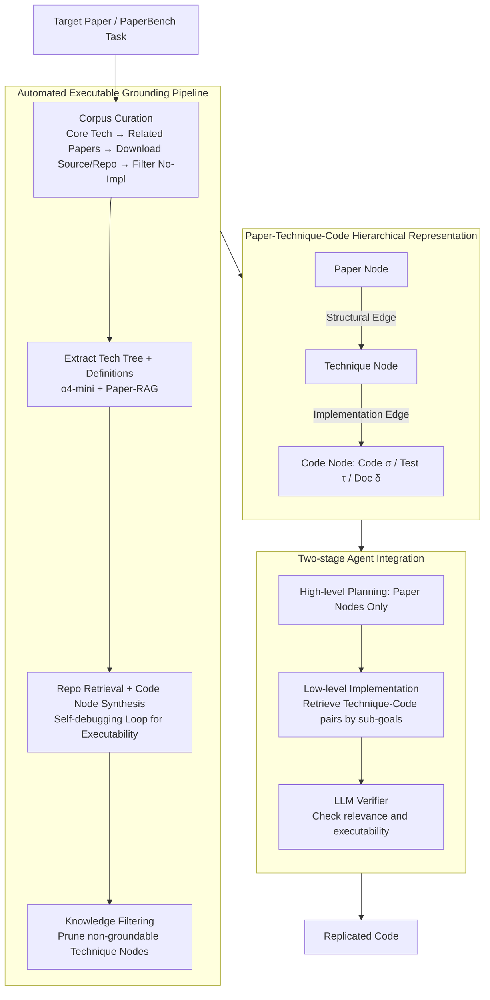

# What Makes AI Research Replicable? Executable Knowledge Graphs as Scientific Knowledge Representations

**Conference**: ACL2026  
**arXiv**: [2510.17795](https://arxiv.org/abs/2510.17795)  
**Code**: https://github.com/zjunlp/xKG  
**Area**: Graph Learning  
**Keywords**: Executable Knowledge Graph, Paper Replication, Code Retrieval, Research Agent, PaperBench

## TL;DR
This paper proposes Executable Knowledge Graphs (xKG), which organize technical concepts and runnable code snippets from papers into a three-layer Paper-Technique-Code graph structure. Serving as a plug-and-play knowledge base for research replication agents, it achieves a replication score improvement of up to 10.90 percentage points on the PaperBench Code-Dev task across various agents.

## Background & Motivation
**Background**: LLM agents have begun to be utilized for automating research tasks, such as reading papers, writing code, replicating experiments, and extending existing methods. Benchmarks like PaperBench, MLE-Bench, and LMR-Bench are evaluating whether agents can truly transform methods described in papers into code implementations.

**Limitations of Prior Work**: Replicating AI papers is difficult not just because papers are long, but because key knowledge is scattered across the main text, appendices, cited papers, official code repositories, configuration files, and implementation details. General RAG can retrieve text fragments but struggles to identify which "technical concept" corresponds to which specific executable code segment. Reading only the paper leads to missing hidden implementation details, while looking only at the repository makes it difficult to understand the methodological structure behind the code.

**Key Challenge**: Research replication requires "executable scientific knowledge," whereas most existing knowledge representations remain at the level of text, summaries, or coarse-grained concepts. Agents are typically stuck on low-level implementation: how to write loss functions, how to assemble modules, how to configure hyperparameters, and how to call code APIs. If the knowledge base cannot connect concepts with executable code, it can only provide generic background and fails to support repo-level implementation.

**Goal**: The authors aim to construct a paper-centric, automatically updatable, and plug-and-play knowledge base for different agent frameworks. It provides agents with high-level methodological structures and low-level executable references during coding, thereby enhancing the reliability of AI research replication.

**Key Insight**: The paper extends "scientific knowledge" from traditional textual knowledge graphs to Executable Knowledge Graphs. Nodes in the graph are not just concepts but include verified code units; edges are not just semantic relations but encompass technical structural dependencies and implementation relationships from concepts to code.

**Core Idea**: Decompose papers into reusable technique nodes and ground each technique node to a rewritten, debugged, and verified Code Node. This allows research agents to view the method structure during the planning stage and retrieve runnable code during the implementation stage.

## Method
xKG is a hierarchical knowledge graph oriented towards AI paper replication. It features a structured graph representation, an automated construction pipeline, and a method for agent integration. The system centers on a target paper: it first identifies related papers and official repositories, extracts technical concepts and code implementations, and finally integrates this knowledge as tools or modules into replication agents.

### Overall Architecture
The formal representation of xKG is $xKG=(N,E)$. The node set $N$ is divided into three categories: Paper Nodes, Technique Nodes, and Code Nodes; the edge set $E$ is divided into Structural Edges and Implementation Edges. A Paper Node represents a paper along with its metadata, technique nodes, and code nodes. A Technique Node represents a self-contained academic concept or method component. A Code Node represents an executable unit containing implementation code, test scripts, and documentation.

The construction pipeline consists of two main parts. The first is paper-aware corpus curation: identifying core technologies around target PaperBench tasks, selecting highly relevant cited papers and web search results, downloading arXiv sources and official GitHub repositories, and filtering papers without official implementations. The second is hierarchical KG construction: extracting technique trees from papers, retrieving code snippets from repositories, generating and verifying Code Nodes, and pruning technique nodes that cannot be grounded to code. The constructed xKG is then integrated into replication agents via a two-stage approach: the planning stage accesses only the method skeleton, while the implementation stage retrieves runnable code.

### Key Designs

**1. Paper-Technique-Code Three-layer Representation: Explicit Alignment of "What the paper says" and "How the code implements it"**

Ordinary RAG returns a collection of text or code fragments, leaving the agent to judge which fragments belong to the method structure and which code actually runs. The three-layer representation removes this burden: Paper Nodes store paper metadata and their associated technique/code nodes; Technique Nodes store self-contained method definitions and optional sub-techniques, representing both entire frameworks and reusable modules; Code Nodes store the implementation triad: code $\sigma$, test script $\tau$, and documentation $\delta$.

Nodes are connected by two types of edges: Structural Edges express architectural dependencies between technique nodes (which module is built upon another), and Implementation Edges link technique nodes to corresponding code. Consequently, agents can follow Structural Edges to read the method skeleton during planning and follow Implementation Edges to obtain runnable implementations during coding, eliminating the need to reassemble fragmented snippets.

**2. Automated Executable Grounding Pipeline: Executability as a Knowledge Quality Filter**

Extracting from papers alone easily produces concepts that are too granular, hallucinated, or fundamentally unimplementable. Therefore, xKG is not satisfied with converting papers into pure text graphs. During construction, o4-mini is first used to extract the technique tree, and Paper-RAG supplements each technique node with definitions. Then, using technical definitions as queries, relevant code snippets are retrieved from the official repo via embedding search. These are handed to o4-mini to synthesize Code Nodes, each of which undergoes a self-debugging loop to ensure it is executable.

A crucial step is knowledge filtering: if a technique node cannot be grounded to code, it is directly pruned. In other words, "executability" is treated as a hard threshold for knowledge quality—every remaining technique node corresponds to at least one piece of functional code. This is why the executability rate of Code Nodes increases from approximately 52% to 100% after self-debugging.

**3. Two-stage Agent Integration: Providing Method Skeletons for Planning and Code for Encoding**

Replication tasks involve two difficulties that occur at different stages: first understanding the method structure, then writing functionally correct code. xKG exposes knowledge in two steps following this cadence. During high-level planning, the agent only receives Paper Nodes of the target paper, deliberately withholding Code Nodes to prevent the agent from being overwhelmed by implementation details at the start. In the low-level implementation stage, the agent retrieves relevant Technique-Code pairs based on the current sub-goal.

The retrieval results finally pass through an LLM verifier to ensure the returned pairs are both technically relevant and actually implementable. This "skeleton first, flesh later" exposure sequence prevents the planning stage from being cluttered with code while ensuring the implementation stage is not left with only abstract concepts.

### Loss & Training
This paper does not propose new neural training losses but constructs a knowledge graph and integrates it as a plug-and-play module for agents. Model calls are primarily used for technique extraction, code modularization, self-debugging, and verification. Retrieval uses text-embedding-3-small and all-MiniLM-L6-v2 for similarity calculations, with key thresholds including technique_similarity=0.6 and paper_similarity=0.6.

## Key Experimental Results

### Main Results
The authors evaluated xKG on the PaperBench Code-Dev lite subset, where the task is to develop code based on a paper. Scores were assessed by o3-mini using a hierarchical rubric. xKG was integrated into BasicAgent, IterativeAgent, and PaperCoder, using o3-mini and DeepSeek-R1 as backbones.

| Agent | Backbone | Vanilla Avg | +xKG Avg | Gain |
|-------|----------|-------------|----------|------|
| BasicAgent | o3-mini | 17.89 | 24.57 | +6.68 |
| BasicAgent | DeepSeek-R1 | 27.89 | 31.62 | +3.73 |
| IterativeAgent | o3-mini | 24.60 | 31.91 | +7.31 |
| IterativeAgent | DeepSeek-R1 | 27.02 | 35.22 | +8.20 |
| PaperCoder | o3-mini | 42.31 | 53.21 | +10.90 |
| PaperCoder | DeepSeek-R1 | 52.23 | 60.34 | +8.11 |

As shown in the table, xKG benefits both simple ReAct agents and the stronger PaperCoder, indicating it is not tied to a specific framework. The largest gain was observed for PaperCoder + o3-mini (from 42.31 to 53.21), suggesting that strong agents can better translate structured executable knowledge into more complete implementations.

| Target Paper / Task | BasicAgent o3-mini | + xKG | Observations |
|---------------------|--------------------|-------|--------------|
| MU-DPO | 12.96 | 37.22 | Large gain; high reusability of related tech/code |
| TTA-FP | 22.63 | 27.26 | Moderate gain; structural knowledge is helpful |
| One-SBI | 18.24 | 20.82 | Small gain; innovative structures harder to migrate |
| FRE | 14.82 | 14.67 | Slight drop; retrieved knowledge may interfere |
| **Average** | **17.89** | **24.57** | **Overall +6.68** |

### Ablation Study
The node type ablation was conducted on PaperCoder + o3-mini to test the importance of Paper Nodes, Technique Nodes, and Code Nodes.

| Configuration | Replication Score | Drop | Description |
|---------------|-------------------|------|-------------|
| xKG Full | 53.21 | - | Complete graph |
| w/o Paper Node | 51.08 | 2.13 | Planning quality drops without target paper structure |
| w/o Code Node | 48.65 | 4.56 | Largest degradation; code is the core profit source |
| w/o Technique Node | 52.16 | 1.05 | Small impact; some tech info is implicit in Code Nodes |

The authors also analyzed xKG quality and scalability. While automated nodes and pairs are not perfect, the overall quality is sufficient for agents.

| Analysis Item | Value | Significance |
|---------------|-------|--------------|
| Technique valid rate | 89.44% | Most tech nodes are self-contained concepts |
| Code valid rate | 100.00% | Code Nodes are executable after self-debugging |
| Tech-Code pair match| 74.51% | About 1/4 of pairings are not precise enough |
| Initial Code validity| 52.38% | Insufficient executability before self-debugging |
| Avg Build Cost | ~$0.7344 / paper| Mostly from code modularization and debugging |

### Key Findings
- **Code Nodes are the most critical component**. Removing Code Nodes leads to a 4.56-point drop, which is significantly larger than removing Paper or Technique Nodes, indicating that replication bottlenecks lie in "executable implementation" rather than just conceptual understanding.
- **xKG is more effective for analytical or combinatorial papers** (e.g., MU-DPO) built on reusable technologies. It provides less help for papers with entirely new architectures (e.g., One-SBI).
- **xKG can self-evolve**. Expanding to 56 related papers improved the bridging-data-gaps task from 11.55 to 44.64 and sample-specific-masks from 24.09 to 42.47, showing that gains increase as the knowledge base becomes more relevant to the target paper.

## Highlights & Insights
- The definition of "Executable Knowledge Graph" addresses a real pain point in research agents. Replication is not a Q&A task on paper content but the transformation of abstract methods into runnable code; thus, knowledge representation must include implementation units.
- The knowledge filtering step is crucial: only technique nodes that can be grounded to code are retained. This sacrifices some theoretical completeness for higher utility and fewer hallucinated nodes.
- The design principle of hiding Code Nodes during high-level planning and retrieving them during low-level implementation is excellent for agent memory design. It prevents agents from being distracted by code details during planning and ensures they don't lack concrete implementations during the coding phase.
- Case studies show xKG can push agents from "building empty skeletons" to "writing substantial modules," which is more explanatory than simple score improvements.

## Limitations & Future Work
- The evaluation cost for PaperBench lite remains high; the paper was limited by budget from running the full PaperBench or large-scale cross-domain stress tests.
- xKG relies on existing related papers and official code in the target field. For very new areas, closed-source methods, or papers without reliable repositories, it is difficult to construct useful Code Nodes.
- Code retrieval and rewriting might still "beautify" semantically similar but technically irrelevant code, thereby misleading agents. While the LLM verifier mitigates this, the 74.51% Tech-Code pair match rate indicates this remains a core risk.
- Currently, the graph is mainly constructed offline. Future work could consider online updates, writing failure feedback back into the graph, and execution-result-driven graph correction.

## Related Work & Insights
- **vs. General RAG**: RAG retrieves text or code fragments, whereas xKG explicitly graphs paper structures, technical concepts, and code implementations, filtering knowledge via executability.
- **vs. Research Agents (AutoMind, AI-Researcher)**: These systems focus on agent workflows. xKG acts as a plug-and-play knowledge foundation available to different agent frameworks.
- **vs. Paper-to-Code Generators (Paper2Code, AutoReproduce)**: While those generate code directly from target papers, xKG emphasizes reusing executable knowledge from related papers and official repositories to reduce the difficulty of implementation from scratch.
- **vs. ExeKG**: Despite similar names, they address different problems. Early ExeKG was for transparent data analysis or monitoring; this xKG is for AI paper replication using a lighter Paper-Technique-Code structure.

## Rating
- Novelty: ⭐⭐⭐⭐☆ Extending KG nodes to executable code for research replication is clear and meets agent needs.
- Experimental Thoroughness: ⭐⭐⭐⭐☆ Covers multiple agents/backbones, node ablations, and quality analysis, though full PaperBench and broader domain validation are limited.
- Writing Quality: ⭐⭐⭐⭐☆ Methodological structure is easy to understand, and experimental tables are information-dense; some implementation details are scattered in appendices.
- Value: ⭐⭐⭐⭐⭐ High reference value for automated research replication, paper-to-code, code RAG, and agent memory design.

<!-- RELATED:START -->

## Related Papers

- [\[ICML 2026\] What Makes a Desired Graph for Relational Deep Learning?](../../ICML2026/graph_learning/what_makes_a_desired_graph_for_relational_deep_learning.md)
- [\[ICML 2026\] What Structural Inductive Bias Helps Transformers Reason Over Knowledge Graphs? A Study with Tabula RASA](../../ICML2026/graph_learning/what_structural_inductive_bias_helps_transformers_reason_over_knowledge_graphs_a.md)
- [\[ICLR 2026\] Towards Improved Sentence Representations using Token Graphs](../../ICLR2026/graph_learning/towards_improved_sentence_representations_using_token_graphs.md)
- [\[ACL 2026\] STEM: Structure-Tracing Evidence Mining for Knowledge Graphs-Driven Retrieval-Augmented Generation](stem_structure-tracing_evidence_mining_for_knowledge_graphs-driven_retrieval-aug.md)
- [\[ACL 2026\] CoG: Controllable Graph Reasoning via Relational Blueprints and Failure-Aware Refinement over Knowledge Graphs](cog_controllable_graph_reasoning_via_relational_blueprints_and_failure-aware_ref.md)

<!-- RELATED:END -->
