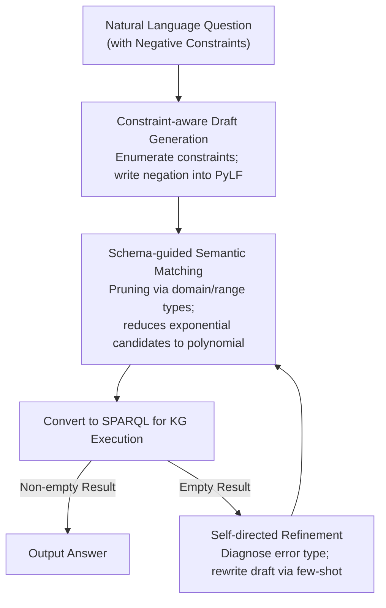

# Which bird does not have wings: Negative-constrained KGQA with Schema-guided Semantic Matching and Self-directed Refinement

**Conference**: ACL 2026 Findings  
**arXiv**: [2604.14749](https://arxiv.org/abs/2604.14749)  
**Code**: [https://github.com/midannii/CUCKOO](https://github.com/midannii/CUCKOO)  
**Area**: Graph Learning / Knowledge Graph Question Answering  
**Keywords**: Knowledge Graph Question Answering (KGQA), Negative Constraints, Semantic Parsing, Logical Form, Schema-guided

## TL;DR

This paper proposes the new Negative-constrained KGQA (NEST KGQA) task and the NestKGQA dataset. It designs PyLF, a Python-formatted logical form to clearly express negative constraints, and introduces the CUCKOO framework. By incorporating constraint-aware draft generation, schema-guided semantic matching, and self-directed refinement, the framework achieves efficient and precise answering of multi-constraint questions in few-shot settings.

## Background & Motivation

**Background**: Knowledge Graph Question Answering (KGQA) is a critical direction for reducing LLM hallucinations by leveraging external knowledge. Semantic Parsing (SP) methods map natural language questions into logical forms, which are then converted into SPARQL queries for execution on Knowledge Graphs (KGs), offering advantages in interpretability and faithfulness.

**Limitations of Prior Work**: Existing KGQA benchmarks and methods are heavily biased toward positive and computational constraints, neglecting negative constraints. Although some datasets contain negation words like "not," they often represent comparison operations. Furthermore, LLMs are inherently fragile in negation reasoning, and existing logical forms (e.g., s-expressions) struggle to express negative semantics clearly.

**Key Challenge**: Negative constraints appear frequently in real-world queries but lack specialized benchmarks and methods. Additionally, negative constraint questions naturally involve multiple constraints, significantly increasing semantic complexity and elevating the risk of generating non-executable queries.

**Goal**: (1) Define the NEST KGQA task and construct the NestKGQA dataset; (2) Design a logical form, PyLF, that explicitly expresses negation; (3) Build an efficient framework capable of handling multi-constraint negative questions.

**Key Insight**: The authors observe that semantic matching in existing SP methods uses brute-force search without considering KG schema semantics, leading to an exponential growth in candidate logical forms. Pruning candidates using KG schema constraints can improve both efficiency and accuracy.

**Core Idea**: The framework uses constraint-aware draft generation to explicitly enumerate constraint elements, followed by schema-guided semantic matching to anchor the draft to the KG. Finally, self-directed refinement is triggered only when execution results are empty, achieving low-cost and robust negative-constrained QA.

## Method

### Overall Architecture

CUCKOO follows a two-stage semantic parsing paradigm of "generation-then-matching" to accurately translate natural language questions with multiple negative constraints into executable KG queries. Given an input question, the Constraint-aware Draft Generation module explicitly enumerates constraint elements and writes a PyLF draft. The Schema-guided Semantic Matching module then anchors entity and relation mentions in the draft to specific KG entries. Finally, if the execution result is empty (indicating an error in draft format or semantics), the Self-directed Refinement module is triggered to rewrite the draft. This pipeline decomposes the high semantic complexity of negative constraints through layered pruning and anchoring.

### Key Designs

**1. PyLF: Encoding Negation via a Boolean Parameter**

Existing logical forms struggle with negation: $\lambda$-calculus is hard to read, while s-expressions lack the syntax for "not having an attribute." PyLF addresses this by using Python syntax as a minimal extension: adding a boolean parameter `neg` to the `JOIN` function (e.g., `JOIN('producing', 'Saturn', neg=True)` for "not producing Saturn") and using an `R_` prefix to distinguish between head and tail entity queries. Using Python as the base leverages the LLM's vast pre-training on code, reducing syntax errors and increasing execution success rates.

**2. Schema-guided Semantic Matching: Compressing Exponential Search to Polynomial**

Draft entity and relation mentions must be anchored to KG entries. Traditional brute-force matching for $n$ entities and $m$ relations results in $K_e^n \cdot K_r^m$ combinations, which explodes with multiple constraints. This design starts from the subject entity in the `START` function, retrieves candidate entities and their types via cosine similarity, and then only extracts schema-level triples containing these types. By propagating type information through domain/range constraints and applying a similarity threshold $\theta$, the candidate space is shrunk from $K_e^n \cdot K_r^m$ to a minimal scale (e.g., $1 \times 2 \times 2 = 4$), benefiting both efficiency and accuracy.

**3. Self-directed Refinement: On-demand Error Correction**

Drafts occasionally fail due to missing constraints or syntax errors. Instead of multi-round refinement for every question, CUCKOO triggers refinement only when a SPARQL query returns an empty set. It diagnoses the error (e.g., missing constraints, format errors) and uses specific few-shot examples to guide the LLM in rewriting the draft. This self-contained, single-round correction avoids external feedback loops and extra fine-tuning, reducing cost and latency.

### Loss & Training

CUCKOO is a training-free framework based on in-context learning. Draft generation uses GPT-3.5-turbo as the backbone LLM, with top-$k$ similar examples retrieved via SimCSE embeddings for few-shot prompts. The number of candidate generations is set to 1 or 6, with the final prediction determined by majority voting.

## Key Experimental Results

### Main Results

| Dataset | Metric | CUCKOO(6) | KB-Coder(6) | KB-BINDER(6) |
|--------|------|-----------|-------------|--------------|
| GrailQA (Overall) | EM/F1 | **62.1/64.2** | 51.2/56.3 | 52.5/54.5 |
| GrailQA (Zero-shot) | EM/F1 | **57.5/59.8** | 46.7/51.6 | 45.9/48.6 |
| NestKGQA | F1 | **26.2** | 24.4 | 4.6 |
| GraphQ | F1 | **40.8** | 35.8 | 32.7 |

### Ablation Study

| Configuration | GrailQA F1 | NestKGQA F1 | Note |
|------|-----------|-------------|------|
| CUCKOO Full Model | 64.2 | 26.2 | Full model |
| w/o Self-directed Refinement | 63.2 | 25.8 | Refinement contributes ~1 point |
| w/o Constraint Elements | 61.3 | 24.4 | Explicit decomposition is helpful |
| w/o Schema-guided Matching | 56.6 | 16.3 | Core module; significant performance drop |

### Key Findings

- Schema-guided matching is the most critical module; removing it drops F1 by 7.6 points on GrailQA and nearly 10 points on NestKGQA.
- CUCKOO shows the strongest advantage in multi-constraint problems (3 constraints), reaching the highest EM.
- In superlative questions, the performance improved dramatically from 3.1 to 53.1.
- All zero-shot LLMs perform much worse on NestKGQA than traditional KGQA, proving that negative constraint reasoning is indeed challenging.
- CPU memory usage is 4.7% lower than KB-Coder, though inference time increased by approximately 1.6x.

## Highlights & Insights

- PyLF effectively solves the long-standing difficulty of expressing negative constraints by simply adding a `neg` parameter to the `JOIN` function. This "minimal modification" approach—extending existing frameworks rather than inventing entirely new ones—is highly effective.
- Schema-guided matching uses the KG type system for pruning, transforming an exponential search space into a polynomial one. This logic is transferable to any scenario involving generation and verification over structured knowledge.
- The "on-demand" trigger for self-directed refinement is an elegant engineering choice that avoids unnecessary LLM calls.

## Limitations & Future Work

- The method assumes a closed-world hypothesis, which may limit applicability in open-world scenarios.
- The NestKGQA dataset is relatively small as it was extended from existing benchmarks.
- It assumes a complete KG schema is available; incomplete schemas might require additional extraction models.
- Performance relies on the backbone LLM; future work could explore model-agnostic strategies.

## Related Work & Insights

- **vs KB-BINDER**: KB-BINDER uses s-expressions which cannot easily express negation and relies on brute-force matching. CUCKOO surpasses it via PyLF and schema-guided matching.
- **vs KB-Coder**: While KB-Coder uses a Python-formatted logical form, it lacks explicit negation handling and constraint decomposition. It performs well in I.I.D. settings by mimicking examples but falls short of CUCKOO in compositional generalization and negation scenarios.

## Rating

- Novelty: ⭐⭐⭐⭐ Systematically defines the negative-constrained KGQA task; PyLF is simple yet effective.
- Experimental Thoroughness: ⭐⭐⭐⭐ Extensive benchmarks and ablations, though the NestKGQA dataset is small.
- Writing Quality: ⭐⭐⭐⭐ Clear structure and intuitive motivating examples.
- Value: ⭐⭐⭐⭐ Fills a gap in negative constraint handling for KGQA; schema-guided matching has general utility.

<!-- RELATED:START -->

## Related Papers

- [\[AAAI 2026\] NOTAM-Evolve: A Knowledge-Guided Self-Evolving Optimization Framework with LLMs for NOTAM Interpretation](../../AAAI2026/graph_learning/notam-evolve_a_knowledge-guided_self-evolving_optimization_framework_with_llms_f.md)
- [\[ACL 2026\] CoG: Controllable Graph Reasoning via Relational Blueprints and Failure-Aware Refinement over Knowledge Graphs](cog_controllable_graph_reasoning_via_relational_blueprints_and_failure-aware_ref.md)
- [\[ACL 2026\] TagRAG: Tag-guided Hierarchical Knowledge Graph Retrieval-Augmented Generation](tagrag_tag-guided_hierarchical_knowledge_graph_retrieval-augmented_generation.md)
- [\[ACL 2026\] GS-Quant: Granular Semantic and Generative Structural Quantization for Knowledge Graph Completion](gs-quant_granular_semantic_and_generative_structural_quantization_for_knowledge_.md)
- [\[ICLR 2026\] Pairwise is Not Enough: Hypergraph Neural Networks for Multi-Agent Pathfinding](../../ICLR2026/graph_learning/pairwise_is_not_enough_hypergraph_neural_networks_for_multi-agent_pathfinding.md)

<!-- RELATED:END -->
