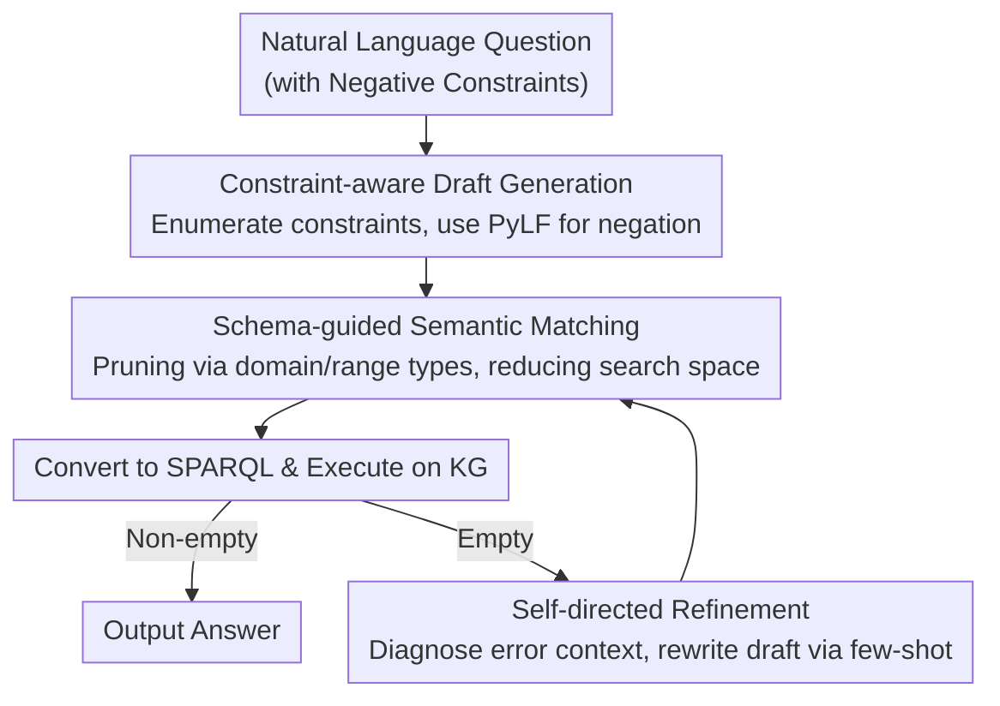

# Which bird does not have wings: Negative-constrained KGQA with Schema-guided Semantic Matching and Self-directed Refinement

**Conference**: ACL 2026 Findings  
**arXiv**: [2604.14749](https://arxiv.org/abs/2604.14749)  
**Code**: [https://github.com/midannii/CUCKOO](https://github.com/midannii/CUCKOO)  
**Area**: Graph Learning / Knowledge Graph Question Answering  
**Keywords**: Knowledge Graph Question Answering, Negative Constraints, Semantic Parsing, Logic Form, Schema-guided

## TL;DR

This paper proposes a new task, Negative-constrained Knowledge Graph Question Answering (NEST KGQA), and the NestKGQA dataset. It introduces PyLF, a Python-formatted logic form to clearly express negative constraints, and the CUCKOO framework. By integrating constraint-aware draft generation, schema-guided semantic matching, and self-directed refinement, the framework achieves efficient and precise answering of multi-constraint questions in a few-shot setting.

## Background & Motivation

**Background**: Knowledge Graph Question Answering (KGQA) is a vital approach for reducing LLM hallucinations by utilizing external knowledge. Semantic Parsing (SP) methods map natural language questions into logic forms, which are then converted into SPARQL queries for execution on KGs, offering advantages in interpretability and faithfulness.

**Limitations of Prior Work**: Existing KGQA benchmarks and methods are heavily biased toward positive and computational constraints, neglecting negative constraints. While some datasets include negation words like "not," they often represent comparison operations. Furthermore, LLMs are inherently fragile in negation reasoning, and existing logic forms (e.g., s-expressions) struggle to express negative semantics clearly.

**Key Challenge**: Negative constraints appear frequently in real-world queries but lack specialized benchmarks and methods. Additionally, negative constraint questions naturally involve multiple constraints, significantly increasing semantic complexity and the risk of generating unexecutable queries.

**Goal**: (1) Define the NEST KGQA task and construct the NestKGQA dataset; (2) design PyLF, a logic form capable of clearly expressing negation; (3) build an efficient framework for processing negative questions with multiple constraints.

**Key Insight**: The authors observe that semantic matching in existing SP methods relies on brute-force search without considering KG schema semantics, leading to an exponential growth in the number of candidate logic forms. By utilizing KG schema constraints for pruning, both efficiency and accuracy can be improved.

**Core Idea**: Use constraint-aware draft generation to explicitly enumerate the constraint elements in the question, followed by schema-guided semantic matching to anchor the draft to the KG. Finally, trigger self-directed refinement only when execution results are empty, achieving low-cost and robust negative-constrained QA.

## Method

### Overall Architecture

CUCKOO follows a "generate-then-match" two-stage semantic parsing paradigm. It aims to translate natural language questions, potentially containing multiple negative constraints, into executable KG queries. Given an input question, the Constraint-aware Draft Generation module enumerates constraint elements and writes a PyLF logic form draft. Subsequently, the Schema-guided Semantic Matching module anchors the entity and relation mentions in the draft to specific KG items, producing executable logic forms converted into SPARQL. Only if the execution returns empty—indicating formatting or semantic errors—is the Self-directed Refinement module invoked to correct and retry. This pipeline decomposes high semantic complexity into manageable layers.

### Key Designs

**1. PyLF: Embedding Negation via a Boolean Parameter**

Existing logic forms struggle with negation: $\lambda$-calculus is expressive but unreadable, while s-expressions are readable but fail to express the absence of attributes. PyLF introduces negation as a minimal extension to Python syntax: a `neg` boolean parameter is added to the `JOIN` function (e.g., `JOIN('producing', 'Saturn', neg=True)` for "not producing Saturn"). It also uses the `R_` prefix to distinguish between head and tail entity queries. Python is chosen as the base because LLMs are pre-trained on vast amounts of code, naturally reducing syntax errors and increasing execution success rates.

**2. Schema-guided Semantic Matching: Pruning Search Space to Polynomial**

Mentions in drafts must be anchored to KG items. Traditional brute-force matching for $n$ entities and $m$ relations leads to $K_e^n \cdot K_r^m$ combinations, which explodes with multiple constraints. This design starts from the subject entity in the `START` function, retrieves candidate entities and their classes via cosine similarity, and extracts only schema-level triples containing those classes. By propagating type information via domain/range constraints and filtering relations with a threshold $\theta$, candidate combinations are reduced from exponential to a very small scale (e.g., $1 \times 2 \times 2 = 4$).

**3. Self-directed Refinement: On-demand Error Correction**

Drafts occasionally fail due to missing constraints or syntax errors. Instead of multi-round correction for every question, CUCKOO triggers refinement only when execution returns an empty set. It diagnoses the error (e.g., missing constraints, format errors) and uses specific few-shot examples to guide the LLM in rewriting the draft. This process is self-contained and avoids the high costs and latency associated with continuous external feedback or fine-tuning.

### Loss & Training

CUCKOO is a training-free framework based on In-Context Learning (ICL). Draft generation uses GPT-3.5-turbo as the backbone. SimCSE embeddings are used to retrieve the top-$k$ similar examples from training data for few-shot demonstrations. The number of candidate generations is set to 1 or 6, with the final prediction determined by majority voting.

## Key Experimental Results

### Main Results

| Dataset | Metric | CUCKOO(6) | KB-Coder(6) | KB-BINDER(6) |
|--------|------|-----------|-------------|--------------|
| GrailQA (Overall) | EM/F1 | **62.1/64.2** | 51.2/56.3 | 52.5/54.5 |
| GrailQA (Zero-shot) | EM/F1 | **57.5/59.8** | 46.7/51.6 | 45.9/48.6 |
| NestKGQA | F1 | **26.2** | 24.4 | 4.6 |
| GraphQ | F1 | **40.8** | 35.8 | 32.7 |

### Ablation Study

| Configuration | GrailQA F1 | NestKGQA F1 | Description |
|------|-----------|-------------|------|
| CUCKOO (Full) | 64.2 | 26.2 | Full model |
| w/o Self-directed Refinement | 63.2 | 25.8 | Refinement adds ~1 point |
| w/o Constraint Elements | 61.3 | 24.4 | Explict decomposition helps |
| w/o Schema-guided Matching | 56.6 | 16.3 | Core module; performance drops sharply |

### Key Findings

- Schema-guided matching is the most critical module; removing it drops GrailQA by 7.6 points and NestKGQA by nearly 10 points.
- CUCKOO's advantage is most pronounced in multi-constraint problems (3 constraints), achieving the highest EM.
- Significant improvements (from 3.1 to 53.1) were achieved in superlative questions.
- Performance of zero-shot LLMs on NestKGQA is far lower than on traditional KGQA, proving the difficulty of negation reasoning.
- CPU memory usage is 4.7% lower than KB-Coder, though inference time increases by approximately 1.6x.

## Highlights & Insights

- PyLF effectively solves the long-standing problem of expressing negative constraints by simply adding a `neg` parameter to the `JOIN` function. This "minimal modification" approach is a valuable alternative to inventing entirely new logic forms.
- Schema-guided matching leverages the KG's type system to prune candidates, converting an exponential search space into a polynomial one. This approach is transferable to any scenario requiring generation and verification over structured knowledge.
- The "trigger only on failure" strategy for self-directed refinement is an elegant engineering choice that avoids unnecessary LLM calls.

## Limitations & Future Work

- Applicability is limited in Open World Assumption (OWA) scenarios as the method relies on the Closed World Assumption.
- The NestKGQA dataset is relatively small, having been expanded from existing benchmarks.
- The method assumes a complete KG schema is available; incomplete schemas would require additional extraction models.
- Performance relies on the backbone LLM's capabilities; future work should explore model-agnostic strategies.

## Related Work & Insights

- **vs. KB-BINDER**: KB-BINDER uses s-expressions which cannot represent negation and relies on brute-force search for matching. CUCKOO outperforms it via PyLF and schema-guided matching.
- **vs. KB-Coder**: KB-Coder uses a Python-based logic form but lacks explicit negation and constraint decomposition. While it performs well in I.I.D. scenarios by mimicking examples, it lags behind CUCKOO in compositional generalization and negation tasks.

## Rating

- Novelty: ⭐⭐⭐⭐ Systematic definition of the Nepatve-constrained KGQA task; PyLF is simple yet effective.
- Experimental Thoroughness: ⭐⭐⭐⭐ Multiple benchmarks and ablation studies, though the NestKGQA dataset size is limited.
- Writing Quality: ⭐⭐⭐⭐ Clear structure with intuitive motivating examples.
- Value: ⭐⭐⭐⭐ Fills a gap in handling negative constraints within KGQA; the schema-guided matching is of general value.

<!-- RELATED:START -->

## Related Papers

- [\[ICLR 2026\] Topological Flow Matching](../../ICLR2026/graph_learning/topological_flow_matching.md)
- [\[ACL 2026\] CoG: Controllable Graph Reasoning via Relational Blueprints and Failure-Aware Refinement over Knowledge Graphs](cog_controllable_graph_reasoning_via_relational_blueprints_and_failure-aware_ref.md)
- [\[AAAI 2026\] NOTAM-Evolve: A Knowledge-Guided Self-Evolving Optimization Framework with LLMs for NOTAM Interpretation](../../AAAI2026/graph_learning/notam-evolve_a_knowledge-guided_self-evolving_optimization_framework_with_llms_f.md)
- [\[ICLR 2026\] MobileKGQA: On-Device KGQA System on Dynamic Mobile Environments](../../ICLR2026/graph_learning/mobilekgqa_on-device_kgqa_system_on_dynamic_mobile_environments.md)
- [\[ACL 2026\] TagRAG: Tag-guided Hierarchical Knowledge Graph Retrieval-Augmented Generation](tagrag_tag-guided_hierarchical_knowledge_graph_retrieval-augmented_generation.md)

<!-- RELATED:END -->
