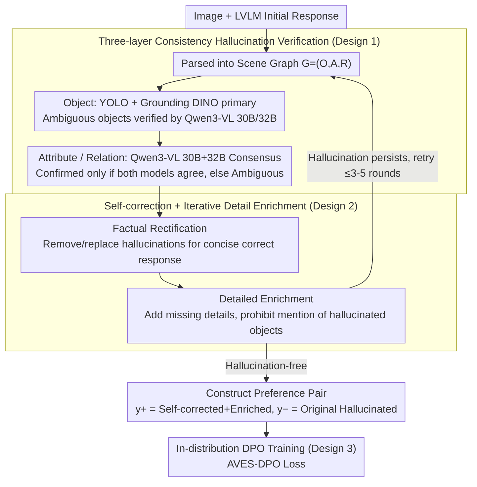

# Aligning with Your Own Voice: Self-Corrected Preference Learning for Hallucination Mitigation in LVLMs

**Conference**: ACL 2026  
**arXiv**: [2604.24395](https://arxiv.org/abs/2604.24395)  
**Code**: None  
**Area**: Hallucination Detection  
**Keywords**: AVES-DPO, self-correction, preference learning, LVLM hallucination, distribution alignment

## TL;DR
The AVES-DPO framework is proposed: using consistent multi-model verification (YOLO/GroundingDINO/Qwen3-VL) to perform fine-grained hallucination detection in responses generated by the LVLM itself across object, attribute, and relation levels. The same LVLM then performs self-correction and detail enrichment. The resulting preference pairs are inherently within the "in-distribution" of the target model. With only 5.2K samples, it outperforms SOTA methods relying on GPT-4V teachers across multiple hallucination benchmarks (improving data efficiency by approximately 25×).

## Background & Motivation

**Background**: DPO has become a mainstream solution for mitigating LVLM hallucinations by constructing preference pairs (preferred as correct detailed responses and dispreferred as hallucinated ones) to guide the model toward the former.

**Limitations of Prior Work**: (1) Existing methods (POVID, oDPO, mDPO, HALVA, etc.) rely almost entirely on closed-source models like GPT-4V to synthesize positive samples or perturb negative ones, which is costly and uncontrollable; (2) There is a **generation pattern distribution mismatch** between closed-source teachers and the target LVLM—the teacher's writing style and vocabulary distribution differ from the target model. Using this "external style" as a preferred signal causes DPO optimization to bias toward "mimicking the teacher" rather than achieving factual improvement; (3) Existing datasets and training targets are overly biased toward object-level hallucinations, with insufficient coverage for fine-grained hallucinations such as attributes and relations (e.g., color, posture, spatial relations).

**Key Challenge**: The gap between high-quality positive samples generated by teachers and the target model’s own distribution is amplified by the DPO log-likelihood ratio into "style difference > factual difference," which dilutes alignment efficiency.

**Goal**: Ensure preferred responses originate from the target model itself (in-distribution) while covering object, attribute, and relation hallucinations.

**Key Insight**: Empirical pre-experiments show that the preference margin distribution of self-corrected responses relative to initial responses is centered at 0 (in-distribution), whereas responses corrected by GPT-4V show large negative margins (out-of-distribution), proving that self-correction is naturally compatible with the target model's internal distribution.

**Core Idea**: Construct fully in-distribution preference pairs through consistency verification and self-correction, followed by standard DPO training.

## Method

### Overall Architecture

Two main stages: (1) Hallucination Verification—Parsing the initial response into a scene graph $G=(O, A, R)$, followed by verifying objects (YOLO + Grounding DINO as primary, Qwen3-VL 30B/32B for dual-adjudication) and attributes/relations (Qwen3-VL 30B+32B consensus). The consensus mechanism requires two independent models to provide the same judgment for a diagnosis; otherwise, it is labeled as Ambiguous. (2) Self-correction—Prompting the LVLM to rewrite based on the diagnosis: first, Factual Rectification (removing or replacing hallucinated elements to obtain a concise, correct response), then Detailed Enrichment (adding missing visual details but prohibiting mention of known hallucinated objects). After enrichment, it is sent back for verification, iterating until it is hallucination-free or discarded after 3-5 rounds. Finally, the "self-corrected + enriched response" is used as $y^+$ and the "original hallucinated response" as $y^-$ for standard DPO.

### Key Designs

**1. Three-layer Consistency Hallucination Verification (O/A/R Consensus Verification): Filtering single-model noise via "dual-model agreement"**

Existing datasets are overly biased toward object-level hallucinations, with insufficient coverage for fine-grained hallucinations such as attributes (color/material/posture/state) and relations (spatial/action relations), while single verifiers are prone to noise. AVES-DPO first parses the initial response into a scene graph $G=(O, A, R)$ and requires two independent verifiers $V_1, V_2$ to provide the same label for confirmation: $L(x) = l$ if $V_1(x) = V_2(x) = l$, otherwise it is marked as Ambiguous. At the Object level, YOLOv8x-worldv2 and Grounding DINO are used, with grouping performed for similar words (cos sim $\ge 0.5$) to avoid interference. Ambiguous objects are adjudicated by Qwen3-VL 30B + 32B.

Attributes and relations are only verified for objects already judged as Factual, using a pre-constructed vocabulary of 148 objects, 38 attributes, and 17 relations to retrieve replacement candidates by semantic sub-type. Hierarchical verification allows for more precise error localization than uniform scoring, while the "dual-model agreement" mechanism prioritizes reliability—crucial for achieving annotation quality comparable to GPT-4V using cheaper open-source models.

**2. Self-correction + Iterative Detail Enrichment (Factual Rectification + Detailed Enrichment): Correction then enrichment to ensure both quality and correctness**

Simply deleting hallucinations makes responses overly brief and low in information; allowing the model to expand freely often reintroduces new hallucinations during the supplementation stage. AVES-DPO splits this into two phases: Phase A (Factual Rectification) prompts the LVLM to delete or replace hallucinated elements based on diagnosis signals to generate a concise, correct response—this step deliberately preserves the target model's own linguistic style; Phase B (Detailed Enrichment) prompts the model to add missing descriptive details from the image, explicitly prohibiting the mention of objects previously labeled as hallucinations.

The enriched response is sent back into the Hallucination Verification loop. If hallucinations remain, it returns to self-correction, with a maximum of 3 rounds for 7B and 5 rounds for 13B models; failed samples are discarded. This closed-loop of "rectification + enrichment + verification" ensures both factuality and descriptiveness, outputting the "self-corrected + enriched response" as the DPO $y^+$ and the original hallucinated response as $y^-$.

**3. In-distribution DPO Training (AVES-DPO Loss): Preference pairs derived entirely from the model itself to direct gradients toward facts rather than style**

The mismatch in generation patterns between closed-source teachers and the target LVLM is amplified by the DPO log-likelihood ratio as "style difference > factual difference." Since both $y^+$ and $y^-$ in AVES-DPO originate from the same target model ($y^-$ is the initial response before Phase A, and $y^+$ is the verified enriched response), training standard DPO on the self-constructed $\mathcal{D}_{SC} = \{(x, y^+, y^-)\}$ ensures preference pairs are naturally in-distribution:

$$\mathcal{L}_{\text{AVES-DPO}}(\pi_\theta; \pi_{\text{ref}}) = -\mathbb{E}_{(x, y^+, y^-)}\Big[\log \sigma\Big(\beta \log \frac{\pi_\theta(y^+ \mid x)}{\pi_{\text{ref}}(y^+ \mid x)} - \beta \log \frac{\pi_\theta(y^- \mid x)}{\pi_{\text{ref}}(y^- \mid x)}\Big)\Big]$$

Because the two responses share the same origin, the preference margin distribution shifts from "centered at negative values" (typical of GPT-4V teacher methods) to "centered at positive values" (Figure 4). The gradient direction clearly points toward factuality rather than style differences, significantly improving data efficiency.

### Loss & Training

LoRA fine-tuning of LLaVA-1.5-7B/13B with rank=128, alpha=256, 1 epoch, $\beta=0.1$, AdamW optimizer, on a single RTX A6000 Ada; 5.2K pairs for 7B and 4.6K pairs for 13B.

## Key Experimental Results

### Main Results

| Method | Data Volume | Feedback Source | Obj-Hal CHAIR$_S\downarrow$ | Obj-Hal CHAIR$_I\downarrow$ | AMBER Hal Rate$\downarrow$ | MMHal Score$\uparrow$ |
|------|-------|---------|---------------------------|---------------------------|--------------------------|--------------------|
| LLaVA-1.5-7B | - | - | 51.4 | 14.8 | 32.5 | 2.22 |
| LLaVA-RLHF | 122K | Self-Reward | 53.6 | 14.8 | 42.5 | 2.06 |
| HALVA | 21.5K | GPT-4V | 41.4 | 11.7 | 32.2 | 2.25 |
| POVID | 17K | GPT-4V | 45.8 | 13.9 | 31.5 | 2.18 |
| oDPO | 19K | GPT-4V | 34.3 | 9.5 | 25.1 | 2.50 |
| mDPO | 10K | GPT-4V | 35.7 | 9.8 | 24.5 | 2.39 |
| SENTINEL | 8.6K | Self | 12.6 | 4.0 | 14.6 | 2.04 |
| **AVES-DPO (Ours)** | **5.2K** | **Self** | **12.2** | **3.9** | **12.6** | **2.35** |

On the AMBER relation category, the 7B model achieved 66.6 (vs. SENTINEL 48.7, base 58.5), while AMBER Acc 82.3 / F1 86.9 were also the highest.

### Ablation Study

| Configuration | Obj-Hal CHAIR$_S$ | AMBER CHAIR | AMBER Hal Rate |
|------|------------------|------------|----------------|
| 7B base | 51.4 | 7.1 | 32.5 |
| + GPT-4V Teacher Supervision (5.2K) | 38.4 | 7.6 | 31.7 |
| **+ AVES-DPO Self-correction (5.2K)** | **12.2** | **3.3** | **12.6** |
| AVES-DPO w/ Two-Phase (Default) | 12.2 | 3.3 | 12.6 |
| AVES-DPO w/ Phase-1 only (No Enrichment) | 16.6 | 3.5 | 12.8 |
| AVES-DPO w/ Phase-2 only (No Rectification) | 19.8 | 3.9 | 17.0 |
| Data Volume 600 | 38.6 | 5.3 | 23.2 |
| Data Volume 5.2K (Sweet spot) | 12.2 | 3.3 | 12.6 |
| Data Volume 10.9K (Over-correction) | 10.6 | 2.8 | 10.1 (But Cover dropped from 40.8 to 37.8) |

### Key Findings
- Under the same 5.2K data volume, the self-correction scheme caused CHAIR$_S$ to plummet from 38.4 (GPT-4V teacher) to 12.2, proving that distribution mismatch is more critical than data scale.
- The Two-Phase approach (correction then enrichment) performs best; correction alone makes responses too brief, while enrichment alone introduces new hallucinations.
- Marginal returns diminish sharply after 5.2K data; further increases lead to "over-correction" (impoverished descriptions, resulting in lower AMBER Cover).
- Relation-based hallucinations are the most difficult (41.9% of 13B training data involved relation hallucinations), but AVES-DPO achieved 77.5 on AMBER relation for 13B, far exceeding baselines.
- The verification strategy itself is also effective on GPT-4V (CHAIR$_S$ dropped from 29.0 to 23.9), indicating the verification module is model-agnostic.

## Highlights & Insights
- Empirically demonstrated the importance of "in-distribution preference data" for DPO—the visualization of the preference margin distribution shifting from negative to positive is highly convincing.
- The consensus mechanism design is simple but effective: using inexpensive open-source models + "agreement" filtering achieves annotation quality comparable to GPT-4V (87.1% win rate on 500 samples).
- A trade-off appears at 13B: MME total score dropped from 1528 to 1364, suggesting that excessive suppression of hallucinations in larger models may damage open-knowledge retrieval—this "scale-aware alignment" warrants future research.
- The closed loop of verification → correction → enrichment → re-verification ensures controllable quality for automated data construction, achieving significant results with minimal samples.

## Limitations & Future Work
- Attribute/relation verification currently only considers single-object levels; complex scenes with multiple interacting objects are not yet covered.
- The 13B degradation on MME suggests that scale-aware training strategies are crucial, but a systematic solution is not provided here.
- The verification model still relies on external detectors (YOLO/GDINO); changing domains (e.g., medical or satellite imagery) requires re-selecting verifiers.
- The vocabulary is based on COCO + GQA (148 objects / 38 attributes / 17 relations), providing limited coverage for open-vocabulary scenarios.

## Related Work & Insights
- **vs. POVID (Zhou et al., 2024a)**: POVID uses GPT-4V to inject hallucinations into ground-truth to create negative samples and requires image distortion; Ours does not rely on external teachers, and negative samples are naturally the model's own initial responses.
- **vs. SENTINEL (Peng et al., 2025)**: Both use self-feedback, but SENTINEL focuses on sentence-level early intervention for object hallucinations; Ours provides O/A/R three-layer verification + iterative enrichment, yielding greater improvements in relation hallucinations.
- **vs. mDPO / oDPO**: These rely on GPT-4V + object masks or image preferences; Ours requires no external teacher, reducing data costs by 25x.

## Rating
- Novelty: ⭐⭐⭐⭐ The "in-distribution self-correction" logic is straightforward but empirically robust; the two-stage verification + enrichment design is clever.
- Experimental Thoroughness: ⭐⭐⭐⭐ Evaluated across five benchmarks (Object-Hal / AMBER / MMHal / MME / POPE) with multiple ablations.
- Writing Quality: ⭐⭐⭐⭐ Tight logical chain from empirical analysis to motivation, method, and validation.
- Value: ⭐⭐⭐⭐ Facilitates reproducibility in the open-source ecosystem without relying on GPT-4V, providing direct utility for practical deployment.

<!-- RELATED:START -->

## Related Papers

- [\[AAAI 2026\] Causally-Grounded Dual-Path Attention Intervention for Object Hallucination Mitigation in LVLMs](../../AAAI2026/hallucination/causally-grounded_dual-path_attention_intervention_for_objec.md)
- [\[ACL 2025\] On-Policy Self-Alignment with Fine-grained Knowledge Feedback for Hallucination Mitigation](../../ACL2025/hallucination/on-policy_self-alignment_with_fine-grained_knowledge_feedback_for_hallucination_.md)
- [\[ACL 2026\] Logical Consistency as a Bridge: Improving LLM Hallucination Detection via Label Constraint Modeling between Responses and Self-Judgments](logical_consistency_as_a_bridge_improving_llm_hallucination_detection_via_label_.md)
- [\[ACL 2026\] MeasHalu: Mitigation of Scientific Measurement Hallucinations for LLMs](meashalu_mitigation_of_scientific_measurement_hallucinations_for_large_language_.md)
- [\[ICML 2026\] Instruction Lens Score: Your Instruction Contributes a Powerful Object Hallucination Detector for Multimodal Large Language Models](../../ICML2026/hallucination/instruction_lens_score_your_instruction_contributes_a_powerful_object_hallucinat.md)

<!-- RELATED:END -->
