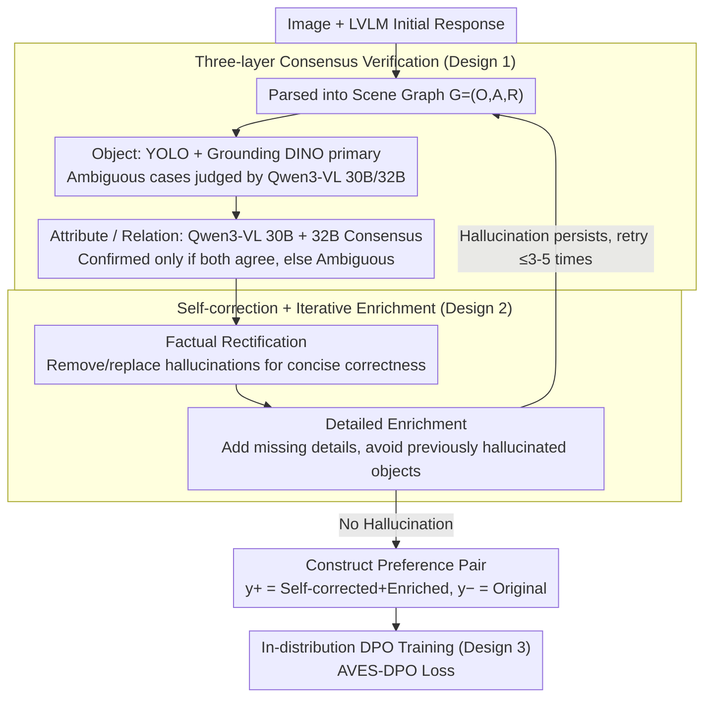

# Aligning with Your Own Voice: Self-Corrected Preference Learning for Hallucination Mitigation in LVLMs

**Conference**: ACL 2026  
**arXiv**: [2604.24395](https://arxiv.org/abs/2604.24395)  
**Code**: None  
**Area**: Hallucination Detection  
**Keywords**: AVES-DPO, Self-Correction, Preference Learning, LVLM Hallucination, Distribution Alignment

## TL;DR
The AVES-DPO framework is proposed. It utilizes consensus-based multi-model verification (YOLO, Grounding DINO, and Qwen3-VL) to detect fine-grained hallucinations (object, attribute, and relation) in responses generated by the LVLM itself. The target LVLM then performs self-correction and detail enrichment, creating preference pairs naturally within the model's "in-distribution." With only 5.2K samples, it outperforms SOTA methods relying on GPT-4V teachers across multiple hallucination benchmarks (achieving ~25× data efficiency).

## Background & Motivation

**Background**: DPO has become a mainstream solution for mitigating LVLM hallucinations. It involves constructing preference pairs (a detailed, correct preferred response and a hallucinated dispreferred response) to guide the model toward the former.

**Limitations of Prior Work**: (1) Existing methods (e.g., POVID, oDPO, mDPO, HALVA) rely heavily on closed-source models like GPT-4V to synthesize positive samples or perturb negative ones, which is costly and uncontrollable. (2) A **generation distribution mismatch** exists between closed-source teachers and the target LVLM. Differences in writing style and vocabulary distribution cause DPO to optimize for "imitating the teacher" rather than actual factual improvement. (3) Current datasets and training objectives are overly biased toward object-level hallucinations, failing to cover fine-grained types like attributes (e.g., color, pose) and relations (spatial relationships).

**Key Challenge**: The gap between high-quality positive samples from teachers and the target model’s own distribution is amplified by the DPO log-likelihood ratio as "style difference > factual difference," diluting alignment efficiency.

**Goal**: To obtain preferred responses from the target model itself (in-distribution) while covering object, attribute, and relation hallucinations.

**Key Insight**: Empirical pilot experiments show that the preference margin distribution of self-corrected responses relative to initial responses is centered at 0 (in-distribution), whereas GPT-4V corrected responses exhibit large negative margins (out-of-distribution). This proves that self-correction is naturally compatible with the target model's internal distribution.

**Core Idea**: Construct fully in-distribution preference pairs via consensus verification and self-correction, followed by standard DPO training.

## Method

### Overall Architecture

The framework consists of two main stages: (1) Hallucination Verification—Initial responses are parsed into a scene graph $G=(O, A, R)$. Objects are verified using YOLO and Grounding DINO, with Qwen3-VL (30B/32B) acting as an arbitrator for ambiguous cases. Attributes and relations are verified through consensus between Qwen3-VL 30B and 32B. The consensus mechanism requires two independent models to provide the same judgment; otherwise, the label is marked "Ambiguous." (2) Self-correction—The LVLM rewrites its response based on the diagnosis: first through Factual Rectification (removing/replacing hallucinated elements for a concise, correct response), then Detailed Enrichment (adding missing visual details while avoiding hallucinated objects). The enriched response is re-verified iteratively until it is hallucination-free or discarded after 3–5 rounds. Finally, the "self-corrected + enriched" response serves as $y^{+}$, and the "original hallucinated" response serves as $y^{-}$ for standard DPO.

### Key Designs

**1. Three-layer Consensus Verification (O/A/R Consensus Verification): Filtering Noise via Agreement**

Current datasets are biased toward object-level hallucinations, neglecting attributes (color/material/pose) and relations (spatial/action). Single verifiers are often noisy. AVES-DPO parses responses into a scene graph $G=(O, A, R)$ and requires two independent verifiers $V_1, V_2$ to provide the same label $l$: $L(x) = l$ if $V_1(x) = V_2(x) = l$, else it is marked Ambiguous. Objects are primarily checked by YOLOv8x-worldv2 and Grounding DINO, with grouping for similar terms (cos sim $\ge 0.5$). Ambiguous objects are arbitrated by Qwen3-VL 30B and 32B.

Attributes and relations are only verified for objects judged as Factual. A pre-built vocabulary of 148 objects, 38 attributes, and 17 relations is used for semantic replacement candidates. Layered verification locates errors more precisely than global scoring, and the consensus mechanism prioritizes reliability—a key factor in achieving GPT-4V level annotation quality using cheaper open-source models.

**2. Factual Rectification + Detailed Enrichment: A Closed-loop Approach**

Simply removing hallucinations leads to overly brief responses with low information density. Conversely, allowing free generation may reintroduce hallucinations. AVES-DPO splits the process: Phase A (Factual Rectification) uses diagnostic signals to delete or replace hallucinated elements, retaining the target model's linguistic style. Phase B (Detailed Enrichment) adds missing descriptive details, explicitly excluding objects previously identified as hallucinations.

The enriched response returns to the Hallucination Verification loop. If hallucinations remain, it retries self-correction (up to 3 rounds for 7B, 5 rounds for 13B). This "delete + add + verify" loop ensures both factuality and descriptiveness, resulting in the preferred $y^{+}$ for DPO.

**3. In-distribution DPO Training (AVES-DPO Loss): Gradient Targeting Facts over Style**

The mismatch between closed-source teachers and target LVLMs is often amplified by the DPO log-likelihood ratio. Since both $y^{+}$ and $y^{-}$ in AVES-DPO originate from the same target model ($y^{-}$ is the initial hallucination, $y^{+}$ is the verified-enriched version), training on $\mathcal{D}_{SC} = \{(x, y^+, y^-)\}$ uses standard DPO while remaining naturally in-distribution:

$$\mathcal{L}_{\text{AVES-DPO}}(\pi_\theta; \pi_{\text{ref}}) = -\mathbb{E}_{(x, y^+, y^-)}\Big[\log \sigma\Big(\beta \log \frac{\pi_\theta(y^+ \mid x)}{\pi_{\text{ref}}(y^+ \mid x)} - \beta \log \frac{\pi_\theta(y^- \mid x)}{\pi_{\text{ref}}(y^- \mid x)}\Big)\Big]$$

Because the responses share the same origin, the preference margin distribution shifts from being negative-centered (with GPT-4V teachers) to positive-centered. This ensures gradients align with factuality rather than stylistic differences, significantly improving data efficiency.

### Loss & Training
The model uses LoRA fine-tuning on LLaVA-1.5-7B/13B (rank=128, alpha=256, 1 epoch, $\beta=0.1$) with the AdamW optimizer on an RTX A6000 Ada. The dataset consists of 5.2K pairs for 7B and 4.6K pairs for 13B.

## Key Experimental Results

### Main Results

| Method | Data Size | Data Source | Obj-Hal CHAIR$_S\downarrow$ | Obj-Hal CHAIR$_I\downarrow$ | AMBER Hal Rate$\downarrow$ | MMHal Score$\uparrow$ |
|------|-------|---------|---------------------------|---------------------------|--------------------------|--------------------|
| LLaVA-1.5-7B | - | - | 51.4 | 14.8 | 32.5 | 2.22 |
| LLaVA-RLHF | 122K | Self-Reward | 53.6 | 14.8 | 42.5 | 2.06 |
| HALVA | 21.5K | GPT-4V | 41.4 | 11.7 | 32.2 | 2.25 |
| POVID | 17K | GPT-4V | 45.8 | 13.9 | 31.5 | 2.18 |
| oDPO | 19K | GPT-4V | 34.3 | 9.5 | 25.1 | 2.50 |
| mDPO | 10K | GPT-4V | 35.7 | 9.8 | 24.5 | 2.39 |
| SENTINEL | 8.6K | Self | 12.6 | 4.0 | 14.6 | 2.04 |
| **AVES-DPO (Ours)** | **5.2K** | **Self** | **12.2** | **3.9** | **12.6** | **2.35** |

AVES-DPO achieves a 66.6 relation score on AMBER (7B), compared to 48.7 for SENTINEL and 58.5 for the base model. AMBER Acc (82.3) and F1 (86.9) are also the highest reported.

### Ablation Study

| Configuration | Obj-Hal CHAIR$_S$ | AMBER CHAIR | AMBER Hal Rate |
|------|------------------|------------|----------------|
| 7B base | 51.4 | 7.1 | 32.5 |
| + GPT-4V Teacher Supervision (5.2K) | 38.4 | 7.6 | 31.7 |
| **+ AVES-DPO Self-correction (5.2K)** | **12.2** | **3.3** | **12.6** |
| AVES-DPO w/ Two-Phase (Default) | 12.2 | 3.3 | 12.6 |
| AVES-DPO w/ Phase-1 only (No Enrichment) | 16.6 | 3.5 | 12.8 |
| AVES-DPO w/ Phase-2 only (No Rectification) | 19.8 | 3.9 | 17.0 |
| Data Size 600 | 38.6 | 5.3 | 23.2 |
| Data Size 5.2K (Sweet Spot) | 12.2 | 3.3 | 12.6 |
| Data Size 10.9K (Over-correction) | 10.6 | 2.8 | 10.1 (Cover drops 40.8 $\to$ 37.8) |

### Key Findings
- With 5.2K samples, self-correction drops CHAIR$_S$ from 38.4 to 12.2 compared to the GPT-4V teacher approach, proving distribution alignment is more critical than data scale.
- The Two-Phase approach is most effective; rectification alone causes brevity, while enrichment alone introduces new hallucinations.
- Marginal gains diminish after 5.2K samples; further increases lead to "over-correction" where descriptions become sparse (drop in AMBER Cover).
- Relation hallucinations are the most difficult (comprising 41.9% of 13B training data), yet AVES-DPO achieves 77.5 on AMBER relation for 13B, far exceeding baselines.
- The verification strategy itself improves GPT-4V (CHAIR$_S$ 29.0 $\to$ 23.9), indicating the verification module is model-agnostic.

## Highlights & Insights
- Empirically demonstrates the importance of "in-distribution preference data" for DPO; the shift in preference margin distribution is highly compelling.
- The consensus mechanism is simple yet effective: using inexpensive open-source models with an agreement requirement achieves annotation quality comparable to GPT-4V (87.1% win rate on 500 samples).
- A trade-off appears for 13B: MME scores drop from 1528 to 1364, suggesting that over-suppressing hallucinations might harm open-knowledge retrieval. This "scale-aware alignment" warrants future research.
- The verification-correction-enrichment loop ensures controllable quality for automated data construction.

## Limitations & Future Work
- Attribute/relation verification is limited to the single-object level and does not cover complex multi-object interactions.
- MME degradation at 13B suggests the need for scale-aware training strategies not fully explored here.
- The verification module relies on external detectors (YOLO/GDINO); changing domains (e.g., medical or satellite imagery) requires selecting new verifiers.
- The vocabulary is based on COCO + GQA, limiting coverage in open-vocabulary scenarios.

## Related Work & Insights
- **vs POVID (Zhou et al., 2024a)**: POVID uses GPT-4V to inject hallucinations into ground-truth. Ours uses the model's own initial responses, which is more natural.
- **vs SENTINEL (Peng et al., 2025)**: Both use self-feedback, but SENTINEL focuses on sentence-level early intervention for object hallucinations. Ours addresses O/A/R layers with iterative enrichment for better relation-level results.
- **vs mDPO / oDPO**: These rely on GPT-4V and object masks. Ours requires no external teacher, reducing data costs by ~25×.

## Rating
- Novelty: ⭐⭐⭐⭐ The "in-distribution self-correction" approach is intuitive with solid empirical backing.
- Experimental Thoroughness: ⭐⭐⭐⭐ Evaluations across five benchmarks (Object-Hal, AMBER, MMHal, MME, POPE) plus comprehensive ablations.
- Writing Quality: ⭐⭐⭐⭐ Clear logical flow from empirical analysis to motivation and verification.
- Value: ⭐⭐⭐⭐ High reproducibility without GPT-4V, providing direct benefits for actual deployment.

<!-- RELATED:START -->

## Related Papers

- [\[AAAI 2026\] Causally-Grounded Dual-Path Attention Intervention for Object Hallucination Mitigation in LVLMs](../../AAAI2026/hallucination/causally-grounded_dual-path_attention_intervention_for_objec.md)
- [\[ACL 2025\] On-Policy Self-Alignment with Fine-grained Knowledge Feedback for Hallucination Mitigation](../../ACL2025/hallucination/on-policy_self-alignment_with_fine-grained_knowledge_feedback_for_hallucination_.md)
- [\[ACL 2026\] Logical Consistency as a Bridge: Improving LLM Hallucination Detection via Label Constraint Modeling between Responses and Self-Judgments](logical_consistency_as_a_bridge_improving_llm_hallucination_detection_via_label_.md)
- [\[ACL 2026\] MeasHalu: Mitigation of Scientific Measurement Hallucinations for LLMs](meashalu_mitigation_of_scientific_measurement_hallucinations_for_large_language_.md)
- [\[ACL 2026\] Vocabulary Hijacking in LVLMs: Unveiling Critical Attention Heads by Excluding Inert Tokens to Mitigate Hallucination](vocabulary_hijacking_in_lvlms_unveiling_critical_attention_heads_by_excluding_in.md)

<!-- RELATED:END -->
