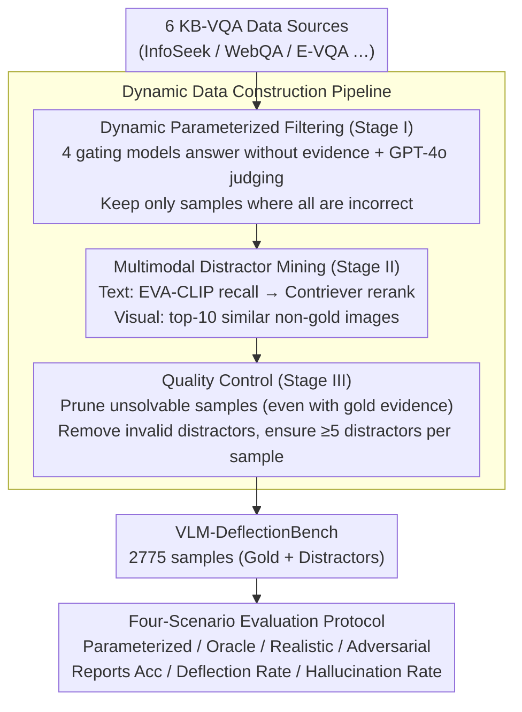

# Benchmarking Deflection and Hallucination in Large Vision-Language Models

**Conference**: ACL 2026  
**arXiv**: [2604.12033](https://arxiv.org/abs/2604.12033)  
**Code**: Available (to be public after publication)  
**Area**: Hallucination Detection  
**Keywords**: Large Vision-Language Models, Hallucination Detection, Deflection Evaluation, Knowledge QA, Retrieval-Augmented Generation

## TL;DR
This paper introduces VLM-DeflectionBench, a multimodal benchmark containing 2775 samples. It systematically evaluates the deflection vs. hallucination behavior of Large Vision-Language Models (LVLMs) when evidence is insufficient or misleading across four evaluation scenarios (Parameterized/Oracle/Realistic/Adversarial). Experiments covering 20 SOTA LVLMs reveal that nearly all models fail to deflect reliably under noisy evidence.

## Background & Motivation

**Background**: Large Vision-Language Models (LVLMs) increasingly rely on retrieval augmentation to answer knowledge-intensive multimodal questions. Existing KB-VQA benchmarks (e.g., OK-VQA, InfoSeek, E-VQA) primarily evaluate accuracy when correct evidence is retrieved.

**Limitations of Prior Work**: (1) **Neglect of Evidence Conflict**: Existing benchmarks do not consider contradictions between visual and textual evidence, nor how models should behave when retrieved knowledge is incomplete. (2) **Rapid Obsolescence**: As LVLM training sets expand, many questions requiring retrieval can now be answered via parameterized knowledge, causing benchmarks to lose discriminative power. (3) **Undifferentiated Failure Modes**: They only measure "correctness" without distinguishing between "incorrect answers" (hallucination) and "refusal to answer" (deflection)—the latter being a preferred failure mode when evidence is insufficient.

**Key Challenge**: A reliable RAG system should deflect rather than fabricate when evidence is insufficient, yet no benchmark currently evaluates this behavior systematically.

**Goal**: To build a dynamically updatable benchmark specifically for evaluating hallucination vs. deflection behaviors of LVLMs under different knowledge conditions.

**Key Insight**: Designing four complementary scenarios to decouple parameterized memory from retrieval robustness—ranging from zero evidence and perfect evidence to mixed evidence and pure distractors.

**Core Idea**: A dynamic filtering pipeline is used to maintain benchmark difficulty (by filtering samples answerable via parameterization), combined with a four-scenario evaluation protocol to separately assess "what the model knows" and "how the model acts when it does not know."

## Method

### Overall Architecture
The core problem VLM-DeflectionBench aims to solve is that existing KB-VQA benchmarks only test accuracy when "correct evidence is retrieved," failing to reveal whether a model honestly deflects or blindly fabricates when evidence is insufficient or misleading. To address this, the benchmark construction is split into three sequential stages: Stage I uses a suite of strong gating models to prune samples that can be answered without retrieval; Stage II mines plausible textual and visual distractors for each retained sample; and Stage III performs quality control to remove unsolvable samples and invalid distractors. The final version comprises 2775 samples, each equipped with gold evidence and distractors, evaluated under a four-scenario protocol with varying knowledge conditions from "zero evidence" to "pure distractors."

### Key Designs

**1. Dynamic Parameterized Filtering (Stage I): Ensuring the benchmark requires retrieval**

As LVLM training sets grow, many knowledge questions originally requiring retrieval can now be answered through parameterized memory, leading to rapid obsolescence of old benchmarks. To counter this, the authors utilize four powerful gating models—Gemma3-27B, Qwen-2.5-VL-32B, InternVL3-38B, and VL-Rethinker-72B—to answer questions without external knowledge. GPT-4o serves as the judge (using SimpleQA prompts to output CORRECT/INCORRECT/NOT ATTEMPTED). Only samples where **all** four models are judged INCORRECT are retained. The elegance of this step lies in its "rollability": as future models become stronger, the benchmark can automatically regain its difficulty by re-running the filter with updated gating models.

**2. Multimodal Distractor Mining (Stage II): Using plausible noise to test true robustness**

Real-world retrieval rarely returns perfectly clean evidence; testing robustness requires high-quality distractors. For each retained sample, gold evidence $K^{+}$ is paired with mined distractors $K^{-}$. For text, EVA-CLIP recalls the top-10 relevant Wikipedia pages, which are chunked and reranked by Contriever to find passages that resemble the answer but are not gold evidence. For vision, the top-10 images similar to the gold image but incorrect are recalled. This forces models in Realistic/Adversarial scenarios to demonstrate true capability in "distinguishing relevant from irrelevant evidence" rather than simply accepting any provided text.

**3. Quality Control (Stage III): Dual Oracle filters for solvers and decoys**

Mining distractors is insufficient if the question itself is unsolvable or if the distractors fail to mislead. Stage III employs gating models for two checks: (1) **Solvability Check**: If all gating models fail to answer even when provided with gold evidence, the sample is discarded as being beyond current capability. (2) **Distractor Validity Check**: If a distractor $k^{-}$ allows any gating model to answer correctly, it indicates a data leak, and that distractor is removed. Finally, at least $K_{\min}=5$ distractors per sample are mandated to ensure the remaining questions are solvable yet genuinely deceptive.

**4. Four-Scenario Evaluation Protocol: Decoupling knowledge from behavior**

A single accuracy metric cannot distinguish whether a model truly understands or is merely lucky, nor can it show whether a model deflects or hallucinates under insufficient evidence. The protocol applies four progressive knowledge conditions to the same question: **Parameterized Scenario** (no external knowledge, validates Stage I filtering, expected Acc close to zero), **Oracle Scenario** (gold evidence only, measures the performance ceiling), **Realistic Scenario** (mixture of gold and distractors, simulates real-world noisy retrieval), and **Adversarial Scenario** (distractors only, ideal models should deflect). By reporting Accuracy, Deflection Rate, and Hallucination Rate for each, the model's behavior pattern across the knowledge spectrum is fully exposed.

## Key Experimental Results

### Main Results (Four-Scenario Evaluation of 20 LVLMs, representative models selected)

| Model | Oracle Acc↑ | Oracle Hall↓ | Realistic Acc | Realistic Hall↓ | Adversarial Defl↑ | Adversarial Hall↓ |
|------|------------|-------------|--------------|----------------|-------------------|-------------------|
| Ovis2-34B | 66.5 | 27.8 | 49.1 | 43.3 | 38.7 | 58.1 |
| GPT-5 | 73.1 | 12.6 | 59.5 | 25.5 | 61.2 | 34.7 |
| Claude-Opus-4 | 49.1 | 9.2 | 32.1 | 8.5 | **88.3** | **11.1** |
| Gemini-2.5-Pro | 59.8 | 13.9 | 51.0 | 20.5 | 76.1 | 22.2 |
| Qwen-2.5-VL-32B | 61.0 | 33.9 | 45.2 | 49.5 | 13.7 | **83.9** |
| Mistral-Small-3.1 | 42.6 | 10.3 | 23.5 | 14.9 | 83.8 | 15.6 |

### Key Findings
- **No model is balanced across all scenarios**: Claude over-deflects (Oracle Acc only 49.1%), Qwen is over-confident (83.9% hallucination in Adversarial), and Mistral also over-deflects.
- **Hallucination remains severe even with gold evidence**: LLaVA-OneVision still has a 41.6% hallucination rate in the Oracle scenario, suggesting grounding rather than retrieval is the primary bottleneck.
- **Accuracy drops significantly in the Realistic scenario**: Performance generally decreases by 10-20 percentage points as models are frequently misled by distractors.
- **GPT-5 shows higher accuracy in the Parameterized scenario (23.7%)**: This may reflect training data contamination.
- **Open-source models rarely deflect in the Adversarial scenario**: Most deflection rates are below 35%, with a strong tendency to fabricate answers.
- **Fundamental trade-off between deflection and accuracy**: High-deflection models (e.g., Claude) sacrifice Oracle accuracy.

## Highlights & Insights
- The **"Dynamic Filtering" concept** is crucial—benchmarks must evolve with models, or they quickly lose relevance. The VLM-DeflectionBench pipeline maintains longevity by updating gating models.
- The **Four-Scenario Evaluation Protocol** reveals behavior patterns hidden by single accuracy metrics. For instance, Claude might score lower on traditional benchmarks due to high deflection, but it is more suitable for high-safety scenarios.
- The **distinction between "Hallucination vs. Deflection"** is vital for RAG deployment. In high-stakes fields like medicine or law, generating unsupported answers is far more dangerous than deflecting.

## Limitations & Future Work
- The benchmark relies on GPT-4o as a judge, which may introduce evaluation bias.
- The sample size of 2775 is relatively limited, with fewer samples for certain modality combinations.
- The "Strict RAG" assumption (all incorrect answers counted as hallucinations) is simplified; errors in real scenarios may stem from misinterpreting evidence rather than pure fabrication.
- No exploration was made into training models to improve deflection (focus was exclusively on evaluation).
- Deflection behavior in multi-turn interactions was not considered.
- Distractor difficulty is not graded, though different difficulties might trigger different behaviors.

## Related Work & Insights
- **vs. MRAG-Bench**: MRAG-Bench includes visual evidence but does not evaluate deflection and hallucination. VLM-DeflectionBench is the first to systematically evaluate both in KB-VQA.
- **vs. HaloQuest/AMBER**: These focus on visual hallucination without retrieval-augmented contexts. VLM-DeflectionBench evaluates within the RAG framework.
- **vs. SimpleQA/GaRaGe**: These are text-only hallucination evaluations that cannot capture visual-textual evidence conflicts.

## Rating
- Novelty: ⭐⭐⭐⭐⭐ First benchmark to systematically evaluate deflection in multimodal RAG; unique four-scenario design.
- Experimental Thoroughness: ⭐⭐⭐⭐⭐ 20 models (open and closed source), human verification with $\kappa=0.91$.
- Writing Quality: ⭐⭐⭐⭐⭐ Clear motivation, rigorous design, and insightful findings.
- Value: ⭐⭐⭐⭐⭐ Establishes a new paradigm for RAG reliability assessment with direct guidance for deployment.

<!-- RELATED:START -->

## Related Papers

- [\[ACL 2026\] Mitigating Hallucinations in Large Vision-Language Models without Performance Degradation](mitigating_hallucinations_in_large_vision-language_models_without_performance_de.md)
- [\[ACL 2026\] Mechanisms of Prompt-Induced Hallucination in Vision–Language Models](mechanisms_of_prompt-induced_hallucination_in_vision-language_models.md)
- [\[CVPR 2026\] Prefill-Time Intervention for Mitigating Hallucination in Large Vision-Language Models](../../CVPR2026/hallucination/prefill-time_intervention_for_mitigating_hallucination_in_large_vision-language_.md)
- [\[ACL 2026\] HalluAudio: A Comprehensive Benchmark for Hallucination Detection in Large Audio-Language Models](halluaudio_a_comprehensive_benchmark_for_hallucination_detection_in_large_audio-.md)
- [\[ICLR 2026\] Dynamic Multimodal Activation Steering for Hallucination Mitigation in Large Vision-Language Models](../../ICLR2026/hallucination/dynamic_multimodal_activation_steering_for_hallucination_mitigation_in_large_vis.md)

<!-- RELATED:END -->
