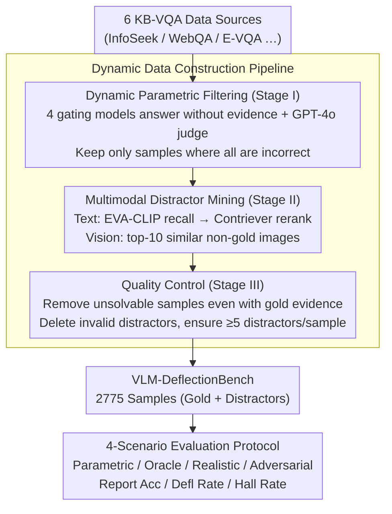

# Benchmarking Deflection and Hallucination in Large Vision-Language Models

**Conference**: ACL 2026  
**arXiv**: [2604.12033](https://arxiv.org/abs/2604.12033)  
**Code**: Yes (Released after publication)  
**Area**: Hallucination Detection  
**Keywords**: Vision-Language Models, Hallucination Detection, Deflection Evaluation, Knowledge QA, Retrieval-Augmented Generation

## TL;DR
This paper proposes VLM-DeflectionBench, a multimodal benchmark with 2775 samples that systematically evaluates the deflection vs. hallucination behaviors of Large Vision-Language Models (LVLMs) when evidence is insufficient or misleading across four evaluation scenarios (Parametric/Oracle/Realistic/Adversarial). Experiments covering 20 SOTA LVLMs reveal that nearly all models fail to reliably deflect under noisy evidence.

## Background & Motivation

**Background**: Large Vision-Language Models (LVLMs) increasingly rely on retrieval augmentation to answer knowledge-intensive multimodal questions. Existing KB-VQA benchmarks (e.g., OK-VQA, InfoSeek, E-VQA) primarily evaluate accuracy when correct evidence is retrieved.

**Limitations of Prior Work**: (1) **Ignored evidence conflict**: Existing benchmarks do not consider contradictions between visual and textual evidence, or how models should behave when retrieved knowledge is incomplete; (2) **Rapid obsolescence**: As LVLM training sets expand, many questions requiring retrieval can now be answered via parametric knowledge, causing benchmarks to lose discriminative power; (3) **Indistinction of failure modes**: They only measure "correctness" without distinguishing between "incorrect answers" (hallucination) and "refusal to answer" (deflection)—where deflection is a preferable failure mode when evidence is insufficient.

**Key Challenge**: A reliable RAG system should deflect rather than hallucinate when evidence is insufficient, but no benchmark currently evaluates this behavior systematically.

**Goal**: Construct a dynamically updatable benchmark specifically to evaluate the hallucination vs. deflection behaviors of LVLMs under various knowledge conditions.

**Key Insight**: Design four complementary scenarios to decouple parametric memory and retrieval robustness—ranging from no evidence to perfect evidence, mixed evidence, and pure distractors.

**Core Idea**: Maintain benchmark difficulty using a dynamic filtering pipeline (filtering samples answerable via parametric knowledge) and evaluate "what the model knows" vs. "what the model does when it doesn't know" through a four-scenario evaluation protocol.

## Method

### Overall Architecture
The core problem VLM-DeflectionBench aims to solve is that existing KB-VQA benchmarks only measure accuracy when "correct evidence is retrieved," failing to reveal whether a model honestly deflects or fabricates answers when evidence is insufficient or misleading. To address this, the benchmark construction is split into three interconnected stages: Stage I uses a group of strong gating models to filter out samples "answerable without lookup"; Stage II mines plausible textual and visual distractors for each retained question; Stage III performs quality control to remove unsolvable samples and invalid distractors. The final 2775 samples are evaluated under a four-scenario protocol with varying knowledge conditions from "zero evidence" to "pure distractors."

### Key Designs

**1. Dynamic Parametric Filtering (Stage I): Retainment of "Lookup-Required" Questions**

As LVLM training sets grow, many knowledge questions originally requiring retrieval can now be answered via parametric memory. To counter this "obsolescence," the authors use 4 strong gating models—Gemma3-27B, Qwen-2.5-VL-32B, InternVL3-38B, and VL-Rethinker-72B—to answer questions without external knowledge. GPT-4o serves as a judge to categorize outputs as CORRECT/INCORRECT/NOT ATTEMPTED, retaining only samples judged as INCORRECT for **all** models. This design is "rolling": as models improve, the benchmark can be refreshed by replacing gating models.

**2. Multimodal Distractor Mining (Stage II): Forcing Robustness via Plausible Noise**

Real-world retrieval rarely returns only clean evidence. To test robustness, high-quality distractors are provided. For each gold evidence $K^{+}$, distractors $K^{-}$ are mined: for text, EVA-CLIP recalls top-10 Wikipedia pages, which are chunked and reranked by Contriever to find segments most similar to the answer but incorrect; for vision, top-10 images similar to the gold image but incorrect are recalled. This requires models to distinguish relevant from irrelevant evidence.

**3. Quality Control (Stage III): Oracle-based Solvability and Deceptiveness Checks**

Unsolvable questions or ineffective distractors are removed in Stage III. First, a **solvability check** discards samples if gating models fail even when provided with gold evidence. Second, a **distractor validity check** removes any $k^{-}$ that allows any gating model to derive the correct answer (preventing leakage). Each sample is required to have at least $K_{\min}=5$ distractors.

**4. Four-Scenario Evaluation Protocol: Decoupling Knowledge and Behavior**

Accuracy alone cannot distinguish between genuine understanding and guessing. The protocol applies four conditions: **Parametric Scenario** (no external knowledge; verifies filtering effectiveness), **Oracle Scenario** (only gold evidence; tests performance ceiling), **Realistic Scenario** (mixed gold and distractors; simulates real-world noisy retrieval), and **Adversarial Scenario** (only distractors; ideal models should deflect). Each scenario reports Accuracy, Deflection Rate, and Hallucination Rate.

## Key Experimental Results

### Main Results (4-Scenario Evaluation for 20 LVLMs, Selected Models)

| Model | Oracle Acc↑ | Oracle Hall↓ | Realistic Acc | Realistic Hall↓ | Adversarial Defl↑ | Adversarial Hall↓ |
|------|------------|-------------|--------------|----------------|-------------------|-------------------|
| Ovis2-34B | 66.5 | 27.8 | 49.1 | 43.3 | 38.7 | 58.1 |
| GPT-5 | 73.1 | 12.6 | 59.5 | 25.5 | 61.2 | 34.7 |
| Claude-Opus-4 | 49.1 | 9.2 | 32.1 | 8.5 | **88.3** | **11.1** |
| Gemini-2.5-Pro | 59.8 | 13.9 | 51.0 | 20.5 | 76.1 | 22.2 |
| Qwen-2.5-VL-32B | 61.0 | 33.9 | 45.2 | 49.5 | 13.7 | **83.9** |
| Mistral-Small-3.1 | 42.6 | 10.3 | 23.5 | 14.9 | 83.8 | 15.6 |

### Key Findings
- **No model is balanced across all scenarios**: Claude over-deflects (Oracle Accuracy only 49.1%), while Qwen is over-confident (83.9% hallucination in Adversarial).
- **Hallucination remains severe even with gold evidence**: LLaVA-OneVision shows 41.6% hallucination in Oracle, suggesting grounding rather than retrieval is the main bottleneck.
- **Accuracy drops significantly (10-20%) in Realistic scenarios**: Distractors frequently mislead models.
- **Open-source models rarely deflect in Adversarial scenarios**: Most show deflection rates below 35%, tending to fabricate answers instead.
- **Fundamental trade-off between deflection and accuracy**: High-deflection models (e.g., Claude) sacrifice Oracle accuracy.

## Highlights & Insights
- The **"Dynamic Filtering" concept** is crucial—benchmarks should evolve with models. The VLM-DeflectionBench pipeline maintains relevance by updating gating models.
- The **Four-Scenario Protocol** reveals behavioral patterns invisible via a single accuracy metric. For instance, Claude might score lower on traditional benchmarks due to high deflection but is more suitable for high-safety scenarios.
- The **Distinction between Hallucination vs. Deflection** is vital for RAG deployment—in high-risk fields like medicine or law, generating unsupported answers is far more dangerous than deflecting.

## Limitations & Future Work
- The benchmark relies on GPT-4o as a judge, potentially introducing grading bias.
- The sample size of 2775 is relatively limited.
- The "Strict RAG" assumption (all wrong answers are hallucinations) is simplified; errors might stem from misinterpreting evidence rather than pure fabrication.
- It does not explore how to train models to improve deflection capabilities.
- Multi-turn interaction deflection behavior is not considered.

## Related Work & Insights
- **vs. MRAG-Bench**: MRAG-Bench includes visual evidence but does not evaluate deflection and hallucination. VLM-DeflectionBench is the first to systematically evaluate these in KB-VQA.
- **vs. HaloQuest/AMBER**: These focus on visual hallucination without RAG context.
- **vs. SimpleQA/GaRaGe**: These are text-only and cannot capture vision-text evidence conflicts.

## Rating
- Novelty: ⭐⭐⭐⭐⭐ First benchmark to systematically evaluate deflection in multimodal RAG.
- Experimental Thoroughness: ⭐⭐⭐⭐⭐ 20 models (open and closed), high human verification κ=0.91.
- Writing Quality: ⭐⭐⭐⭐⭐ Clear motivation, rigorous design, insightful findings.
- Value: ⭐⭐⭐⭐⭐ Proposes a new paradigm for RAG reliability assessment.

<!-- RELATED:START -->

## Related Papers

- [\[CVPR 2026\] SVHalluc: Benchmarking Speech-Vision Hallucination in Audio-Visual Large Language Models](../../CVPR2026/hallucination/svhalluc_benchmarking_speech-vision_hallucination_in_audio-visual_large_language.md)
- [\[ACL 2026\] Mechanisms of Prompt-Induced Hallucination in Vision–Language Models](mechanisms_of_prompt-induced_hallucination_in_vision-language_models.md)
- [\[ACL 2026\] HalluAudio: A Comprehensive Benchmark for Hallucination Detection in Large Audio-Language Models](halluaudio_a_comprehensive_benchmark_for_hallucination_detection_in_large_audio-.md)
- [\[ACL 2026\] Mitigating Hallucinations in Large Vision-Language Models without Performance Degradation](mitigating_hallucinations_in_large_vision-language_models_without_performance_de.md)
- [\[CVPR 2026\] Residual Decoding: Mitigating Hallucinations in Large Vision-Language Models via History-Aware Residual Guidance](../../CVPR2026/hallucination/residual_decoding_mitigating_hallucinations_in_large_vision-language_models_via_.md)

<!-- RELATED:END -->
