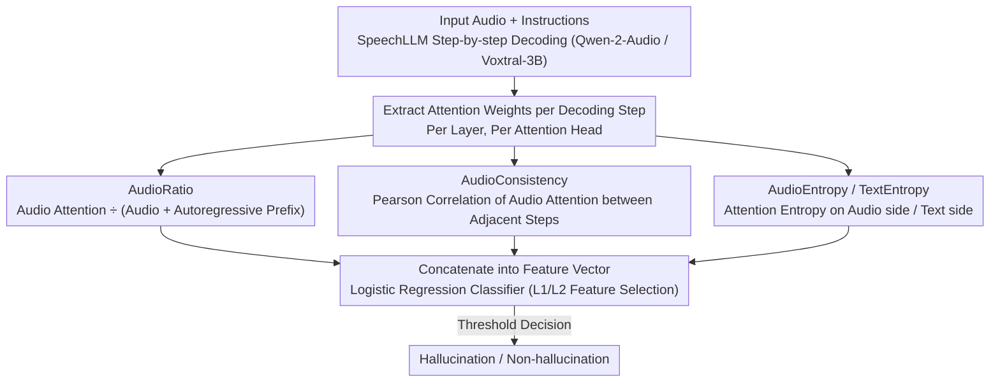

# Detecting Hallucinations in SpeechLLMs at Inference Time Using Attention Maps

**Conference**: ACL 2026 Findings  
**arXiv**: [2604.19565](https://arxiv.org/abs/2604.19565)  
**Code**: None  
**Area**: Hallucination Detection  
**Keywords**: Speech Large Language Models, Hallucination Detection, Attention Maps, Inference-time Detection, Lightweight Classifiers

## TL;DR

Ours proposes four audio-attention-based metrics (AudioRatio, AudioConsistency, AudioEntropy, TextEntropy) to train a lightweight logistic regression classifier for detecting hallucinations in SpeechLLMs during inference, achieving a PR-AUC improvement of up to +0.23 on in-domain data.

## Background & Motivation

**Background**: Speech Large Language Models (SpeechLLMs) have made significant progress in tasks such as Automatic Speech Recognition (ASR) and Speech-to-Text Translation (S2TT), but they still generate hallucinations—content that is fluent but inconsistent with the input audio.

**Limitations of Prior Work**: (1) Existing hallucination detection methods rely on comparison with gold-standard outputs, which is costly and infeasible in deployment scenarios; (2) Hallucination detection methods developed for text LLMs cannot directly capture audio-specific signals because audio representations are much longer than text, and the alignment between input frames and output tokens differs from text-to-text generation.

**Key Challenge**: There is a need to detect hallucinations at inference time (without reference text), but the attention dynamics of the audio modality are fundamentally different from those of the text modality, preventing direct transfer of existing methods.

**Goal**: Utilize the internal attention patterns of SpeechLLMs to develop lightweight inference-time hallucination detectors.

**Key Insight**: It is observed that when models generate hallucinations, attention exhibits pathological patterns—the degradation of diagonal attention structures and the fallback of attention to the starting position of the audio input.

**Core Idea**: Design four audio-specific attention metrics to capture hallucination-related attention patterns and train a logistic regression classifier for efficient detection.

## Method

### Overall Architecture

SpeechLLMs generate hallucinations in ASR and speech translation—fluent content that mismatches the input audio. Existing detection methods either require gold-standard answers for comparison (unavailable during deployment) or are designed for text LLMs, failing to capture audio-specific alignment signals (audio representations are much longer than text, and alignment between input frames and output tokens is different). The key observation of this paper is that pathological patterns appear in attention during hallucinations—diagonal structures degrade, and attention falls back to the beginning of the audio. Consequently, the authors perform inference on SpeechLLMs (Qwen-2-Audio, Voxtral-3B), extract attention weights at each decoding step, calculate four audio attention metrics as features, and train a lightweight logistic regression classifier to determine whether the current output is a hallucination at inference time (without reference text).

### Key Designs

**1. AudioRatio: Monitoring whether the model attends to input audio or the autoregressive prefix**

Hallucinations often occur when the model stops attending to the input audio and relies excessively on the previously generated text prefix. AudioRatio quantifies this tendency: $AR^{l,h}_t = \frac{A^{l,h}_t(\text{Audio})}{A^{l,h}_t(\text{Audio}) + A^{l,h}_t(\text{ART})}$, representing the proportion of attention allocated to audio tokens relative to the total attention (audio + autoregressive text) for each head at step $t$. It follows the input/output attention ratio concept from Lookback-Lens but strictly limits the input side to audio tokens to specifically capture "audio detachment" hallucination signals.

**2. AudioConsistency: Detecting abnormally similar audio attention across adjacent decoding steps**

During hallucinations, model attention often collapses to the starting position of the audio, resulting in highly similar attention distributions over consecutive steps. AudioConsistency calculates the Pearson correlation coefficient between audio attention vectors of adjacent decoding steps to capture this "attention fallback"—during normal decoding, attention moves smoothly as the output progresses, resulting in moderate correlation, whereas collapse leads to abnormally high correlation.

**3. AudioEntropy / TextEntropy: Capturing features from heads without clear diagonal patterns**

Not all attention heads exhibit clean diagonal alignment patterns, and the first two metrics may fail on such heads. AudioEntropy calculates entropy after re-normalizing the audio-side attention weights, $AE^{l,h}_t = H(\frac{a^{l,h,t}_{1:N}}{\sum_i a^{l,h,t}_i})$, measuring the model's uncertainty regarding the audio input; TextEntropy calculates uncertainty on the text side similarly. Both serve as complementary signals, allowing the detector to obtain useful features even from heads lacking diagonal structures.

### Loss & Training

A logistic regression classifier is employed, with L2 regularization used for feature ranking and L1 regularization for feature pruning (Stable Features variant). The training data consists of 40,000 samples from the VoxPopuli training set (10,000 for each of the 4 languages). Hallucination labels are automatically generated using a threshold of WER + SHS > 0.7, with a manually annotated subset used to calibrate the threshold.

## Key Experimental Results

### Main Results (Voxtral-3B, VoxPopuli In-domain)

| Method | F1 | PR-AUC | PRR@10% |
|------|-----|--------|---------|
| Mean Entropy (baseline) | 0.42 | 0.44 | 0.43 |
| Perplexity (baseline) | 0.40 | 0.41 | 0.40 |
| AudioRatio Only (LR) | 0.64 | 0.67 | 0.56 |
| Combined (LR) | 0.64 | 0.69 | 0.56 |

### Qwen-2-Audio Results

| Dataset | Method | F1 | PR-AUC |
|--------|------|-----|--------|
| VoxPopuli | Mean Entropy | 0.50 | 0.49 |
| VoxPopuli | AudioRatio (LR) | 0.56 | 0.56 |
| VoxPopuli | Combined (LR) | 0.55 | 0.58 |
| CALLHOME | Mean Entropy | 0.58 | 0.67 |
| CALLHOME | Combined (LR) | 0.41 | 0.61 |

### Ablation Study

| Configuration | Key Metric | Description |
|------|---------|------|
| All Features (4096) | PR-AUC 0.58 | Too many features may lead to overfitting |
| AudioRatio Only (1024) | PR-AUC 0.56 | Single metric performance is close to optimal |
| Top 75 (300 features) | PR-AUC 0.58 | A small number of heads can achieve optimal in-domain performance |
| Stable Features | Better OOD Generalization | ~100 attention heads yield optimal results |

### Key Findings
- Attention features significantly outperform uncertainty estimation baselines on in-domain data, with a PR-AUC increase of +0.23 on Voxtral-3B.
- Approximately 100 attention heads are sufficient to achieve strong detection performance, and out-of-distribution (OOD) generalization is better than using all heads.
- Effectiveness depends on the model: Improvements on Voxtral-3B are more significant than on Qwen-2-Audio.
- OOD generalization (e.g., noisy CALLHOME data) remains a major challenge; feature selection can help mitigate this.
- Hallucination rates are very low on clean data (VoxPopuli: 1-6%) but as high as 20% on noisy data (CALLHOME).

## Highlights & Insights
- Ours is the first to extend attention-based hallucination detection from text LLMs to SpeechLLMs, designing audio-specific metrics.
- The lightweight method (logistic regression) can be deployed in real-time during inference for online filtering or offline analysis.
- Visualizations clearly demonstrate pathological attention patterns during hallucinations: diagonal degradation and attention fallback to the audio start.
- It is found that feature selection not only reduces computational overhead but also improves OOD generalization capability.

## Limitations & Future Work
- Effectiveness is highly dependent on the model and task, requiring training for specific tasks.
- OOD generalization remains a primary bottleneck, particularly from clean data to noisy data.
- Hallucination labels depend on automatic thresholds (WER + SHS > 0.7), which may introduce noise.
- Future directions: Combining with uncertainty estimation, exploring more SpeechLLM architectures, and end-to-end training.

## Related Work & Insights
- **vs Lookback-Lens**: Lookback-Lens calculates input/output attention ratios in text LLMs; ours adapts this to the audio modality by exclusively calculating the attention ratio for audio tokens.
- **vs SHALLOW**: SHALLOW is a reference-based hallucination detection benchmark; ours proposes reference-free inference-time detection.
- **vs Uncertainty Estimation**: Uncertainty methods (Mean Entropy, Perplexity) provide general signals, whereas the attention features in ours specifically capture audio-text alignment failures.

## Rating
- Novelty: ⭐⭐⭐ Adapts existing text hallucination detection ideas to the speech modality; innovation lies in metric design.
- Experimental Thoroughness: ⭐⭐⭐⭐ Evaluated across two models, two tasks, and multiple datasets with detailed ablations.
- Writing Quality: ⭐⭐⭐⭐ Clear methodology, intuitive visualizations, and sound experimental design.
- Value: ⭐⭐⭐ Strong practicality but relatively narrow scope, depending on specific models and tasks.

<!-- RELATED:START -->

## Related Papers

- [\[CVPR 2026\] PAS: Prelim Attention Score for Detecting Object Hallucinations in Large Vision-Language Models](../../CVPR2026/hallucination/pas_prelim_attention_score_for_detecting_object_hallucinations_in_large_vision-l.md)
- [\[ACL 2026\] FaithLens: Detecting and Explaining Faithfulness Hallucination](faithlens_detecting_and_explaining_faithfulness_hallucination.md)
- [\[ACL 2026\] TPA: Next Token Probability Attribution for Detecting Hallucinations in RAG](tpa_next_token_probability_attribution_for_detecting_hallucinations_in_rag.md)
- [\[ACL 2026\] FinGround: Detecting and Grounding Financial Hallucinations via Atomic Claim Verification](finground_detecting_and_grounding_financial_hallucinations_via_atomic_claim_veri.md)
- [\[ACL 2026\] Hallucination Detection in LLMs with Topological Divergence on Attention Graphs](hallucination_detection_in_llms_with_topological_divergence_on_attention_graphs.md)

<!-- RELATED:END -->
