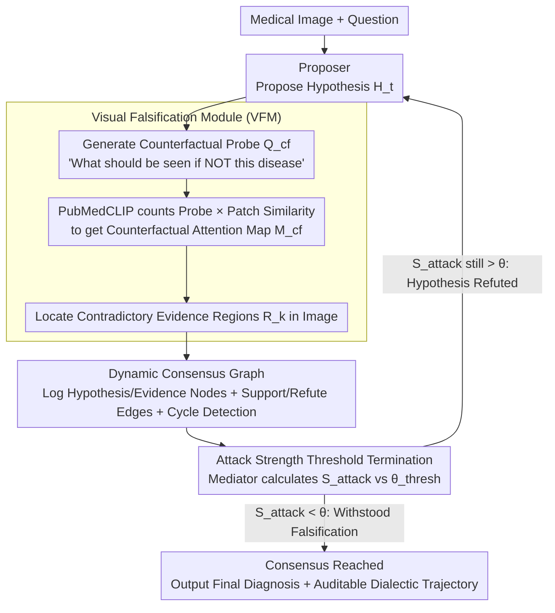

# Dialectic-Med: Mitigating Diagnostic Hallucinations via Counterfactual Adversarial Multi-Agent Debate

**Conference**: ACL 2026  
**arXiv**: [2604.11258](https://arxiv.org/abs/2604.11258)  
**Code**: None  
**Area**: Hallucination Detection  
**Keywords**: Medical Hallucinations, Multi-Agent Debate, Counterfactual Reasoning, Visual Falsification, Confirmation Bias

## TL;DR
Proposes Dialectic-Med, a multi-agent medical diagnostic framework inspired by Popper’s falsificationism. Through adversarial dialectic reasoning among a Proposer (diagnostic hypothesis), an Opposer (Visual Falsification Module actively retrieving contradictory visual evidence), and a Mediator (weighted consensus graph decision), it achieves SOTA on MIMIC-CXR-VQA, VQA-RAD, and PathVQA, improving explanation faithfulness by 12.5% and significantly mitigating diagnostic hallucinations.

## Background & Motivation

**Background**: Multimodal LLMs are being integrated into high-stakes medical domains (radiology report generation, medical VQA), but they face severe diagnostic hallucination issues—models tend toward confirmation bias, generating fluent but factually incorrect diagnostic statements.

**Limitations of Prior Work**: (1) LLMs often "lock" onto initial textual hypotheses and then "hallucinate" visual features to support these potentially erroneous conclusions, leading to error propagation; (2) CoT reasoning is inherently linear forward reasoning, lacking an intrinsic self-correction mechanism—it tends to seek evidence validating current steps rather than challenging them (the "Verificationism Trap"); (3) Most existing multi-agent systems rely on static consensus or text-only debates without being driven by visual evidence.

**Key Challenge**: Robust diagnosis should not rely solely on finding supporting evidence but should withstand rigorous falsification attempts—yet existing methods lack a falsification mechanism.

**Goal**: Design a multi-agent framework that explicitly models the falsification process, forcing the system to break confirmation bias loops and ground reasoning firmly in adversarially scrutinized visual regions.

**Key Insight**: Stemming from Popper's philosophy of science—falsificationism—a diagnosis should establish credibility by "trying to refute it and failing."

**Core Idea**: An adversarial dialectic loop among three specialized agents (Proposer for diagnosis + Opposer for visual falsification + Mediator for consensus). The key innovation lies in the Opposer's Visual Falsification Module—replacing semantic debate with the active retrieval of contradictory visual evidence.

## Method

### Overall Architecture

Dialectic-Med aims to resolve the most insidious failure mode in medical diagnosis: the model locking onto a hypothesis textually and then "hallucinating" non-existent image features to justify it. It transforms diagnosis into a refereed adversarial debate—the Proposer suggests a diagnostic hypothesis based on medical images; the Opposer, rather than engaging in semantic disputes, generates counterfactual probes to actively search for contradictory evidence in the image; the Mediator assesses the attack strength to decide if the Proposer must revise. Across iterations, all hypotheses, evidence, and their support/refutation relationships are recorded in a dynamic consensus graph until a hypothesis withstands all falsification attempts (consensus reached) or the maximum rounds are met.

### Key Designs

**1. Visual Falsification Module (VFM): Grounding "Refutation" in Image Evidence**

Purely textual multi-agent debates have a fundamental flaw—the Opposer's doubts often stem from priors in parameters rather than the image at hand, leading to disconnected arguments. VFM forces the Opposer to pin its challenges to specific pixel regions: given the current hypothesis $H_t$ (e.g., "pneumonia"), it generates a counterfactual probe query $Q_{cf}$, asking "If this is not pneumonia, what should be seen?" (e.g., "clear costophrenic angles"—a sign pneumonia should not exhibit). It then uses PubMedCLIP to calculate the cosine similarity between this probe and image patches, producing an attention map $M_{cf}$. Regions with high attention represent actual contradictory evidence existing in the image. Consequently, the Opposer no longer refutes arbitrarily but speaks through specific image regions, breaking the confirmation bias loop with the hard constraint of "what is actually in the image."

**2. Dynamic Consensus Graph: Making the Dialectic Trajectory Traceable and Auditable**

Simple majority voting only yields a final count, losing crucial clinical audit information like "why the revision occurred" or "which evidence was fatal." Dialectic-Med precipitates every round of debate into a graph: nodes $\mathcal{V}_t$ are diagnostic hypotheses or visual evidence, and edges $\mathcal{E}_t$ encode supporting/refuting logic and confidence weights. The graph includes cycle detection to prevent hypotheses from circling back to old paths. The credibility of each Opposer attack is quantified as the attack strength:

$$S_{attack} = \frac{1}{|R_k|}\sum_{r \in R_k} \alpha_r,$$

which is the mean weight of all retrieved contradictory evidence regions $R_k$ in that round. The entire graph preserves the complete dialectic context, ensuring the final diagnosis is not just an answer but a playback of "how it withstood scrutiny," satisfying the explainability needs of medical scenarios.

**3. Attack Strength Threshold Termination: Deciding When to Stop via "Refutability"**

Debates requires a stopping condition to avoid infinite loops or being misled by trivial weak attacks. Dialectic-Med uses attack strength as the referee: when $S_{attack} < \theta_{thresh}$, it indicates the Opposer can no longer find strong enough contradictory evidence, meaning the current hypothesis has withstood falsification attempts. The debate terminates, and consensus is reached. Otherwise, the Proposer is forced to correct the hypothesis for the next round. This threshold mechanism operationalizes Popper's principle—that credibility comes not from how much supporting evidence is found, but from "failing to refute it" after trying—into an executable criterion.

### Mechanism

Using a chest X-ray with an initial hypothesis of "pneumonia" as an example: The Proposer first gives the "pneumonia" hypothesis and enters it as a node in the consensus graph. The Opposer generates the counterfactual probe "clear costophrenic angle" based on this. PubMedCLIP calculates $M_{cf}$, finding that the costophrenic angle regions are indeed clear and have high attention—this is evidence against pneumonia. Thus, $S_{attack}$ is high, exceeding $\theta_{thresh}$. The Mediator judges the attack as valid, forcing the Proposer to revise the hypothesis to "pleural effusion." In the next round, the Opposer generates probes for the new hypothesis; if no strong contradictory regions are found ($S_{attack} < \theta_{thresh}$), the debate stops. "Pleural effusion" is adopted as the conclusion that withstood falsification. The consensus graph records the auditable trajectory: "pneumonia → refuted by costophrenic angle evidence → pleural effusion → unable to be refuted." The paper reports that such debates typically converge in 3–5 rounds.

## Key Experimental Results

### Main Results

| Method | MIMIC-CXR-VQA | VQA-RAD | PathVQA |
|------|--------------|---------|---------|
| Single Agent CoT | Baseline | Baseline | Baseline |
| Multi-Agent Consensus | +Medium | +Medium | +Medium |
| **Ours** | **SOTA** | **SOTA** | **SOTA** |

### Key Findings
- **Visual falsification is the key differentiator**: Multi-agent methods using only semantic debate provided limited improvement; VFM brought essential gains.
- **Confirmation bias is severe in standard CoT**: Models "see" non-existent visual features to support incorrect hypotheses.
- **3-5 rounds of debate are usually sufficient for consensus**, making computational overhead manageable.
- **12.5% increase in explanation faithfulness** indicates that diagnoses are not only more accurate but also more explainable and trustworthy.

## Highlights & Insights
- **Operationalizing Popper's falsificationism into AI design principles** is a profound insight—not just searching for supporting evidence, but actively seeking opposing evidence. This principle can be transferred to any high-stakes scenario requiring reliable reasoning.
- **VFM turns "debate" from a language game into a visual evidence-driven scientific process**—Opposers do not refute at will but speak through actual image regions.
- **Direct value for Medical AI safety**: The falsification mechanism can serve as a safety guarantee layer before clinical deployment.

## Limitations & Future Work
- VFM relies on the visual-language alignment quality of PubMedCLIP, which may degrade on rare pathologies.
- Multi-turn debates increase inference latency, imposing constraints on real-time diagnosis.
- The quality of counterfactual probes depends on the completeness of medical knowledge $\mathcal{K}_{med}$.
- Validated only on VQA tasks; more complex tasks like radiology report generation await exploration.
- The construction and traversal of the consensus graph increase system complexity.

## Related Work & Insights
- **vs Standard CoT**: CoT is linear verificational reasoning; Dialectic-Med is iterative falsificational reasoning.
- **vs Multi-Agent (e.g., CAMEL)**: CAMEL uses role-playing for collaboration; Dialectic-Med uses adversarial dialectics—the latter is better suited for scenarios requiring scrutiny.
- **vs Med-PaLM**: Med-PaLM pursues single-model accuracy; Dialectic-Med ensures trustworthiness through system design.

## Rating
- Novelty: ⭐⭐⭐⭐⭐ The combination of falsificationism and the Visual Falsification Module is a brand-new paradigm.
- Experimental Thoroughness: ⭐⭐⭐⭐ Three benchmarks + faithfulness evaluation, though ablation details are slightly sparse.
- Writing Quality: ⭐⭐⭐⭐⭐ The connection between philosophical motivation and technical implementation is very natural.
- Value: ⭐⭐⭐⭐⭐ High significance for medical AI safety and trustworthy reasoning.

<!-- RELATED:START -->

## Related Papers

- [\[AAAI 2026\] MUG: Multi-agent Undercover Gaming — Hallucination Removal via Counterfactual Test for Multimodal Reasoning](../../AAAI2026/hallucination/multi-agent_undercover_gaming_hallucination_removal_via_coun.md)
- [\[AAAI 2026\] InEx: Hallucination Mitigation via Introspection and Cross-Modal Multi-Agent Collaboration](../../AAAI2026/hallucination/inex_hallucination_mitigation_via_introspection_and_cross-mo.md)
- [\[ACL 2026\] Stable-RAG: Mitigating Retrieval-Permutation-Induced Hallucinations in Retrieval-Augmented Generation](stable-rag_mitigating_retrieval-permutation-induced_hallucinations_in_retrieval-.md)
- [\[CVPR 2026\] SEASON: Mitigating Temporal Hallucination in Video Large Language Models via Self-Diagnostic Contrastive Decoding](../../CVPR2026/hallucination/season_mitigating_temporal_hallucination_in_video_large_language_models_via_self.md)
- [\[ACL 2025\] Removal of Hallucination on Hallucination: Debate-Augmented RAG](../../ACL2025/hallucination/removal_of_hallucination_on_hallucination_debate-augmented_rag.md)

<!-- RELATED:END -->
