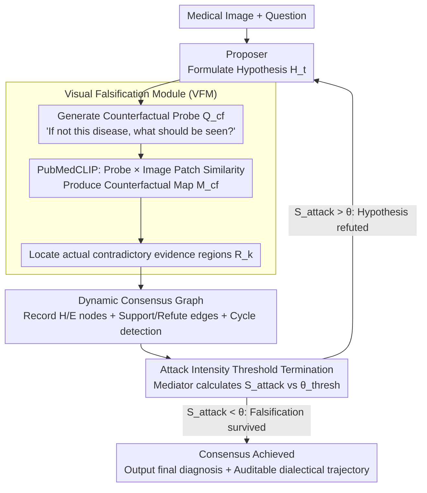

# Dialectic-Med: Mitigating Diagnostic Hallucinations via Counterfactual Adversarial Multi-Agent Debate

**Conference**: ACL 2026  
**arXiv**: [2604.11258](https://arxiv.org/abs/2604.11258)  
**Code**: None  
**Area**: Hallucination Detection  
**Keywords**: Medical Hallucination, Multi-Agent Debate, Counterfactual Reasoning, Visual Falsification, Confirmation Bias

## TL;DR
Ours proposes Dialectic-Med, a multi-agent medical diagnostic framework inspired by Popper’s falsificationism. Through adversarial dialectical reasoning among a Proposer (diagnostic hypothesis), an Opponent (Visual Falsification Module actively retrieving contradictory evidence), and a Mediator (weighted consensus graph decision), it achieves SOTA on MIMIC-CXR-VQA, VQA-RAD, and PathVQA, improving explanation faithfulness by 12.5% and significantly mitigating diagnostic hallucinations.

## Background & Motivation

**Background**: Multimodal LLMs are being integrated into high-stakes medical fields (radiology report generation, medical VQA), but they face severe diagnostic hallucination issues—models tend toward confirmation bias, generating fluent but factually incorrect diagnostic statements.

**Limitations of Prior Work**: (1) LLMs often "lock onto" a preliminary textual hypothesis and then "hallucinate" visual features to support this potentially erroneous conclusion, leading to error propagation; (2) CoT reasoning is inherently linear forward reasoning, lacking intrinsic self-correction mechanisms—it tends to seek evidence verifying the current step rather than challenging it (the "verificationist trap"); (3) Existing multi-agent systems mostly rely on static consensus or text-only debate without being driven by visual evidence.

**Key Challenge**: A robust diagnosis should not only rely on finding supportive evidence but should also withstand rigorous falsification attempts—yet existing methods lack a falsification mechanism.

**Goal**: Design a multi-agent framework that explicitly models the falsification process, forcing the system to break the cycle of confirmation bias and anchor reasoning firmly on adversarially scrutinized visual regions.

**Key Insight**: Drawing from Popper's philosophy of science—falsificationism—a diagnosis establishes credibility by "attempting to refute it and failing."

**Core Idea**: An adversarial dialectical loop featuring three specialized Agents (Proposer for diagnosis, Opponent for visual falsification, and Mediator for consensus). The key innovation lies in the Opponent's Visual Falsification Module—not a semantic debate, but proactive retrieval of contradictory visual evidence.

## Method

### Overall Architecture

Dialectic-Med aims to resolve the most insidious failure mode in medical diagnosis: the model first locks onto a hypothesis in text, then "hallucinates" features not actually present in the image to justify itself. The solution is to turn diagnosis into a refereed adversarial debate. The Proposer offers a diagnostic hypothesis based on the medical image; the Opponent, instead of engaging in semantic arguments, generates counterfactual probes and returns to the image to actively search for contradictory evidence; the Mediator evaluates the strength of this attack and decides whether to force the Proposer to revise. Through iterations, all hypotheses, evidence, and their support/refutation relationships are recorded in a dynamic consensus graph until a hypothesis withstands all falsification attempts (consensus reached) or the maximum rounds are met.

### Key Designs

**1. Visual Falsification Module (VFM): Transforming "Refutation" from Textual Dispute to Evidence Retrieval**

Text-only multi-agent debate suffers from a fundamental flaw—the Opponent's skepticism often stems from priors in the parameters rather than the image at hand, leading to a disconnect from visual reality. VFM forces the Opponent to anchor challenges in specific pixel regions. Given the current hypothesis $H_t$ (e.g., "pneumonia"), it generates a counterfactual probe query $Q_{cf}$, asking "if it were not pneumonia, what should be seen" (e.g., "clear costophrenic angles"—a sign that should not exist in pneumonia). It then uses PubMedCLIP to calculate cosine similarity between this probe and image patches, generating an attention map $M_{cf}$. High-attention areas represent contradictory evidence actually existing in the image. Consequently, the Opponent no longer refutes arbitrarily but speaks through specific image regions, breaking the confirmation bias loop with the hard constraint of "what is actually in the image."

**2. Dynamic Consensus Graph: Making the Dialectical Trajectory Traceable and Auditable**

Simple majority voting only yields a final count, losing clinical information such as "why the hypothesis changed" or "which evidence was most lethal." Dialectic-Med precipitates every round of debate into a graph: nodes $\mathcal{V}_t$ represent diagnostic hypotheses or visual evidence, and edges $\mathcal{E}_t$ encode the logic of support/refutation and confidence weights. The graph includes cycle detection to prevent hypotheses from reverting to old paths or falling into circular reasoning. The credibility of each Opponent attack is quantified as attack intensity:

$$S_{attack} = \frac{1}{|R_k|}\sum_{r \in R_k} \alpha_r,$$

defined as the mean weight of all contradictory evidence regions $R_k$ retrieved in that round. The entire graph preserves the complete dialectical context, ensuring the final diagnosis is not just an answer but a playback of "how it withstood scrutiny," meeting the explainability needs of medical scenarios.

**3. Attack Intensity Threshold Termination: Deciding When to Stop via "Resilience to Refutation"**

Debates require a stopping condition; otherwise, they either loop infinitely or are diverted by trivial weak attacks. Dialectic-Med uses attack intensity as the referee: when $S_{attack} < \theta_{thresh}$, it indicates the Opponent cannot find sufficiently strong contradictory evidence, meaning the current hypothesis has survived falsification attempts. The debate terminates and consensus is reached. Otherwise, the Proposer is forced to revise the hypothesis for the next round. This threshold mechanism operationalizes Popper's principle that "credibility comes from surviving refutation"—a diagnosis is trustworthy not because of how much support it found, but because it "could not be overthrown."

### Full Example

Consider a chest X-ray with an initial hypothesis of "pneumonia": The Proposer offers the "pneumonia" hypothesis, which enters the consensus graph as a node. The Opponent generates a counterfactual probe "clear costophrenic angles." PubMedCLIP calculates the attention map $M_{cf}$ and finds that the costophrenic angle regions are indeed clear with high attention—this is evidence against pneumonia, resulting in a high $S_{attack}$ exceeding $\theta_{thresh}$. The Mediator determines the attack is valid and forces a revision; the hypothesis shifts to "pleural effusion." In the next round, the Opponent generates probes for the new hypothesis. If no strong contradictory regions are found ($S_{attack} < \theta_{thresh}$), the debate stops. "Pleural effusion" is adopted as the conclusion that survived falsification. The consensus graph records the auditable trajectory: "pneumonia $\rightarrow$ refuted by clear costophrenic angles $\rightarrow$ pleural effusion $\rightarrow$ could not be further refuted." The paper reports that such debates typically converge in 3–5 rounds.

## Key Experimental Results

### Main Results

| Method | MIMIC-CXR-VQA | VQA-RAD | PathVQA |
|------|--------------|---------|---------|
| Single Agent CoT | Baseline | Baseline | Baseline |
| Multi-Agent Consensus | +Moderate | +Moderate | +Moderate |
| **Dialectic-Med** | **SOTA** | **SOTA** | **SOTA** |

### Key Metric Gains

| Metric | Gain |
|------|------|
| Explanation Faithfulness | +12.5% |
| Diagnostic Accuracy | SOTA |
| Hallucination Rate | Significantly Reduced |

### Key Findings
- **Visual falsification is the key differentiator**: Multi-agent methods using only semantic debate show limited improvement; VFM provides a fundamental boost.
- **Confirmation bias is severe in standard CoT**: Models "see" non-existent visual features to support incorrect hypotheses.
- **3-5 rounds of debate are usually sufficient** for consensus, keeping computational overhead manageable.
- **A 12.5% increase in explanation faithfulness** indicates that diagnoses are not only more accurate but also more explainable and trustworthy.

## Highlights & Insights
- **Operationalizing Popperian falsificationism into AI system design** is a profound insight—not just seeking supporting evidence, but actively seeking opposing evidence. This principle can be transferred to any high-stakes scenario requiring reliable reasoning.
- **VFM transforms "debate" from a language game into a visual evidence-driven scientific process**—the Opponent refutes based on actual image regions rather than arbitrary claims.
- **Direct value for Medical AI safety**: The falsification mechanism can serve as a safety assurance layer before clinical deployment.

## Limitations & Future Work
- VFM relies on the quality of PubMedCLIP's vision-language alignment, which may degrade in rare pathologies.
- Multi-round debate increases inference latency, placing constraints on real-time diagnostics.
- The quality of counterfactual probes depends on the completeness of medical knowledge $\mathcal{K}_{med}$.
- Only verified on VQA tasks; more complex tasks like radiology report generation remain to be explored.
- The construction and traversal of the consensus graph increase system complexity.

## Related Work & Insights
- **vs. Standard CoT**: CoT is linear verificationist reasoning; Dialectic-Med is iterative falsificationist reasoning.
- **vs. Multi-Agent (e.g., CAMEL)**: CAMEL uses role-playing collaboration; Dialectic-Med uses adversarial dialectics—the latter is more suitable for scenarios requiring scrutiny.
- **vs. Med-PaLM**: Med-PaLM pursues single-model accuracy; Dialectic-Med ensures trustworthiness through system design.

## Rating
- Novelty: ⭐⭐⭐⭐⭐ The combination of falsificationism and the Visual Falsification Module is a brand-new paradigm.
- Experimental Thoroughness: ⭐⭐⭐⭐ Three benchmarks plus faithfulness evaluation, though ablation details are slightly sparse.
- Writing Quality: ⭐⭐⭐⭐⭐ The connection between philosophical motivation and technical implementation is very natural.
- Value: ⭐⭐⭐⭐⭐ High significance for medical AI safety and trustworthy reasoning.

<!-- RELATED:START -->

## Related Papers

- [\[AAAI 2026\] MUG: Multi-agent Undercover Gaming — Hallucination Removal via Counterfactual Test for Multimodal Reasoning](../../AAAI2026/hallucination/multi-agent_undercover_gaming_hallucination_removal_via_coun.md)
- [\[AAAI 2026\] InEx: Hallucination Mitigation via Introspection and Cross-Modal Multi-Agent Collaboration](../../AAAI2026/hallucination/inex_hallucination_mitigation_via_introspection_and_cross-mo.md)
- [\[ACL 2026\] Stable-RAG: Mitigating Retrieval-Permutation-Induced Hallucinations in Retrieval-Augmented Generation](stable-rag_mitigating_retrieval-permutation-induced_hallucinations_in_retrieval-.md)
- [\[ACL 2025\] Removal of Hallucination on Hallucination: Debate-Augmented RAG](../../ACL2025/hallucination/removal_of_hallucination_on_hallucination_debate-augmented_rag.md)
- [\[ICML 2026\] REALISTA: Realistic Latent Adversarial Attacks that Elicit LLM Hallucinations](../../ICML2026/hallucination/realista_realistic_latent_adversarial_attacks_that_elicit_llm_hallucinations.md)

<!-- RELATED:END -->
