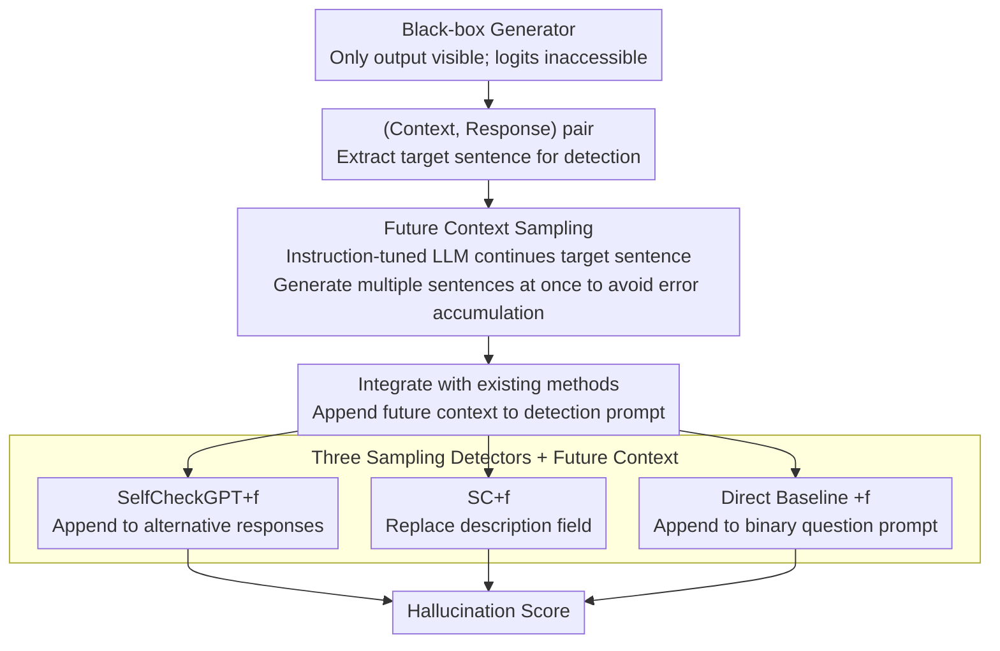

# Enhancing Hallucination Detection via Future Context

**Conference**: ACL 2026 Findings  
**arXiv**: [2507.20546](https://arxiv.org/abs/2507.20546)  
**Code**: None  
**Area**: Hallucination Detection  
**Keywords**: Hallucination Detection, Future Context, Black-box Generator, Sampling Methods, Snowball Effect

## TL;DR

This paper proposes utilizing sampled "future context" (subsequent sentences) to enhance hallucination detection in black-box scenarios. By leveraging the "snowball effect"—where hallucinations tend to propagate once they occur—the method consistently improves performance across various sampling-based approaches such as SelfCheckGPT and SC.

## Background & Motivation

**Background**: LLM hallucination detection methods are primarily categorized into uncertainty-based (requiring logit access) and sampling-based (e.g., SelfCheckGPT, which checks consistency across multiple generated responses). In practical scenarios—such as blog posts or API services being updated or deprecated—internal signals of the generator are often inaccessible.

**Limitations of Prior Work**: (1) Uncertainty-based methods require token-level logits, which is infeasible for black-box models. (2) Retrieval-based methods are limited by access to internal documents or private knowledge bases and fail to detect logical hallucinations or internal inconsistencies (35.2% of self-contradictory hallucinations cannot be identified via retrieval). (3) Existing sampling methods rely solely on alternative samples of the "current context" and neglect signals from "future context."

**Key Challenge**: While hallucinations tend to persist and amplify in subsequent generations (the snowball effect), existing methods focus only on the consistency of the current sentence, ignoring cues provided by future context.

**Goal**: To enhance the hallucination detection capabilities of existing sampling methods by using future context as an additional signal.

**Key Insight**: An instruction-tuned LLM is used to generate potential continuations following the target sentence. These future contexts are appended to the detection prompt to provide richer evidence for hallucination judgment.

**Core Idea**: If the current sentence is a hallucination, its future context is more likely to contain hallucinatory information—leveraging this "contagiousness" as a detection signal.

## Method

### Overall Architecture

The method revolves around a counter-intuitive observation: once a hallucination emerges, it often spreads in subsequent sentences (the snowball effect). Thus, "what would be generated after the target sentence" serves as a clue to judge its veracity. The pipeline consists of three steps: first, the black-box generator produces a "context-response" pair (only the output is visible, without logits); second, an instruction-tuned LLM samples several "future contexts" for the target sentence, i.e., sentences that might follow it; finally, these future contexts are integrated into the prompts of existing detection methods (SelfCheckGPT, SC, Direct), providing "downstream evidence" for detectors originally focused only on the current sentence. This process does not involve the generator's internals, making it naturally compatible with real-world black-box scenarios.

### Key Designs

**1. Future Context Sampling: Transforming Hallucination "Contagiousness" into Observable Signals**

Existing sampling methods only resample around the target sentence itself (current context), remaining within the same sentence and missing the traces of hallucination diffusion. In contrast, this work uses an instruction-tuned LLM to write "what might be said next" and defines a single sampling path of generated sentences as a "future context." When multiple subsequent sentences are needed, the authors find that generating them all at once is more effective than sequential generation—sequential generation causes error accumulation, whereas one-shot generation is more coherent and efficient. This is effective precisely due to the snowball effect: if the target sentence is a hallucination, the probability of hallucinations in subsequent sentences increases, making "hallucinations emerging later" evidence against the target sentence.

**2. Integration with Existing Methods: Augmenting Sampling Detectors via Appending**

The internal logic of different detection methods varies, making individual modifications costly. The authors employ a unified strategy: appending the future context directly into the detection prompt without altering the underlying judgment logic. For SelfCheckGPT+f, the future context is attached to alternative responses to expand the scope of consistency checking. For SC+f, it replaces the original description field. For Direct+f, the future context is added to the binary query prompt to supplement internal knowledge-based judgment. As this is an "augmentation" rather than a "rewrite," future context acts as a universal plug-in for any sampling method.

**3. Direct Baseline: Direct Hallucination Querying**

Methods like SelfCheckGPT rely on multiple samplings and consistency statistics, which can be computationally heavy. "Direct" simplifies the task to its most basic form: for each "sentence-cue" pair, a binary question ("Is this sentence accurate?") is posed to the LLM detector. The detector uses its internal knowledge and reasoning to give an answer, and the judgments are averaged into a hallucination score. This serves as a concise baseline and provides an experimental condition to cleanly isolate the specific contribution of future context.

### Loss & Training

No model training is involved. Pre-trained instruction-tuned models (LLaMA 3.1, Gemma 3, Qwen 2.5) are used as detectors and samplers.

## Key Experimental Results

### Main Results

**Hallucination Detection AUC-PR (Average across 6 datasets)**

| Detector | Method | Without Future Context | With Future Context | Gain |
|--------|------|------------|------------|------|
| LLaMA 3.1 | Direct | 68.9 | **71.1** | +2.2 |
| LLaMA 3.1 | SelfCheckGPT | 73.5 | **74.8** | +1.3 |
| LLaMA 3.1 | SC | 65.7 | **70.8** | +5.1 |
| Gemma 3 | SelfCheckGPT | 69.4 | **72.4** | +3.0 |
| Qwen 2.5 | Direct | 67.4 | **69.4** | +2.0 |

### Key Findings

- Future context **consistently** improves performance across all methods and detector models.
- The SC method gains the most (+5.1) because the original SC has fewer clues, and future context provides significant information gain.
- Increasing the number of samples for future context further enhances performance.
- Future context also **reduces sampling costs**—when combined with SelfCheckGPT, equivalent performance can be achieved with fewer alternative responses.
- Empirical evidence validates the snowball effect: the probability of subsequent sentences being hallucinations is significantly higher following a hallucinated sentence than a non-hallucinated one.

## Highlights & Insights

- Utilizing the "contagiousness" of hallucinations (snowball effect) as a detection signal is clever and counter-intuitive—hallucination propagation is typically viewed as a defect, but here it is transformed into a tool for detection.
- The universality and simplicity of the method are major advantages; as an "augmentation" strategy, it can strengthen any sampling-based approach.
- The generator-agnostic nature makes it suitable for real-world black-box scenarios such as blogs and APIs.

## Limitations & Future Work

- Additional sampling steps are required to generate future context, increasing inference costs.
- The future context itself may contain hallucinations, potentially introducing noise.
- Detection is performed only at the sentence level and has not been extended to the claim or paragraph levels.
- The experimental datasets primarily consist of Wikipedia-style factual texts, leaving dialogue or creative writing scenarios uncovered.

## Related Work & Insights

- **vs SelfCheckGPT**: While SelfCheckGPT uses alternative samples of the current context, Ours introduces sampled future context.
- **vs Uncertainty-based methods**: Ours operates entirely in a black-box setting without requiring logit access.

## Rating

- Novelty: ⭐⭐⭐⭐ The idea of using the snowball effect for detection is novel, though the implementation is a simple augmentation.
- Experimental Thoroughness: ⭐⭐⭐⭐⭐ Comprehensive evaluation across three detectors, six datasets, and three methods.
- Writing Quality: ⭐⭐⭐⭐ Clear motivation and rigorous experimental design.
- Value: ⭐⭐⭐⭐ Provides a simple and effective enhancement for black-box hallucination detection.

<!-- RELATED:START -->

## Related Papers

- [\[ICLR 2026\] Enhancing Hallucination Detection through Noise Injection](../../ICLR2026/hallucination/enhancing_hallucination_detection_through_noise_injection.md)
- [\[ACL 2026\] The Reasoning Trap: How Enhancing LLM Reasoning Amplifies Tool Hallucination](the_reasoning_trap_how_enhancing_llm_reasoning_amplifies_tool_hallucination.md)
- [\[AAAI 2026\] ESG-Bench: Benchmarking Long-Context ESG Reports for Hallucination Mitigation](../../AAAI2026/hallucination/esg-bench_benchmarking_long-context_esg_reports_for_hallucination_mitigation.md)
- [\[ACL 2026\] Hallucination Detection in LLMs with Topological Divergence on Attention Graphs](hallucination_detection_in_llms_with_topological_divergence_on_attention_graphs.md)
- [\[ACL 2026\] MultiHaluDet: Multilingual Hallucination Detection via LLM Hidden State Probing](multihaludet_multilingual_hallucination_detection_via_llm_hidden_state_probing.md)

<!-- RELATED:END -->
