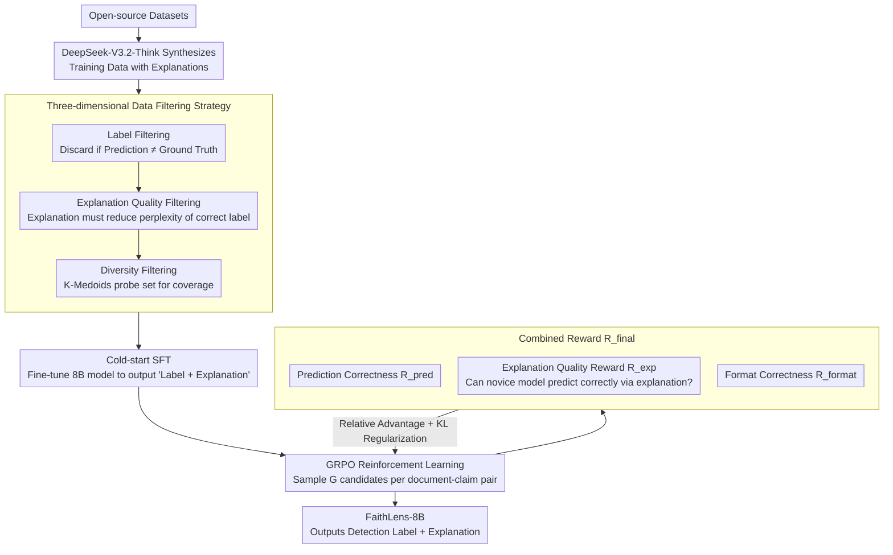

# FaithLens: Detecting and Explaining Faithfulness Hallucination

**Conference**: ACL 2026 Findings  
**arXiv**: [2512.20182](https://arxiv.org/abs/2512.20182)  
**Code**: [https://github.com/S1s-Z/FaithLens](https://github.com/S1s-Z/FaithLens)  
**Area**: Hallucination Detection  
**Keywords**: Faithfulness Hallucination, Interpretable Detection, Rule-based Reinforcement Learning, Data Filtering, Cross-task Generalization

## TL;DR

This paper proposes FaithLens, an 8B parameter faithfulness hallucination detection model. It undergoes cold-start SFT using high-quality data synthesis combined with three-dimensional filtering (label correctness, explanation quality, and data diversity), followed by further optimization via rule-based reinforcement learning (prediction correctness reward + explanation quality reward). It surpasses GPT-5.2 and o3 across 12 tasks while providing high-quality explanatory outputs.

## Background & Motivation

**Background**: LLMs are widely used for context-based text generation (e.g., RAG, summarization), but are prone to generating "faithfulness hallucinations" that are inconsistent with or irrelevant to the given context. Detecting such hallucinations is crucial for responsible LLM services.

**Limitations of Prior Work**: (1) Lack of interpretability—existing methods treat hallucination detection as black-box binary classification, outputting labels without reasons, preventing users from locating and understanding errors; (2) Inconsistent cross-task generalization—different tasks have distinct hallucination patterns (subtle distortions in summaries vs. contradictory claims in RAG), leading to uneven performance; (3) Lack of high-quality data—annotation is costly with low consistency, and synthetic data often lacks quality control.

**Key Challenge**: Achieving high detection accuracy and high explanation quality simultaneously is difficult. SFT training prompts models to imitate data, causing them to memorize simple samples while generalizing poorly in complex scenarios, and the quality of free-form explanations is hard to verify via rules.

**Goal**: Construct a cost-effective hallucination detection model that outputs both results and explanatory notes, achieving SOTA performance across 12 diverse tasks.

**Key Insight**: A two-stage training approach—initial cold-start SFT with meticulously filtered synthetic data, followed by GRPO reinforcement learning using specifically designed rule rewards (prediction correctness + explanation quality).

**Core Idea**: The key insight for the explanation quality reward is that if an explanation helps a "novice model" (un-tuned Llama-3.1-8B) correctly predict the label, the explanation is sufficiently clear and informative.

## Method

### Overall Architecture

FaithLens addresses the dual challenge of accuracy and explainability through a two-stage process. The first stage involves cold-start SFT: starting from open-source datasets, an advanced reasoning model (DeepSeek-V3.2-Think) synthesizes training data with explanations. After three-dimensional filtering to remove noise, an 8B model is fine-tuned to output "label + explanation." The second stage uses rule-based reinforcement learning: GRPO further optimizes the model using rewards based on prediction correctness, explanation quality, and format. The logic connecting these stages is that SFT teaches basic detection and formatting, while RL utilizes reward signals to improve robustness in complex scenarios.

### Key Designs

**1. Three-dimensional Data Filtering Strategy: Ensuring synthesis data is correct, informative, and comprehensive.**

Unfiltered synthetic data contains significant noise and excessive simple samples; direct SFT causes models to memorize easy cases. FaithLens employs three progressive filters. **Label Filtering** compares LLM predictions with ground truth, discarding mismatches—since explanations paired with wrong labels are often "self-consistent" but misleading. **Explanation Quality Filtering** measures whether the explanation reduces the model's perplexity for the correct label, retaining only informative samples. **Diversity Filtering** uses K-Medoids clustering to build a probe set, testing if a candidate sample helps the model predict diversity-representative samples correctly. These filters tighten the requirements from correctness to informativeness to scenario coverage.

**2. Explanation Quality Reward: Scoring free-form text by "whether a novice can understand your explanation."**

Verifying the quality of free-form explanations with rules is difficult. FaithLens uses a proxy evaluation: the generated explanation $e$ is fed alongside the document and claim to a "novice model" (un-tuned Llama-3.1-8B-Instruct). If the novice model predicts the label correctly based on the explanation, the reward is $1$, otherwise $0$. This is integrated into the total reward $R_{\text{final}} = R_{\text{pred}} + R_{\text{exp}} + R_{\text{format}}$. The criterion is: "If an untrained novice can reach the correct answer following your explanation, the explanation is clear and informative." This converts an unverifiable text quality problem into a verifiable classification problem.

**3. GRPO Reinforcement Learning Training: Mastering complex scenarios via exploration beyond SFT.**

A common pitfall of SFT is memorizing simple samples while failing on complex ones. FaithLens follows SFT with Group Relative Policy Optimization (GRPO). For each document-claim pair, $G$ candidates (explanation + prediction) are generated and scored by the combined rewards. The policy is updated via intra-group relative advantage estimation with KL divergence regularization to prevent deviation from the reference policy. Unlike the passive imitation in SFT, RL uses active exploration and reward-driven updates to force the model to produce high-quality outputs for complex samples that cannot be solved by memorization.

### Loss & Training

The SFT stage uses standard cross-entropy loss on filtered synthetic data. The RL stage employs GRPO, where Combined Reward = Prediction Correctness (0/1) + Explanation Quality (0/1) + Format Correctness (0/1). The base model is Llama-3.1-8B-Instruct.

## Key Experimental Results

### Main Results

**Overall Performance across 12 Tasks (Balanced Accuracy %)**

| Model | Std. Dev. ↓ | Mean ↑ |
|------|---------|---------|
| GPT-4o | 7.0 | 76.1 |
| o3 | 6.0 | 82.1 |
| GPT-5.2 | - | 85.3 |
| Claude-3.7-Sonnet | 5.3 | 82.6 |
| DeepSeek-V3.2-Think | 5.1 | 84.4 |
| MiniCheck-7B | 9.3 | 76.7 |
| **FaithLens-8B (Ours)** | **4.1** | **85.8** |

### Ablation Study

| Configuration | Mean Accuracy | Description |
|------|----------|------|
| Full FaithLens | 85.8 | Complete model |
| w/o RL (SFT only) | 82.3 | RL contribution +3.5 |
| w/o Explanation Reward | 84.1 | Explanation reward contribution +1.7 |
| w/o Data Filtering | 79.8 | Filtering contribution +6.0 |
| w/o Diversity Filtering | 81.5 | Diversity filtering contribution +4.3 |

### Key Findings

- FaithLens-8B surpasses GPT-5.2 (85.8 vs 85.3) and o3 (82.1) with an order of magnitude advantage in cost.
- It achieves the lowest standard deviation (4.1), indicating the most stable cross-task generalization, solving the "strong in some tasks, weak in others" issue of prior methods.
- The contribution of data filtering (+6.0) is greater than RL (+3.5), highlighting high-quality training data as the foundation.
- Diversity filtering is crucial for cross-task generalization; accuracy drops by 4.3 percentage points without it.
- The explanation quality reward not only improves explanations but also indirectly boosts detection accuracy (+1.7), suggesting an inherent regularization effect in the "explanation → prediction" process.

## Highlights & Insights

- The "novice model proxy evaluation" is an elegant solution for assessing free-form explanation quality, transforming unverifiable quality issues into verifiable correctness.
- The progressive "Label → Explanation → Diversity" 3D filtering ensures comprehensive data quality.
- Surpassing closed-source giant models with only 8B parameters demonstrates that "well-designed training strategies > brute-force scale."

## Limitations & Future Work

- The explanation quality reward depends on the novice model's capability; biases in the novice model may distort the reward signal.
- Synthetic data inherits biases from the source open-source datasets.
- Only English tasks were evaluated; multilingual generalization remains unverified.
- Future work could explore fine-grained explanation evaluation, such as sentence-level evidence anchoring.

## Related Work & Insights

- **vs MiniCheck**: MiniCheck trains a 7B classifier to reach GPT-4o levels using synthetic data but lacks explanation capabilities; FaithLens provides explanations and surpasses GPT-5.2.
- **vs SelfCheckGPT**: SelfCheckGPT relies on large model inference with low efficiency; FaithLens achieves better performance with an 8B model.
- **vs DeepSeek-V3.2-Think**: While the teacher model for synthesis is strong (84.4%), FaithLens surpasses the teacher through RL (85.8%).

## Rating

- Novelty: ⭐⭐⭐⭐ Innovative explanation reward and 3D filtering, though the SFT+RL framework is a standard paradigm.
- Experimental Thoroughness: ⭐⭐⭐⭐⭐ 12 tasks, multiple baselines (including GPT-5.2/o3), and detailed ablation.
- Writing Quality: ⭐⭐⭐⭐ Methods are clearly described with complete formulas.
- Value: ⭐⭐⭐⭐⭐ Extremely practical, achieving super-human performance with an 8B model while providing explanations.

<!-- RELATED:START -->

## Related Papers

- [\[ACL 2026\] Detecting Hallucinations in SpeechLLMs at Inference Time Using Attention Maps](detecting_hallucinations_in_speechllms_at_inference_time_using_attention_maps.md)
- [\[ACL 2026\] FinGround: Detecting and Grounding Financial Hallucinations via Atomic Claim Verification](finground_detecting_and_grounding_financial_hallucinations_via_atomic_claim_veri.md)
- [\[ACL 2026\] TPA: Next Token Probability Attribution for Detecting Hallucinations in RAG](tpa_next_token_probability_attribution_for_detecting_hallucinations_in_rag.md)
- [\[ICLR 2026\] LUMINA: Detecting Hallucinations in RAG System with Context-Knowledge Signals](../../ICLR2026/hallucination/lumina_detecting_hallucinations_in_rag_system_with_context-knowledge_signals.md)
- [\[ICML 2026\] From Flat Facts to Sharp Hallucinations: Detecting Stubborn Errors via Gradient Sensitivity](../../ICML2026/hallucination/from_flat_facts_to_sharp_hallucinations_detecting_stubborn_errors_via_gradient_s.md)

<!-- RELATED:END -->
