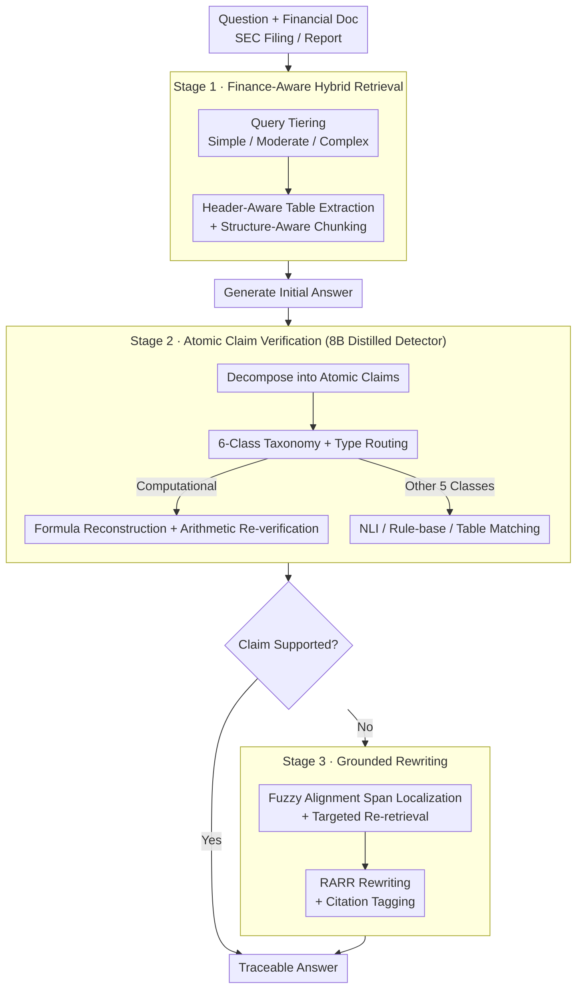

# FinGround: Detecting and Grounding Financial Hallucinations via Atomic Claim Verification

**Conference**: ACL 2026  
**arXiv**: [2604.23588](https://arxiv.org/abs/2604.23588)  
**Code**: Undisclosed  
**Area**: Hallucination Detection  
**Keywords**: Financial QA, Atomic Claim Verification, Formula Reconstruction, Table Attribution, Knowledge Distillation

## TL;DR
FinGround is a three-stage "verify-then-ground" pipeline for financial document QA: (1) finance-aware hybrid retrieval; (2) decomposing answers into atomic claims and verifying them using a type-routed strategy across a six-category taxonomy (Numerical, Temporal, Entity Property, Comparative, Regulatory, Computational—where computational claims use formula reconstruction and arithmetic re-verification); (3) grounded rewriting of unsupported claims with paragraph/cell-level citations. By distilling GPT-4o into an 8B detector, it achieves a 91.4% F1 score with 18× acceleration, reducing the hallucination rate by 78% compared to GPT-4o+CoT.

## Background & Motivation

**Background**: LLMs in the financial industry must ground answers in specific SEC filings or financial reports. However, even GPT-4-Turbo with RAG exhibits an 81% error rate on SEC QA (Islam 2023). Furthermore, the EU AI Act mandates a compliance deadline of August 2026 for high-risk financial AI, requiring "human oversight, explainability, and accuracy assurance."

**Limitations of Prior Work**: General hallucination detectors like FActScore and SAFE treat all claims equally. While they can extract atomic facts like "gross margin is 62.4%", they fail to align them with table cells for verification, missing 43% of computational errors. Rewriting methods like RARR assume a single evidence source and rewrite blindly without distinguishing claim types, causing 34% of computational claims to generate new hallucinations. Table-cell attribution suffers from 23% dangling citations if upstream chunking is not structure-aware.

**Key Challenge**: General hallucination detection seeks to be "domain-agnostic," but core errors in financial scenarios (arithmetic mistakes, fabricated regulatory citations, table misalignment) require "domain-awareness." The type of claim determines whether to use NLI, formula recalculation, or table matching. A one-size-fits-all NLI approach is destined to fail on ratio and margin verification.

**Goal**: (i) Unify detection and mitigation into a production-ready financial QA pipeline; (ii) design a claim-type routed verification strategy, specifically targeting computational errors; (iii) reduce costs to a level feasible for deployment ($\le$ $0.005/query); (iv) propose a "retrieval-equalized evaluation" protocol to decouple retrieval gains from verification gains.

**Key Insight**: An error analysis of 500 real financial hallucinations revealed that errors concentrate on six enumerable claim types, each with an optimal verification strategy. Therefore, the requirement is not a "stronger NLI model" but "routing by type."

**Core Idea**: Upgrade atomic-claim verification from a "single NLI black box" to a "multi-strategy ensemble routed by a 6-category financial claim taxonomy," where computational claims are handled via a three-step process: formula template matching, table cell extraction, and arithmetic re-verification.

## Method

### Overall Architecture

FinGround addresses hallucinations in financial document QA where "answers look correct but figures are miscalculated or evidence is fabricated." The pipeline follows a "verify-then-ground" flow: retrieve evidence, verify answers claim-by-claim, and rewrite unsupported sentences with traceable citations. The workflow comprises three stages: **Stage 1 Retrieval** uses RoBERTa-base to classify queries into Simple/Moderate/Complex tiers, utilizing BM25, dense retrieval with table extraction, or iterative retrieve-then-reason respectively. Table similarity is calculated using column-header-aware scoring: $\text{sim}(q,t)=\alpha\cdot\cos(\mathbf{q},\mathbf{t}_{\text{cell}})+(1-\alpha)\cdot\cos(\mathbf{q},\mathbf{t}_{\text{header}})$ ($\alpha=0.6$), with structure-aware chunking preserving row-column relationships and source tags $\langle\text{document, section, page, element\_type}\rangle$. **Stage 2 Verification** decomposes the answer into atomic claims, which are routed to different strategies based on the 6-class taxonomy, outputting states of supported / contradicted / unverifiable. This is executed by an 8B detector distilled from GPT-4o. **Stage 3 Rewriting** maps the latter two states back to the original answer spans via fuzzy alignment (edit distance $\le 3$), performs targeted re-retrieval, and rewrites using the RARR paradigm with inline citations such as `[Doc:d, §s, p.p]` or `[Doc:d, Table t, Row r, Col c]`. If $\ge 3$ claims require modification, paragraph-level regeneration is triggered to avoid error compounding.

### Key Designs

**1. 6-Class Financial Claim Taxonomy + Type-Routed Verification: Identify the error before deciding how to verify**

General hallucination detectors (FActScore, SAFE) treat all claims identically and feed them to NLI. However, for a claim like "gross margin was 62.4%", NLI models typically fail to calculate the accuracy, missing 43% of computational errors. FinGround addresses this by classifying atomic claims into six categories based on error types: Numerical, Temporal, Entity-Attribute, Comparative, Regulatory, and Computational. Numerical claims are matched against table cells using (value, unit, period, entity); Entity-Attribute claims use cross-encoder NLI; Regulatory claims query a rule-base; and Computational claims enter a specific formula reconstruction branch. This taxonomy, derived from an analysis of 500 real hallucinations, improves F1 by 4.3 over a 3-class system, with no significant gain from a 10-class system ($p=0.23$). Essentially, it acknowledges that verification strategies and claim types are coupled; using NLI to verify ratios is akin to asking a non-accountant to audit books.

**2. Computational Claim Formula Reconstruction + Arithmetic Re-verification: Recalculate derived metrics instead of guessing**

Computational claims represent the highest hallucination rate (28.4%) but are also the easiest to verify automatically if operands are found. FinGround replaces semantic entailment with actual recalculation: it matches claims against a library of 47 financial formula templates (e.g., gross margin, debt-to-equity ratio), retrieves operand values from table cells, and recalculates the derived metric with a $\pm0.5\%$ tolerance for rounding. This embeds symbolic execution into RAG verification, achieving 90.2% F1 on computational claims, 18.9 points higher than SelfCheckGPT.

**3. 8B Distilled Detector + Retrieval-Equalized Evaluation Protocol: Feasibility and attribution**

GPT-4o verification takes 6.1s per claim, which is cost-prohibitive for real-time finance QA. FinGround distills GPT-4o (gpt-4o-2024-05-13) performances onto Llama-3-8B-Instruct using 3,200 financial QA pairs. The distillation objective uses reverse KL divergence with multi-task joints (decomposition + alignment + verdict). Samples with inconsistencies (8.4%) are removed. This reduces p95 latency from 6.1s to 340ms (18×) and deployment costs to \$0.003/query while retaining 96.2% of the teacher's F1 (at 91.4%). Additionally, the "retrieval-equalized" protocol decouples retrieval and verification gains by equipping all baselines with Stage 1 retrieval, ensuring that HalRate differences are attributable solely to the verification stage.

### Loss & Training

Distillation employs reverse KL divergence ($\text{KL}(p_{\text{student}} || p_{\text{teacher}})$) for better mode-seeking. Multi-task learning covers decomposition, alignment, and verdict targets, deployed via vLLM with continuous batching. The cross-encoder alignment model was fine-tuned on 8,400 TAT-QA/FinQA NLI samples, reaching 87.2% F1.

## Key Experimental Results

### Main Results: FinHalu Detection Performance (1,200 expert-annotated triples)

| System | Precision | Recall | F1 |
|------|-----------|--------|-----|
| SelfCheckGPT | 69.4 | 76.5 | 72.8 |
| HHEM (Vectara) | 78.9 | 73.8 | 76.3 |
| FActScore | 74.2 | 79.3 | 76.7 |
| CRAG | 80.6 | 74.9 | 77.6 |
| Self-RAG | 81.2 | 77.1 | 79.1 |
| GPT-4o (teacher) | 94.1 | 95.9 | 95.0 |
| **FinGround (8B distilled)** | **92.7** | **90.2** | **91.4** |

All improvements over baselines are significant ($p<0.01$).

### Ablation Study (Key FinanceBench Data)

| System | FinQA HalRate↓ | TAT-QA HalRate↓ | FinanceBench HalRate↓ | Uncond. Acc |
|------|---------------|----------------|----------------------|-------------|
| Vanilla RAG | 34.7 | 31.5 | 43.8 | 63.9 |
| GPT-4o + CoT | 18.6 | 15.2 | 22.4 | 71.9 |
| **FinGround (full)** | **3.6** | **3.8** | **4.9** | **71.2** |
| − taxonomy (unified NLI) | 7.2 | 8.1 | 11.7 | 70.5 |
| − table retrieval | 5.9 | 10.6 | 9.4 | 66.2 |

Ours reduces the end-to-end HalRate by an average of 78% compared to GPT-4o+CoT.

### Key Findings
- **Removing Taxonomy Doubled HalRate**: HalRate increased from 4.9% to 11.7% on FinanceBench, proving type-routed verification is the core contribution.
- **Table Retrieval is Essential**: Removing table retrieval caused HalRate to surge to 10.6% on TAT-QA, highlighting the necessity of tabular evidence in finance.
- **Computational Claims**: These are the most hallucination-prone (28.4%) but show the highest gain from formula reconstruction (+18.9 F1), confirming the bottleneck is routing, not verification difficulty.
- **Efficiency**: The 8B model achieves \$0.003/query with sub-second latency, meeting production requirements.

## Highlights & Insights
- **Evolution of FActScore**: While FActScore decomposes answers, it treats all facts equally. FinGround completes the logic by matching verification strategies to claim types. This "type-routed verification" is transferable to legal or medical domains.
- **Symbolic Execution in RAG**: Using formula recalculation instead of NLI moves the model from "guessing" to "calculating."
- **Methodological Decoupling**: The "retrieval-equalized evaluation" clarifies whether RAG improvements come from finding better evidence or using evidence better, a distinction often blurred in prior work.

## Limitations & Future Work
- The formula library is limited to 47 templates; derived quantities outside this scope fallback to NLI, reducing accuracy.
- Hedged language (e.g., "approximately") accounts for 52% of false positives, necessitating better uncertainty modeling.
- Accuracy is bounded by Stage 1 retrieval; 56% of false negatives stem from operands residing outside the retrieval window.
- The FinHalu benchmark is relatively small (1,200 samples) and relies on high-expertise annotation.

## Related Work & Insights
- **vs FActScore (Min 2023)**: Both use atomic facts, but FinGround adds taxonomy routing and formula reconstruction, leading to a +14.7 F1 gain in financial contexts.
- **vs Self-RAG / CRAG (Asai 2024, Yan 2024)**: These focused on adaptive retrieval; FinGround serves as an orthogonal verification layer that can be stacked on them.
- **Insight**: Production-grade papers should strictly decouple retrieval, verification, and rewriting in evaluations to ensure results are attributable.

## Rating
- Novelty: ⭐⭐⭐⭐ (Type-routed verification and formula reconstruction are substantial domain contributions).
- Experimental Thoroughness: ⭐⭐⭐⭐ (Comprehensive ablations and cross-generator tests, though FinHalu size is a minor constraint).
- Writing Quality: ⭐⭐⭐⭐ (Clear 3-stage structure and data-backed claims).
- Value: ⭐⭐⭐⭐ (Directly addresses 2026 EU AI Act compliance and offers a production-ready cost profile).

<!-- RELATED:START -->

## Related Papers

- [\[ICLR 2026\] Grounding or Guessing? Visual Signals for Detecting Hallucinations in Sign Language Translation](../../ICLR2026/hallucination/grounding_or_guessing_visual_signals_for_detecting_hallucinations_in_sign_langua.md)
- [\[ACL 2026\] TPA: Next Token Probability Attribution for Detecting Hallucinations in RAG](tpa_next_token_probability_attribution_for_detecting_hallucinations_in_rag.md)
- [\[ACL 2026\] Detecting Hallucinations in SpeechLLMs at Inference Time Using Attention Maps](detecting_hallucinations_in_speechllms_at_inference_time_using_attention_maps.md)
- [\[CVPR 2026\] Evaluating and Easing Hallucinations for GUI Grounding](../../CVPR2026/hallucination/exposing_and_evaluating_hallucinations_for_gui_grounding.md)
- [\[ACL 2026\] FaithLens: Detecting and Explaining Faithfulness Hallucination](faithlens_detecting_and_explaining_faithfulness_hallucination.md)

<!-- RELATED:END -->
