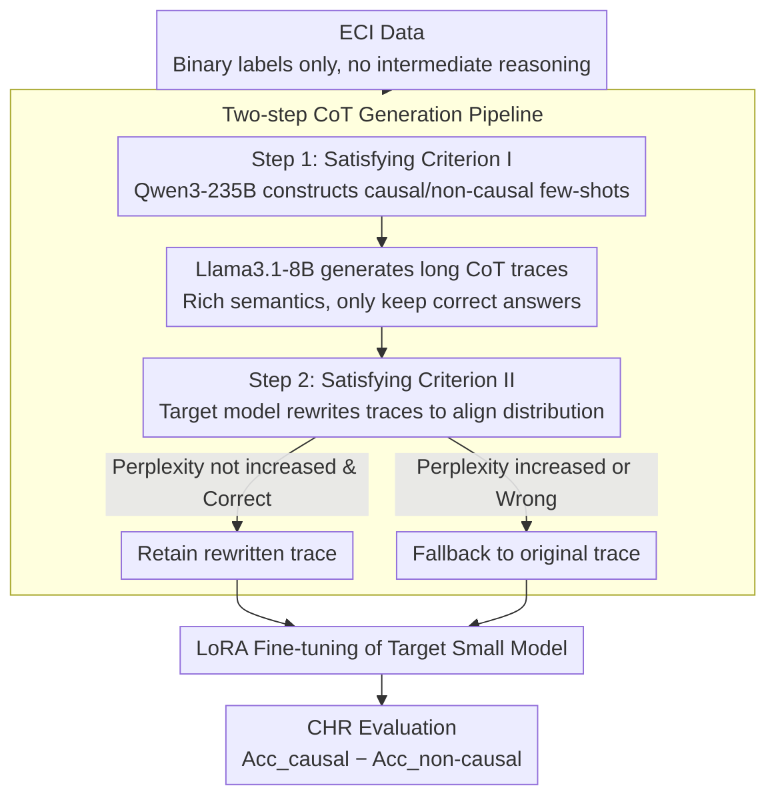

# Generating Effective CoT Traces for Mitigating Causal Hallucination

**Conference**: ACL 2026  
**arXiv**: [2604.12748](https://arxiv.org/abs/2604.12748)  
**Code**: None  
**Area**: Hallucination Detection  
**Keywords**: Causal Hallucination, Chain-of-Thought, Event Causality Identification, Small Model Fine-tuning, Data Generation

## TL;DR
This paper proposes the Causal Hallucination Rate (CHR) metric to quantify the tendency of small LLMs to over-predict causal relationships in Event Causality Identification (ECI). Through systematic experiments, two criteria for effective CoT data are identified (sufficient semantic explanation length + distribution alignment with the target model). A low-cost CoT data generation pipeline is designed, reducing the CHR of Qwen2.5-1.5B from 83.54% to 6.26% while improving average accuracy to 66.00%.

## Background & Motivation

**Background**: Large Language Models (LLMs) perform exceptionally well in complex reasoning tasks like mathematics and programming. However, they exhibit severe "causal hallucination" in Event Causality Identification (ECI) tasks—tending to predict a causal relationship regardless of whether one truly exists. This issue is particularly acute in small models ($\le$ 1.5B parameters); for instance, Qwen2.5-1.5B shows high accuracy on causal pairs but nearly zero on non-causal pairs.

**Limitations of Prior Work**: Existing ECI research primarily focuses on inference-time prompt design (e.g., causal prompting in Dr.ECI, multi-agent debate in MRBalance), which fails to mitigate hallucinations in small models. Current ECI datasets only provide binary labels and lack intermediate reasoning steps, making them unsuitable for CoT fine-tuning. Furthermore, existing CoT construction guidelines (e.g., prioritizing low perplexity, shorter traces for easier learning, or rewriting to reduce distribution gaps) were derived from mathematical reasoning and may not apply to ECI.

**Key Challenge**: Due to limited parameter capacity, small LLMs struggle to learn fine-grained causal discrimination from binary labels or brief prompts. They require rich intermediate reasoning steps to "teach" them how to distinguish causal from non-causal relations. However, the criteria for "effective" CoT traces in the ECI domain remain systematically unstudied.

**Goal**: (1) Define a metric to quantify causal hallucination; (2) Systematically investigate criteria for effective CoT traces; (3) Design a low-cost CoT data generation pipeline to mitigate causal hallucination in small models.

**Key Insight**: Instead of directly adopting CoT construction principles from mathematical reasoning, this work conducts controlled experiments on perplexity, trace length, and distribution gaps. It finds that ECI possesses unique principles—longer traces are actually superior, and perplexity is not a reliable selection criterion.

**Core Idea**: Effective ECI CoT traces must satisfy two criteria: containing sufficiently long semantic explanations and reasoning steps (Criterion I), and maintaining a small distribution gap with the target model without increasing perplexity (Criterion II). A two-step generation pipeline is designed based on these criteria.

## Method

### Overall Architecture
A two-step CoT trace generation pipeline: First, Qwen3-235B-A22B (Thinking) is used to construct few-shot examples that prompt Llama3.1-8B to generate CoT traces with rich semantic explanations (retaining only correct ones). Second, the target model rewrites these traces to reduce the distribution gap, ensuring perplexity does not increase. Finally, the target small model is fine-tuned via LoRA and evaluated using the Causal Hallucination Rate (CHR).

### Key Designs

**1. Causal Hallucination Rate (CHR): Directly identifying systematic bias**

Overall accuracy or F1 scores can mask causal hallucination—a model predicting "causal" for every pair would still achieve roughly 50% accuracy. CHR calculates the difference between classes: $\text{CHR} = \text{Acc}_{\text{causal}} - \text{Acc}_{\text{non-causal}}$. A $\text{CHR} > 0$ indicates causal hallucination, with higher values representing more severe bias, while $\text{CHR} < 0$ indicates a preference for non-causal relations. This metric exposes extreme bias: the original Qwen2.5-1.5B has a CHR of 83.54%, meaning it classifies almost every pair as causal.

**2. Empirical Findings on CoT Standards: Debunking mathematical reasoning "Common Sense"**

The paper uses controlled experiments to test existing CoT guidelines, yielding conclusions opposite to mathematical reasoning: First, perplexity is not a reliable selection criterion—traces chosen for low perplexity resulted in a CHR of 39.26%, whereas longer Llama traces with higher perplexity suppressed CHR to 34.12% due to richer semantic explanations. Second, small models effectively learn from longer CoT traces—CHR consistently decreased as trace length increased (from 59.79% at 242 tokens to 30.60% at 482 tokens). Third, rewriting strategies are only effective if they do not increase perplexity—rewriting medium-length traces increased both perplexity and CHR.

**3. Two-step CoT Generation Pipeline: Balancing quality and distribution**

To meet the identified criteria, a low-cost pipeline was designed. Step 1 uses Qwen3-235B-A22B (Thinking) to construct one causal and one non-causal few-shot example. These prompt Llama3.1-8B to generate long CoT traces with rich explanations, satisfying the "long and explanatory" Criterion I. Step 2 uses the target model (e.g., Qwen2.5-1.5B) to rewrite these traces to reduce the distribution gap. If the rewriting increases perplexity or results in an incorrect answer, the original trace is retained. This balances high-quality guidance from large models with distribution alignment for small models.

### Loss & Training
LoRA fine-tuning was conducted using the `SFTTrainer` in the TRL framework: batch size 1, 8 gradient accumulation steps, 1 epoch, learning rate $2 \times 10^{-4}$ with a cosine annealing scheduler. LoRA parameters: rank=8, alpha=16, dropout=0.05. Decoding temperature was fixed at 0.

## Key Experimental Results

### Main Results

| Method | CHR (↓) | mAcc (↑) |
| :--- | :--- | :--- |
| GPT-4 | 53.30 | 51.40 |
| Llama3.1-8B | 60.59 | 58.97 |
| Qwen2.5-1.5B (Original) | 83.54 | 52.97 |
| Qwen2.5-1.5B (CoT Prompting) | 69.77 | 51.48 |
| Qwen2.5-1.5B (Binary SFT) | 66.67 | 56.74 |
| **Qwen2.5-1.5B (Ours)** | **6.26** | **66.00** |
| Llama3.2-1B (Original) | 76.43 | 55.58 |
| **Llama3.2-1B (Ours)** | **9.14** | **63.44** |

### Ablation Study

| Configuration | CHR | mAcc | Description |
| :--- | :--- | :--- | :--- |
| Qwen2.5-1.5B Original | 83.54 | 52.97 | Baseline |
| w/o Rewriting | 23.39 | 56.51 | Step 1 only |
| w/ Rewriting | 6.26 | 66.00 | Full Pipeline |
| Llama3.2-1B Original | 76.43 | 55.58 | Baseline |
| w/o Rewriting | 17.13 | 55.51 | Step 1 only |
| w/ Rewriting | 9.14 | 63.44 | Full Pipeline |

### Key Findings
- The fine-tuned 1.5B model exhibits significantly lower causal hallucination than GPT-4 (CHR 6.26% vs. 53.30%) and Llama3.1-8B, demonstrating the high quality of the generated CoT data.
- Strong cross-dataset generalization: Training on EventStoryLine reduced CHR on Causal-TimeBank and MAVEN-ERE to 11.37% and 11.13% respectively.
- Cross-difficulty generalization: Sentence-level training data successfully generalized to document-level ECI, reducing CHR from 54.52% to 1.41%.
- Robustness: Model accuracy remained stable when injected with "wrong intervention" prompts, suggesting the model learned causal reasoning rather than just instruction following.

## Highlights & Insights
- The most significant contribution is the refutation of three "common sense" CoT construction rules inherited from mathematical reasoning. Specifically, the finding that "small models can learn from long CoT traces" contradicts prior work (Li et al., 2025), with the explanation that semantic richness in long traces is the decisive factor rather than length itself.
- The CHR metric is simple yet effective; traditional metrics mask systemic bias, which CHR exposes directly. This metric is applicable to any task with label imbalance or model preference bias.
- The two-step pipeline achieves a sophisticated balance between "quality guidance from large models" and "distribution adaptation for small models," while the fallback mechanism prevents quality degradation during rewriting.

## Limitations & Future Work
- The first step relies on Qwen3-235B to construct few-shot examples; while only two are needed, access to large-scale models is still required.
- The effectiveness of the rewriting strategy (perplexity condition) requires pre-verification, as behavior varies across trace lengths.
- Experiments were restricted to English ECI datasets; applicability to Chinese or other languages has not been verified.

## Related Work & Insights
- **vs. Dr.ECI (Cai et al., 2025)**: Dr.ECI uses causal reasoning principles for prompting, but results in a 100% CHR on Qwen2.5-1.5B (predicting all as causal), whereas this work's CoT fine-tuning reduces it to 6.26%.
- **vs. Zhang et al. (2025) Perplexity Strategy**: Their method, effective in math, fails in ECI—lowest perplexity traces do not yield the lowest CHR; length and semantic richness are the dominant factors.

## Rating
- Novelty: ⭐⭐⭐⭐ (Proposes CHR and debunks three CoT myths in ECI)
- Experimental Thoroughness: ⭐⭐⭐⭐⭐ (Rigorous controlled variables, comprehensive cross-dataset/difficulty/robustness tests)
- Writing Quality: ⭐⭐⭐⭐ (Logical progression from discovery to criteria to pipeline)

<!-- RELATED:START -->

## Related Papers

- [\[NeurIPS 2025\] Causal-LLaVA: Causal Disentanglement for Mitigating Hallucination in Multimodal Large Language Models](../../NeurIPS2025/hallucination/causalllava_causal_disentanglement_for_mitigating_hallucinat.md)
- [\[ICML 2026\] Mitigating Hallucinations in Large Vision-Language Models via Causal Route Gating](../../ICML2026/hallucination/mitigating_hallucinations_in_large_vision-language_models_via_causal_route_gatin.md)
- [\[CVPR 2025\] Seeing Far and Clearly: Mitigating Hallucinations in MLLMs with Attention Causal Decoding](../../CVPR2025/hallucination/seeing_far_and_clearly_mitigating_hallucinations_in_mllms_with_attention_causal_.md)
- [\[CVPR 2026\] COPO: Causal-Oriented Policy Optimization for Hallucinations of MLLMs](../../CVPR2026/hallucination/copo_causal-oriented_policy_optimization_for_hallucinations_of_mllms.md)
- [\[ACL 2026\] Stable-RAG: Mitigating Retrieval-Permutation-Induced Hallucinations in Retrieval-Augmented Generation](stable-rag_mitigating_retrieval-permutation-induced_hallucinations_in_retrieval-.md)

<!-- RELATED:END -->
