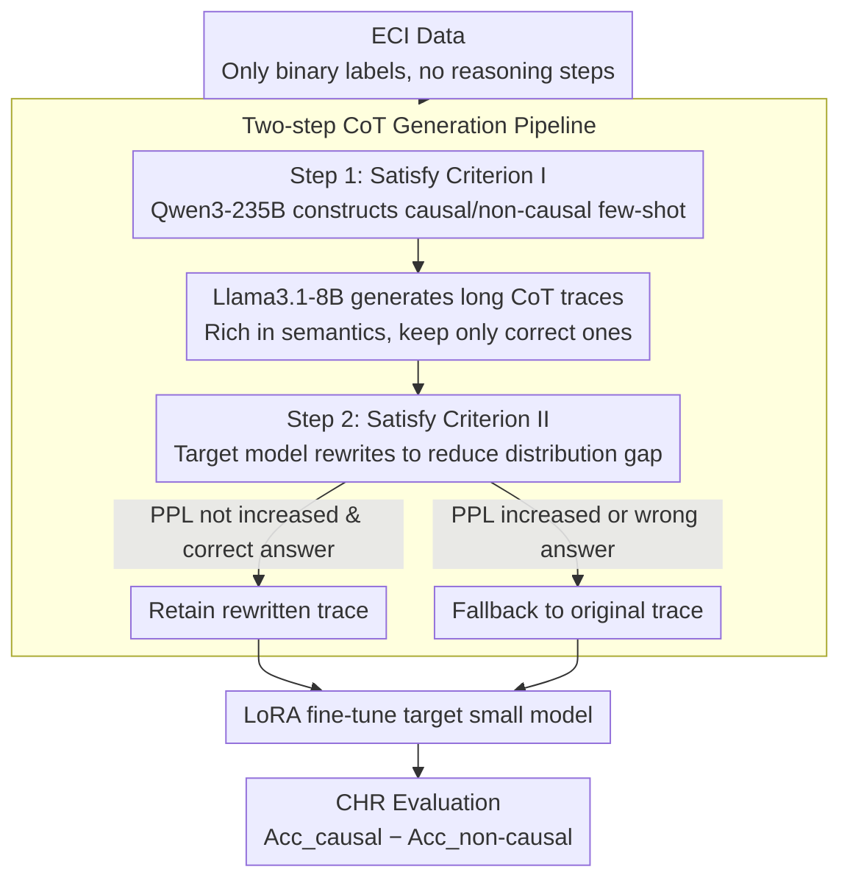

# Generating Effective CoT Traces for Mitigating Causal Hallucination

**Conference**: ACL 2026  
**arXiv**: [2604.12748](https://arxiv.org/abs/2604.12748)  
**Code**: None  
**Area**: Hallucination Detection  
**Keywords**: Causal Hallucination, Chain-of-Thought, Event Causality Identification, Small Model Fine-tuning, Data Generation

## TL;DR
This paper proposes the Causal Hallucination Rate (CHR) metric to quantify the tendency of small LLMs to over-predict causal relationships in Event Causality Identification. Through systematic experiments, two key criteria for effective CoT data are identified (sufficient semantic explanation length + distribution alignment with the target model). A low-cost CoT data generation pipeline is designed, reducing the CHR of Qwen2.5-1.5B from 83.54% to 6.26% while improving average accuracy to 66.00%.

## Background & Motivation

**Background**: Large language models perform exceptionally well on complex reasoning tasks like mathematics and programming. However, in Event Causality Identification (ECI), they suffer from severe "causal hallucination"—a tendency to predict a causal relationship regardless of whether one actually exists between event pairs. This issue is particularly acute in small models (≤1.5B parameters); for instance, Qwen2.5-1.5B achieves high accuracy on causal pairs but nearly zero on non-causal pairs.

**Limitations of Prior Work**: Existing ECI research primarily focuses on inference-time prompt design (e.g., Dr.ECI's causal prompting, MRBalance's multi-agent debate), which fails to mitigate causal hallucinations in small models. Current ECI datasets only contain binary labels and lack intermediate reasoning steps, making them unsuitable for CoT fine-tuning. Furthermore, existing CoT data construction guidelines (prioritizing low perplexity, shorter traces for easier learning, and rewriting to reduce distribution gaps) derived from mathematical reasoning do not necessarily apply to ECI.

**Key Challenge**: Due to limited parameter capacity, small LLMs struggle to learn fine-grained causal discrimination from binary labels or brief prompts. They require rich intermediate reasoning steps to "teach" the model to distinguish between causal and non-causal relations. However, the standards for what constitutes an "effective" CoT trace in the ECI domain have not been systematically studied.

**Goal**: (1) Define a metric to quantify causal hallucination; (2) Systematically investigate criteria for effective CoT traces; (3) Design a low-cost CoT data generation pipeline to mitigate causal hallucination in small models.

**Key Insight**: Instead of directly adopting CoT construction guidelines from mathematical reasoning, this study conducts controlled experiments on perplexity, trace length, and distribution gaps. It discovers unique principles for the ECI domain: longer traces are actually superior, and perplexity is not a reliable selection criterion.

**Core Idea**: Effective ECI CoT traces must satisfy two criteria: containing sufficiently long semantic explanations and reasoning steps (Criterion I), and maintaining a small distribution gap with the target model without increasing perplexity (Criterion II). A two-step generation pipeline is designed based on these criteria.

## Method

### Overall Architecture
A two-step CoT trace generation pipeline: First, Qwen3-235B-A22B (Thinking) constructs few-shot examples to prompt Llama3.1-8B to generate CoT traces rich in semantic explanations and reasoning steps, retaining only those with correct answers. Second, the target model itself rewrites these traces to reduce the distribution gap, verifying that perplexity does not increase after rewriting. Finally, the target small model is fine-tuned using LoRA on these traces, with the reduction in hallucination measured by the Causal Hallucination Rate (CHR).

### Key Designs

**1. Causal Hallucination Rate (CHR) Metric: Identifying systematic bias of "predicting causal for everything"**

Overall accuracy or F1 scores can mask causal hallucination—a model that predicts every event pair as causal might still achieve 50% overall accuracy. CHR addresses this by calculating the difference between two categories: $\text{CHR} = \text{Acc}_{\text{causal}} - \text{Acc}_{\text{non-causal}}$. A CHR $>0$ indicates causal hallucination, with higher values representing more severe bias, while CHR $<0$ indicates a negative bias (over-predicting non-causality). This metric exposes systematic deviations: Qwen2.5-1.5B originally had a CHR of 83.54%, meaning it predicted almost all pairs as causal.

**2. Empirical Findings on CoT Trace Standards: Overturning three "common sense" rules from mathematical reasoning**

The paper uses controlled experiments to test existing CoT guidelines, reaching conclusions opposite to those in math reasoning: First, perplexity is not a reliable selection criterion—traces chosen for low perplexity yielded a CHR of 39.26%, while longer Llama traces with higher perplexity reduced CHR to 34.12% due to richer semantic explanations. Second, small models indeed learn better from longer CoT traces—CHR decreased as trace length increased (242 tokens: 59.79% → 317 tokens: 34.68% → 482 tokens: 30.60%). Third, the rewriting strategy is only effective if it does not increase perplexity—rewriting medium-length traces actually raised both perplexity and CHR.

**3. Two-step CoT Generation Pipeline: Quality from large models, distribution alignment from small models**

To satisfy the identified criteria (long semantic explanations + aligned distribution without increased perplexity), a two-step pipeline is designed. Step 1 uses Qwen3-235B-A22B (Thinking) to construct one causal and one non-causal few-shot example. Llama3.1-8B is then prompted with these to generate long CoT traces with rich reasoning steps, keeping only those resulting in correct answers (satisfying Criterion I). Step 2 uses the target model (e.g., Qwen2.5-1.5B) to rewrite these traces. If the rewritten trace maintains the correct answer and does not increase perplexity, it is kept; otherwise, the pipeline falls back to the original trace (satisfying Criterion II).

### Loss & Training
LoRA fine-tuning is performed using the SFTTrainer from the TRL framework: batch size 1, gradient accumulation 8, 1 epoch, learning rate $2 \times 10^{-4}$ with a cosine annealing scheduler. LoRA parameters: rank=8, alpha=16, dropout=0.05. Decoding temperature is set to 0 for reproducibility.

## Key Experimental Results

### Main Results

| Method | CHR (↓) | mAcc (↑) |
|------|---------|----------|
| GPT-4 | 53.30 | 51.40 |
| Llama3.1-8B | 60.59 | 58.97 |
| Qwen2.5-1.5B (Original) | 83.54 | 52.97 |
| Qwen2.5-1.5B (CoT Prompting) | 69.77 | 51.48 |
| Qwen2.5-1.5B (Binary SFT) | 66.67 | 56.74 |
| **Qwen2.5-1.5B (Ours)** | **6.26** | **66.00** |
| Llama3.2-1B (Original) | 76.43 | 55.58 |
| **Llama3.2-1B (Ours)** | **9.14** | **63.44** |

### Ablation Study

| Configuration | CHR | mAcc | Note |
|------|-----|------|------|
| Qwen2.5-1.5B Original | 83.54 | 52.97 | Baseline |
| w/o Rewriting | 23.39 | 56.51 | Step 1 Only |
| w/ Rewriting | 6.26 | 66.00 | Full Pipeline |
| Llama3.2-1B Original | 76.43 | 55.58 | Baseline |
| w/o Rewriting | 17.13 | 55.51 | Step 1 Only |
| w/ Rewriting | 9.14 | 63.44 | Full Pipeline |

### Key Findings
- The fine-tuned 1.5B model exhibits lower causal hallucination than GPT-4 (CHR 6.26% vs 53.30%) and Llama3.1-8B (6.26% vs 60.59%), indicating the high quality of the generated CoT data.
- Strong cross-dataset generalization: Training on EventStoryLine reduced CHR to 11.37% on Causal-TimeBank and 11.13% on MAVEN-ERE.
- Strong cross-difficulty generalization: Sentence-level training data generalizes to document-level ECI (cross-sentence pairs), reducing CHR from 54.52% to 1.41%.
- Robustness: Model accuracy remains stable even when injected with misleading intervention prompts, suggesting the model learns causal reasoning rather than just instruction following.

## Highlights & Insights
- Overturning three "common sense" rules of CoT construction transferred from math reasoning is the most significant contribution. Specifically, the finding that "small models can learn from long CoT traces" contradicts prior work (Li et al., 2025), but is explained through experiments showing that semantic depth is the crucial factor, not length itself.
- The CHR metric is simple yet effective: Traditional metrics cover up causal hallucination (a model with CHR=100% can still have 50% accuracy), while CHR exposes systematic bias.
- The two-step pipeline balances quality (via large models) and distribution alignment (via the target model), with a fallback mechanism to prevent quality degradation during rewriting.

## Limitations & Future Work
- Step 1 depends on Qwen3-235B for generating few-shot examples; though only two are needed, it still requires access to a large model.
- The effectiveness of the rewriting strategy depends on not increasing perplexity, which varies across trace lengths.
- Experiments are limited to English ECI datasets (e.g., EventStoryLine); applicability to Chinese or other languages remains unverified.

## Related Work & Insights
- **vs Dr.ECI (Cai et al., 2025)**: Dr.ECI uses causal reasoning principles for prompting but still results in a 100% CHR on Qwen2.5-1.5B (predicting all as causal). Ours reduces this to 6.26% via CoT fine-tuning.
- **vs Zhang et al. (2025) Perplexity Strategy**: This method works in math reasoning but fails in ECI—traces with the lowest perplexity do not yield the lowest CHR; length and semantic richness are the dominant factors.

## Rating
- Novelty: ⭐⭐⭐⭐ Proposed CHR metric and overturned three CoT common sense rules, providing unique contributions to the ECI field.
- Experimental Thoroughness: ⭐⭐⭐⭐⭐ Rigorous controlled experiments with comprehensive cross-dataset, cross-difficulty, and robustness tests.
- Writing Quality: ⭐⭐⭐⭐ Logical flow from discovery to standards to pipeline design is clear and well-supported.

<!-- RELATED:START -->

## Related Papers

- [\[NeurIPS 2025\] Causal-LLaVA: Causal Disentanglement for Mitigating Hallucination in Multimodal Large Language Models](../../NeurIPS2025/hallucination/causalllava_causal_disentanglement_for_mitigating_hallucinat.md)
- [\[ICML 2026\] Mitigating Hallucinations in Large Vision-Language Models via Causal Route Gating](../../ICML2026/hallucination/mitigating_hallucinations_in_large_vision-language_models_via_causal_route_gatin.md)
- [\[CVPR 2025\] Seeing Far and Clearly: Mitigating Hallucinations in MLLMs with Attention Causal Decoding](../../CVPR2025/hallucination/seeing_far_and_clearly_mitigating_hallucinations_in_mllms_with_attention_causal_.md)
- [\[ACL 2026\] Stable-RAG: Mitigating Retrieval-Permutation-Induced Hallucinations in Retrieval-Augmented Generation](stable-rag_mitigating_retrieval-permutation-induced_hallucinations_in_retrieval-.md)
- [\[ACL 2026\] Dialectic-Med: Mitigating Diagnostic Hallucinations via Counterfactual Adversarial Multi-Agent Debate](dialectic-med_mitigating_diagnostic_hallucinations_via_counterfactual_adversaria.md)

<!-- RELATED:END -->
