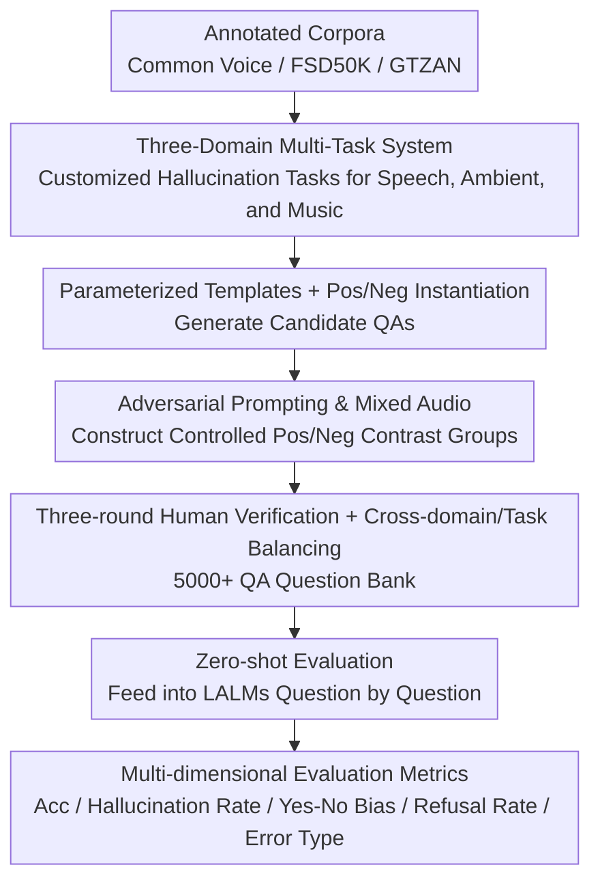

# HalluAudio: A Comprehensive Benchmark for Hallucination Detection in Large Audio-Language Models

**Conference**: ACL 2026  
**arXiv**: [2604.19300](https://arxiv.org/abs/2604.19300)  
**Code**: [https://github.com/Feiyuzhao25/halluaudio](https://github.com/Feiyuzhao25/halluaudio)  
**Area**: Hallucination Detection  
**Keywords**: Audio Hallucination, Large Audio-Language Models, Benchmark Evaluation, Adversarial Prompting, Multi-dimensional Analysis

## TL;DR

This paper introduces HalluAudio, the first large-scale cross-domain (Speech/Ambient/Music) audio hallucination detection benchmark. It contains 5,000+ human-verified QA pairs and systematic adversarial prompt designs. By evaluating mainstream LALMs using multi-dimensional metrics (Accuracy, Hallucination Rate, Yes-No Bias, Refusal Rate, and Error Type), it reveals significant deficiencies in current models regarding acoustic anchoring, temporal reasoning, and music attribute understanding.

## Background & Motivation

**Background**: Large Audio-Language Models (LALMs) have demonstrated powerful capabilities in speech recognition, audio QA, and music understanding. While hallucination issues have been extensively studied in text and vision domains, research in the audio domain remains severely insufficient.

**Limitations of Prior Work**: (1) Existing audio benchmarks primarily focus on capability evaluation rather than reliability; (2) A few audio hallucination studies (e.g., AHa-Bench) are small in scale, limited to binary classification, and lack diagnostic depth; (3) There is a lack of systematic adversarial prompts and mixed audio conditions to induce hallucinations.

**Key Challenge**: Models that perform strongly on standard benchmarks do not necessarily resist hallucinations—a gap exists between capability evaluation and reliability evaluation.

**Goal**: Construct the first large-scale, cross-domain, multi-dimensional audio hallucination detection benchmark to systematically analyze the failure modes of LALMs.

**Key Insight**: Three domains (Speech/Ambient/Music) × Multiple task types (Binary judgment/Multiple-choice reasoning/Attribute verification/Open QA) × Adversarial designs (Adversarial prompts/Mixed audio), combined with multi-dimensional evaluation metrics.

**Core Idea**: Audio hallucination is defined as the model generating statements unsupported by input acoustic evidence, including fabrication (claiming non-existent events), evidence contradiction, and unfounded affirmative bias.

## Method

### Overall Architecture

HalluAudio is a pure evaluation benchmark designed to fill the diagnostic gap in audio hallucination. Its construction follows a pipeline from corpora to question sets: first, speech, ambient sound, and music are selected from high-quality annotated corpora such as Common Voice, FSD50K, and GTZAN. Then, parameterized templates combined with positive/negative instantiation are used to generate QA pairs. Controlled positive/negative contrast groups are then constructed through minimal-edit prompts or audio attribute modifications. Finally, the benchmark undergoes three rounds of human verification (two independent annotators and one senior reviewer) and is balanced across domains and task types. During the evaluation phase, each question is fed zero-shot into the LALM, and outputs are scored by an automated evaluation engine according to multi-dimensional metrics.

### Key Designs

**1. Three-Domain Multi-Task System: Customized Hallucination Tasks by Audio Type**

Hallucination patterns differ across audio domains—speech often involves temporal hallucinations, ambient sounds involve event fabrication, and music involves attribute misjudgment. Therefore, the benchmark designs specific tasks for each: the speech side includes overlap detection, word order, counting, gender verification, noise verification, transcript matching, and speed/loudness comparison; the ambient side includes overlap/order/existence/co-occurrence detection, mismatch queries, multi-label checks, and loudness comparison; the music side includes genre matching, instrument presence, rhythm/tempo comparison, and dynamic/key identification. Each task corresponds to a clear hallucination induction mechanism.

**2. Adversarial Prompting and Mixed Audio: Inducing Hallucinations via Controlled Perturbations**

Models often perform well on standard inputs, but hallucinations are exposed when deliberately misled. Adversarial prompts use descriptions contrary to facts to test if the model blindly agrees (e.g., asking "What did the female voice say?" for a male recording). Mixed audio splices two sounds to test if the model can correctly distinguish temporal order and event attribution. Positive/negative contrast groups isolate factors triggering hallucinations by changing only a single attribute.

**3. Multi-dimensional Evaluation Metrics: Characterizing Failure Modes Beyond Accuracy**

Looking only at accuracy hides systematic biases specific to LALMs. The benchmark uses complementary metrics: Accuracy measures basic correctness; Hallucination Rate counts the proportion of fabricated facts; Yes/No Bias characterizes systematic lean towards affirmation or negation; Error Type analysis splits errors into fabrication, contradiction, and affirmative bias; and Refusal Rate records the frequency of avoiding answers.

### Loss & Training

HalluAudio is an evaluation benchmark and does not involve model training. It employs a unified zero-shot evaluation protocol throughout, where model outputs are standardized and verified by an automated engine.

## Key Experimental Results

### Main Results

**Average Accuracy of mainstream LALMs across three domains**

| Model | Speech Acc | Ambient Acc | Music Acc | Overall Acc |
|-------|------------|-------------|-----------|-------------|
| Gemini-2.5-Pro | Top Tier | Top Tier | Top Tier | ~70-80% |
| Qwen2-Audio | Medium | Medium | Low | ~50-60% |
| SALMONN | Low | Medium | Low | ~40-50% |

### Ablation Study

| Dimension | Finding | Description |
|-----------|---------|-------------|
| Yes/No Bias | Most models tend towards "Yes" | Unfounded affirmative bias is prevalent |
| Refusal Behavior | Some models refuse frequently | Excessive safety alignment |
| Domain Variance | Music is the hardest | Weakest understanding of musical attributes |
| Adversarial vs Standard | Significant drop | Confirms hallucinations are not apparent in standard evaluations |

### Key Findings

- The music domain is the biggest weakness for all models—understanding of musical attributes (key, rhythm, instrument details) is severely lacking.
- Systematic Yes/No bias is widespread—models tend to affirm unconditionally, even if the queried element does not exist in the audio.
- High scores on standard benchmarks $\neq$ hallucination robustness—the gap between capability and reliability is also significant in the audio domain.
- Closed-source LLMs generally outperform open-source models in hallucination resistance, though the gap is narrower than in the text/vision domains.

## Highlights & Insights

- First systematic audio hallucination benchmark—filling the void compared to the abundant hallucination research in text and vision.
- The design of 3 domains × Multi-task × Multi-dimensional metrics provides unprecedented diagnostic granularity.
- Yes/No bias and refusal rate analyses reveal systematic issues unique to LALMs.

## Limitations & Future Work

- The dataset scale (5K+) is still relatively small compared to vision hallucination benchmarks.
- Audio sources are derived from a limited set of datasets, potentially not covering all real-world scenarios.
- Multilingual speech hallucinations are not addressed.
- Future work can extend to audio-visual joint scenarios and conversational audio understanding.

## Related Work & Insights

- **vs AHa-Bench**: AHa-Bench uses small-scale binary QA; HalluAudio provides a comprehensive multi-task, multi-dimensional evaluation.
- **vs CHAIR (Vision)**: CHAIR detects object-level hallucinations; HalluAudio migrates similar concepts to the audio domain.
- **vs Frieske & Shi (2024)**: Only analyzes ASR hallucinations, whereas HalluAudio covers Speech + Ambient + Music.

## Rating

- Novelty: ⭐⭐⭐⭐⭐ First large-scale cross-domain audio hallucination benchmark, filling a critical gap.
- Experimental Thoroughness: ⭐⭐⭐⭐ Multi-model and multi-dimensional evaluation, though deeper analysis of model behavior could be more detailed.
- Writing Quality: ⭐⭐⭐⭐ Clear benchmark design and systematic taxonomy.
- Value: ⭐⭐⭐⭐⭐ Provides a much-needed evaluation tool for audio AI safety research.

<!-- RELATED:START -->

## Related Papers

- [\[ACL 2025\] ReefKnot: A Comprehensive Benchmark for Relation Hallucination Evaluation, Analysis and Mitigation in Multimodal Large Language Models](../../ACL2025/hallucination/reefknot_a_comprehensive_benchmark_for_relation_hallucination_evaluation_analysi.md)
- [\[ACL 2026\] Benchmarking Deflection and Hallucination in Large Vision-Language Models](benchmarking_deflection_and_hallucination_in_large_vision-language_models.md)
- [\[ACL 2026\] Rethinking Evaluation for LLM Hallucination Detection: A Desiderata, A New RAG-based Benchmark, New Insights](rethinking_evaluation_for_llm_hallucination_detection_a_desiderata_a_new_rag-bas.md)
- [\[ACL 2026\] Mechanisms of Prompt-Induced Hallucination in Vision–Language Models](mechanisms_of_prompt-induced_hallucination_in_vision-language_models.md)
- [\[ACL 2025\] CCHall: A Novel Benchmark for Joint Cross-Lingual and Cross-Modal Hallucinations Detection in Large Language Models](../../ACL2025/hallucination/cchall_a_novel_benchmark_for_joint_cross-lingual_and_cross-modal_hallucinations_.md)

<!-- RELATED:END -->
