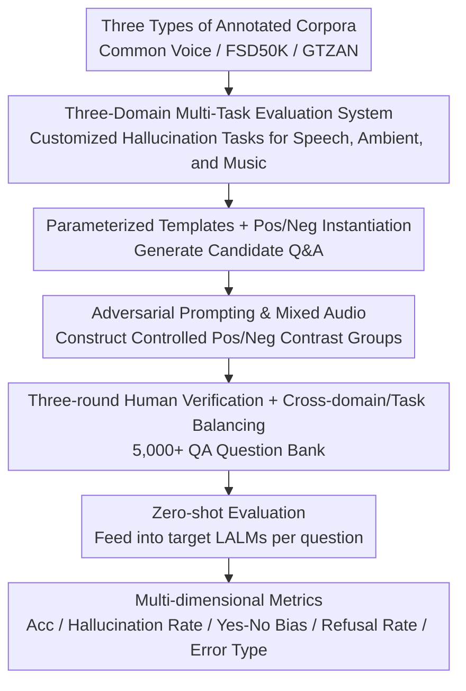

# HalluAudio: A Comprehensive Benchmark for Hallucination Detection in Large Audio-Language Models

**Conference**: ACL 2026  
**arXiv**: [2604.19300](https://arxiv.org/abs/2604.19300)  
**Code**: [https://github.com/Feiyuzhao25/halluaudio](https://github.com/Feiyuzhao25/halluaudio)  
**Area**: Hallucination Detection  
**Keywords**: Audio Hallucination, Large Audio-Language Models, Benchmark, Adversarial Prompting, Multi-dimensional Analysis

## TL;DR

This paper introduces HalluAudio, the first large-scale cross-domain (speech/ambient/music) benchmark for audio hallucination detection. It features 5,000+ human-verified QA pairs and systematic adversarial prompt designs. By evaluating mainstream LALMs using multi-dimensional metrics (Accuracy, Hallucination Rate, Yes-No Bias, Refusal Rate, and Error Types), the study reveals significant deficiencies in current models regarding acoustic anchoring, temporal reasoning, and music attribute understanding.

## Background & Motivation

**Background**: Large Audio-Language Models (LALMs) have demonstrated powerful capabilities in speech recognition, audio question answering, and music understanding. While hallucination has been extensively studied in text and vision domains, research in the audio domain remains severely insufficient.

**Limitations of Prior Work**: (1) Existing audio benchmarks primarily focus on capability evaluation rather than reliability; (2) Minimal audio hallucination studies (e.g., AHa-Bench) are small-scale, limited to binary classification, and lack diagnostic depth; (3) There is a lack of systematic adversarial prompts and mixed-audio conditions to induce hallucinations.

**Key Challenge**: Models performing strongly on standard benchmarks do not necessarily resist hallucinations—a gap exists between capability assessment and reliability assessment.

**Goal**: Construct the first large-scale, cross-domain, multi-dimensional benchmark for audio hallucination detection to systematically analyze LALM failure modes.

**Key Insight**: Utilize three domains (speech/ambient/music) $\times$ multiple task types (binary judgment/multiple-choice reasoning/attribute verification/open-ended QA) $\times$ adversarial designs (adversarial prompts/mixed audio), complemented by multi-dimensional evaluation metrics.

**Core Idea**: Audio hallucination is defined as model-generated statements unsupported by input acoustic evidence, including fabrication (claiming non-existent events), evidence contradiction, and unfounded affirmative bias.

## Method

### Overall Architecture

HalluAudio is a pure evaluation benchmark designed to fill the diagnostic void in audio hallucination. Its construction follows a pipeline from corpus to problem set: first, speech, ambient sound, and music are selected from high-quality annotated corpora such as Common Voice, FSD50K, and GTZAN. Then, QA pairs are generated using parameterized prompt templates with positive/negative instances. Controlled positive/negative contrast groups are then constructed via minimal modification prompts or audio attribute adjustments. Finally, after three rounds of human verification (two independent annotators and one senior reviewer) and balancing across domains and tasks, the benchmark is finalized. In the evaluation phase, each question is fed zero-shot into the target LALM, and outputs are scored by an automated engine based on multi-dimensional metrics.

### Key Designs

**1. Three-Domain Multi-Task Evaluation System: Tailored Hallucination Tasks per Audio Type**

Hallucination patterns vary across audio domains—speech often involves temporal hallucinations, ambient sound frequently shows event fabrication, and music involves attribute misjudgment. No single task set can cover these. Therefore, the benchmark designs specific tasks for each domain: for speech, tasks include overlap detection, word order judgment, counting, gender verification, noise verification, transcript matching, and speed/loudness comparison; for ambient sound, tasks cover overlap/sequence/existence/co-existence detection, mismatch queries, multi-label checks, and loudness comparison; for music, tasks include genre matching, instrument presence, rhythm/tempo comparison, and key identification. Each task corresponds to a clear hallucination induction mechanism, providing comprehensive diagnostic granularity.

**2. Adversarial Prompting and Mixed Audio: Inducing Hallucinations with Controlled Perturbations**

Models often perform well on standard inputs; hallucinations only surface when intentionally misled. The benchmark embeds perturbations into the questions. Adversarial prompts use descriptions contrary to facts to test if the model blindly agrees (e.g., asking "What did the female voice say?" for a male voice recording). Mixed audio splices two sounds to test if the model can correctly distinguish temporal order and event attribution. Positive/negative contrast groups modify only a single attribute to isolate factors triggering hallucinations. This design specifically targets systemic failures like Yes/No bias that are invisible in standard tests.

**3. Multi-dimensional Evaluation Metrics: Characterizing Failure Modes Beyond Accuracy**

Relying solely on accuracy masks the systematic biases of LALMs. Thus, the benchmark uses complementary metrics: Accuracy measures basic correctness; Hallucination Rate tracks the proportion of fabricated non-existent facts; Yes/No Bias characterizes systemic tendencies toward affirmation or negation; Error Type Analysis further categorizes errors into fabrication, contradiction, and affirmative bias; and Refusal Rate records how often the model avoids answering. Yes/No bias and refusal behavior are dimensions that reflect reliability shortcomings often missed by accuracy alone.

### Loss & Training

HalluAudio is an evaluation benchmark and does not involve model training. It employs a uniform zero-shot evaluation protocol, with model outputs standardized and verified by an automated evaluation engine.

## Key Experimental Results

### Main Results

**Average Accuracy of Mainstream LALMs across Three Domains**

| Model | Speech Acc | Ambient Acc | Music Acc | Overall Acc |
|------|---------|----------|---------|---------|
| Gemini-2.5-Pro | Highest | Highest | Highest | ~70-80% |
| Qwen2-Audio | Medium | Medium | Low | ~50-60% |
| SALMONN | Low | Medium | Low | ~40-50% |

### Ablation Study

| Dimension | Finding | Description |
|------|------|------|
| Yes/No Bias | Most models favor "Yes" | Unfounded affirmative bias is prevalent |
| Refusal Behavior | Some models refuse frequently | Excessive safety alignment |
| Domain Difference | Music is the most difficult | Music attribute understanding is weakest |
| Adversarial vs. Standard | Significant drop | Confirms hallucination issues are hidden in standard evaluations |

### Key Findings

- The music domain is the greatest weakness for all models—understanding of music attributes (key, rhythm, instrumental details) is severely insufficient.
- Systemic Yes/No bias is widespread—models tend to affirm unconditionally even when the questioned elements are absent from the audio.
- High scores on standard benchmarks $\neq$ hallucination robustness—the gap between capability and reliability is also significant in the audio domain.
- Closed-source large models generally outperform open-source models in anti-hallucination, though the gap is smaller than in the text/vision domains.

## Highlights & Insights

- First systematic audio hallucination benchmark—filling the void compared to the extensive research in text and vision domains.
- The design of three domains $\times$ multi-task $\times$ multi-dimensional metrics provides unprecedented diagnostic granularity.
- Yes/No bias and refusal rate analyses reveal systemic issues unique to LALMs.

## Limitations & Future Work

- Dataset size (5K+) is still relatively small compared to vision hallucination benchmarks.
- Audio sources are derived from a limited number of datasets and may not cover all real-world scenarios.
- Multilingual speech hallucinations are not addressed.
- Future work could extend to audio-video joint scenarios and conversational audio understanding.

## Related Work & Insights

- **vs AHa-Bench**: AHa-Bench uses small-scale binary QA; HalluAudio provides comprehensive multi-task and multi-dimensional evaluation.
- **vs CHAIR (Vision)**: CHAIR detects object-level hallucinations; HalluAudio transfers similar concepts to the audio domain.
- **vs Frieske & Shi (2024)**: That study only analyzes ASR hallucinations; HalluAudio covers speech, ambient sound, and music.

## Rating

- Novelty: ⭐⭐⭐⭐⭐ First large-scale cross-domain audio hallucination benchmark, filling a critical gap.
- Experimental Thoroughness: ⭐⭐⭐⭐ Evaluated multiple models across multiple dimensions, though deeper analysis of model performance could be more detailed.
- Writing Quality: ⭐⭐⭐⭐ Clear benchmark design and systematic taxonomy.
- Value: ⭐⭐⭐⭐⭐ Provides a much-needed evaluation tool for audio AI safety research.

<!-- RELATED:START -->

## Related Papers

- [\[ACL 2025\] ReefKnot: A Comprehensive Benchmark for Relation Hallucination Evaluation, Analysis and Mitigation in Multimodal Large Language Models](../../ACL2025/hallucination/reefknot_a_comprehensive_benchmark_for_relation_hallucination_evaluation_analysi.md)
- [\[CVPR 2026\] SVHalluc: Benchmarking Speech-Vision Hallucination in Audio-Visual Large Language Models](../../CVPR2026/hallucination/svhalluc_benchmarking_speech-vision_hallucination_in_audio-visual_large_language.md)
- [\[ACL 2026\] Benchmarking Deflection and Hallucination in Large Vision-Language Models](benchmarking_deflection_and_hallucination_in_large_vision-language_models.md)
- [\[ACL 2025\] CCHall: A Novel Benchmark for Joint Cross-Lingual and Cross-Modal Hallucinations Detection in Large Language Models](../../ACL2025/hallucination/cchall_a_novel_benchmark_for_joint_cross-lingual_and_cross-modal_hallucinations_.md)
- [\[ACL 2026\] Rethinking Evaluation for LLM Hallucination Detection: A Desiderata, A New RAG-based Benchmark, New Insights](rethinking_evaluation_for_llm_hallucination_detection_a_desiderata_a_new_rag-bas.md)

<!-- RELATED:END -->
