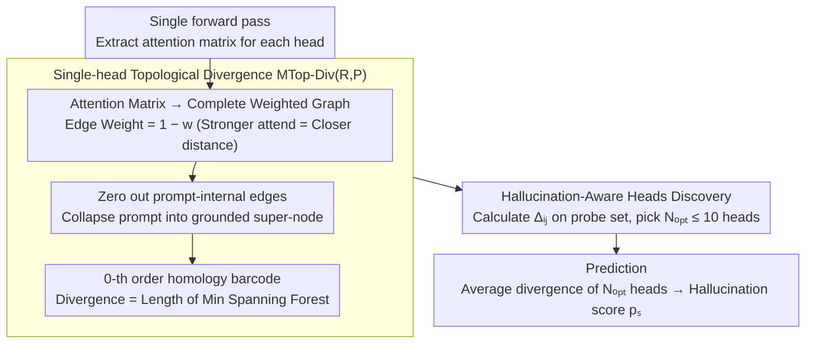

# Hallucination Detection in LLMs with Topological Divergence on Attention Graphs

**Conference**: ACL 2026  
**arXiv**: [2504.10063](https://arxiv.org/abs/2504.10063)  
**Code**: https://github.com/sb-ai-lab/TOHA  
**Area**: Hallucination Detection  
**Keywords**: TDA, Attention Graphs, Manifold Topology Divergence, Hallucination-Aware Heads, Training-free

## TL;DR
TOHA treats the LLM attention matrix as a weighted graph and leverages Manifold Topology Divergence from Topological Data Analysis (TDA) to measure the "topological novelty of the response subgraph relative to the prompt subgraph." It identifies "hallucination-aware heads" that are stable across datasets—averaging just 10 such heads enables a training-free approach in RAG scenarios that is 70× faster than SelfCheckGPT with significantly higher ROC-AUC.

## Background & Motivation

**Background**: LLM + RAG has become the de facto deployment architecture, but models still generate hallucinations inconsistent with the provided context. Existing detection methods are categorized into: (1) **Uncertainty**—using output probabilities like perplexity or max entropy; (2) **Consistency**—performing N-time resampling to compare consistency (e.g., SelfCheckGPT, Semantic Entropy, EigenScore); (3) **Internal States**—using probes for linear classification of hidden layers or attention (e.g., HaloScope, LLM-Check, ReDeEP).

**Limitations of Prior Work**: (1) Supervised internal state methods require massive manually labeled hallucination samples; (2) Consistency methods incur explosive overhead (10–20 regenerations); (3) Output probabilities do not fully reflect true model uncertainty; (4) Existing attention-based work either treats all heads equally or focuses solely on numerical values rather than geometric structure, wasting the graph information inherent in attention matrices.

**Key Challenge**: High-quality hallucination detection currently requires either abundant data (supervised) or massive computation (sampling), lacking a solution that is efficient in both dimensions. While research indicates that attention internal states are information-rich, their topological structure has not been systematically explored.

**Goal**: (1) Develop a training-free, single-generation detector that selects key heads using minimal probes; (2) Establish a provable connection between hallucination occurrence and attention geometry/topology; (3) Verify the cross-dataset transferability of the identified "hallucination-aware heads."

**Key Insight**: View each head's attention matrix as a complete weighted graph where prompt tokens and response tokens form two sub-vertex sets. Apply **Manifold Topology Divergence** on this graph to calculate the topological novelty of the response subgraph relative to the prompt. "Excessive novelty" serves as a hallucination signal (intuition: faithful responses should be geometrically "embedded" within the prompt's attention structure).

**Core Idea**: Use 0-th order homology (Minimum Spanning Tree length) to quantify the "minimum connection distance required to attach the response to the prompt." Larger distance = response detached from prompt = higher hallucination probability. Averaging $\leq 10$ specific heads is sufficient for detection.

## Method

### Overall Architecture
The TOHA pipeline (Algorithm 1) consists of two stages: (a) **HeadsSelection**—Uses a tiny probe set (hallucination set $S_h$ + grounded set $S_g$) to calculate $\Delta_{ij}$ (mean topological divergence difference) for each head $(i,j)$, sorted in descending order; it cumulatively averages $N=1$ to $N_{\max}=10$ heads to select $N_{\mathrm{opt}}$ with the largest AUROC. (b) **Prediction**—For a test sample $s$, the average $d_{ij}(s)$ of these $N_{\mathrm{opt}}$ heads is used as the hallucination score $p_s$. The process involves no parameter training, relying solely on attention matrices from the forward pass.

### Key Designs

**1. Attention as Weighted Graph + MTop-Div$_G$(R,P): Quantifying Faithfulness via Graph Metrics**

Previous attention-based detection focused on numerical values or global sums, ignoring the inherent graph structure. This paper interprets the attention matrix $W$ for each head as a complete undirected weighted graph $G$. Edge weights are defined as $1-w_{ij}$, acting as "pseudo-distances"—stronger attention implies closer proximity. Vertices are partitioned into prompt subset $P$ and response subset $R$. Vietoris-Rips filtration and 0-th order homology barcode $\mathcal{B}_0$ are computed on this graph. Divergence is defined as the sum of bar lengths: $\operatorname{MTop-Div}_G(R,P)=\sum_{[b_i,d_i]\in\mathcal{B}_0}|d_i-b_i|$.

This metric is grounded in both geometry and information theory. Proposition 3.1 proves it equals the total edge length of a Minimum Spanning Forest (MSF) connecting $R$ to $P$. In information theory, $\operatorname{MTop-Div}_G(R,P)\geq L_{\mathrm{MST}}(R\cup P)-L_{\mathrm{MST}}(P)$, representing the MST length increment after adding response tokens. Intuition: Faithful responses are geometrically embedded with the prompt (small divergence), while hallucinations lack such support (large distance).

**2. Hallucination-Aware Heads Discovery: Quantifying and Selecting Sensitive Heads**

Since not all heads are hallucination-sensitive, the paper quantifies each head $(i,j)$ by its mean divergence difference between hallucinated and grounded samples in a training set:

$$\Delta_{ij}=\frac{1}{|S_{\mathrm{hallu}}|}\sum_{s\in S_{\mathrm{hallu}}} d_{ij}(s)-\frac{1}{|S_{\mathrm{gr}}|}\sum_{s\in S_{\mathrm{gr}}} d_{ij}(s),\qquad d_{ij}(s)=\frac{1}{|R_{ij}^s|}\operatorname{MTop-Div}_{G_{ij}^s}(R_{ij}^s,P_{ij}^s),$$

A higher $\Delta_{ij}$ indicates a head better at separating hallucinations from faithful responses. Scatter plots across datasets reveal a stable structure: in Mistral-7B and Llama-2-7B, specific heads consistently reside in the top-right corner. This stability ensures transferability across tasks. Some of these heads correlate with "copying heads" identified in prior literature, suggesting that hallucinations stem from insufficient copying, causing the response to "drift" geometrically.

**3. Zeroing Prompt-Internal Edge Weights: Filtering Structural Noise**

Prompt internal segments contain rich semantic/syntactic attention, which acts as noise for detecting response hallucinations. Before calculating MTop-Div, all edge weights within $P$ are zeroed. This effectively collapses the entire prompt into a "grounded" connected super-node. Consequently, the topology only measures how "far" response nodes are from the prompt. §4.4 confirms that without this simplification, structural noise from the prompt obscures the hallucination signal, significantly degrading performance.

### Loss & Training
TOHA is entirely training-free. The only "optimization" is the HeadSelection ranking using a minimal labeled set (100 validation samples or 5% experimental split). These labels are used for ranking heads rather than training a classifier. $N_{\mathrm{opt}}$ is capped at 10.

## Key Experimental Results

### Main Results: ROC-AUC (↑), 5 Datasets × 5 LLMs

| Model/Method | MS MARCO | CNN/DM | CoQA | SQuAD | XSum |
|------|------|------|------|------|------|
| **Mistral-7B** | | | | | |
| SelfCheckGPT | 0.63 | 0.51 | 0.86 | 0.71 | 0.66 |
| Max entropy | 0.68 | 0.60 | 0.73 | 0.75 | 0.71 |
| ReDeEP | 0.54 | 0.47 | 0.59 | 0.45 | 0.63 |
| **TOHA** | **0.76** | **0.60** | **0.89** | **0.96** | 0.66 |
| **LLaMA-2-7B** | | | | | |
| SelfCheckGPT | 0.59 | 0.60 | 0.66 | 0.57 | 0.64 |
| Semantic entropy | 0.53 | 0.51 | 0.76 | 0.73 | 0.61 |
| **TOHA** | **0.65** | 0.56 | **0.90** | **0.87** | **0.68** |
| **LLaMA-2-13B** | | | | | |
| Max entropy | 0.62 | 0.53 | 0.66 | 0.78 | 0.59 |
| **TOHA** | **0.67** | **0.56** | **0.92** | **0.88** | **0.66** |

TOHA improves AUROC by 11.7% over the strongest baseline on MS MARCO and 21.6% for LLaMA-2-7B on CoQA. Wilcoxon-Holm post-hoc tests show TOHA ranks 1.67 overall, significant at $p\leq 0.0016$ against all baselines.

### Ablation Study: Efficiency & Transferability

| Dimension | Metric | Performance |
|------|------|------|
| Relative to SelfCheckGPT (Single addition) | ~7× faster | TOHA requires only one forward pass |
| Relative to SelfCheckGPT (Actual 10–20 samples) | **~70× faster** | Real deployment scenarios |
| Relative to Max Entropy | Similar overhead | But significantly higher AUROC |
| Training Set Size | $|S_h\cup S_g|=100$ | Only 100 samples needed to select heads |
| Optimal Head Count | $N_{\mathrm{opt}}\leq 10$ | Stable (4 for Mistral, 3 for Llama-2) |
| HotpotQA Multi-hop | Better than all baselines | "In the wild" validation |
| Cross-dataset Transfer (XSum↔CNN/DM) | Within 1σ | High universality of selected heads |

### Key Findings
- **Few heads are enough**: Using $\leq 10$ heads outperforms all baselines, suggesting hallucination signals are highly concentrated in specific heads rather than uniformly distributed.
- **Topological > Numerical**: Methods using direct attention values (ReDeEP/LLM-Check) perform near random (0.5), while TOHA's MST-based topology stabilizes at 0.8+, proved that geometric structure is more informative than absolute weights.
- **Strong Transferability**: Heads selected on XSum remain effective on CNN/DM, showcasing core cross-dataset transportability.
- **Mechanistic Interpretability**: The selected sensitive heads overlap with known "copying heads," providing a link: high divergence indicates a failure to copy prompt info, leading to hallucination.

## Highlights & Insights
- **Proper Application of TDA**: Moves TDA beyond descriptive "accuracy boost" studies. TOHA provides dual interpretations (MSF length and MST length increment/entropy), making abstract metrics both computable and interpretable.
- **Value of Hallucination-Aware Heads**: Reveals that hallucination is a local behavior of specific attention heads, providing a focus for mechanistic interpretability and potential precise intervention (e.g., specific head suppression).
- **Clever Engineering with Prompt Masking**: Zeroing internal edges removes semantic noise, focusing the metric exclusively on "cross-boundary" signals. This "task-specific topological simplification" is a generalizable strategy for other graph-based domain adaptation tasks.

## Limitations & Future Work
- **Dependency on Minimal Labels**: Though only 100 samples are needed, they must be labeled. Pure zero-shot detection remains a research goal.
- **White-box Constraint**: Requires access to attention matrices, making it incompatible with closed-source APIs (e.g., GPT-4o).
- **RAG Focused**: The prompt-response divergence assumption is less clear in free-form generation without explicit context.
- **Beyond 0-th Homology**: The study currently only uses $\mathcal{B}_0$ (connected components). Future use of $\mathcal{B}_1$ (loops) might unlock richer structural signals.
- **Potential Enhancements**: Integrating with RLHF/Alignment training as a "low divergence" regularizer or using TOHA to trigger RAG re-retrieval.

## Related Work & Insights
- **vs SelfCheckGPT / Semantic Entropy**: Consistency methods require 10-20 regenerations; TOHA requires one forward pass and achieves higher accuracy on most datasets.
- **vs HaloScope / LLM-Check / ReDeEP**: These internal state methods require probe training or treat all heads equally; TOHA is training-free and more interpretable.
- **vs Kushnareva 2021 / Tulchinskii 2023**: Previous TDA work focused on global topology for classification; TOHA is the first to apply manifold topology divergence to the prompt-response cross-structure, backed by MSF equivalence proofs.

## Rating
- Novelty: ⭐⭐⭐⭐ Introduces manifold topology divergence to attention graphs with MSF equivalence proofs.
- Experimental Thoroughness: ⭐⭐⭐⭐ 5 LLMs × 5 datasets + HotpotQA + Transferability + Efficiency + Significance tests.
- Writing Quality: ⭐⭐⭐⭐ Clear intuition (Fig 1) and scatter analysis (Fig 2), complete derivations.
- Value: ⭐⭐⭐⭐ 70× speedup with minimal labels; highly practical for industrial RAG deployment.

<!-- RELATED:START -->

## Related Papers

- [\[ACL 2025\] Mixture of Decoding: An Attention-Inspired Adaptive Decoding Strategy to Mitigate Hallucination in Multimodal LLMs](../../ACL2025/hallucination/mixture_of_decoding_an_attention-inspired_adaptive_decoding_strategy_to_mitigate.md)
- [\[NeurIPS 2025\] Robust Hallucination Detection in LLMs via Adaptive Token Selection](../../NeurIPS2025/hallucination/robust_hallucination_detection_in_llms_via_adaptive_token_selection.md)
- [\[ACL 2026\] MeasHalu: Mitigation of Scientific Measurement Hallucinations for LLMs](meashalu_mitigation_of_scientific_measurement_hallucinations_for_large_language_.md)
- [\[ACL 2025\] HD-NDEs: Neural Differential Equations for Hallucination Detection in LLMs](../../ACL2025/hallucination/hd-ndes_neural_differential_equations_for_hallucination_detection_in_llms.md)
- [\[ACL 2026\] Detecting Hallucinations in SpeechLLMs at Inference Time Using Attention Maps](detecting_hallucinations_in_speechllms_at_inference_time_using_attention_maps.md)

<!-- RELATED:END -->
