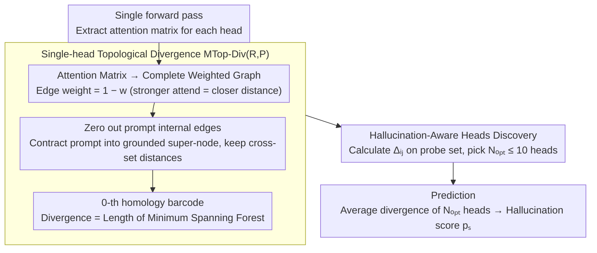

# Hallucination Detection in LLMs with Topological Divergence on Attention Graphs

**Conference**: ACL 2026  
**arXiv**: [2504.10063](https://arxiv.org/abs/2504.10063)  
**Code**: https://github.com/sb-ai-lab/TOHA  
**Area**: Hallucination Detection  
**Keywords**: TDA, Attention Graphs, Manifold Topology Divergence, Hallucination-aware Heads, Training-free

## TL;DR
TOHA treats the LLM attention matrix as a weighted graph, utilizes Manifold Topology Divergence from topological data analysis (TDA) to measure the "topological novelty of the response subgraph relative to the prompt subgraph," and discovers "hallucination-aware heads" that are stable across datasets. Averaging only 10 such heads achieves a training-free solution in RAG scenarios that is 70× faster than SelfCheckGPT with significantly leading ROC-AUC.

## Background & Motivation

**Background**: LLM + RAG is the current de facto deployment form, yet models still generate hallucinations inconsistent with the provided context. Existing detection methods can be categorized into three groups: (1) **Uncertainty**—using output probabilities like perplexity or max entropy; (2) **Consistency**—performing N re-samplings to compare consistency, e.g., SelfCheckGPT, Semantic Entropy, or EigenScore; (3) **Internal States**—using probes for linear classification of hidden layers or attention, e.g., HaloScope, LLM-Check, or ReDeEP.

**Limitations of Prior Work**: (1) Supervised internal state methods require large amounts of human-annotated hallucination samples; (2) Consistency methods require 10–20 re-generations, leading to excessive computational overhead; (3) Output probabilities do not fully reflect the true uncertainty of the model; (4) Existing attention-based work either treats all heads equally or ignores the geometric structure by only looking at numerical attention values, wasting the intrinsic graph information of the attention matrix.

**Key Challenge**: High-quality hallucination detection is currently either data-intensive (supervised) or compute-intensive (multi-sampling), lacking a solution that is efficient in both aspects. Additionally, while the academic community recognizes that "attention internal states are information-rich," the systematic exploration of its topological structure remains unexplored.

**Goal**: (1) Develop a training-free, single-generation detector that selects key heads using a minimal number of probes; (2) Establish a provable link between "hallucination occurrence" and "attention geometric/topological structure"; (3) Verify if the selected "hallucination-aware heads" can transfer across different datasets.

**Key Insight**: Each head's attention matrix is viewed as a complete weighted graph, where prompt tokens and response tokens form two vertex subsets. **Manifold Topology Divergence** is computed on this graph to measure the topological novelty of the response subgraph relative to the prompt subgraph. "Excessive novelty" is taken as a hallucination signal (Intuition: a faithful response should be geometrically "embedded" within the prompt's attention geometry).

**Core Idea**: Use 0-th homology (Minimum Spanning Tree length) to quantify the "minimal connection distance required to attach the response to the prompt." A larger distance implies the response is more detached from the prompt, indicating a higher likelihood of hallucination. It was found that averaging $\leq 10$ specific heads is sufficient.

## Method

### Overall Architecture
The TOHA pipeline (Algorithm 1, two stages): (a) **HeadsSelection**—uses a small probe set (hallucination set $S_h$ + grounded set $S_g$) to calculate the topological divergence mean difference $\Delta_{ij}$ for each head $(i,j)$ between hallucinated and grounded samples, sorted in descending order. Accumulate and average from $N=1$ to $N_{\max}=10$ to select $N_{\mathrm{opt}}$ that yields the maximum AUROC. (b) **Prediction**—calculates the average $d_{ij}(s)$ of these $N_{\mathrm{opt}}$ heads for a test sample $s$ to serve as the hallucination score $p_s$. The entire process involves no parameter training and only analyzes the attention matrix from a forward pass.

### Key Designs

**1. Attention as Weighted Graph + MTop-Div$_G$(R,P): Quantifying "Response Faithfulness to Prompt" as a Graph Metric**

Previous attention-based detection focused on raw magnitudes or summed all heads, ignoring the intrinsic graph structure. This work views the attention matrix $W$ of each head as a complete undirected weighted graph $G$. Edge weights are defined as $1-w_{ij}$, representing a "pseudo-distance"—stronger attention implies closer proximity. Vertices are partitioned into prompt subset $P$ and response subset $R$. Vietoris-Rips filtration is performed on a modified complex to compute the 0-th homology barcode $\mathcal{B}_0$. Divergence is defined as the sum of bar lengths: $\operatorname{MTop-Div}_G(R,P)=\sum_{[b_i,d_i]\in\mathcal{B}_0}|d_i-b_i|$.

Proposition 3.1 proves this metric is exactly equal to the total edge length of the "Minimum Spanning Forest connecting $R$ to $P$." Information-theoretically, $\operatorname{MTop-Div}_G(R,P)\geq L_{\mathrm{MST}}(R\cup P)-L_{\mathrm{MST}}(P)$, which is the incremental MST length after adding response tokens. The intuition is straightforward: a faithful response is embedded within the prompt's attention geometry with small divergence; a hallucinated response lacks support from the prompt and requires a longer connection distance, resulting in higher divergence.

**2. Hallucination-Aware Heads Discovery: Selecting a Minimal Subset of Sensitive Heads**

Since not all heads are sensitive to hallucinations, a metric is needed to identify them. The difference in average divergence between hallucinated and grounded samples for each head $(i,j)$ is calculated on the training set:

$$\Delta_{ij}=\frac{1}{|S_{\mathrm{hallu}}|}\sum_{s\in S_{\mathrm{hallu}}} d_{ij}(s)-\frac{1}{|S_{\mathrm{gr}}|}\sum_{s\in S_{\mathrm{gr}}} d_{ij}(s),\qquad d_{ij}(s)=\frac{1}{|R_{ij}^s|}\operatorname{MTop-Div}_{G_{ij}^s}(R_{ij}^s,P_{ij}^s),$$

A higher $\Delta_{ij}$ indicates a head's superior ability to distinguish hallucinations from grounded content. Scatter plots of cross-dataset $\Delta_{ij}$ reveal a stable structure: for Mistral-7B, 4 heads consistently reside in the top-right corner regardless of the dataset. This stability ensures strong transferability. Moreover, some of these heads correspond to "copying heads," providing a mechanistic explanation: faithful responses rely on copying prompt information; when copying is insufficient, the response "drifts" in the attention geometry.

**3. Zeroing Prompt-Internal Weights: Eliminating Structural Noise**

Internal prompt connections contain rich semantic/syntactic information, but these are noise for hallucination detection as they can drown out cross-set signals. Therefore, $P$-internal edge weights are zeroed before calculating MTop-Div. This is equivalent to contracting the prompt into a "grounded" connected super-node. The resulting topology purely measures "how far response nodes must travel to reach the prompt." §4.4 confirms that without this simplification, signals are obscured by structural noise, degrading detection performance.

### Loss & Training
TOHA is entirely training-free. The only "learning" occurs during the HeadsSelection phase (head ranking), which requires a minimal labeled set (100 samples or a 5% split). These labels are used only for ranking heads, not for training classifiers. $N_{\mathrm{opt}}$ is capped at 10.

## Key Experimental Results

### Main Results: ROC-AUC (↑), 5 Datasets × 5 LLMs

| Model / Method | MS MARCO | CNN/DM | CoQA | SQuAD | XSum |
|------|------|------|------|------|------|
| **Mistral-7B** | | | | | |
| SelfCheckGPT | 0.63 | 0.51 | 0.86 | 0.71 | 0.66 |
| Max entropy | 0.68 | 0.60 | 0.73 | 0.75 | 0.71 |
| ReDeEP | 0.54 | 0.47 | 0.59 | 0.45 | 0.63 |
| **TOHA** | **0.76** | **0.60** | **0.89** | **0.96** | 0.66 |
| **LLaMA-2-7B** | | | | | |
| SelfCheckGPT | 0.59 | 0.60 | 0.66 | 0.57 | 0.64 |
| Semantic entropy | 0.53 | 0.51 | 0.76 | 0.73 | 0.61 |
| **TOHA** | **0.65** | 0.56 | **0.90** | **0.87** | **0.68** |
| **LLaMA-2-13B** | | | | | |
| Max entropy | 0.62 | 0.53 | 0.66 | 0.78 | 0.59 |
| **TOHA** | **0.67** | **0.56** | **0.92** | **0.88** | **0.66** |

Ours improves by 11.7% on MS MARCO over the strongest baseline and by 21.6% on CoQA for LLaMA-2-7B. Wilcoxon-Holm post-hoc tests show TOHA ranks 1.67 overall and identifies significant improvements ($p \leq 0.0016$) against each baseline.

### Ablation Study: Efficiency + Transferability

| Metric | Value | Description |
|------|------|------|
| Speed vs SelfCheckGPT (Single extra gen) | ~7× faster | TOHA uses only one forward pass |
| Speed vs SelfCheckGPT (Actual 10–20 iterations) | **~70× faster** | Measured in deployment scenarios |
| Speed vs Max entropy | Similar | But significantly higher AUROC |
| Training set size | $|S_h \cup S_g| = 100$ | Only 100 samples needed to select heads |
| Selected head count | $N_{\mathrm{opt}} \leq 10$ | Stable heads: 4 (Mistral) / 3 (Llama-2) |
| HotpotQA Multi-hop | Ours > all baselines | "In the wild" validation |
| Cross-dataset transfer (XSum ↔ CNN/DM) | Within 1σ | High universality of selected heads |

### Key Findings
- **Few heads needed**: Identifying $\leq 10$ heads outperforms all baselines, suggesting hallucination signals are highly concentrated rather than uniformly distributed.
- **Topological > Numerical**: Baselines like ReDeEP/LLM-Check using raw attention values often drop to near-random levels (0.5), while TOHA's MST-based topology remains stable above 0.8.
- **Strong transferability**: Heads selected on XSum perform consistently on CNN/DM, showcasing cross-dataset robustness.
- **Mechanistic interpretability**: The selected "copying heads" link "high divergence" to "insufficient copying," explaining why responses drift in attention geometry during hallucinations.

## Highlights & Insights
- **Applying TDA to the right scenario**: Unlike previous NLP studies where TDA provided marginal gains or purely descriptive analysis, this work provides a dual explanation (geometric MSF vs information-theoretic MST increment) for MTop-Div, making an abstract metric calculable and interpretable.
- **Value of "Hallucination-Aware Heads"**: It reveals that hallucination is a local behavior of specific attention heads rather than an emergent property of the entire network, providing a concrete target for mechanistic interpretability and potential intervention methods.
- **Smart engineering with "prompt zeroing"**: This simplifies the task by removing semantic structural noise, ensuring the metric is only sensitive to cross-set distances. This "task-specific topological simplification" could be applied to other graph-based tasks like domain adaptation.

## Limitations & Future Work
- **Dependency on limited labels**: Although only 100 samples are needed, they must be labeled "hallucinated/grounded"; pure zero-shot scenarios require further research.
- **White-box requirement**: The method requires access to attention matrices, precluding its use with closed-source APIs (e.g., GPT-4o).
- **RAG-specific focus**: The assumption that divergence reflects prompt-response relationships is ambiguous in free-form generation (without context).
- **Homology order**: Only 0-th homology ($\mathcal{B}_0$) is used; future work could explore $\mathcal{B}_1$ (loops) or higher-order persistent homology.
- **Potential improvements**: Integrating signals with RLHF/alignment training or using TOHA signals to trigger re-retrieval.

## Related Work & Insights
- **vs SelfCheckGPT / Semantic Entropy**: Consistency methods require 10–20 generations; TOHA needs only one and often achieves higher accuracy.
- **vs HaloScope / LLM-Check / ReDeEP**: These require training probes or treat all heads equally; TOHA is training-free and offers stronger interpretability.
- **vs Kushnareva 2021 / Tulchinskii 2023**: While these treat attention as TDA objects for global classification, TOHA is the first to apply manifold topology divergence to prompt-response cross-set structures and prove its MSF equivalence.

## Rating
- Novelty: ⭐⭐⭐⭐ Introducing manifold topology divergence to attention graph analysis with MSF equivalence proof.
- Experimental Thoroughness: ⭐⭐⭐⭐ 5 LLMs × 5 datasets + HotpotQA + transferability + efficiency + significance tests.
- Writing Quality: ⭐⭐⭐⭐ Clear intuition and scatter plots, with complete mathematical derivations.
- Value: ⭐⭐⭐⭐ 70× speedup with only 100 labeled samples, making it a highly practical detector for industrial RAG deployment.

<!-- RELATED:START -->

## Related Papers

- [\[ICLR 2026\] Neural Message-Passing on Attention Graphs for Hallucination Detection](../../ICLR2026/hallucination/neural_message-passing_on_attention_graphs_for_hallucination_detection.md)
- [\[ACL 2026\] Spotlight and Shadow: Attention-Guided Dual-Anchor Introspective Decoding for MLLM Hallucination Mitigation](spotlight_and_shadow_attention-guided_dual-anchor_introspective_decoding_for_mll.md)
- [\[ACL 2026\] MeasHalu: Mitigation of Scientific Measurement Hallucinations for LLMs](meashalu_mitigation_of_scientific_measurement_hallucinations_for_large_language_.md)
- [\[ACL 2026\] Why LLMs Hallucinate on Structured Knowledge: A Mechanistic Analysis of the Reasoning Process](why_llms_hallucinate_on_structured_knowledge_a_mechanistic_analysis_of_reasoning.md)
- [\[ACL 2026\] HalluAudio: A Comprehensive Benchmark for Hallucination Detection in Large Audio-Language Models](halluaudio_a_comprehensive_benchmark_for_hallucination_detection_in_large_audio-.md)

<!-- RELATED:END -->
