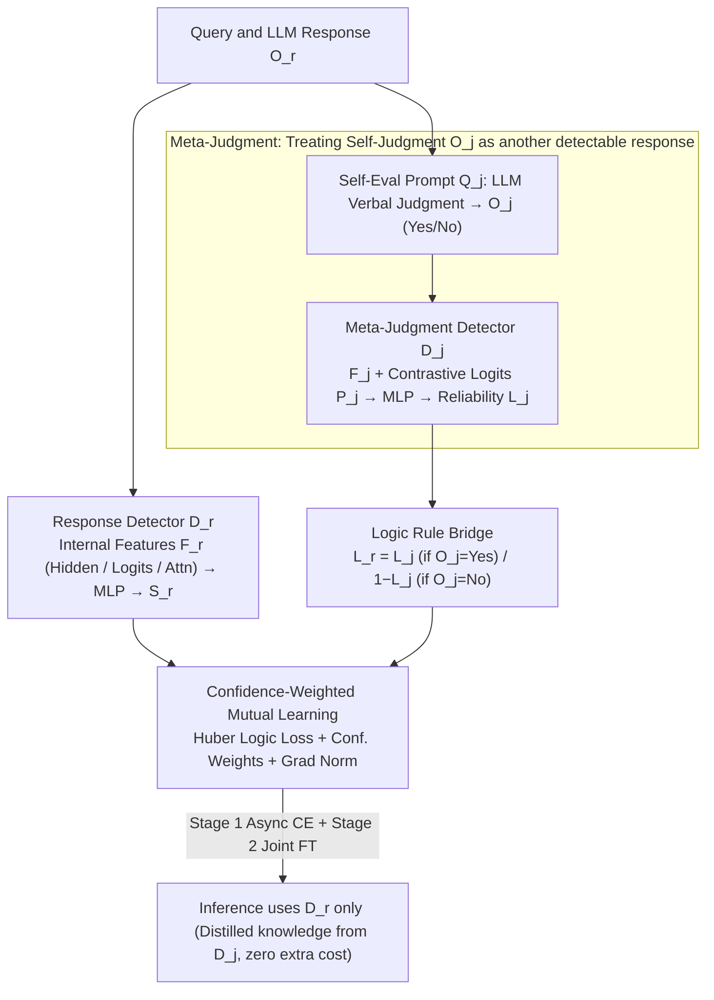

# Logical Consistency as a Bridge: Improving LLM Hallucination Detection via Label Constraint Modeling between Responses and Self-Judgments

**Conference**: ACL 2026  
**arXiv**: [2605.03971](https://arxiv.org/abs/2605.03971)  
**Code**: https://summerrice.github.io/LaaB (Project Page)  
**Area**: Hallucination Detection  
**Keywords**: Hallucination Detection, Self-Judgment, Meta-Judgment, Logical Constraints, Mutual Learning, Internal Features

## TL;DR
The model treats the LLM's self-judgment (whether it thinks its previous answer was correct) as a potentially hallucinated generation itself. It first trains a "meta-judgment detector" using intrinsic features to estimate the judgment's credibility. Then, using the inherent logical rule ("if self-judgment says true → both labels same / if self-judgment says false → labels opposite"), it constrains the response detector and meta-judgment detector via confidence-weighted mutual learning with Huber loss. During inference, only the response detector is used, achieving gains from both perspectives with zero additional inference cost.

## Background & Motivation

**Background**: Current LLM hallucination detection follows two main paths: (a) **Intrinsic-pattern** approach—mining hidden states (SAPLMA), prediction logits (Logits Lens), or attention patterns (Lookback Lens) during generation, which essentially quantifies uncertainty at a microscopic level; (b) **Self-judgment** approach—directly prompting the LLM to answer "was my previous statement correct," using macroscopic symbolic judgment as a signal.

**Limitations of Prior Work**: Both paths have significant drawbacks. Route (a) captures fine-grained neural signals but struggles to detect "high-confidence hallucinations" (cases where the LLM is wrong but certain) and lacks semantic calibration. Route (b) offers explicit semantic reasoning, but the verbal judgment itself may suffer from "evaluative hallucination"—issues like self-preference bias, overthinking, or simply being wrong make "says it's true" unreliable.

**Key Challenge**: Intrinsic features (implicit/neural/micro) and self-judgment (explicit/symbolic/macro) are **coupled** behaviors but are currently processed independently. Simple ensemble methods are often dragged down by the weaker predictor, while treating self-judgment as ground truth introduces noise from evaluative hallucinations.

**Goal**: (a) Utilize both signals within a unified learnable framework; (b) provide a "reliability estimate" for self-judgment rather than treating it as truth; (c) avoid significant additional overhead during inference (running the LLM twice is expensive).

**Key Insight**: The authors observe that "an LLM's self-judgment of its own response is also a response." This judgment is generated, can hallucinate, and its credibility can be estimated via intrinsic features. If one can estimate the self-judgment's credibility $L_j$, then by the **inherent logic rule** ("self-judgment says true → response is true" / "self-judgment says false → response is false"), this judgment can be mapped back to the response. This creates a prediction path for the response that is independent of the direct response detector.

**Core Idea**: Treat the self-judgment $O_j$ as "another response" and train a meta-judgment detector $D_j$ to estimate its truth $L_j$. Use a logic bridge where $L_r = L_j$ if $O_{j} = \text{"Yes"}$ and $L_r = 1 - L_j$ if $O_{j} = \text{"No"}$ to translate $D_j$'s prediction into a prediction for the original response. Finally, align $D_r$ and $D_j$ via mutual learning under logical constraints.

## Method

### Overall Architecture
LaaB consists of three modules and a two-stage training strategy:

**Module (a) Response Hallucination Modeling**: Given a query $Q_r$ and the generated response $O_r$, internal features $F_r \in \{H_r, P_r, A_r\}$ (hidden states / logits / attention) are extracted and fed into an MLP detector $D_r$, outputting $S_r = (S_{r,\text{hallu}}, S_{r,\text{real}})$.

**Module (b) Self-Judgment Hallucination Modeling**: An evaluation prompt $Q_j$ is used to obtain a verbal judgment $O_j \in \{\text{"Yes"}, \text{"No"}\}$. Internal features $F_j$ from this generation are fed into an MLP detector $D_j$, outputting $S_j$ to estimate the correctness of the judgment itself ($L_j \in \{0,1\}$).

**Module (c) Logic-Constrained Mutual Learning**: The logic rule (Table 2) translates $D_j$'s prediction into a prediction for $L_r$. Huber loss aligns the probability distributions of $D_r$ and $D_j$, using confidence weighting to prevent the detectors from degrading each other.

**Training Strategy**: Stage 1 uses round-robin asynchronous training with CE loss for $D_r$ and $D_j$. Stage 2 performs joint fine-tuning including the logic loss. **Only $D_r$ is used during inference**—it absorbs knowledge from $D_j$ through mutual learning, eliminating the need for self-judgment generation at runtime and resulting in zero additional inference cost.

### Key Designs

**1. Meta-Judgment—Treating self-judgment as a "detectable response": Estimating reliability rather than assuming truth**

The primary risk of self-judgment routes is treating the verbal output $O_j$ as ground truth, despite its susceptibility to self-preference bias and evaluative hallucination. LaaB addresses this by observing that "self-evaluation is also a generation process." Thus, $O_j$ is treated as a "query-response pair," and a meta-judgment detector $D_j$ is trained to predict its correctness $L_j$. $D_j$ utilizes features isomorphic to the response detector: hidden states $H_j$ at the optimal validation layer for the final token, logits $P_j$ for the first token, and attention ratios $A_j$ across six segmented context parts (Framing, Query, Response, Eval_Query, Format, Trigger).

Notably, $P_j$ uses a contrastive vector: $P_j = P_{\text{yes}} \oplus (P_{\text{yes}} - P_{\text{no}})$ if $O_j=\text{"Yes"}$, and $P_j = P_{\text{no}} \oplus (P_{\text{no}} - P_{\text{yes}})$ if $O_j=\text{"No"}$. While raw logits vary in magnitude, the difference term directly encodes how certain the model is about its "Yes/No" choice, making $D_j$ more sensitive to self-evaluation confidence. This leverages neural signals to gate the reliability of verbal judgments.

**2. Logic Rule Bridge—Using logical identities to link detectors**

Estimating $L_j$ is insufficient; it must be translated to the response's truth value. This is done via a definitional identity: if $L_j$ indicates whether $O_j$ correctly judged the response, then if $O_j=\text{"Yes"}$, correctness implies the response is real ($L_r = L_j$). If $O_j=\text{"No"}$, correctness implies the response is a hallucination ($L_r = 1 - L_j$). Together: $L_r = L_j$ if $O_j=\text{"Yes"}$ else $1 - L_j$.

Regarding the loss function, Huber loss aligns the probability distributions of the two paths: $\mathcal{L}_{\text{Logic}} = \mathcal{L}_{\text{Huber}}(S_{r,\text{hallu}}, S_{j,\text{hallu}})$ if $O_j=\text{"Yes"}$, otherwise $\mathcal{L}_{\text{Huber}}(S_{r,\text{hallu}}, S_{j,\text{real}})$. Because this constraint is derived from logic, it acts as a weak supervision signal between two detectors without requiring additional labeling or significant computation—it forces logical consistency based on the polarity of $O_j$.

**3. Confidence-Weighted Mutual Learning + Gradient Normalization—Preventing mutual degradation**

Standard Deep Mutual Learning assumes peers are equal. However, in hallucination detection, the quality of $D_r$ (e.g., hidden states) and $D_j$ (e.g., attention) is inherently unequal. Equal-weight learning would allow a weaker detector to pollute a stronger one. LaaB applies a confidence weight to each sample pair: $\mathcal{L}_{\text{Logic}, r} = \log(1 + \frac{S_j(L_j)}{S_r(L_r)}) \cdot \mathcal{L}_{\text{Logic}}$ and $\mathcal{L}_{\text{Logic}, j} = \log(1 + \frac{S_r(L_r)}{S_j(L_j)}) \cdot \mathcal{L}_{\text{Logic}}$. A peer's influence is proportional to its confidence in the ground truth.

Additionally, to prevent CE loss and Logic loss from being dominated by different magnitudes, the ratio is dynamically adjusted via gradient norms $\alpha_* = \frac{\|\nabla_{\theta_*^{-1}} \mathcal{L}_{\text{CE}, *}\|_2}{\|\nabla_{\theta_*^{-1}} \mathcal{L}_{\text{Logic}, *}\|_2 + \epsilon}$. The final objective is $\mathcal{L}_* = \mathcal{L}_{\text{CE}, *} + \alpha_* \mathcal{L}_{\text{Logic}, *}$. This combination ensures robust learning even with unequal feature qualities.

### Loss & Training
**Stage 1**: Round-robin asynchronous training of $D_r$ and $D_j$, minimizing $\mathcal{L}_{\text{CE}} + \alpha \mathcal{L}_{\text{Logic}}$. When one converges, it is frozen while the other continues. **Stage 2**: Joint fine-tuning using $\mathcal{L}_{\text{Joint}} = \mathcal{L}_{\text{CE}, r} + \mathcal{L}_{\text{CE}, j} + \alpha \mathcal{L}_{\text{Logic}}$. **Inference only uses $D_r$**, which has absorbed $D_j$'s knowledge via logic loss, maintaining the same inference cost as a single response detector.

## Key Experimental Results

### Main Results
**Setup**: 4 datasets (TriviaQA / MMLU / NQ_Open / HaluEval) × 4 LLMs (Llama-3.1-8B-Instruct / Llama-3.1-70B-Instruct / Qwen-2.5-32B-Instruct / Mistral-7B-Instruct-v0.3) × 8 baselines (Self-Judge, SAPLMA, Logits Lens, Lookback Lens, SelfCheckGPT, EigenScore, etc.). 7:1:2 split for Train/Val/Test. Metrics: Macro F1 and Accuracy.

| Dimension | Configuration | Description |
|------|------|------|
| Dataset | TriviaQA | Open-domain QA |
| Dataset | MMLU | Multi-task understanding |
| Dataset | NQ_Open | Natural questions |
| Dataset | HaluEval | Specifically for hallucination |
| LLM | Llama-3.1-8B / 70B-Instruct | Scale comparison |
| LLM | Qwen-2.5-32B-Instruct | Cross-family |
| LLM | Mistral-7B-Instruct-v0.3 | Cross-family |
| Baseline (self-judgment) | Self-Judge (Kadavath et al. 2022) | Direct verbal self-evaluation |
| Baseline (intrinsic, trainable) | SAPLMA / Logits Lens / Lookback Lens | Feature-based detectors |
| **LaaB Application** | Wrapped around the 3 trainable baselines | Base detector + LaaB |

Paper Table 3 indicates: "**Bolded numbers denote that the use of LaaB is better-performing than its corresponding base version. Underlined numbers are the highest in each column within each LLM group.**" Essentially, for nearly every (LLM, base detector) pair, the "+LaaB" version consistently outperforms the base, and column-wide bests are concentrated in LaaB combinations.

### Ablation Study

| Configuration | Function | Expected Impact |
|------|---------|---------|
| Full LaaB | Complete method | Baseline performance |
| w/o meta-judgment | Directly trusting verbal $O_j$ | Performance drops due to evaluative hallucination |
| w/o logic rule | KL-alignment without $O_j$ polarity | Error propagation, especially in "No" cases |
| w/o confidence weighting | Equal-weight mutual learning | Weak detectors degrade stronger ones |
| w/o stage 1 round-robin | No pre-training of detectors | Training instability |

### Key Findings
- **LaaB as a "Wrapper"**: The three trainable baselines (SAPLMA, Logits Lens, Lookback Lens) all show consistent improvements when wrapped with LaaB, proving it is a **general-purpose framework**.
- **Self-Judge Weakness**: Self-Judge (Kadavath 2022) as a baseline is poor due to evaluative hallucinations; LaaB filters this signal through a meta-detector.
- **Zero Inference Cost**: While training requires one-time self-judgment generation, inference utilizes only $D_r$, making deployment no more expensive than base detectors.
- **Cross-LLM Robustness**: Improvements are consistent across 8B to 70B models and different model families (Llama, Qwen, Mistral).

## Highlights & Insights
- **Perspective shift: "Self-judgment is also a response"**: Previous self-judgment methods assumed the verbal judge was a higher-level oracle. This paper treats it as just another potentially hallucinating generation, allowing intrinsic features to calibrate it. This has implications for LLM-as-judge, RLAIF, and self-rewarding systems. 
- **Logically Identical Weak Supervision**: Using definitional logic to create a constraint via Huber loss provides a "free" multi-view signal that requires no extra labeling or compute.
- **Engineering Efficiency**: Using mutual learning to distill knowledge from $D_j$ into $D_r$ allows for multi-view training while maintaining single-view inference speed.
- **Contrastive Logit Features**: Using $(P_{\text{yes}} - P_{\text{no}})$ explicitly encodes confidence, a trick highly reusable for any binary LLM classification task.

## Limitations & Future Work
- **Training Data Cost**: Requires generating self-judgments and their features for every training instance, doubling the data collection cost compared to direct detection.
- **Binary Logic Constraint**: The logic rule currently only handles binary "Yes/No" judgments; extension to graded or multi-class outputs is non-trivial.
- **Dependence on Intrinsic Features**: Requires access to hidden states/logits, making it inapplicable to closed-source API models like GPT-4o or Claude.
- **Short-form Context focus**: Evaluated primarily on QA datasets; performance in long-form generation (summarization, dialogue) where feature aggregation is more complex remains to be seen.

## Related Work & Insights
- **Comparison with SAPLMA / Logits Lens**: These are single-view detectors. LaaB serves as an orthogonal enhancement that can be applied on top of them.
- **Comparison with Self-Judge (Kadavath 2022)**: Kadavath uses raw verbal judgment, which is prone to error; LaaB adds a reliability gate.
- **Comparison with SelfCheckGPT**: While SelfCheckGPT uses multiple-response consistency, LaaB uses logical consistency between the response and its judgment.
- **Inspiration**: The "train with multi-view, infer with single-view" paradigm is an excellent blueprint for creating high-performance, low-latency industrial LLM monitoring systems.

## Rating
- Novelty: ⭐⭐⭐⭐ (Original perspective on self-judgment as generation; novel logic bridge).
- Experimental Thoroughness: ⭐⭐⭐⭐ (Extensive grid of LLMs and baselines).
- Writing Quality: ⭐⭐⭐⭐ (Clear logic and high-quality notation/diagrams).
- Value: ⭐⭐⭐⭐ (High engineering utility due to zero inference overhead).

<!-- RELATED:START -->

## Related Papers

- [\[ACL 2026\] MultiHaluDet: Multilingual Hallucination Detection via LLM Hidden State Probing](multihaludet_multilingual_hallucination_detection_via_llm_hidden_state_probing.md)
- [\[ACL 2026\] 为什么 LLM 在结构化知识上产生幻觉：推理过程的机制分析](why_llms_hallucinate_on_structured_knowledge_a_mechanistic_analysis_of_reasoning.md)
- [\[ACL 2026\] Rethinking Evaluation for LLM Hallucination Detection: A Desiderata, A New RAG-based Benchmark, New Insights](rethinking_evaluation_for_llm_hallucination_detection_a_desiderata_a_new_rag-bas.md)
- [\[ICML 2025\] Steer LLM Latents for Hallucination Detection](../../ICML2025/hallucination/steer_llm_latents_for_hallucination_detection.md)
- [\[ACL 2026\] Aligning with Your Own Voice: Self-Corrected Preference Learning for Hallucination Mitigation in LVLMs](aligning_with_your_own_voice_self-corrected_preference_learning_for_hallucinatio.md)

<!-- RELATED:END -->
