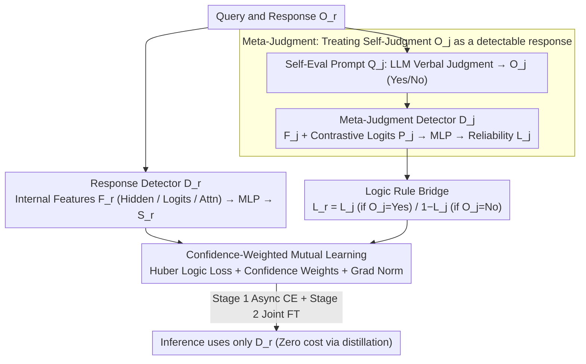

# Logical Consistency as a Bridge: Improving LLM Hallucination Detection via Label Constraint Modeling between Responses and Self-Judgments

**Conference**: ACL 2026  
**arXiv**: [2605.03971](https://arxiv.org/abs/2605.03971)  
**Code**: https://summerrice.github.io/LaaB (Project Homepage)  
**Area**: Hallucination Detection  
**Keywords**: Hallucination Detection, Self-Judgment, Meta-Judgment, Logical Constraints, Mutual Learning, Intrinsic Features

## TL;DR
This work treats an LLM's self-judgment ("Does it think its previous answer was correct?") as another potentially hallucinated generation. It first trains a "meta-judgment detector" using intrinsic features to estimate self-judgment credibility. Then, by applying the logical rule "if self-judgment says True → labels are identical" and "if False → labels are opposite," the response detector and meta-judgment detector are jointly trained via Huber loss and confidence-weighted mutual learning. At inference time, only the response detector is used, absorbing knowledge from self-judgment with zero additional inference cost while achieving dual-perspective gains.

## Background & Motivation

**Background**: Current LLM hallucination detection follows two main paradigms: (a) **intrinsic-pattern** route, which mines hidden states (SAPLMA), prediction logits (Logits Lens), or attention patterns (Lookback Lens) during generation, essentially quantifying uncertainty at the microscopic level; (b) **self-judgment** route, where the LLM is directly asked "Was my previous answer correct?", using macroscopic symbolic judgment as a signal.

**Limitations of Prior Work**: Both routes have inherent flaws and remain disconnected. Route (a) can access fine-grained neural signals but struggles to detect "high-confidence hallucinations" where the LLM is confidently wrong; its metrics also lack semantic calibration. Route (b) involves explicit semantic reasoning, but verbal judgment itself can suffer from "secondary hallucinations"—issues like self-preference bias (favoring its own output), overthinking, and evaluative hallucination make its "Yes" unreliable.

**Key Challenge**: Intrinsic features (implicit/neural/micro) and self-judgment (explicit/symbolic/macro) are **coupled** behaviors but are currently processed independently. Simple ensembles of the two paths are often limited by the weaker component, while treating self-judgment as ground truth risks contamination from evaluative hallucinations.

**Goal**: (a) Utilize both signals within a unified learnable framework; (b) Avoid treating self-judgment as absolute truth by providing a "reliability estimate"; (c) Maintain zero additional inference overhead (running the LLM twice is too expensive).

**Key Insight**: The authors observe that "an LLM's self-judgment of its own response is also a response." This judgment is a generated output, can hallucinate, and its credibility can also be estimated using intrinsic features. If one can estimate the self-judgment reliability $L_j$ and combine it with the **logical necessity** that "True self-judgment → Response is as stated" and "False self-judgment → Response is opposite," the meta-judgment can be **back-propagated** to the response judgment, creating an independent prediction path.

**Core Idea**: Treat self-judgment $O_j$ as "another response." Train a meta-judgment detector $D_j$ to estimate its truth $L_j$. Use a logic bridge where $L_r = L_j$ if $O_j = \text{"Yes"}$ and $L_r = 1 - L_j$ if $O_j = \text{"No"}$ to translate $D_j$'s prediction into a response prediction. Finally, use mutual learning to align $D_r$ and $D_j$ under logical constraints.

## Method

### Overall Architecture
LaaB consists of three modules and a two-stage training strategy:

**Module (a) Response Hallucination Modeling**: Given a query $Q_r$ and generated response $O_r$, internal features $F_r \in \{H_r, P_r, A_r\}$ (hidden states / logits / attention) are extracted and fed to an MLP detector $D_r$ to output $S_r = (S_{r,\text{hallu}}, S_{r,\text{real}})$.

**Module (b) Self-Judgment Hallucination Modeling**: An evaluation prompt $Q_j$ is used to obtain a verbal judgment $O_j \in \{\text{"Yes"}, \text{"No"}\}$. Similarly, internal features $F_j \in \{H_j, P_j, A_j\}$ from the generation of $O_j$ are extracted and fed to a meta-judgment detector $D_j$ to estimate the reliability of the judgment itself ($L_j \in \{0,1\}$).

**Module (c) Logic-Constrained Mutual Learning**: The logical rule (Table 2) translates $D_j$'s prediction into a prediction for $L_r$. Huber loss is used to align the probability distributions of $D_r$ and $D_j$, supplemented by confidence weighting to prevent mutual degradation.

**Training Strategy**: Stage 1 uses round-robin asynchronous training for $D_r$ and $D_j$ with individual CE loss. Stage 2 involves joint fine-tuning with the logic loss. **Inference only requires $D_r$**—it has distilled knowledge from $D_j$, so the self-judgment generation is not needed at runtime, resulting in zero additional overhead.

### Key Designs

**1. Meta-Judgment—Treating self-judgment as a "detectable response": Estimating reliability rather than assuming truth**

The primary risk of the self-judgment route is treating the verbal judgment $O_j$ as ground truth, despite its susceptibility to biases and evaluative hallucinations. LaaB addresses this by observing that "LLM self-evaluation is also a generation process." Thus, $O_j$ is treated as another "query-response pair," and a meta-judgment detector $D_j$ is trained to estimate its truth $L_j$. $D_j$ is isomorphic to the response detector: it takes the hidden state $H_j$ at the last token of the judgment, the logits $P_j$ at the first token, and attention ratios $A_j$ across six segmented context parts (Framing/Query/Response/etc.).

Crucially, $P_j$ uses a contrastive vector: if $O_j = \text{"Yes"}$, then $P_j = P_{\text{yes}} \oplus (P_{\text{yes}} - P_{\text{no}})$; if $O_j = \text{"No"}$, then $P_j = P_{\text{no}} \oplus (P_{\text{no}} - P_{\text{yes}})$. The difference term explicitly encodes the model's certainty, making $D_j$ more sensitive to self-evaluation confidence.

**2. Logic Rule Bridge—Using logical identities to link detectors**

Estimating $L_j$ is insufficient; it must be translated back to the response judgment. Instead of heuristic assumptions, the method uses an identity: if $L_j$ indicates whether $O_j$ correctly judged the response, then if $O_j = \text{"Yes"}$, correctly judging means $L_r = L_j$. If $O_j = \text{"No"}$, correctly judging means $L_r = 1 - L_j$. 

This is implemented using Huber loss to align the probability distributions: $\mathcal{L}_{\text{Logic}} = \mathcal{L}_{\text{Huber}}(S_{r,\text{hallu}}, S_{j,\text{hallu}})$ if $O_j = \text{"Yes"}$, otherwise $\mathcal{L}_{\text{Huber}}(S_{r,\text{hallu}}, S_{j,\text{real}})$. Since this constraint is derived from definitions, it introduces a zero-cost weak supervision signal that enforces logical consistency between detectors.

**3. Confidence-Weighted Mutual Learning + Gradient Normalization—Preventing pollution from weaker detectors**

Standard Deep Mutual Learning assumes peers are equal, but in hallucination detection, the quality of features for $D_r$ and $D_j$ may differ. To prevent weaker signals from misleading stronger ones, a confidence weight is added: $\mathcal{L}_{\text{Logic}, r} = \log(1 + \frac{S_j(L_j)}{S_r(L_r)}) \cdot \mathcal{L}_{\text{Logic}}$. Peers only influence each other when their confidence in the ground truth is high. Additionally, gradient norms $\alpha_*$ are used to dynamically balance the CE loss and Logic loss.

### Loss & Training
**Stage 1**: Round-robin asynchronous training of $D_r$ and $D_j$, minimizing $\mathcal{L}_{\text{CE}} + \alpha \mathcal{L}_{\text{Logic}}$. **Stage 2**: Joint fine-tuning where $\mathcal{L}_{\text{Joint}} = \mathcal{L}_{\text{CE}, r} + \mathcal{L}_{\text{CE}, j} + \alpha \mathcal{L}_{\text{Logic}}$. **At inference**, only $D_r$ is used. Since the logic loss acts as a distillation mechanism during training, $D_r$ captures $D_j$'s knowledge without needing the self-judgment generation step at runtime.

## Key Experimental Results

### Main Results
**Setup**: 4 Datasets (TriviaQA / MMLU / NQ_Open / HaluEval) × 4 LLMs (Llama-3.1-8B/70B-Instruct, Qwen-2.5-32B, Mistral-7B) × 8 Baselines. Data split 7:1:2. Metrics: Macro F1 and Accuracy.

| Dimension | Configuration | Description |
|------|------|------|
| Datasets | TriviaQA, MMLU, NQ_Open, HaluEval | QA and specialized hallucination sets |
| LLMs | Llama-3.1 (8B/70B), Qwen-2.5 (32B), Mistral-7B | Diverse scales and families |
| Baselines | Self-Judge, SAPLMA, Logits Lens, Lookback Lens, etc. | Symbolic and intrinsic routes |
| **LaaB Application** | Wrapped around 3 trainable baselines | Base detector + LaaB |

Experimental results show that for nearly every (LLM, base detector) combination, the "+LaaB" version significantly outperforms the original base version. The best-performing configurations in each column are consistently those utilizing the LaaB framework.

### Ablation Study
Key ablation findings:
- **w/o meta-judgment**: Treating self-judgment as ground truth harms performance due to evaluative hallucination.
- **w/o logic rule**: Using simple KL divergence for alignment ignoring $O_j$ polarity leads to error propagation.
- **w/o confidence weighting**: Equal-weight mutual learning allows weaker detectors to degrade stronger ones.
- **Stage 1 Importance**: Skipping asynchronous pre-training leads to training instability.

### Key Findings
- **LaaB as a Universal Wrapper**: It consistently improves three different trainable baselines (SAPLMA, Logits Lens, Lookback Lens), proving its robustness as a general framework.
- **Self-Judging Alone is Weak**: Direct verbal judgment suffers from overconfidence and bias; LaaB filters this signal through intrinsic features.
- **Zero Additional Inference Overhead**: This is a core advantage. While training requires generating self-judgments, inference does not, making it production-ready.
- **Cross-LLM Robustness**: Consistent gains across different model families and scales.

## Highlights & Insights
- **Perspective Shift**: Viewing self-judgment as just another response is a deep insight. It shifts the paradigm from treating LLMs as trustworthy oracles to treating their evaluations as data points that require calibration via internal neural signals.
- **Logical Rules as Supervision**: Encoding logical identities into the loss function provides a "free" multi-view supervision signal without needing extra manual labels or compute during inference.
- **Engineering Excellence**: The distillation via mutual learning allows the complex two-path architecture during training to collapse into a single efficient detector during deployment.
- **Contrastive Logits**: Using $P_{\text{yes}} - P_{\text{no}}$ to encode certainty is a robust feature engineering trick for classification tasks.

## Limitations & Future Work
- **Training Data Generation**: Requires an extra generation step for every training sample to collect self-judgments, doubling data collection costs for large datasets.
- **Binary Logic Constraint**: The current bridge is designed for Yes/No judgments and may not easily extend to graded or multi-class evaluations.
- **White-box Requirement**: Depends on access to internal features (hidden states/logits), making it inapplicable to closed-source APIs like GPT-4o.
- **Domain Focus**: Primarily validated on short-form QA; performance in long-form generation (summarization, dialogue) remains to be explored.

## Related Work & Insights
- **vs. Intrinsic Detectors (SAPLMA, etc.)**: LaaB is not a replacement but an enhancement that integrates symbolic signals.
- **vs. SelfConnectGPT/EigenScore**: While those focus on consistency across multiple samples, LaaB focuses on logical consistency between the response and the judgment of that response.
- **vs. Chain-of-Verification**: CoVe requires multiple iterative generations (expensive); LaaB requires only one detector pass at inference (fast).

## Rating
- **Novelty**: ⭐⭐⭐⭐ (Original perspective on self-judgment as hallucination-prone generation)
- **Experimental Thoroughness**: ⭐⭐⭐⭐ (Wide coverage across 4 LLMs and 8 baselines)
- **Writing Quality**: ⭐⭐⭐⭐ (Clear logical flow and notation)
- **Value**: ⭐⭐⭐⭐ (Practical zero-cost inference improvement)

<!-- RELATED:START -->

## Related Papers

- [\[ACL 2026\] MultiHaluDet: Multilingual Hallucination Detection via LLM Hidden State Probing](multihaludet_multilingual_hallucination_detection_via_llm_hidden_state_probing.md)
- [\[ACL 2026\] Aligning with Your Own Voice: Self-Corrected Preference Learning for Hallucination Mitigation in LVLMs](aligning_with_your_own_voice_self-corrected_preference_learning_for_hallucinatio.md)
- [\[ACL 2026\] Rethinking Evaluation for LLM Hallucination Detection: A Desiderata, A New RAG-based Benchmark, New Insights](rethinking_evaluation_for_llm_hallucination_detection_a_desiderata_a_new_rag-bas.md)
- [\[ICML 2025\] Steer LLM Latents for Hallucination Detection](../../ICML2025/hallucination/steer_llm_latents_for_hallucination_detection.md)
- [\[ICML 2026\] Zero-source LLM Hallucination Detection with Human-like Criteria Probing](../../ICML2026/hallucination/zero-source_llm_hallucination_detection_with_human-like_criteria_probing.md)

<!-- RELATED:END -->
## Related Papers

- [\[ACL 2026\] Why LLMs Hallucinate on Structured Knowledge: A Mechanistic Analysis of the Reasoning Process](why_llms_hallucinate_on_structured_knowledge_a_mechanistic_analysis_of_reasoning.md)
- [\[ACL 2026\] MultiHaluDet: Multilingual Hallucination Detection via LLM Hidden State Probing](multihaludet_multilingual_hallucination_detection_via_llm_hidden_state_probing.md)
- [\[ACL 2026\] Rethinking Evaluation for LLM Hallucination Detection: A Desiderata, A New RAG-based Benchmark, New Insights](rethinking_evaluation_for_llm_hallucination_detection_a_desiderata_a_new_rag-bas.md)
- [\[ACL 2026\] Aligning with Your Own Voice: Self-Corrected Preference Learning for Hallucination Mitigation in LVLMs](aligning_with_your_own_voice_self-corrected_preference_learning_for_hallucinatio.md)
- [\[ICML 2025\] Steer LLM Latents for Hallucination Detection](../../ICML2025/hallucination/steer_llm_latents_for_hallucination_detection.md)

<!-- RELATED:END -->
