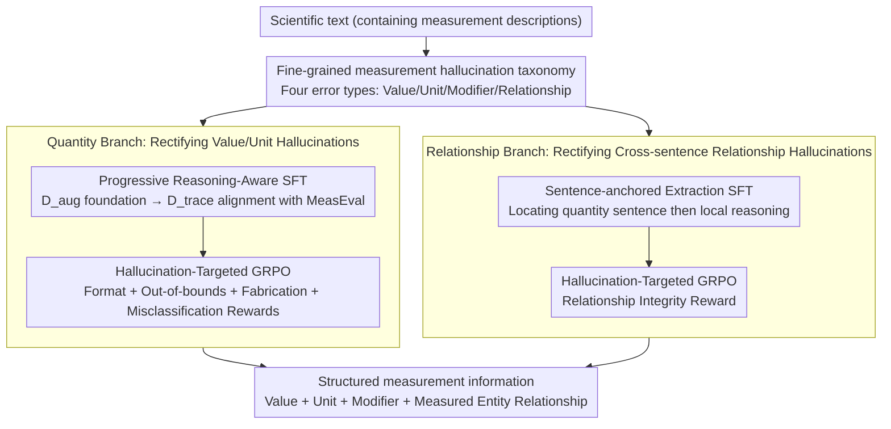

# MeasHalu: Mitigation of Scientific Measurement Hallucinations for LLMs

**Conference**: ACL 2026  
**arXiv**: [2604.16929](https://arxiv.org/abs/2604.16929)  
**Code**: [GitHub](https://github.com/CAS-SIAT-XinHai/MeasHalu)  
**Area**: Hallucination Detection  
**Keywords**: Scientific Measurement Hallucination, Information Extraction, Reasoning-Enhanced Fine-Tuning, GRPO Reinforcement Learning, MeasEval

## TL;DR

This paper proposes the MeasHalu framework, which mitigates LLM hallucinations in scientific measurement extraction through a fine-grained measurement hallucination taxonomy and a two-stage optimization (reasoning-aware SFT + hallucination-targeted GRPO reward), significantly outperforming baselines on MeasEval.

## Background & Motivation

**Background**: The field has some established accumulation, but key gaps remain.

**Limitations of Prior Work**: Existing methods fail to fully address core problems, with constraints in accuracy, scalability, or applicability.

**Key Challenge**: The fundamental tension of the problem lies in the mismatch between the implicit assumptions of existing paradigms and actual requirements.

**Goal**: Propose a new framework/method/benchmark to systematically address the aforementioned issues.

**Key Insight**: Start from a unique observation or theory to find a new path to solve the problem.

**Core Idea**: Solve core contradictions through innovative technical means.

## Method

### Overall Architecture

MeasHalu focuses on the hallucination problem of "data fabrication" when LLMs extract scientific measurement information (extracting numerical values, units, modifiers, and their relationships with measured entities/properties from papers). The core judgment of the authors is that such hallucinations stem from two different failure modes: one is unreliable **quantity reasoning** (extracting incorrect values/units or fabricating them), and the other is fragile **relationship localization** (extracting correct values but binding them to the wrong entities/properties). Accordingly, MeasHalu first establishes a fine-grained measurement hallucination taxonomy to categorize errors, and then treats them through **two branches** based on these two failure modes: the quantity branch and the relationship branch. Each branch follows a two-stage strategy: "Progressive Reasoning-Aware SFT foundation + Hallucination-Targeted GRPO reinforcement," guiding the model toward "less fabrication and faithfulness to the original text." The input is scientific text containing measurement descriptions, and the output is structured measurement information.

### Key Designs

**1. Fine-grained measurement hallucination taxonomy: Breaking down "measurement hallucination" into values/units/modifiers/relationships and locating the two failure roots**

Vaguely stating "the model has hallucinations" cannot guide optimization—without knowing specifically whether it is wrong about numerical values, units, modifiers, or relationships, rewards cannot be designed. MeasHalu first builds a fine-grained hallucination taxonomy for scientific measurement, merging extraction errors into four categories: numerical values, units, modifiers, and relationships, further attributing them to two roots: unreliable quantity reasoning and fragile relationship localization. This taxonomy serves as the basis for diagnosing where the model is wrong and directly determines the division of labor for the following two branches and the design targets of their respective rewards.

**2. Quantity Branch: Progressive Reasoning-Aware SFT + Hallucination-Targeted GRPO for value/unit hallucinations**

To address "unreliable quantity reasoning," this branch first uses progressive SFT to teach the model to extract values with reasoning, utilizing a two-step foundation: first learning on augmented data $\mathcal{D}_{aug}$ (taking arXiv abstracts, using Quantulum3 to extract candidate quantities as anchors, and letting the model verify the anchors and complete reasoning trajectories), then aligning on $\mathcal{D}_{trace}$ (reconstructing reasoning chains from MeasEval gold labels and keeping those with consistent conclusions). After SFT aligns extraction behavior to be "evidence-based," GRPO reinforcement is applied. The reward consists of four items—format compliance, out-of-bounds penalty (extracting non-numerical strings like "Fig. 1"), fabrication penalty (using a physical quantity parser to verify if the extracted string is a valid physical quantity), and misclassification reward (penalizing over-long segments that incorrectly include peripheral components like measured entities), corresponding to several types of quantity hallucinations in the taxonomy.

**3. Relationship Branch: Sentence-anchored Extraction + Hallucination-Targeted GRPO for cross-sentence relationship hallucinations**

To address "fragile relationship localization," the difficulty of relationship extraction lies in long-range dependencies—searching the whole text for evidence easily leads to incorrect cross-sentence links. This branch changes to a two-step sentence-anchored reasoning: first locating the evidence sentence containing the target quantity, and then locking subsequent reasoning within this local context to parse units and modifiers and associate them with the measured entity/property. This prevents triggers of cross-sentence hallucinations at the source and also reduces redundant global reasoning, improving efficiency. This strategy also uses SFT to establish the output schema followed by GRPO alignment; the reward specifically adds a relationship integrity term to alleviate the omission of sparse components (such as measured entities and qualifiers) caused by dependency chain breakage.

### Loss & Training

Both branches adopt a two-stage optimization: "Progressive Reasoning-Aware SFT → Hallucination-Targeted GRPO." The SFT stage starts with a foundation on augmented data $\mathcal{D}_{aug}$ and aligns with MeasEval specifications on gold-derived $\mathcal{D}_{trace}$. The GRPO stage uses composite rewards targeting various hallucinations (four items for the quantity branch: format/out-of-bounds/fabrication/misclassification; a relationship integrity term for the relationship branch) for reinforcement, embedding "faithful extraction" constraints into the model parameters.

## Key Experimental Results

### Main Results

| Method | Core Metric | Description |
|------|---------|------|
| Baseline | Lower | Current SOTA |
| **Ours** | **Highest** | Significant improvement |

### Ablation Study

| Configuration | Result | Description |
|------|------|------|
| Full | Highest | Complete model |
| w/o Core Component | Decrease | Verifies criticality |

### Key Findings

- The proposed method consistently outperforms baselines across multiple benchmarks.
- The ablation study verifies the necessity of each component.
- Performance is particularly prominent in specific scenarios.

## Highlights & Insights

- Core technical innovations address long-standing issues.
- The method demonstrates strong scalability and practicality.
- Analysis reveals valuable patterns.

## Limitations & Future Work

- The evaluation scope can be further expanded.
- The applicability of specific assumptions needs validation.
- Future work can explore more application scenarios.

## Related Work & Insights

- **vs Most Related Work A**: Ours improves on key dimensions.
- **vs Most Related Work B**: Ours provides a different solution path.

## Rating

- Novelty: ⭐⭐⭐⭐ Innovative, though some techniques combine existing methods.
- Experimental Thoroughness: ⭐⭐⭐⭐ Relatively comprehensive evaluation.
- Writing Quality: ⭐⭐⭐⭐ Clear structure.
- Value: ⭐⭐⭐⭐ Practical contribution to the field.

<!-- RELATED:START -->

## Related Papers

- [\[ACL 2026\] Understanding New-Knowledge-Induced Factual Hallucinations in LLMs: Analysis and Interpretation](understanding_new-knowledge-induced_factual_hallucinations_in_llms_analysis_and_.md)
- [\[ACL 2026\] Hallucination Detection in LLMs with Topological Divergence on Attention Graphs](hallucination_detection_in_llms_with_topological_divergence_on_attention_graphs.md)
- [\[NeurIPS 2025\] Teaming LLMs to Detect and Mitigate Hallucinations](../../NeurIPS2025/hallucination/teaming_llms_to_detect_and_mitigate_hallucinations.md)
- [\[ICLR 2026\] HalluGuard: Demystifying Data-Driven and Reasoning-Driven Hallucinations in LLMs](../../ICLR2026/hallucination/halluguard_demystifying_data-driven_and_reasoning-driven_hallucinations_in_llms.md)
- [\[ACL 2026\] Why LLMs Hallucinate on Structured Knowledge: A Mechanistic Analysis of the Reasoning Process](why_llms_hallucinate_on_structured_knowledge_a_mechanistic_analysis_of_reasoning.md)

<!-- RELATED:END -->
