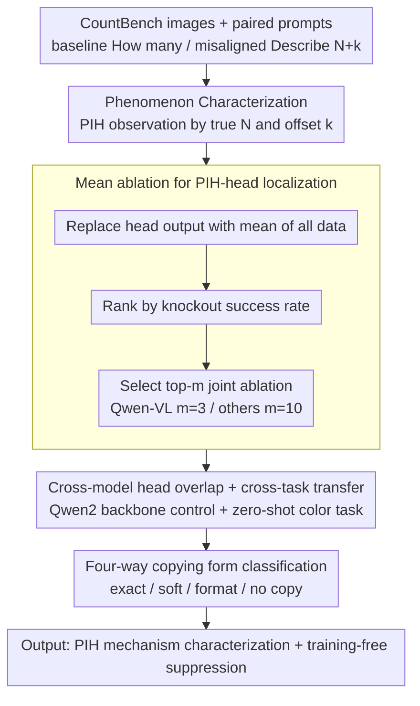

# Mechanisms of Prompt-Induced Hallucination in Vision–Language Models

**Conference**: ACL 2026  
**arXiv**: [2601.05201](https://arxiv.org/abs/2601.05201)  
**Code**: https://github.com/michalg04/prompt-induced_hallucinations.git  
**Area**: Hallucination Detection  
**Keywords**: prompt-induced hallucination, attention head knockout, mean ablation, object counting, modality conflict

## TL;DR
In controlled object counting tasks, prompt-induced hallucination (PIH)—where the model follows the prompt rather than the image—is localized to 3–10 attention heads in the **early layers** ($L0-1$) of LLaVA-OneVision, Qwen-VL, and Janus-Pro. Mean ablation of these heads, requiring no retraining, reduces prompt-following from 42–64% to <11% and restores true counting rates to 70–78%, while zero-shot transferring to color identification (PIH suppression of 40–95%).

## Background & Motivation
**Background**: Vision-Language Models (VLMs) like LLaVA, Qwen-VL, and Janus tend to follow the prompt when it conflicts with image information, leading to "prompt-induced hallucination (PIH)." For instance, if an image contains 3 lilies and the model is asked to "describe the 4 lilies," it might describe 4. This reflects sycophancy or anchoring bias common in real-world deployment, yet existing research largely remains at the phenomena level, lacking mechanistic explanations.

**Limitations of Prior Work**: (1) Conventional mitigation relies on expensive RLHF retraining or fragile prompt engineering, without identifying which specific components execute prompt-copying. (2) While attention heads are known to perform specific functions (e.g., induction or copying heads), whether PIH is managed by a localized set of heads remains unverified. (3) Functional differences across models and tasks (whether models use identical mechanisms for PIH) remain open questions even if heads are localized.

**Key Challenge**: (a) Minimal intervention vs. maximal effect—minimizing changes for safety while maintaining a broad impact to suppress PIH. (b) **Commality vs. Specificity of mechanisms**—whether a single mechanism persists across all VLMs or each model develops its own PIH circuit.

**Goal**: (1) Systematically characterize PIH occurrence (sliced by ground-truth $N$ and prompt offset $k$). (2) Locate the minimal set of heads responsible for PIH using attention head knockout (mean ablation). (3) Verify cross-model sharing and cross-task generalization (counting to color). (4) Deconstruct PIH-head functions (inhibiting copying versus amplifying visual attention).

**Key Insight**: The authors observe that LLaVA-OV and Qwen-VL share the Qwen2 backbone but use different visual encoders. This serves as a natural controlled experiment—if their identified PIH-heads overlap significantly, PIH likely originates from the Language Model (LM) rather than visual components.

**Core Idea**: Use the mean ablation paradigm (replacing head output with its mean activation over the dataset to remove token-specific information while preserving activation magnitude) to rank heads for PIH. Perform group ablation testing and compare head overlap and functional differences across tasks and models.

## Method

### Overall Architecture
This is an inference-only mechanistic interpretability study aimed at localizing PIH behavior—"following the prompt instead of the image"—to specific attention heads and characterizing their functions. The process involves three steps: **Phenomenon Characterization** on CountBench using paired prompts (baseline "How many [X]..." vs. misaligned "Describe the N+k [X]..." where $k \in \{1,...,5\}$ and extreme offsets $k \in \{10, 20, 50\}$); **Mechanism Localization** where each head is individually ablated via mean ablation and ranked by its success in shifting the response from $N+k$ back to $N$; and **Functional Analysis** to analyze behavioral changes across four copying forms and measure the shift in attention mass from text to image.

### Key Designs

**1. Mean ablation instead of zero ablation: Removing token information while maintaining activation budget**

Setting head output to zero disrupts the activation distribution after layer normalization, introducing uncontrollable distribution shifts. Mean ablation replaces the output at each position with the head's average output across all tokens: $\tilde H^{(l,h)}_t = \mu^{(l,h)} = \frac{1}{T}\sum_{t'} H^{(l,h)}_{t'}$. This removes the head's ability to "see" specific token content while maintaining a fixed bias and activation magnitude. The knockout success rate is defined as the proportion of PIH samples corrected back to ground-truth $N$. The minimal head set is determined by ranking single heads and testing group ablations for $m \in \{1, 3, 5, 10\}$.

**2. Cross-model head overlap + cross-task transfer: Quantifying component attribution**

To determine if PIH stems from the LM or visual components, the authors use head overlap rates. LLaVA-OV and Qwen-VL share the Qwen2 LM but have different visual backbones. Their top-1/top-2 PIH-heads (L0H3, L0H6) overlap perfectly, and 50% of the top-10 heads overlap. In contrast, Janus-Pro (DeepSeek-LLM) shows low overlap (top head is L0H20). This suggests PIH originates in the LM. The same PIH-heads are then tested on the Visual CounterFact color task ("Describe the C+k [object]" with color wheel distance $k$) to verify task-agnosticism.

**3. Four-way copying form classification: Distinguishing behavior shifts**

Aggregated metrics often mask the underlying "why" of hallucination reduction. The authors categorize responses into: exact copy (content and format follow prompt), soft copy (content follows prompt, different format), format copy (correct content, prompt-like format), and no copy (correct content, free format). By calculating probability shifts for $P(N_{digit}\mid N_{digit})$ and $P(N_{word}\mid N_{digit})$, they determine if PIH reduction is due to reallocating attention to the image or suppressing the copying mechanism. This reveals that LLaVA-OV suppresses copying while increasing image attention, whereas Qwen-VL actually **increases** format copying after ablation.

### Loss & Training
**Training-free**. This is an inference-only mechanistic study. All interventions are performed via hooks injecting mean activations. Experiments were completed on a single RTX 3090 (approx. 200–300 GPU hours).

## Key Experimental Results

### Main Results: PIH-head Ablation (CountBench, average $k \in \{1, \dots, 5\}$)

| Metric | LLaVA-OV | Qwen-VL | Janus-Pro |
|---|---|---|---|
| Baseline prompt Exact Match (↑, Before intervention) | 76.89 | 78.49 | 80.32 |
| Baseline prompt Exact Match (↑, **Ours**) | **81.24** (**Gain** +4.35) | 79.29 (Gain +0.80) | 79.41 (−0.91) |
| Misaligned **Prompt Match** (↓, Before intervention) | 42.58 | 56.51 | 64.10 |
| Misaligned Prompt Match (↓, **Ours**) | **1.42** | **3.22** | **10.19** |
| Misaligned **True-Count Match** (↑, Before intervention) | 45.68 | 37.70 | 30.54 |
| Misaligned True-Count Match (↑, **Ours**) | **77.80** | **70.66** | **70.90** |

Ablation of PIH-heads reduces prompt-following nearly to zero and increases true-count recovery by 30–40%. It does not degrade baseline counting (LLaVA-OV even improves). Performance fluctuations on MM-Vet/POPE were $\le 2\%$, proving PIH-heads are task-specific.

### Ablation Study: Color Task (Visual CounterFact) for Cross-task Generalization

| Response Type | LLaVA-OV (Prev.) | LLaVA-OV (**Ours**) | Qwen-VL (Prev.) | Qwen-VL (**Ours**) | Janus-Pro (Prev.) | Janus-Pro (**Ours**) |
|---|---|---|---|---|---|---|
| No PIH (Combined) | 0.96 | **95.21** | 20.27 | **79.72** | 14.78 | **55.42** |
| PIH (Combined) | 99.04 | **4.79** | 79.73 | **20.28** | 85.22 | **44.58** |

PIH suppression on the color task: LLaVA-OV **94.25%**, Qwen-VL **59.45%**, Janus-Pro **40.64%**, achieved purely zero-shot using heads identified in the counting task.

### Key Findings
- **$N=4$ Threshold**: When true object count $N \le 4$, models often correct prompt errors. For $N \ge 5$, prompt match reaches 80–90% regardless of offset. Correlation analysis proves that **lower visual confidence leads to more severe PIH**.
- **Early Layer Concentration**: PIH-heads are mostly in L0–1. LLaVA-OV and Qwen-VL (sharing Qwen2) have identical top-1/top-2 heads (L0H3, L0H6), confirming PIH is an internal LM routing issue.
- **Three Models, Three Mechanisms**: LLaVA-OV suppresses copying and shifts attention +12% toward the image; Janus-Pro suppresses format copying without increasing visual dependence; Qwen-VL suppresses soft copying but **increases format copying** (40.21% → 53.95%).
- **No Side Effects**: Performance on MM-Vet, POPE, and CalTech101 remains stable, proving PIH-heads are specialized and do not interfere with general instruction following.

## Highlights & Insights
- **Cross-model overlap as an attribution probe**: Quantifying head overlap between models with shared/different components elegantly identifies PIH as an LM-centric issue.
- **Mechanism Isomorphism $\neq$ Realization Isomorphism**: Similar high-level behavior (reduced prompt-following) arises from distinct internal mechanisms across models, highlighting the need for functional dissection in interpretability research.
- **Engineering Value**: Mean ablation of 3–10 heads via hooks is a zero-cost inference-time mitigation strategy compared to heavy RLHF.
- **$N \ge 5$ Cognitive Link**: This threshold aligns with human subitizing limits ($\le 4$), suggesting models may internalize "exact small numbers vs. estimated large numbers" priors during pre-training.

## Limitations & Future Work
- Focus on 7B models; scaling laws for PIH circuits in 70B+ models are unconfirmed.
- Attention patterns are localized but not fully "explained" at the circuit level.
- The cause of mechanism divergence between models (data vs. architecture) remains unclear.
- Future work should trace causal paths to output logits using path patching and extend to complex conflicts like spatial relations.

## Related Work & Insights
- **vs. Frank 2021 / Salin 2022**: Moves from observing textual bias to providing mechanistic explanations.
- **vs. Olsson 2022 (Induction Heads)**: PIH-heads are early-layer "malicious cousins" of induction heads, further proving early layers handle shallow copying.
- **vs. Sharma 2024 (Sycophancy)**: Provides a mechanistic instantiation of sycophancy in the context of VLM modality conflicts.

## Rating
- Novelty: ⭐⭐⭐⭐☆ PIH protocol and overlap attribution are novel; mean ablation is standard but the application is insightful.
- Experimental Thoroughness: ⭐⭐⭐⭐☆ Robust cross-model and cross-task testing; lacks horizontal comparison with other mitigation baselines.
- Writing Quality: ⭐⭐⭐⭐⭐ Clear structure and honest discussion of limitations.
- Value: ⭐⭐⭐⭐☆ Significant for mechanistic interpretability; provides a lightweight suppression solution for practitioners.

<!-- RELATED:START -->

## Related Papers

- [\[ACL 2026\] Benchmarking Deflection and Hallucination in Large Vision-Language Models](benchmarking_deflection_and_hallucination_in_large_vision-language_models.md)
- [\[ACL 2026\] Stable-RAG: Mitigating Retrieval-Permutation-Induced Hallucinations in Retrieval-Augmented Generation](stable-rag_mitigating_retrieval-permutation-induced_hallucinations_in_retrieval-.md)
- [\[ACL 2026\] Mitigating Hallucinations in Large Vision-Language Models without Performance Degradation](mitigating_hallucinations_in_large_vision-language_models_without_performance_de.md)
- [\[ICLR 2026\] Hallucination-aware Intermediate Representation Edit in Large Vision-Language Models](../../ICLR2026/hallucination/hallucination-aware_intermediate_representation_edit_in_large_vision-language_mo.md)
- [\[CVPR 2026\] Prefill-Time Intervention for Mitigating Hallucination in Large Vision-Language Models](../../CVPR2026/hallucination/prefill-time_intervention_for_mitigating_hallucination_in_large_vision-language_.md)

<!-- RELATED:END -->
