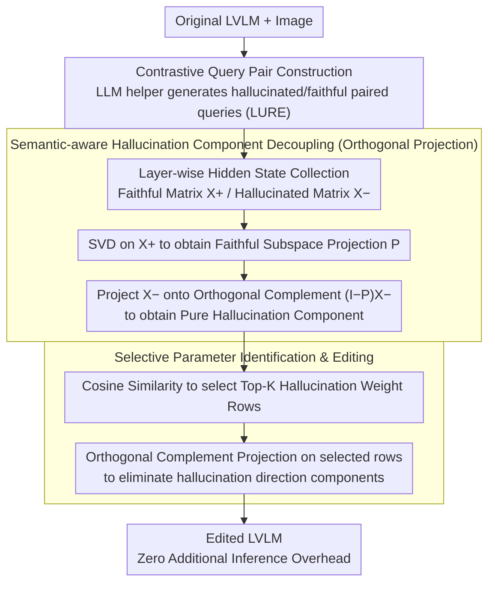

# Mitigating Hallucinations in Large Vision-Language Models without Performance Degradation

**Conference**: ACL 2026 Oral  
**arXiv**: [2604.20366](https://arxiv.org/abs/2604.20366)  
**Code**: None  
**Area**: Hallucination Detection  
**Keywords**: Large Vision-Language Models, Object Hallucination, Representation Intervention, Orthogonal Projection, Selective Parameter Editing

## TL;DR
This paper proposes the MPD framework, which decouples hallucination components through semantic-aware orthogonal subspace projection and selectively updates a small number of parameters most relevant to hallucinations. While reducing hallucinations by 23.4%, it maintains 97.4% of general generation capability without introducing additional inference overhead.

## Background & Motivation

**Background**: Large Vision-Language Models (LVLMs) demonstrate excellent performance in cross-modal understanding and generation, but commonly suffer from object hallucinations—generating text descriptions that fabricate non-existent objects, misattribute visual properties, or invent spatial relationships. Mainstream mitigation methods are divided into two routes: supervised fine-tuning (SFT) on labeled data (high cost) and representation intervention (efficient but with side effects).

**Limitations of Prior Work**: Although representation intervention methods (e.g., Nullu) do not require labeled data, the processed LVLMs lose general generation capabilities—manifesting as semantic incoherence and increased vocabulary repetition. There are two fundamental reasons: (1) Hallucination components are highly coupled with general semantics during extraction, thus simple differencing mistakenly removes normal semantics; (2) Parameter updates apply large perturbations to all weights of the target layer, modifying hundreds of millions of parameters which leads to overfitting and destruction of the original parameter distribution.

**Key Challenge**: Hallucination components and general semantics are highly entangled in the hidden representation space, so crude global intervention inevitably damages both—how can hallucination signals be precisely separated and suppressed with minimal perturbation?

**Goal**: Design a two-stage framework that effectively mitigates hallucinations while maintaining the model's general generation capability, without introducing additional inference costs.

**Key Insight**: Leveraging the orthogonal projection theory from linear algebra, faithful representations and hallucinated representations are treated as components in different subspaces, achieving precise decoupling through SVD.

**Core Idea**: Orthogonal projection for pure hallucination component extraction + Cosine similarity for selective parameter editing = Precise hallucination suppression without damaging generation capability.

## Method

### Overall Architecture
MPD is divided into two stages: (1) Hallucination component extraction—utilizing contrastive query pairs to construct faithful/hallucinated representations and separating pure hallucination components via SVD orthogonal projection; (2) Selective parameter update—finding weight vectors most relevant to hallucination components through cosine similarity and applying space projection editing only to these weights. The input is the original LVLM + a small set of contrastive data pairs, and the output is the edited LVLM with zero additional inference overhead.

### Key Designs

**1. Contrastive Query Pair Construction: Preparing paired hallucinated/faithful representations for component extraction**

The entire methodology is built upon the premise that "the same image has both a hallucinated representation and a faithful representation"; otherwise, differential analysis cannot be performed. MPD uses an auxiliary LLM to generate two semantically equivalent queries for the same image—one inducing the model to hallucinate and one faithful to the image content, with paired data directly taken from the LURE dataset. With this control group, the faithful hidden state matrix $\mathbf{X}_\ell^+$ and the hallucinated hidden state matrix $\mathbf{X}_\ell^-$ for each layer can be collected under strictly aligned conditions for the next step of orthogonal projection.

**2. Semantic-aware Hallucination Component Decoupling (Orthogonal Projection): Extracting "pure" hallucination components without general semantics**

The most direct approach is to treat the difference between hallucinated and faithful representations ($\mathbf{X}^- - \mathbf{X}^+$) as the hallucination direction. However, this difference mixes parallel components shared with faithful semantics and overlaps double noise; intervening based on this would delete normal generation capabilities. MPD uses orthogonal projection instead: for each layer $\ell$, SVD is performed on the faithful hidden state matrix $\mathbf{X}_\ell^+$ to obtain the projection matrix of the faithful subspace $\mathbf{P}_\ell = \mathbf{U}_\ell \mathbf{U}_\ell^\top$, and then the hallucinated representation is projected onto the orthogonal complement of the faithful subspace:

$$\tilde{\mathbf{X}}_\ell = (\mathbf{I} - \mathbf{P}_\ell)\,\mathbf{X}_\ell^-$$

This step automatically eliminates components overlapping with faithful semantics, leaving $\tilde{\mathbf{X}}_\ell$ as the "pure" hallucination direction. The paper uses Proposition 1 to prove that its expected error in estimating hallucination components is smaller than naive differencing, ensuring subsequent intervention suppresses hallucinations without harming general semantics.

**3. Selective Parameter Identification and Editing: Modifying only the most relevant weights to minimize perturbation to original distributions**

Methods like Nullu rewrite all weights in the target layer, disturbing hundreds of millions of parameters and causing original distribution destruction. MPD locates before performing surgery: for each row $\mathbf{w}_\ell^{(i)}$ of the weight matrix $\mathbf{W}_\ell$, it calculates the average cosine similarity $s_i$ with the hallucination component $\tilde{\mathbf{x}}_{\ell,j}$. The top-K rows with the highest similarity are selected as "hallucination weights," and an orthogonal complement projection matrix for the hallucination subspace is constructed:

$$\tilde{\mathbf{Q}}_\ell = \mathbf{I} - \tilde{\mathbf{X}}_\ell^\top (\tilde{\mathbf{X}}_\ell \tilde{\mathbf{X}}_\ell^\top)^{-1} \tilde{\mathbf{X}}_\ell$$

The operation $\mathbf{w}_\ell^{(i)} \leftarrow \tilde{\mathbf{Q}}_\ell\,\mathbf{w}_\ell^{(i)}$ is performed only on the selected rows to erase their components in the hallucination direction. After these edits, the parameter modification amount is 42% less on mPLUG-Owl2 and 37% less on MiniGPT-4 compared to Nullu, resulting in lower hallucination rates and better generation quality—precision strikes outperform saturation bombing.

### Loss & Training
MPD is a training-free method—it involves no gradient optimization and directly edits model weights through SVD decomposition and projection operations. Once the editing process is completed, the inference process is identical to the original model with zero additional computational overhead.

## Key Experimental Results

### Main Results (CHAIR Benchmark)

| Model | Method | CHAIR_S ↓ | CHAIR_I ↓ | BLEU ↑ |
|------|------|-----------|-----------|--------|
| LLaVA-1.5-7B | Greedy | 20.40 | 7.08 | 15.72 |
| LLaVA-1.5-7B | Nullu | 15.20 | 5.30 | 15.69 |
| LLaVA-1.5-7B | **MPD** | **12.80** | **4.20** | 15.31 |
| mPLUG-Owl2 | Greedy | 22.90 | 8.62 | 15.01 |
| mPLUG-Owl2 | Nullu | 15.60 | 5.77 | 15.45 |
| mPLUG-Owl2 | **MPD** | **14.00** | **4.99** | **16.06** |
| MiniGPT-4 | Greedy | 32.40 | 12.20 | 14.57 |
| MiniGPT-4 | Nullu | 21.40 | 8.99 | 14.81 |
| MiniGPT-4 | **MPD** | **19.40** | **7.50** | **14.98** |

### Ablation Study (LLaVA-Bench Generation Capability)

| Model | Method | Accuracy ↑ | Detailedness ↑ |
|------|------|-----------|---------------|
| MiniGPT-4 | Original | 4.05 | 3.95 |
| MiniGPT-4 | MPD | 5.53 | 4.67 |
| mPLUG-Owl2 | Original | 5.76 | 4.22 |
| mPLUG-Owl2 | MPD | 6.13 | 4.62 |
| LLaVA-1.5-7B | Original | 5.59 | 4.72 |
| LLaVA-1.5-7B | MPD | 6.39 | — |

### Key Findings
- MPD achieves the lowest hallucination rate and highest/competitive generation quality (BLEU) across all models and benchmarks, breaking the previous trade-off between hallucination mitigation and generation capability.
- Under the three settings of the POPE benchmark (random/popular/adversarial), MPD achieves the highest F1 across all models.
- On LLaVA-Bench, MPD not only maintains but actually improves accuracy and detailedness—suggesting that removing hallucination noise itself can improve generation quality.
- Consistent improvements are seen on HallusionBench, indicating the method generalizes to fine-grained hallucination scenarios beyond object hallucinations.

## Highlights & Insights
- **Theoretical Elegance of Orthogonal Projection**: Proposition 1 strictly proves that the projection method has a smaller expected error in estimating hallucination components than naive differencing, providing a mathematical foundation rather than relying solely on heuristics.
- **Selective Parameter Editing**: The idea of reducing parameter modifications by 37-42% while obtaining better results demonstrates that "less is more"—precise suppression is more effective than global modification.
- **Zero Inference Overhead**: The edited model parameters are permanently modified, which is more suitable for practical deployment compared to methods like VCD or OPERA that require modifying the inference logic.

## Limitations & Future Work
- Validated only on three smaller LVLMs (MiniGPT-4, mPLUG-Owl2, LLaVA-1.5-7B); not tested on larger/newer models (e.g., LLaVA-Next, Qwen-VL).
- Requires pre-prepared contrastive data pairs, which increases pipeline complexity despite the small scale.
- Orthogonal projection assumes that hallucinations and faithful semantics can be linearly separated; it may fail in cases of high non-linear entanglement.
- The number of principal components $C$ in SVD and the top-K parameter selection require hyperparameter tuning.

## Related Work & Insights
- **vs Nullu (Yang et al., 2025)**: Both use null-space projection, but Nullu operates on all weights. MPD adds orthogonal decoupling and selective editing, outperforming Nullu in both hallucination metrics and generation quality.
- **vs VCD (Leng et al., 2024)**: VCD introduces contrastive distribution constraints during decoding, increasing inference latency; MPD has zero inference overhead after editing.
- **vs HALC (Chen et al., 2024)**: HALC relies on external visual grounding modules for posterior correction, introducing extra dependencies; MPD is self-contained.

## Rating
- Novelty: ⭐⭐⭐⭐ The combination of orthogonal projection and selective editing has theoretical support, though the core idea is an improvement over Nullu rather than a completely new paradigm.
- Experimental Thoroughness: ⭐⭐⭐⭐ 5 benchmarks, 3 models, and multiple baselines, though the model scales are relatively small.
- Writing Quality: ⭐⭐⭐⭐ Clear theoretical derivations, though notation is heavy.
- Value: ⭐⭐⭐⭐ High practicality—hallucination mitigation with zero inference overhead has direct value for deployment.

<!-- RELATED:START -->

## Related Papers

- [\[ICML 2026\] Mitigating Hallucinations in Large Vision-Language Models via Causal Route Gating](../../ICML2026/hallucination/mitigating_hallucinations_in_large_vision-language_models_via_causal_route_gatin.md)
- [\[CVPR 2026\] HulluEdit: Single-Pass Evidence-Consistent Subspace Editing for Mitigating Hallucinations in Large Vision-Language Models](../../CVPR2026/hallucination/hulluedit_single-pass_evidence-consistent_subspace_editing_for_mitigating_halluc.md)
- [\[ACL 2026\] Benchmarking Deflection and Hallucination in Large Vision-Language Models](benchmarking_deflection_and_hallucination_in_large_vision-language_models.md)
- [\[CVPR 2026\] Residual Decoding: Mitigating Hallucinations in Large Vision-Language Models via History-Aware Residual Guidance](../../CVPR2026/hallucination/residual_decoding_mitigating_hallucinations_in_large_vision-language_models_via_.md)
- [\[CVPR 2026\] Prefill-Time Intervention for Mitigating Hallucination in Large Vision-Language Models](../../CVPR2026/hallucination/prefill-time_intervention_for_mitigating_hallucination_in_large_vision-language_.md)

<!-- RELATED:END -->
