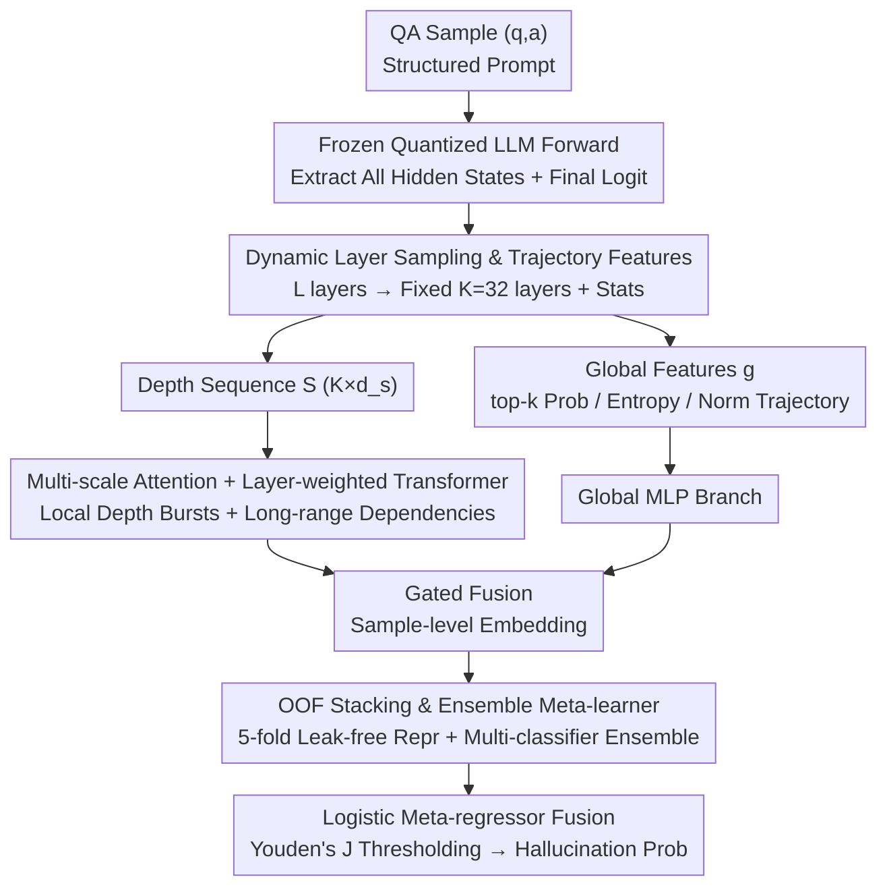

# MultiHaluDet: Multilingual Hallucination Detection via LLM Hidden State Probing

**Conference**: ACL2026  
**arXiv**: [2605.24919](https://arxiv.org/abs/2605.24919)  
**Code**: https://github.com/alvi-uiu/MultiHaluDet  
**Area**: Hallucination Detection  
**Keywords**: Multilingual Hallucination Detection, Hidden State Probing, Multi-scale Attention, OOF stacking, Cross-lingual Robustness

## TL;DR
MultiHaluDet performs multi-scale sequence modeling using the full-layer hidden state trajectories of frozen LLMs, then identifies hallucinations through out-of-fold representations and ensemble meta-learners. It achieves approximately 98% AUROC on HaluEval / TriviaQA and generalizes to French, Bengali, and Amharic.

## Background & Motivation

**Background**: LLM hallucination detection is generally categorized into three types: evidence-based methods that retrieve and verify evidence, evidence-free methods based on output probabilities or consistency, and hidden-state probing methods that directly inspect internal model states. The first two are constrained by retrieval latency, external evidence quality, multi-sampling costs, or unreliable probability calibration. The third type is more lightweight, but most existing work focuses only on the final layer, the final token, or a few fixed layers.

**Limitations of Prior Work**: The paper notes that hallucinations are often semantic confabulations rather than low confidence at a single token level. Consequently, simple $P(\text{True})$, average probability, entropy, single-layer probes, or fixed token positions easily miss factual inconsistencies distributed throughout an entire response. This issue is more severe in non-English and low-resource languages, where internal representation quality and corpus coverage are inherently less balanced.

**Key Challenge**: If hallucination signals form gradually along the depth of the transformer, looking only at the final output or a static representation from a single layer loses dynamic information about "how the model arrived at this answer." However, reading all layers entirely introduces issues with dimensionality, model depth inconsistency, and overfitting.

**Goal**: The authors aim to build a hallucination detector that does not require fine-tuning for the target language, does not rely on external retrieval, and works across different models and languages. It addressed three sub-problems: how to compress hidden states of LLMs with varying depths into a unified sequence, how to capture local and global depth patterns, and how to avoid data leakage and overfitting during training on depth-based features.

**Key Insight**: Starting from "hidden state trajectories," each layer's hidden state is viewed as a sequence evolving with depth rather than treating single-layer vectors as one-off features. The hypothesis is that the difference between factual consistency and hallucination is reflected in the coupling between inter-layer norms, distributional statistics, and logit confidence with depth dynamics.

**Core Idea**: Use dynamic layer sampling + multi-scale attention + OOF stacking to transform the full-depth internal trajectories of frozen LLMs into robust features for hallucination detection.

## Method

MultiHaluDet is a four-stage framework: first, extract per-layer statistical features and global logit features from a frozen LLM; second, model the depth sequence using multi-scale attention and a transformer encoder; third, generate leak-free depth representations using an out-of-fold approach; and finally, output hallucination probabilities using a stacking ensemble of multiple conventional/neural classifiers.

### Overall Architecture

The input consists of question-answer pairs $(q_i, a_i)$, with labels $y_i \in \{0,1\}$ indicating whether the response is a hallucination. The system concatenates the QA into a structured prompt, feeds it into a frozen and quantized LLM, and performs a single forward pass to obtain hidden states for all layers $\{H^{(l)}\}_{l=0}^{L}$ and the logit vector at the final position. LLM parameters remain fixed throughout.

To adapt to models of different depths, the method maps an arbitrary $L$ layers to a fixed $K=32$ layer indices. For each sampled layer, statistics such as the final token representation, sequence mean, norm, mean, standard deviation, extreme values, sparsity, near-zero ratio, kurtosis, and MAD are extracted to form a depth sequence $S \in \mathbb{R}^{K \times d_s}$. Simultaneously, global features $g$ are constructed, including top-$k$ token probabilities, logit entropy, logit standard deviation, inter-layer norm trajectory statistics, and anchor layer features.

Subsequently, $S$ enters the sequence branch of MultiHaluDet, and $g$ enters the global MLP branch. The two representations are combined via gated fusion to obtain a sample-level embedding. During training, embeddings are not fed directly to the final classifier; instead, 5-fold out-of-fold (OOF) training is used: the deep features for each sample are generated by a fold model that has not seen that sample. Finally, probabilities from multiple base classifiers are fused via a logistic meta-regressor, with the threshold selected by Youden's J statistic.

### Key Designs

**1. Dynamic Layer Sampling & Trajectory Features: Compressing arbitrary LLM depths into fixed-length sequences**

Hallucinations are not necessarily concentrated in the final token or layer, yet they are distributed across models with varying layer counts. The method maps $L$ layers to a fixed $K=32$ indices: if the model depth matches, it is used directly; if shallower, the deepest layer is repeated; if deeper, layers are uniformly sampled relative to depth. Each sampled layer retains sequence means, norms, sparsity, kurtosis, MAD, and other statistics. This preserves the "bottom-to-top" evolution while allowing a single detector design to be applied to different models like Mistral-7B and LLaMA2-7B.

**2. Multi-scale Attention + Layer-weighted Transformer: Capturing local mutations and long-range inter-layer dependencies**

Hallucination signals may manifest as sudden semantic shifts in intermediate layers or as slow changes in the overall norm trajectory. Simple mean pooling is too coarse and smoothes out these patterns. Here, the depth sequence is projected into a unified hidden space, followed by local average pooling, linear projection, and upsampling using multiple scale factors. Different scales are fused via position-dependent gates. A learnable layer importance vector $\lambda$ modulates each depth position before entering a Pre-LN transformer encoder. This allows the model to view depth patterns at both fine and coarse granularities and adaptively decide which layers are critical.

**3. OOF Stacking & Ensemble Meta-learner: Mitigating overfitting on high-dimensional features**

Given high-dimensional hidden state statistics and limited samples, particularly with varying distributions across languages, training a final classifier directly on the training set embeddings risks severe overfitting. The method utilizes 5-fold out-of-fold training: embeddings for each training sample are generated by fold models that did not see them, while test samples use averaged embeddings. Base classifiers like RandomForest, XGBoost, LightGBM, and SVM output probabilities, which are then fused by a logistic meta-regressor. OOF minimizes data leakage risks, while the ensemble combines different inductive biases for cross-architecture robustness.

### Loss & Training

The deep model is trained using AdamW with a learning rate of $2 \times 10^{-4}$ and weight decay of $6 \times 10^{-5}$, using a ReduceLROnPlateau scheduler for 45 epochs with an early stopping patience of 15. The framework uses a combination of BCE, focal, asymmetric, and contrastive objectives, along with label smoothing, Mixup, and CutMix. The sequence model uses a hidden dimension of 384, 8 attention heads, and 6 transformer layers.

Multilingual evaluation is performed without language-specific fine-tuning. The authors expanded the English HaluEval / TriviaQA datasets to French, Bengali, and Amharic using Gemini 2.5 Flash, followed by manual inspection of 100 samples per language (600 total). Initial translation accuracy was 96%, with the remaining 4% refined manually.

## Key Experimental Results

### Main Results

| Dataset | Base LLM | Best Baseline AUROC | MultiHaluDet AUROC | Key Conclusion |
|---------|----------|---------------------|--------------------|----------------|
| HaluEval | Mistral-7B | Neural CDEs 95.4 | 98.43 | Outperforms best continuous dynamic baseline by ~3.03 pts |
| HaluEval | LLaMA2-7B | Neural SDEs 92.8 | 98.55 | Maintains ~98.5 AUROC across architectures |
| TriviaQA | Mistral-7B | Neural SDEs 85.1 | 98.30 | Significant gains on plausible hard negatives |
| TriviaQA | LLaMA2-7B | Neural CDEs 83.7 | 98.26 | More stable than hidden-state/probabilistic baselines |

### Cross-lingual Results

| Language Resource Tier | Dataset | Mistral-7B AUROC | LLaMA2-7B AUROC | Observation |
|-----------------------|---------|------------------|-----------------|-------------|
| English | HaluEval | 98.4 | 98.5 | English benchmarks near saturation |
| French high-resource | HaluEval | 96.2 | 95.8 | Minor drop compared to English |
| Bangla medium-resource | HaluEval | 89.1 | 88.4 | Noticeable degradation due to morphology/coverage |
| Amharic low-resource | HaluEval | 78.5 | 76.2 | Still significantly higher than best baseline (62.3/59.8) |
| French high-resource | TriviaQA | 95.5 | 94.9 | Stable in hard negative scenarios |
| Bangla medium-resource | TriviaQA | 87.6 | 86.3 | Retains strong cross-lingual detection signal |
| Amharic low-resource | TriviaQA | 75.8 | 73.4 | Low-resource languages remain the primary challenge |

### Ablation Study

| Configuration | Mistral HaluEval | Mistral TriviaQA | LLaMA2 HaluEval | LLaMA2 TriviaQA | Description |
|---------------|------------------|------------------|-----------------|-----------------|-------------|
| Full | 98.43 | 98.30 | 98.55 | 98.26 | Full Model |
| w/o MSA | 91.45 | 90.82 | 92.14 | 91.33 | Removing MSA drops ~6-8 pts |
| w/o OOF | 88.67 | 87.41 | 89.25 | 88.19 | Largest drop, highlighting OOF for generalization |
| w/o TP | 93.28 | 92.56 | 93.71 | 93.04 | Using only static last layer loses ~5 pts |

### Key Findings

- Surface-level probability features are nearly ineffective: $P(\text{True})$, AvgProb, and AvgEnt hover between 41.1%-49.7% AUROC, suggesting that the "low confidence equals hallucination" heuristic is unreliable.
- OOF stacking is the most critical component; its removal drops AUROC by over 10 points on TriviaQA, indicating that plausible hard negatives easily induce overfitting.
- Low-resource languages remain a bottleneck: AUROC for Amharic is significantly lower than for French/Bangla, which the authors attribute to poor representation quality in base models for low-resource languages.

## Highlights & Insights

- The most valuable perspective is shifting hallucination detection from "inspecting output confidence" to "observing hidden state trajectory." This is closer to the model's factual judgment process and explains why removing trajectory probing significantly impacts performance.
- Dynamic layer sampling is a practical engineering design. It avoids assuming a specific layer's importance and instead aligns different models via relative depth, facilitating cross-architecture reuse.
- The combination of multi-scale attention and self-attention pooling is well-suited for this task: the former captures local depth anomalies, while the latter allows the model to adaptively select important layers per sample.
- Multilingual experiments, though based on translated data, clearly demonstrate bottlenecks in representation quality. This suggests future multilingual safety detection should not report English results in isolation.

## Limitations & Future Work

- **White-box Dependency**: The method requires access to internal hidden states and logits, making it inapplicable to black-box models like GPT-4 or Claude.
- **Higher Overhead**: While avoiding language-specific fine-tuning, extracting full-layer states, depth modeling, and 5-fold OOF are more expensive than simple heuristics like $P(\text{True})$.
- **Translation-based Evaluation**: French/Bangla/Amharic data comes from translated English benchmarks. Despite manual QA, nuances in local context, cultural knowledge, and natural low-resource prompts might be missed.
- **Task Boundaries**: Experiments primarily focus on QA hallucination; it remains unclear if the strong AUROC persists in long-form generation, tool-calling, or multi-hop RAG scenarios.
- Future work could involve compressing full-depth trajectory probing into a few key layers or distilling it into a lightweight detector to reduce deployment costs.

## Related Work & Insights

- **vs P(True) / AvgProb / AvgEnt**: These look at output confidence/entropy and are low-cost but perform near random; MultiHaluDet reads internal trajectories to capture high-confidence hallucinations.
- **vs SAPLMA / MIND / Probe@Exact**: These probes outperform surface probabilities but rely on static or single-point representations. MultiHaluDet explicitly models full-depth sequences and uses OOF to reduce training leakage.
- **vs Neural ODE / CDE / SDE methods**: These also view continuous dynamics. Neural CDEs reach 95.4 AUROC on HaluEval; MultiHaluDet further improves this to 98.43 through multi-scale attention and ensemble stacking.
- **Insight**: For safety tasks, the "path" of internal representations may be more informative than the final state. This can be generalized to jailbreak detection, factual consistency, and RAG answer reliability.

## Rating
- Novelty: ⭐⭐⭐⭐☆ Combines trajectories, multi-scale attention, and OOF stacking robustly, though built on existing hidden-state probing foundations.
- Experimental Thoroughness: ⭐⭐⭐⭐☆ Strong main, cross-lingual, and ablation results, though multilingual data relies on translation.
- Writing Quality: ⭐⭐⭐⭐☆ Clear breakdown of the method and results; engineering complexity is somewhat high.
- Value: ⭐⭐⭐⭐⭐ Highly insightful for multilingual LLM safety, proving that low-resource hallucination detection cannot solely rely on output probabilities.

<!-- RELATED:START -->

## Related Papers

- [\[ACL 2025\] ICR Probe: Tracking Hidden State Dynamics for Reliable Hallucination Detection in LLMs](../../ACL2025/hallucination/icr_probe_tracking_hidden_state_dynamics_for_reliable_hallucination_detection_in.md)
- [\[ACL 2026\] Rethinking Evaluation for LLM Hallucination Detection: A Desiderata, A New RAG-based Benchmark, New Insights](rethinking_evaluation_for_llm_hallucination_detection_a_desiderata_a_new_rag-bas.md)
- [\[ACL 2026\] 为什么 LLM 在结构化知识上产生幻觉：推理过程的机制分析](why_llms_hallucinate_on_structured_knowledge_a_mechanistic_analysis_of_reasoning.md)
- [\[ACL 2026\] Logical Consistency as a Bridge: Improving LLM Hallucination Detection via Label Constraint Modeling between Responses and Self-Judgments](logical_consistency_as_a_bridge_improving_llm_hallucination_detection_via_label_.md)
- [\[ACL 2025\] Activation Steering Decoding: Mitigating Hallucination in Large Vision-Language Models through Bidirectional Hidden State Intervention](../../ACL2025/hallucination/activation_steering_decoding_mitigating_hallucination_in_large_vision-language_m.md)

<!-- RELATED:END -->
