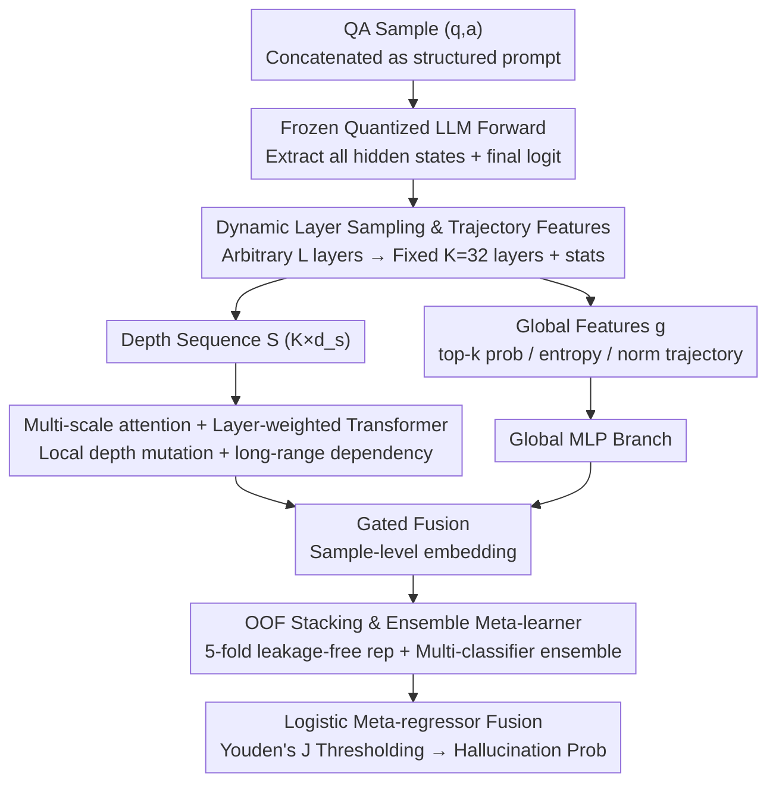

# MultiHaluDet: Multilingual Hallucination Detection via LLM Hidden State Probing

**Conference**: ACL2026  
**arXiv**: [2605.24919](https://arxiv.org/abs/2605.24919)  
**Code**: https://github.com/alvi-uiu/MultiHaluDet  
**Area**: Hallucination Detection  
**Keywords**: Multilingual Hallucination Detection, Hidden State Probing, Multi-scale Attention, OOF stacking, Cross-lingual Robustness

## TL;DR
MultiHaluDet utilizes the full-layer hidden state trajectories of frozen LLMs for multi-scale sequence modeling, subsequently discriminating hallucinations through out-of-fold representations and an ensemble meta-learner. It achieves approximately 98% AUROC on HaluEval / TriviaQA and transfers effectively to French, Bangla, and Amharic.

## Background & Motivation

**Background**: LLM hallucination detection is generally categorized into three types: evidence-based methods that retrieve and verify evidence, evidence-free methods based on output probability or consistency, and hidden-state probing methods that directly probe the internal states of the model. The first two are constrained by retrieval latency, external evidence quality, multi-sampling costs, or unreliable probability calibration, respectively; the third is more lightweight, but most existing works only examine the final layer, the final token, or a few fixed layers.

**Limitations of Prior Work**: The paper points out that hallucinations are often semantic confabulations rather than low confidence in a single token. Therefore, simple P(True), average probability, entropy, single-layer probes, or fixed token positions easily miss factual inconsistencies distributed throughout the full response. This issue is more severe in non-English and low-resource languages, as internal representation quality and corpus coverage are inherently less balanced.

**Key Challenge**: If hallucination signals gradually form along the transformer depth, capturing only the final output or a static representation at a certain layer loses dynamic information of how the model "reached this answer." However, reading all layers in full introduces problems with dimensionality, model depth inconsistency, and overfitting.

**Goal**: The authors aim to construct a hallucination detector that does not require target-language fine-tuning, does not depend on external retrieval, and works across different models and languages. It needs to resolve three sub-problems: how to compress hidden states from LLMs of varying depths into a unified sequence, how to capture local and global depth patterns, and how to avoid data leakage and overfitting during depth feature training.

**Key Insight**: Starting from "hidden state trajectories", the paper treats the hidden states of each layer as a sequence evolving with depth, rather than treating single-layer vectors as one-off features. The authors hypothesize that the difference between factual consistency and hallucination is manifested in the coupling relationship between inter-layer norms, distributional statistics, logit confidence, and depth dynamics.

**Core Idea**: Use dynamic layer sampling + multi-scale attention + OOF stacking to transform the full-depth internal trajectories of frozen LLMs into robust features for hallucination detection.

## Method

MultiHaluDet is a four-stage framework: it first extracts per-layer statistical features and global logit features from a frozen LLM, then uses multi-scale attention + transformer encoders to model the depth sequence, followed by generating leakage-free depth representations via an out-of-fold approach, and finally outputs the hallucination probability using a stacking ensemble composed of multiple traditional/neural classifiers.

### Overall Architecture

The input consists of a set of QA samples $(q_i, a_i)$, with labels $y_i \in \{0,1\}$ indicating whether the answer is a hallucination. The system concatenates the QA into a structured prompt, feeds it into a frozen and quantized LLM, and obtains the hidden states $\{H^{(l)}\}_{l=0}^{L}$ for all layers and the logit vector at the final position after a single forward pass. LLM parameters are not updated throughout.

To adapt to models of different depths, the method first maps any $L$ layers to a fixed set of $K=32$ layer indices. For each sampled layer, the final token representation, sequence mean representation, norm, mean, standard deviation, extrema, sparsity, near-zero ratio, kurtosis, and MAD statistics are extracted and concatenated into a depth sequence $S \in \mathbb{R}^{K \times d_s}$. Simultaneously, the method constructs global features $g$, including top-$k$ token probabilities, logit entropy, logit standard deviation, inter-layer norm trajectory statistics, and anchor layer features.

Subsequently, $S$ enters the sequence branch of MultiHaluDet, and $g$ enters the global MLP branch. The representations from both paths are combined via gated fusion to obtain sample-level embeddings. During the training phase, the training set embeddings are not directly fed to the final classifier; instead, 5-fold out-of-fold training is used: the deep features for each sample are derived from a fold model that has not seen that sample. Finally, the probabilities from multiple base classifiers are fused via a logistic meta-regressor, with the threshold selected by Youden's J statistic.

### Key Designs

**1. Dynamic Layer Sampling and Trajectory Features: Compressing arbitrary LLM layers into fixed-length sequences to share a detector across models**

Hallucinations are not necessarily concentrated in the last token or the last layer, yet they are distributed across models with varying layer counts, making direct alignment difficult. The approach maps any $L$ layers to a fixed $K=32$ layer indices: if the model has exactly $K$ layers, they are taken directly; if shallower, the deepest layer is repeated; if deeper, layers are sampled via uniform interpolation based on depth ratios. Each sampled layer retains not just the last token but also sequence means, norms, sparsity, kurtosis, MAD, and other distributional statistics, concatenated into a depth sequence. This preserves the "shallow-to-deep" evolution process and avoids manual layer indexing for every model, allowing Mistral-7B and LLaMA2-7B to use the same detector design.

**2. Multi-scale Attention + Layer-weighted Transformer: Capturing local depth mutations and long-range inter-layer dependencies simultaneously**

Hallucination signals sometimes manifest as sudden semantic shifts in an intermediate layer, and sometimes as gradual changes in the global norm trajectory. Simple mean pooling is too coarse and flattens both patterns. Here, the depth sequence is first projected into a unified hidden space, followed by local average pooling, linear projection, and upsampling using multiple scale factors. Different scales are fused via position-dependent gated weights. Then, a learnable layer importance vector $\lambda$ modulates each depth position before feeding it into a Pre-LN transformer encoder. Multi-scale allows the model to observe fine-grained and coarse-grained depth patterns simultaneously, while layer weighting allows it to adaptively decide which layers are more important per sample, preventing the signal from being averaged out by fixed pooling.

**3. OOF Stacking and Ensemble Meta-learner: Suppressing overfitting on high-dimensional depth features via leakage-free representations and ensembles**

Hidden state statistics have high dimensionality, limited samples, and varying distributions across languages, making direct training of final classifiers on training set embeddings highly prone to overfitting. The method uses 5-fold out-of-fold training: the fused embedding for each sample in the training set is generated by fold models that have not seen it, while test samples use the average embedding of multiple fold models. Subsequently, base classifiers like RandomForest, XGBoost, GradientBoosting, LightGBM, LogisticRegression, and SVM output individual probabilities, which are then fused by a logistic meta-regressor to learn final weights. OOF reduces the risk of data leakage, and the ensemble meta-learner combines the inductive biases of different classifiers to achieve cross-architecture robustness.

### Loss & Training

The deep model is trained using AdamW with a learning rate of $2 \times 10^{-4}$, weight decay of $6 \times 10^{-5}$, and a ReduceLROnPlateau scheduler for 45 epochs with an early stopping patience of 15. The framework uses a combination of BCE, focal, asymmetric, and contrastive objectives, incorporating label smoothing, Mixup, and CutMix. Hidden layers are fixed-sampled to $K=32$, the sequence model hidden dimension is 384 with 8 attention heads and a 6-layer transformer encoder. Experiments utilize 5-fold stratified cross-validation.

Multilingual evaluation is performed without language-specific fine-tuning. The authors expanded the English HaluEval / TriviaQA to French, Bangla, and Amharic using Gemini 1.5 Flash, manually inspecting 100 samples per language per dataset (600 total); initial translation accuracy was 96%, with the remaining 4% refined and regenerated.

## Key Experimental Results

### Main Results

| Dataset | Base LLM | Best Baseline AUROC | MultiHaluDet AUROC | Key Conclusion |
|---------|----------|---------------------|--------------------|----------------|
| HaluEval | Mistral-7B | Neural CDEs 95.4 | 98.43 | Outperforms strongest continuous dynamics baseline by ~3.03 pts |
| HaluEval | LLaMA2-7B | Neural SDEs 92.8 | 98.55 | Maintains ~98.5 AUROC across architectures |
| TriviaQA | Mistral-7B | Neural SDEs 85.1 | 98.30 | Significant improvement on plausible hard negatives |
| TriviaQA | LLaMA2-7B | Neural CDEs 83.7 | 98.26 | More stable than hidden-state/probabilistic baselines |

### Cross-lingual Results

| Language Resource Level | Dataset | Mistral-7B AUROC | LLaMA2-7B AUROC | Observation |
|-------------------------|---------|------------------|-----------------|-------------|
| English | HaluEval | 98.4 | 98.5 | English benchmark near saturation |
| French high-resource | HaluEval | 96.2 | 95.8 | Only marginal drop compared to English |
| Bangla medium-resource | HaluEval | 89.1 | 88.4 | Morphology and corpus coverage bring noticeable degradation |
| Amharic low-resource | HaluEval | 78.5 | 76.2 | Still significantly higher than best baseline (62.3 / 59.8) |
| French high-resource | TriviaQA | 95.5 | 94.9 | Stable in hard negative scenarios |
| Bangla medium-resource | TriviaQA | 87.6 | 86.3 | Retains strong cross-lingual detection signal |
| Amharic low-resource | TriviaQA | 75.8 | 73.4 | Low-resource languages remain the primary challenge |

### Ablation Study

| Configuration | Mistral HaluEval | Mistral TriviaQA | LLaMA2 HaluEval | LLaMA2 TriviaQA | Description |
|---------------|------------------|------------------|-----------------|-----------------|-------------|
| Full | 98.43 | 98.30 | 98.55 | 98.26 | Full Model |
| w/o MSA | 91.45 | 90.82 | 92.14 | 91.33 | Removing multi-scale attention drops ~6-8 pts |
| w/o OOF | 88.67 | 87.41 | 89.25 | 88.19 | Largest drop; OOF stacking is key to robust generalization |
| w/o TP | 93.28 | 92.56 | 93.71 | 93.04 | Using only static last layer loses ~5 pts |

### Key Findings

- Surface probabilistic features are nearly ineffective: P(True), AvgProb, and AvgEnt hover between 41.1% and 49.7% AUROC, indicating that the "low confidence equals hallucination" heuristic is unreliable.
- OOF stacking is the most critical component; removing it causes a drop of over 10 points on TriviaQA, suggesting that plausible hard negatives are particularly prone to inducing overfitting.
- Low-resource languages remain a bottleneck: AUROC on Amharic is significantly lower than French/Bangla, which the authors attribute to insufficient representation quality in base models for low-resource languages.

## Highlights & Insights

- The most valuable perspective is the shift of hallucination detection from "observing output confidence" to "observing hidden state evolution trajectories." This is closer to the model's factual judgment process than single-layer probes and explains why the ablation of trajectory probing results in performance drops.
- Dynamic layer sampling is a practical engineering design. It does not assume any absolute layer index is most important but aligns different models using relative depth, making it suitable for cross-architecture reuse.
- The combination of multi-scale attention and self-attention pooling is well-suited for this detection task: the former catches local depth anomalies, while the latter allows the model to adaptively select important layers, preventing signal averaging from fixed pooling.
- Although multilingual experiments are based on translated data, the stratified high/medium/low resource layers clearly demonstrate the bottleneck in representation quality. This suggests that future multilingual safety detection should not report only English results.

## Limitations & Future Work

- **Heavy White-box Dependency**: The method requires access to the hidden states and logits of the target LLM, thus it cannot be directly applied to black-box commercial models like GPT-4 or Claude.
- **Higher Computation and Memory Cost**: Although no language-specific fine-tuning is needed, full-layer hidden state extraction, depth sequence modeling, and 5-fold OOF are more expensive than P(True) or logit entropy.
- **Translation-based Multilingual Evaluation**: French / Bangla / Amharic data are translated from English benchmarks. Even with manual QA and back-translation, subtle phenomena in localized contexts, cultural knowledge, and natural low-resource prompts might be missed.
- **Task Boundaries Limited to QA**: Experiments focus on HaluEval and a constructed version of TriviaQA. It remains unclear if the same AUROC strength applies to long-form generation, tool use, or multi-hop RAG scenarios.
- Potential future work includes compressing full-depth trajectory probing into a few key layers or distilling it into a lightweight detector to reduce deployment costs.

## Related Work & Insights

- **vs P(True) / AvgProb / AvgEnt**: These methods look at output confidence or entropy with low cost but perform near-random in this paper's setting; MultiHaluDet reads internal trajectories with higher cost but captures high-confidence hallucinations.
- **vs SAPLMA / MIND / Probe@Exact**: These hidden-state probes outperform surface probabilities but mostly rely on single points or static representations. MultiHaluDet explicitly models full depth sequences and reduces training leakage via OOF representations.
- **vs Neural ODE / CDE / SDE hidden trajectory methods**: These methods also observe continuous dynamics, where Neural CDEs reached 95.4 AUROC on HaluEval Mistral; MultiHaluDet further improves this to 98.43 through multi-scale attention, global feature fusion, and stacking ensembles.
- **Insight**: For safety detection tasks, the "path" of internal representations may be more informative than the final state. Similar ideas could be transferred to jailbreak detection, factual consistency evaluation, cross-lingual harmful content detection, and RAG answer reliability estimation.

## Rating
- Novelty: ⭐⭐⭐⭐☆ Combining full-layer trajectories, multi-scale attention, and OOF stacking for multilingual hallucination detection is a solid combination design, though it builds on existing hidden-state probing directions.
- Experimental Thoroughness: ⭐⭐⭐⭐☆ Main experiments, cross-lingual, and ablations are complete; the limitation is the reliance on translated multilingual data.
- Writing Quality: ⭐⭐⭐⭐☆ The method is clearly decomposed with key values provided in tables; however, the framework has many components and high engineering complexity.
- Value: ⭐⭐⭐⭐⭐ Highly instructive for multilingual LLM safety detection, specifically demonstrating that low-resource hallucination detection cannot rely solely on output probabilities.

<!-- RELATED:START -->

## Related Papers

- [\[ACL 2025\] ICR Probe: Tracking Hidden State Dynamics for Reliable Hallucination Detection in LLMs](../../ACL2025/hallucination/icr_probe_tracking_hidden_state_dynamics_for_reliable_hallucination_detection_in.md)
- [\[ICML 2026\] Zero-source LLM Hallucination Detection with Human-like Criteria Probing](../../ICML2026/hallucination/zero-source_llm_hallucination_detection_with_human-like_criteria_probing.md)
- [\[ACL 2026\] Rethinking Evaluation for LLM Hallucination Detection: A Desiderata, A New RAG-based Benchmark, New Insights](rethinking_evaluation_for_llm_hallucination_detection_a_desiderata_a_new_rag-bas.md)
- [\[ACL 2026\] 为什么 LLM 在结构化知识上产生幻觉：推理过程的机制分析](why_llms_hallucinate_on_structured_knowledge_a_mechanistic_analysis_of_reasoning.md)
- [\[ACL 2026\] Logical Consistency as a Bridge: Improving LLM Hallucination Detection via Label Constraint Modeling between Responses and Self-Judgments](logical_consistency_as_a_bridge_improving_llm_hallucination_detection_via_label_.md)

<!-- RELATED:END -->
