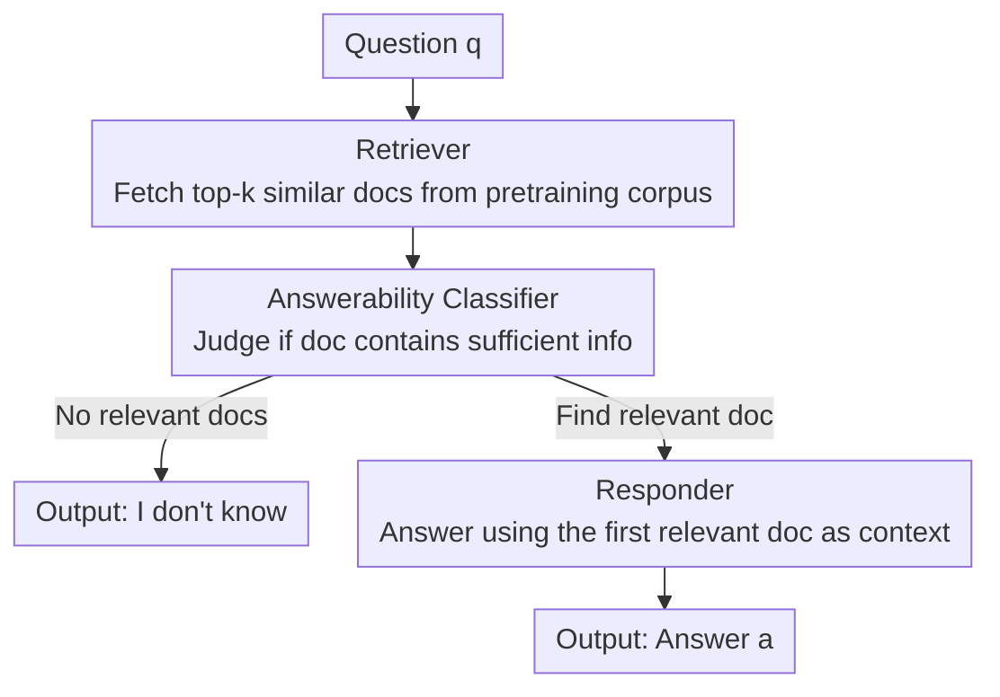

# Parametric Knowledge is Not All You Need: Toward Honest Large Language Models via Retrieval of Pretraining Data

**Conference**: ACL 2026  
**arXiv**: [2601.21218](https://arxiv.org/abs/2601.21218)  
**Code**: https://github.com/nusnlp/RETAIN  
**Area**: Hallucinations / LLM Honesty / Retrieval Augmentation  
**Keywords**: LLM Honesty, Knowledge Boundary, Pretraining Data Retrieval, Refusal, Hallucinations

## TL;DR
The authors argue that existing "LLM Honesty" benchmarks fail to consider what knowledge the model actually encountered during pretraining. By utilizing Pythia, whose training data is fully public, they define knowledge boundaries based on "retrievability of answers in pretraining data" to construct the more reliable TIP-TriviaQA benchmark. They further propose RETAIN, a tri-agent method that retrieves the model’s own pretraining corpus to decide whether to answer or refuse, improving honest EM-F1 from a baseline high of ~40 to 58.57.

## Background & Motivation
**Background**: LLMs are proficient at answering questions but often **fail to perceive what they know or do not know**, leading to confident fabrications (hallucinations) on topics where they lack knowledge. An honest model should respond with "I don't know" when lacking information. Honesty comprises two parts: **self-knowledge** (recognizing knowledge boundaries and refusing when appropriate) and **self-expression** (accurately expressing information already mastered, as low-frequency documents often result in incorrect answers despite being seen during training).

**Limitations of Prior Work**: Many existing methods for enhancing honesty (R-Tuning, RLKF, Best-of-N, self-reflective prompting, etc.) suffer from **non-robust evaluations**. These evaluations **neglect the knowledge actually ingested during pretraining** and use inconsistent models and metrics, preventing horizontal comparison. Furthermore, current benchmarks define "unanswerable" incorrectly: for instance, Cheng et al. label questions the model 100% fails as unanswerable. The authors demonstrate this measures **inconsistency (self-expression issues)** rather than a **genuine lack of knowledge (self-knowledge issues)**—finding that **94.7% of questions** labeled "unanswerable" by such standards are actually answerable.

**Key Challenge**: Constructing a reliable honesty benchmark requires knowing the model's **true knowledge boundary**. Current methods treat LLMs as black boxes with unknown training data, resulting in indirect boundary estimations that conflate "ability to answer" with "possession of knowledge." Consequently, developers cannot distinguish whether to improve self-knowledge or self-expression.

**Goal**: (1) Define knowledge boundaries using the model's **actual pretraining data** to build an honesty benchmark for fair comparison; (2) Propose a method that effectively improves honesty while simultaneously enhancing accuracy.

**Key Insight**: Utilize **Pythia**, an open model with fully public training data (a deduplicated version of The Pile). Access to training data allows for the precise determination of whether a model has "seen" a specific piece of knowledge, clearly defining when it should answer or refuse.

**Core Idea**: Operationalize the knowledge boundary as **"whether a document supporting the answer can be retrieved from the pretraining corpus."** This is used both to label the benchmark and at inference time to decide whether to answer or refuse by directly retrieving the model’s own pretraining data.

## Method

### Overall Architecture
The paper presents two primary contributions. First is the **TIP-TriviaQA** (Training-Information-Partitioned TriviaQA) benchmark: questions from TriviaQA are automatically labeled as **answerable/unanswerable** based on the presence of supporting documents in the Pythia pretraining corpus, grounding the evaluation in the model's true knowledge boundary. Second is the **RETAIN** (Retrieval-Enhanced Training-Aware INference) method: a tri-agent inference framework that retrieves the model’s pretraining data during inference to determine answerability and provide context. The inference workflow is shown below:

### Key Designs

**1. Operationalizing knowledge boundaries as "pretraining data retrievability"**

This is the central thesis. The authors use a **known-unknown four-quadrant** model to characterize the relationship between actual knowledge (horizontal axis: whether information was ingested during training) and perceived knowledge (vertical axis: whether it can be correctly answered): $N_1$ Correctly Answered (known and correct), $N_2$ Correctly Refused (unknown and refused), $N_3$ Seen but Wrong, and $N_4$ Unseen and Wrong. Improving honesty involves maximizing self-knowledge ($N_2/N_4$) and self-expression ($N_1/N_3$). Crucially, only by knowing the training data can one distinguish $N_3$ (self-expression issue) from $N_4$ (self-knowledge issue). Using Pythia's corpus, the "knowledge boundary" is defined as a computable criterion—**the existence of at least one relevant document in the pretraining corpus**. If it exists, the question is "answerable" and the gold answer should be provided; otherwise, it is "unanswerable" and the model should say "I don't know."

**2. Two-stage retrieval for automatic labeling of TIP-TriviaQA**

To avoid manual verification of billions of tokens, the authors designed a **two-stage (token then vector)** search. For pretraining documents, they built two Elasticsearch indices: a token index for speed and a vector index (split with RecursiveCharacterTextSplitter and encoded with Multilingual E5 Large). **Token-based search**: Documents containing both question keywords and the gold answer are retrieved, ranked by frequency ($k_1=100$), and judged for relevance by a critic LLM (Llama 3.1 8B Instruct). If any are relevant, it is "answerable." If none are relevant but untried documents remain, the **question is discarded** (<1% discard rate). **Vector-based search**: For questions still labeled unanswerable, the top $k_2=10$ semantically similar blocks are retrieved and judged. If all are "no," the question is finalized as "unanswerable."

**3. RETAIN: Retriever + Answerability Classifier + Responder**

RETAIN delegates tasks to three collaborating agents. The **Retriever** encodes questions using the same embedding model and performs dense retrieval ($top-k$) from the indexed pretraining data. These documents serve both for answerability classification and as context. The **Answerability Classifier** is a fine-tuned binary classifier (leveraging the same LLM as the responder) that judges if a document contains sufficient info. **Crucially, it does not see the gold answer or call external LLMs during inference**, relying purely on the model's internal judgment. The **Responder** is fine-tuned to generate gold answers given a document-question pair.

**4. Refusal-first inference workflow**

During inference, the Retriever fetches documents, and the Classifier examines them **sequentially**. If **no relevant documents** are found, the system immediately outputs "I don't know." Otherwise, the **first relevant document is used as context** for the Responder to generate the answer. This sequence—verifying the knowledge boundary before generating—distinguishes RETAIN from purely parametric methods. Ablations show that without the classifier, relying only on prompts for refusal results in almost no refusals, as LLMs are equally confident about questions outside their knowledge range.

## Key Experimental Results

### Main Results
Evaluation was conducted on TIP-TriviaQA using Pythia-12b-deduped. Metrics: Precision ($P$), Recall ($R$), and EM-F1 based on Exact Match ($FP_u$: answered unanswerable; $FN$: refused answerable; $TP$: correct; $FP_a$: incorrect). PM-F1 (SQuAD 2.0 style) is also used.

| Method | EM-Prec | EM-Rec | EM-F1 | PM-F1 |
|------|------|------|------|------|
| Prompting | 30.26 | 31.32 | 30.78 | 36.41 |
| SFT | 39.25 | 40.28 | 39.76 | 43.06 |
| BoN | 21.24 | 22.21 | 21.71 | 25.99 |
| DPO | 39.04 | 41.20 | 40.09 | 43.59 |
| R-Tuning | 39.07 | 41.21 | 40.11 | 44.16 |
| **RETAIN (Ours)** | **62.82** | **54.86** | **58.57** | **62.23** |

RETAIN significantly outperforms all baselines. The performance gap stems from **utilizing pretraining data** to refuse questions outside the knowledge scope and providing context for answerable ones. Purely parametric models struggle to refuse. On HoneSet (930 human-unanswerable questions), RETAIN achieved the highest refusal rate of **87.63%**.

### Ablation Study
RT=Retriever, AC=Answerability Classifier, RS=Responder training.

| # | RT | AC | RS | EM-F1 | PM-F1 | Note |
|---|----|----|----|------|------|------|
| 1 | ✗ | ✗ | ✗ | 30.78 | 36.41 | Equiv. to Prompting |
| 2 | ✗ | ✗ | ✓ | 39.76 | 43.06 | Equiv. to SFT |
| 3 | ✓ | ✗ | ✗ | 39.99 | 48.82 | RT alone beats baselines |
| 4 | ✓ | ✓ | ✗ | 46.55 | 54.42 | Adding AC |
| 5 | ✓ | ✗ | ✓ | 19.72 | 37.93 | RS without AC → Sharp drop |
| 6 | ✓ | ✓ | ✓ | **58.57** | **62.23** | Full RETAIN |

### Key Findings
- **Direct contribution of Retriever**: Retrieval alone (Row 3) outperforms all baselines by helping the model "recall" pretraining information.
- **Classifier is essential for honesty**: It identifies knowledge boundaries and reduces hallucinations (Rows 4 & 6).
- **Responder relies on Classifier**: Without the classifier (Row 5), performance drops significantly because the Responder assumes retrieved documents are always relevant.
- **Mitigating Long-tail**: Using pretraining documents as context significantly improves performance on "long-tail" facts seen only a few times during training.

## Highlights & Insights
- **Novelty**: Defining knowledge boundaries via training data retrievability cleanly separates "inconsistency" from "lack of knowledge" for the first time.
- **Ours**: RETAIN retrieves the **model's own pretraining corpus** rather than external knowledge, which aligns with the definition of what a model "should know" and provides interpretability.
- **Mechanism**: The tri-agent division mapping to internal vs. external honesty (self-knowledge vs. self-expression) is logically sound.
- **Experimental Thoroughness**: The evaluation paradigm can be extended to any open-source model to distinguish between "not knowing" and "unstable generation."

## Limitations & Future Work
- **Dependency on Open Data**: The method requires access to the pretraining corpus, tested only on Pythia-12b. Scalability to closed-sourced or larger models is delegated to future work.
- **Annotation Noise**: The LLM critic has an 82.8% agreement rate with humans; while high, it is not perfect.
- **Task Scope**: Limited to closed-book factoid QA; multi-hop or mathematical reasoning tasks requiring knowledge synthesis were not explored.
- **Inference Cost**: Vector retrieval and the tri-step process increase latency compared to purely parametric generation.

## Related Work & Insights
- **Comparison with Cheng et al.**: Previous work mistakenly categorized inconsistency as lack of knowledge (94.7% error rate); this work corrects the boundary definition.
- **Comparison with R-Tuning/RLKF**: These methods rely on indirect tuning without pretraining data, yielding limited improvements (EM-F1 ~40) compared to RETAIN.
- **Comparison with HoneSet/SelfAware**: Existing datasets focus on questions humans cannot answer; TIP-TriviaQA focuses on factual boundaries relative to model training.

## Rating
- **Novelty**: ⭐⭐⭐⭐⭐ (First to use pretraining data to define boundaries and retrieve it for-inference).
- **Experimental Thoroughness**: ⭐⭐⭐⭐ (Comprehensive ablations and generalization tests, but limited to Pythia-12b).
- **Writing Quality**: ⭐⭐⭐⭐ (Clear definitions of quadrants and knowledge boundaries).
- **Value**: ⭐⭐⭐⭐ (Provides a robust benchmark and an interpretable method for honesty).

<!-- RELATED:START -->

## Related Papers

- [\[ACL 2025\] Aligning Large Language Models to Follow Instructions and Hallucinate Less via Effective Data Filtering](../../ACL2025/hallucination/aligning_large_language_models_to_follow_instructions_and_hallucinate_less_via_e.md)
- [\[ACL 2026\] Stable-RAG: Mitigating Retrieval-Permutation-Induced Hallucinations in Retrieval-Augmented Generation](stable-rag_mitigating_retrieval-permutation-induced_hallucinations_in_retrieval-.md)
- [\[ACL 2025\] Retrieval Visual Contrastive Decoding to Mitigate Object Hallucinations in Large Vision-Language Models](../../ACL2025/hallucination/retrieval_visual_contrastive_decoding_to_mitigate_object_hallucinations_in_large.md)
- [\[ACL 2025\] Alleviating Hallucinations from Knowledge Misalignment in Large Language Models via Selective Abstention Learning](../../ACL2025/hallucination/alleviating_hallucinations_from_knowledge_misalignment_in_large_language_models_.md)
- [\[ACL 2026\] Benchmarking Deflection and Hallucination in Large Vision-Language Models](benchmarking_deflection_and_hallucination_in_large_vision-language_models.md)

<!-- RELATED:END -->
