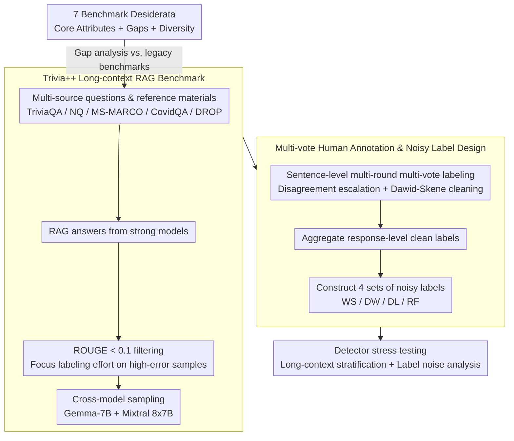

# Rethinking Evaluation for LLM Hallucination Detection: A Desiderata, A New RAG-based Benchmark, New Insights

**Conference**: ACL2026  
**arXiv**: [2605.11330](https://arxiv.org/abs/2605.11330)  
**Code**: https://github.com/amazon-science/hallucination-benchmark-trivialplus  
**Area**: Hallucination Detection  
**Keywords**: RAG Hallucination Detection, Long Context Evaluation, Label Noise, Trivia++, LLM-as-a-Judge

## TL;DR
This paper redefines seven requirements for RAG hallucination detection benchmarks and constructs Trivia++, a new benchmark featuring long contexts, multi-round human annotations, and realistic noisy labels. The study finds that existing detectors perform significantly below ideal levels on organic RAG hallucinations.

## Background & Motivation
**Background**: LLM hallucination detection has expanded from open-domain fact-checking to scenarios like summarization, QA, and RAG. Common detectors include SelfCheckGPT, LLM-as-a-Judge, few-shot judges, prompt optimization, and LoRA-based supervised fine-tuned (SFT) models. Meanwhile, the research community has accumulated benchmarks such as HaluEval, RAGTruth, FACTS, and Dolly to measure the progress of hallucination detectors.

**Limitations of Prior Work**: While many benchmarks exist, few are closely aligned with modern RAG applications. Real-world RAG often involves long contexts, domain-specific materials, knowledge-intensive questions, and answers that are difficult for humans to verify quickly. Existing datasets either have short contexts, use human-injected hallucinations, contain model-generated hallucinations via adversarial prompting, or lack reliable human evaluation labels.

**Key Challenge**: Evaluation of hallucination detection requires clean gold test labels, yet detector training often relies on LLM judges, weak supervision, or crowdsourced labels. If a benchmark only provides an idealized test set without exposing training label noise, researchers cannot determine if detectors are robust in real-world noisy-label scenarios.

**Goal**: The authors decompose the problem into three layers: first, defining what constitutes a trustworthy hallucination detection benchmark; second, examining the gaps in existing benchmarks using these criteria; and third, constructing a new dataset covering long-context RAG, organic hallucinations, human-verified labels, and various types of noisy labels.

**Key Insight**: Instead of proposing just another detector, this paper focuses on evaluation infrastructure. The authors argue that if benchmarks do not meet the requirements of modern RAG applications, detector rankings will mislead research directions, particularly by overestimating methods that perform well only on short contexts or artificial hallucinations.

**Core Idea**: The study utilizes a set of benchmark desiderata to constrain evaluation design and presents Trivia++ as an instance that incorporates long-context RAG, multi-vote human annotation, and realistic label noise into hallucination detection research.

## Method

### Overall Architecture
The workflow consists of "Evaluation Standards → Data Construction → Detector Stress Testing." First, the authors propose seven properties for hallucination detection benchmarks, categorized into core attributes, major literature gaps, and diversity attributes. Second, they build Trivia++ based on multiple QA and retrieval sources, collect RAG-style answers from three LLMs, and obtain response-level clean labels through multi-round sentence-level human annotation. Third, they construct four sets of noisy labels to simulate weak supervision, crowdsourcing disagreement, and random flipping. Fourth, they evaluate common detectors on Trivia++, RAGTruth, Dolly, and HaluEval to analyze the impact of long context and label noise on performance.

### Key Designs
**1. 7 benchmark desiderata: Establishing a unified "health check" for hallucination benchmarks so reliability is no longer determined solely by scale or popularity.**

Hallucination detection is highly dependent on evaluation definitions—how hallucinations originate, who verifies test labels, and whether noisy training labels exist. Every factor affects detector rankings. The authors explicitize these hidden constraints into seven requirements: organic generations, human-verified test labels, realistic training label noise, RAG/long-context tasks, faithfulness type coverage, multi-LLM sources, and multi-domain coverage. After a point-by-point comparison, they found that no legacy benchmark satisfies all seven. This checklist highlights three common pitfalls: if hallucinations are manually injected, detectors may simply learn to recognize injection patterns; if test labels are not human-verified, leaderboards reflect judge bias; and without noisy training labels, it is impossible to evaluate the risks of weak supervision common in real-world deployments.

**2. Trivia++ Long-context RAG benchmark: Creating a detection dataset closer to modern applications using real RAG distributions.**

To address the two largest gaps—long context and organic generation—the authors extracted questions and reference materials from sources like TriviaQA, NaturalQuestions, MS-MARCO, CovidQA, and DROP. They first used a strong commercial model to generate answers, then applied a ROUGE < 0.1 filtering strategy to retain samples with low overlap between answers and reference text to increase the hallucination hit rate, without intervening in the model output itself. Subsequently, the same context-question pairs were fed to Gemma-7B and Mixtral 8x7B to create cross-model samples. A crucial point is that ROUGE filtering is a resource allocation strategy rather than hallucination injection—it focuses valuable human annotation on organic outputs that are more likely to be erroneous while preserving the natural error distribution of LLMs, distinguishing it from manually constructed datasets like HaluEval.

**3. Multi-vote human annotation and noisy label design: A single dataset facilitating both reliable evaluation and noisy-label robustness research.**

Because long-context RAG samples are extremely difficult to annotate, the reliability of single-annotator labels is insufficient. The authors implemented multi-round, multi-vote labeling at the sentence level. Labels were categorized into Supported, Contradicted, Not Mentioned, and Supplementary, where Contradicted and Not Mentioned map to "unfaithful." The first round utilized disagreement escalation: starting with two annotators per sample, increasing to four or six in case of disagreement. The second round used the Dawid-Skene model to filter low-quality annotators and added three votes for the remaining samples. Finally, response-level labels were aggregated based on the strictest sentence-level labels to ensure test label credibility. Beside these clean labels, the authors constructed four sets of noisy labels—LLM weak supervision (WS), Dissenting Worker (DW), Dissenting Label (DL), and Random Flip (RF), with noise levels for the latter three controlled at 15%. This design allows researchers to cleanly separate the impact of sample-dependent noise (human disagreement) and sample-independent noise (random flips) for the first time on the same dataset.

### Loss & Training
The core contribution of this paper is the benchmark and evaluation analysis; no new detector loss function is proposed. SFT detectors in the experiments use Mistral-7B-Instruct-v0.2 with LoRA fine-tuning. SelfCheckGPT uses GPT-4-mini or Claude-Sonnet-3.5 to generate consistency signals. LLM-as-a-Judge, few-shot, and prompt-optimized methods generate binary decisions through prompting. Supervised methods were trained on clean and noisy labels separately and tested on the same clean test set to verify noise robustness.

## Key Experimental Results

### Main Results
The primary difference between Trivia++ and existing RAG-based benchmarks lies in long context and domain coverage. Its mean context length reaches 9.3K characters, with a maximum of 94K, significantly longer than RAGTruth and Dolly.

| Benchmark | Sample Size | Avg Context Length | Max Context Length | Hallucination Ratio | # of LLMs | Domains |
|-----------|-------------|--------------------|--------------------|---------------------|-----------|---------|
| HaluEval QA| 20K         | 344                | 1557               | 50.0%               | 1         | HotpotQA multi-hop |
| RAGTruth QA| 989         | 1.3K               | 2.8K               | 29.1%               | 6         | MS-MARCO |
| Dolly NC   | 100         | 3.1K               | 5.99K              | 44.5%               | 7         | MS-MARCO |
| Trivia++   | 3224        | 9.3K               | 94K                | 35.0%               | 3         | Paragraph/Web/Medical/Wiki |

In the detector evaluation, F1 scores on HaluEval are generally high but drop significantly on organic RAG benchmarks, indicating that non-organic hallucinations overestimate detector capabilities.

| Dataset | Best/Representative Method | F1 | Precision | Recall | Accuracy | Key Conclusion |
|---------|---------------------------|----|-----------|--------|----------|----------------|
| HaluEval | SFT | 0.996 | 0.999 | 0.993 | 0.996 | Artificial hallucinations are easily separated by supervised models |
| RAGTruth | SFT | 0.671 | 0.644 | 0.700 | 0.874 | SFT performance remains low under organic RAG hallucinations |
| Dolly NC | SC-GPT (C) | 0.667 | 0.567 | 0.810 | 0.651 | Limited performance gap on small-scale organic data |
| Trivia++ | LLM-as-a-Judge | 0.694 | 0.601 | 0.821 | 0.749 | Simple LLM judges are comparable to or better than SFT |

### Ablation Study
Long-context stratification experiments show that all detectors degrade significantly on contexts >5K characters. Trivia++ thus exposes issues that short-context benchmarks fail to observe.

| Method | Short <1K F1 | Medium 1K-5K F1 | Long >5K F1 | Long Context Gain |
|--------|--------------|-----------------|-------------|-------------------|
| SFT | 0.725 | 0.702 | 0.504 | -0.221 |
| SC-GPT (C) | 0.739 | 0.732 | 0.508 | -0.231 |
| SC-GPT (G) | 0.700 | 0.632 | 0.506 | -0.194 |
| LLM-as-a-Judge | 0.712 | 0.722 | 0.621 | -0.091 |
| Few-shot | 0.711 | 0.732 | 0.594 | -0.117 |
| Prompt-optimized | 0.701 | 0.725 | 0.535 | -0.166 |

Label noise experiments further demonstrate that noisy labels distort evaluation or training conclusions.

| Setting | SC-GPT(C) F1 | LLM-aaJ F1 | FS F1 | PO F1 | SFT F1 | Explanation |
|---------|--------------|------------|-------|-------|--------|-------------|
| Eval with WS noisy test label | 0.763 | n/a | 0.929 | 0.912 | 0.708 | WS labels optimistically overestimate LLM-based detectors |
| Eval with DW noisy test label | 0.678 | 0.680 | 0.682 | 0.664 | 0.664 | Sample-dependent human noise is closer to clean labels |
| Eval with RF noisy test label | 0.611 | 0.609 | 0.613 | 0.607 | 0.620 | Random flips pessimistically underestimate performance |
| Clean test label | 0.675 | 0.694 | 0.692 | 0.670 | 0.663 | No method approaches the ceiling under clean labels |

### Key Findings
- Trivia++ is a more challenging RAG hallucination benchmark: long contexts, natural errors, and multi-domain samples collectively lower the performance of existing detectors.
- LLM-as-a-Judge achieves F1=0.694 on Trivia++, slightly higher than FS, PO, and SFT, indicating that zero-shot judgment from strong LLMs with good prompts has become a very strong baseline.
- Supervised fine-tuning does not automatically solve the problem. SFT is nearly perfect on HaluEval but only reaches F1=0.663 on Trivia++, and training label noise further harms SFT performance.
- ReDeEP is limited by long-context memory on Trivia++; 14% to 22% of samples could not be processed on a single 95GB GPU, highlighting structural bottlenecks for attention-based detectors.

## Highlights & Insights
- The most valuable aspect of the paper is treating "benchmark credibility" as a first-class problem. While many detector papers focus on model metrics, this study shows that the source of hallucinations, label sources, and context length directly change conclusions.
- The noisy label design of Trivia++ is practical. Instead of stating that labels "might be noisy" in the abstract, it releases multiple controllable noise versions, allowing subsequent research to systematically test robust learning for hallucination detection.
- The competitiveness of LLM-as-a-Judge serves as a realistic signal: given the strength of models in 2026, complex detectors must significantly outperform carefully designed judge prompts to justify their value.
- Long-context stratification is a transferable evaluation paradigm. RAG, agent search, long-context QA, legal, and medical QA can all be stratified by context or evidence length to prevent average metrics from masking failure zones.

## Limitations & Future Work
- While covering multiple sources and three LLMs, Trivia++ is primarily focused on English RAG-QA; multilingual, code, table, and multimodal RAG hallucinations are not covered.
- The ROUGE < 0.1 filtering strategy increases hallucination density but may shift the sample distribution, biasing the benchmark toward cases with low overlap between answers and references.
- Human annotation costs are high. While 3,224 samples are valuable, the size is still relatively small for training robust detectors, especially large-scale supervised ones.
- The paper primarily evaluates general detectors without proposing new noise-robust training methods. Future work could introduce Learning from Noisy Labels (LNL) methods like co-teaching, loss correction, and confidence calibration into RAG hallucination detection.

## Related Work & Insights
- **vs HaluEval**: HaluEval is large in scale, but many hallucinations are prompted or artificially constructed; Trivia++ emphasizes organic generation, making it more effective for testing errors in real RAG outputs.
- **vs RAGTruth**: RAGTruth features human annotation and multiple LLMs but has shorter contexts and lacks various training noise labels; Trivia++ makes long context and noisy-label stress testing core designs.
- **vs FACTS / Dolly NC**: These benchmarks are helpful for faithfulness but have limitations regarding generation availability, scale, or domain diversity; the desiderata in this paper serve as a checklist for evaluating such new benchmarks.
- **Insight**: When evaluating RAG or agent systems, one should not only report overall accuracy but also inspect variables like evidence length, domain shift, label reliability, and weak-supervision bias.

## Rating
- **Novelty**: ⭐⭐⭐⭐☆ Reframes hallucination detection evaluation through desiderata and noisy-label lenses with clear problem definitions.
- **Experimental Thoroughness**: ⭐⭐⭐⭐☆ Covers multiple benchmarks, detectors, long-context stratification, and label noise, though supervised training methods could be expanded.
- **Writing Quality**: ⭐⭐⭐⭐☆ Clear structure and informative tables; logic is consistent despite dense benchmark details.
- **Value**: ⭐⭐⭐⭐⭐ Directly valuable for RAG hallucination detection, LLM judge evaluation, and noisy-label robust learning.

<!-- RELATED:START -->

## Related Papers

- [\[NeurIPS 2025\] Hallucination as an Upper Bound: A New Perspective on Text-to-Image Evaluation](../../NeurIPS2025/hallucination/hallucination_as_an_upper_bound_a_new_perspective_on_text-to-image_evaluation.md)
- [\[ACL 2026\] Understanding New-Knowledge-Induced Factual Hallucinations in LLMs: Analysis and Interpretation](understanding_new-knowledge-induced_factual_hallucinations_in_llms_analysis_and_.md)
- [\[ACL 2026\] MultiHaluDet: Multilingual Hallucination Detection via LLM Hidden State Probing](multihaludet_multilingual_hallucination_detection_via_llm_hidden_state_probing.md)
- [\[ACL 2026\] HalluAudio: A Comprehensive Benchmark for Hallucination Detection in Large Audio-Language Models](halluaudio_a_comprehensive_benchmark_for_hallucination_detection_in_large_audio-.md)
- [\[ICLR 2026\] FREAK: A Fine-grained Hallucination Evaluation Benchmark for Advanced MLLMs](../../ICLR2026/hallucination/freak_a_fine-grained_hallucination_evaluation_benchmark_for_advanced_mllms.md)

<!-- RELATED:END -->
