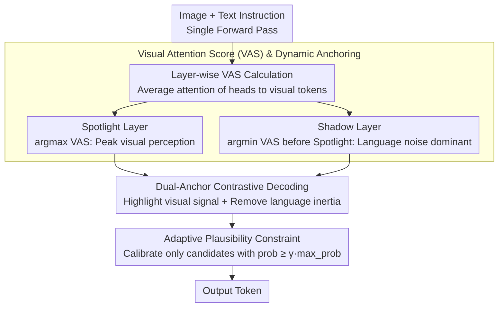

# Spotlight and Shadow: Attention-Guided Dual-Anchor Introspective Decoding for MLLM Hallucination Mitigation

**Conference**: ACL 2026 Findings  
**arXiv**: [2604.10071](https://arxiv.org/abs/2604.10071)  
**Code**: None  
**Area**: Hallucination Detection  
**Keywords**: Multimodal Hallucination, Contrastive Decoding, Layer-wise Analysis, Visual Attention, Training-free

## TL;DR

Ours proposes DaID (Dual-Anchor Introspective Decoding), which mines visual perception differences across MLLM internal layers—amplifying visual signals via the "Spotlight" layer and suppressing linguistic inertia via the "Shadow" layer—to achieve hallucination mitigation within a single forward pass.

## Background & Motivation

**Background**: Multimodal Large Language Models (MLLMs) excel in reasoning tasks but suffer from severe hallucination issues, where generated text is inconsistent with visual content.

**Limitations of Prior Work**: Existing contrastive decoding methods (e.g., VCD, ICD) have two major flaws: (1) they require an additional forward pass per step to obtain the negative sample distribution, increasing inference latency by 1.83×; (2) they rely on heuristic external perturbations (e.g., visual masking) to construct the negative distribution, which introduces stochastic noise leading to semantic drift.

**Key Challenge**: The uncertainty of external perturbations may cause correct visual signals to be erroneously suppressed (e.g., VCD replacing a correct "yellow" with an incorrect "red").

**Goal**: Transition from an external intervention paradigm to an internal introspection paradigm, utilizing the model's own intermediate layer perception differences as the source of contrastive signals.

**Key Insight**: Through layer-wise diagnostics of MLLMs, it was discovered that shallow layers have a strong hallucination tendency (visual agnosia), intermediate layers possess the strongest visual perception (peak fidelity), and deep layers see visual signals overwritten by linguistic priors (the "see-then-forget" phenomenon).

**Core Idea**: Use Visual Attention Scores (VAS) to dynamically locate a Spotlight layer (peak visual perception) and a Shadow layer (linguistic noise dominant) for each token, achieving hallucination suppression through contrastive calibration within a single forward pass.

## Method

### Overall Architecture

During the standard MLLM decoding process, DaID utilizes the attention distribution over visual tokens across layers to select two anchor layers in real-time: the Spotlight layer ($\arg\max$ visual attention $\rightarrow$ amplifies visual signals) and the Shadow layer ($\arg\min$ visual attention before Spotlight $\rightarrow$ suppresses linguistic priors). These are used to calibrate the final logits via a dual-anchor contrastive formula, with an adaptive plausibility constraint to restrict calibration to syntactically valid candidates. The entire process requires no additional forward pass.

### Key Designs

**1. Visual Attention Score (VAS) and Dynamic Anchoring: Using the model's own attention to visual tokens as a probe to find peak and noise layers per token.**

Contrastive decoding requires "positive" and "negative" signal sources. Previous methods relied on external perturbations (masking images) to forge negative samples, which adds an extra forward pass and introduces noise. DaID looks internally: it defines the Visual Attention Score $\text{VAS}_t(l)$ as the average attention weight of all heads in layer $l$ toward visual tokens. The layer with $\arg\max\,\text{VAS}$ is selected as the Spotlight (peak fidelity), and the layer with $\arg\min\,\text{VAS}$ prior to the Spotlight is selected as the Shadow (weakest vision, linguistic noise dominant). Experiments show that visual attention is highly synchronized with object recognition accuracy/hallucination rates (both peak at layer 25 in LLaVA-1.5), making VAS a reliable, training-free proxy for the model's cognitive state.

**2. Dual-Anchor Contrastive Decoding: Simultaneously "highlighting" visual signals and "denoising" linguistic inertia in one forward pass.**

Hallucinations stem from both weak visual signals and strong linguistic priors; thus, enhancing vision or suppressing language alone is insufficient. DaID integrates logits from both anchor layers into the final logit calibration:

$$L_{\text{DaID}} = [L_{\text{final}} + \alpha \cdot L_{\text{spotlight}}] \cdot (1+\beta) - \beta \cdot L_{\text{shadow}}$$

Where $\alpha$ controls visual enhancement and $\beta$ controls linguistic suppression. The first part incorporates visual evidence from the Spotlight layer to amplify correct signals, while the second part subtracts the linguistic inertia represented by the Shadow layer. This completes "highlighting + denoising" in one pass without the extra overhead of VCD.

**3. Adaptive Plausibility Constraint: Restricting calibration to syntactically sensible candidates.**

The Spotlight layer comes from intermediate layers; while visual-related, its logits might include syntactically inappropriate tokens. Applying calibration directly could disrupt sentence fluency. The constraint applies dual-anchor calibration only to candidate tokens in the final layer distribution with probability $\ge \gamma \cdot \max\text{-prob}$, setting others to zero. This restricts the calibration to a "syntactically reasonable" space, reaping visual benefits without promoting nonsensical tokens.

### Loss & Training

DaID is a training-free inference-time method. Key hyperparameters: $\alpha=0.8$ (visual enhancement), $\beta=0.2$ (language suppression), $\gamma=0.9$ (for POPE) / $0.1$ (others).

## Key Experimental Results

### Main Results

**Hallucination Benchmarks on LLaVA-1.5-7B**:

| Method | POPE Acc | POPE F1 | CHAIR_S↓ | CHAIR_I↓ | MME Total↑ |
|------|----------|---------|----------|----------|-----------|
| Greedy | 81.38 | 82.20 | 49.6 | 14.4 | 559.48 |
| VCD | 84.66 | 84.52 | 49.2 | 14.8 | 603.66 |
| OPERA | 84.88 | 85.21 | 45.4 | 12.7 | 549.00 |
| SID | 84.82 | 85.50 | 44.2 | 12.2 | 599.80 |
| EAZY | 84.97 | 85.78 | 38.8 | 11.4 | 596.16 |
| **Ours (DaID)** | **85.08** | **85.92** | **35.9** | **11.3** | **633.68** |

**Hallucination Benchmarks on LLaVA-NeXT**:

| Method | POPE Acc | POPE F1 | CHAIR_S↓ | CHAIR_I↓ | MME Total↑ |
|------|----------|---------|----------|----------|-----------|
| Greedy | 83.78 | 82.24 | 32.8 | 9.1 | 580.92 |
| EAZY | 84.91 | 85.40 | 26.8 | 8.3 | 611.14 |
| **Ours (DaID)** | **85.32** | **85.76** | **24.2** | **8.2** | **644.40** |

### Ablation Study

**Hyperparameter Analysis (LLaVA-1.5)**:
- $\alpha$ from $0.4\rightarrow0.8$: POPE Acc rises from 83.44% to 85.08%; performance drops for $\alpha > 0.8$ (excessive visual signal disrupts syntax).
- $\beta=0.2$ is optimal: compared to $\beta=0$ (no suppression), F1 +0.93%, Acc +0.51%; $\beta > 0.2$ leads to performance degradation due to over-suppression.

**General Reasoning Ability**: Across GQA, VQAv2, MMB, SeedI, and VizWiz benchmarks, DaID consistently maintains or improves performance at both 7B and 13B scales (e.g., +2.1% on SeedI).

### Key Findings

- Layer-wise diagnostics reveal the "see-then-forget" phenomenon in MLLMs: object recognition accuracy peaks in intermediate layers and drops significantly in deep layers (e.g., an 11.12% drop in LLaVA-NeXT).
- Visual attention synchronizes precisely with object recognition accuracy (both peak at layer 25 in LLaVA-1.5), validating VAS as a reliable proxy for cognitive state.
- DaID outperforms methods like VCD and OPERA without increasing inference overhead, thanks to the single forward pass.
- Generalization experiments across five MLLM architectures confirm the consistent effectiveness of the method.

## Highlights & Insights

- The paradigm shift from "external perturbation" to "internal introspection" is elegant—it avoids external noise and reduces computational overhead.
- The "Spotlight + Shadow" dual-anchor concept is highly intuitive: shallow layers = linguistic noise $\rightarrow$ Shadow; intermediate layers = visual peak $\rightarrow$ Spotlight.
- The layer-wise diagnostic analysis itself holds significant scientific value—the "see-then-forget" phenomenon and the attention proxy mechanism could inspire further research.
- The method is entirely training-free and can be applied plug-and-play to any MLLM.

## Limitations & Future Work

- $\alpha$ and $\beta$ require different settings across benchmarks (e.g., $\gamma=0.9$ for POPE vs. $0.1$ for others), indicating a lack of automated hyperparameter selection.
- Layer analysis is based on the LLaVA series; optimal layers for other architectures (e.g., Qwen2-VL) may differ.
- While boasting a single forward pass, the overhead for attention extraction and layer-wise logit computation was not detailed in terms of specific latency.
- Extension to more complex multimodal scenarios like video understanding remains to be explored.

## Related Work & Insights

- Comparison with VCD is most illustrative: whereas VCD uses external perturbations for negative distributions, DaID uses shallow linguistic priors as a natural negative distribution, proving both more elegant and effective.
- DoLa similarly uses layer-wise contrast but only compares early and late layers to extract factual knowledge; DaID's dual-anchor + VAS dynamic selection is more fine-grained for multimodal tasks.
- Implications for MLLM architecture: auxiliary objectives for visual retention in intermediate layers could be considered during training to mitigate "see-then-forget" at the source.

## Rating

- Novelty: ⭐⭐⭐⭐⭐ The internal introspection paradigm is novel, the dual-anchor dynamic selection is ingenious, and the "see-then-forget" discovery is valuable.
- Experimental Thoroughness: ⭐⭐⭐⭐ Includes multiple hallucination and general benchmarks, multiple MLLMs, and thorough hyperparameter analysis.
- Writing Quality: ⭐⭐⭐⭐⭐ The paper structure is excellent, flowing naturally from Motivation to Observation to Method.

<!-- RELATED:START -->

## Related Papers

- [\[AAAI 2026\] Causally-Grounded Dual-Path Attention Intervention for Object Hallucination Mitigation in LVLMs](../../AAAI2026/hallucination/causally-grounded_dual-path_attention_intervention_for_objec.md)
- [\[CVPR 2026\] Tell Model Where to Look: Mitigating Hallucinations in MLLMs by Vision-Guided Attention](../../CVPR2026/hallucination/tell_model_where_to_look_mitigating_hallucinations_in_mllms_by_vision-guided_att.md)
- [\[CVPR 2026\] Cross-Modal Attention Calibration for LVLM Hallucination Mitigation](../../CVPR2026/hallucination/cross-modal_attention_calibration_for_lvlm_hallucination_mitigation.md)
- [\[ICLR 2026\] Imitating the Truth: Attention-aware Truth-Guided Enhancement for Hallucination Mitigation in Large Vision-Language Models](../../ICLR2026/hallucination/imitating_the_truth_attention-aware_truth-guided_enhancement_for_hallucination_m.md)
- [\[ACL 2026\] Hallucination Detection in LLMs with Topological Divergence on Attention Graphs](hallucination_detection_in_llms_with_topological_divergence_on_attention_graphs.md)

<!-- RELATED:END -->
