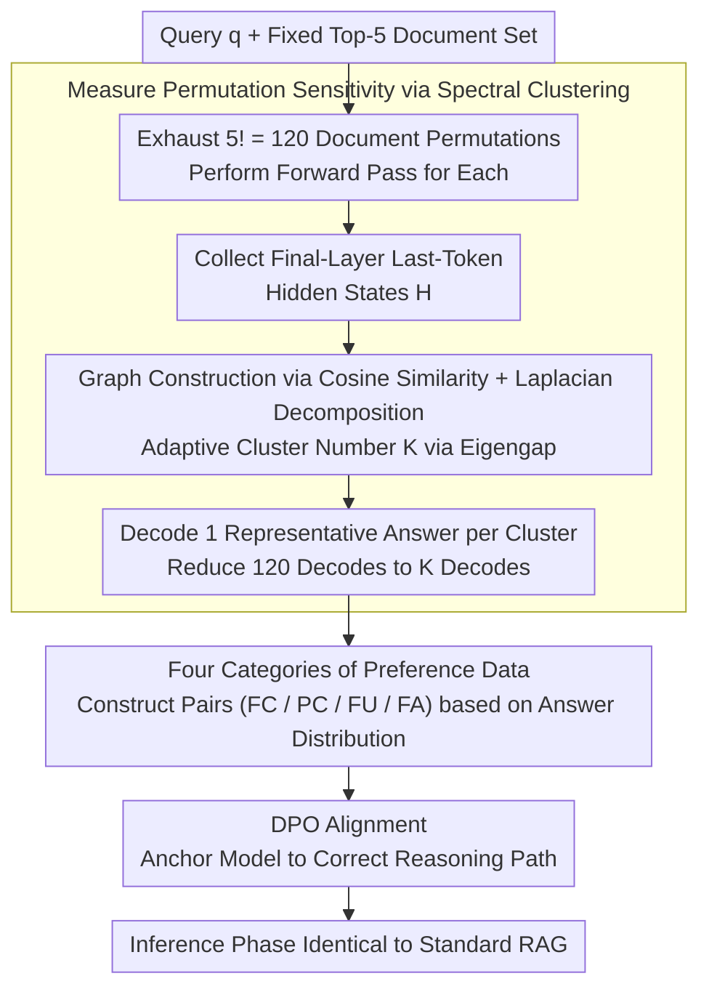

# Stable-RAG: Mitigating Retrieval-Permutation-Induced Hallucinations in Retrieval-Augmented Generation

**Conference**: ACL 2026  
**arXiv**: [2601.02993](https://arxiv.org/abs/2601.02993)  
**Code**: [GitHub](https://github.com/zqc1023/Stable-RAG)  
**Area**: Hallucination Detection  
**Keywords**: Retrieval-Augmented Generation, Permutation Sensitivity, Hallucination, Hidden State Clustering, Preference Alignment

## TL;DR

This work reveals the high sensitivity of RAG systems to the permutation order of retrieved documents and proposes Stable-RAG. By applying spectral clustering to hidden states generated by document permutations to identify dominant reasoning patterns, and subsequently employing DPO alignment to guide hallucinatory outputs toward correct answers, Stable-RAG achieves dual improvements in accuracy and reasoning consistency across three QA datasets.

## Background & Motivation

**Background**: RAG is a crucial paradigm for mitigating factual hallucinations in LLMs by providing evidence support through retrieved external documents. Current RAG research primarily focuses on retrieval quality (how to find better documents) and position bias (uneven attention in long contexts).

**Limitations of Prior Work**: The authors identify a previously overlooked vulnerability—permutation sensitivity. Even when the retrieved document set is identical (containing gold-standard documents), simply changing the document order can lead the model down vastly different reasoning paths, resulting in inconsistent answers. On the NQ dataset, even with the gold document fixed in the first position, the Permutation Success Rate (PSR) of LLMs remains high.

**Key Challenge**: Permutation sensitivity is neither a retrieval quality issue (as the document set is identical) nor a long-context position bias (Top-5 is typically within a thousand tokens). Instead, it stems from the structural instability of the internal reasoning dynamics in LLMs—as network depth increases, document permutations induce an increasing number of divergent reasoning trajectories.

**Goal**: (1) Quantify and understand the internal mechanism of permutation sensitivity, and (2) design a model-agnostic method to enable RAG systems to produce consistent and accurate outputs under any document permutation.

**Key Insight**: By visualizing the spectral clustering behavior of hidden states layer by layer, the authors find that shallow-layer hidden states are mixed, while deep-layer hidden states are clearly clustered according to the final answer. Furthermore, sensitive samples exhibit significantly more clusters than non-sensitive samples, indicating that permutation effects are amplified in higher layers.

**Core Idea**: Utilize the permutation sensitivity estimation itself to eliminate permutation-induced hallucinations. This involves performing spectral clustering on the final-layer hidden states of all permutations, decoding representative answers from each cluster center, and then constructing preference data to align the model via DPO.

## Method

### Overall Architecture

Ours decomposes the elimination of permutation hallucinations into a pipeline from internal observation to preference alignment. Given a query $q$ and a fixed Top-5 document set, all $5!=120$ permutations are processed through the model. The hidden states of the last token in the final layer are collected for spectral clustering to identify several dominant reasoning paths. Representative answers from these paths are categorized as "to be rewarded" or "to be penalized" to construct preference pairs. Finally, DPO is used to guide the model toward the correct path, ensuring insensitivity to document order. The method is model-agnostic and only involves permutation sampling during training; the inference phase remains identical to standard RAG.

### Key Designs

**1. Measuring Permutation Sensitivity via Spectral Clustering: Compressing 120 Decodes into K**

Directly decoding and voting on all permutations is computationally expensive and fails to distinguish permutations that follow the same reasoning path. Ours performs statistics in the "hidden state space" instead. For $N=n!$ permutations, the last-token hidden states are concatenated into $H \in \mathbb{R}^{N \times d}$. A graph is constructed using cosine similarity $A_{ij} = \exp(-\frac{1-\cos(h^{(i)}, h^{(j)})}{\sigma})$, and the number of clusters $K$ is adaptively determined using the eigengap of the normalized Laplacian $L = I - D^{-1/2}AD^{-1/2}$. Decoding only the hidden state closest to each cluster centroid represents the answer for the entire cluster. This is effective because layer-wise visualization shows deep hidden states clearly cluster by final answer—quantitatively, this clustering achieves an F1 of 83.9% on LLaMA3 and 87.6% on Qwen3, reliably recovering the model's reasoning modes.

**2. Four Categories of Preference Data: Targeted Treatments for Permutation Inconsistency**

Simple "correct/incorrect" labels ignore the structural information in the permutation distribution. Ours categorizes samples based on the clustered answer distribution: FC (fully correct under all permutations) is excluded from training as the model is already stable; PC (partially correct) uses the most frequent correct answer as $y_w$ and the most frequent incorrect answer as $y_l$ to stabilize existing capabilities; FU (fully incorrect and unanswerable) sets $y_w=$ "I don't know" to teach the model to abstain rather than hallucinate; FA (fully incorrect but answerable) sets the gold answer as $y_w$ to force the model to derive correct conclusions. This alignment ensures DPO signals match the failure mode—stabilization, abstention, or correction. PC contributes the most, with its removal dropping average SubEM from 52.34 to 42.51.

**3. DPO Alignment: Anchoring the Model via Preference Pairs**

With preference pairs, the model is trained using the standard DPO loss $\mathcal{L}_{\text{DPO}} = -\mathbb{E}[\log\sigma(\beta \log\frac{\pi_\theta(y_w|x)}{\pi_{\text{ref}}(y_w|x)} - \beta \log\frac{\pi_\theta(y_l|x)}{\pi_{\text{ref}}(y_l|x)})]$, where input $x$ is the query concatenated with a specific document permutation. DPO is chosen over RLHF as it learns directly from preference pairs without a separate reward model, efficiently utilizing the high-quality data from clustering. Feeding "different permutations" as $x$ explicitly trains the model to converge to the same $y_w$ regardless of order, which is the objective for suppressing permutation hallucinations.

### Loss & Training

Standard DPO loss is used, with $\beta$ controlling preference sharpness. Base models are LLaMA3-8B-Instruct and Qwen3-8B. Retrievers include DPR and Contriever with Top-5 retrieval. For each query in the training set, full permutations ($5!=120$) are used for hidden state clustering and preference data construction.

## Key Experimental Results

### Main Results

LLaMA3-8B-Instruct, SubEM (%) / F1 (%):

| Method | NQ (Contriever) | TriviaQA (DPR) | HotpotQA (Contriever) | Average SubEM |
|------|-----------------|----------------|----------------------|------------|
| Vanilla RAG | 40.75 / 42.82 | 67.12 / 68.61 | 30.73 / 34.08 | 45.66 |
| RetRobust | 41.82 / 44.26 | 68.67 / 70.42 | 31.46 / 35.34 | 47.08 |
| ATM | 43.75 / 44.88 | 70.12 / 70.35 | 34.36 / 36.97 | 48.82 |
| **Ours** | **48.14** / 45.80 | **73.43** / **73.76** | **38.91** / **39.87** | **52.34** |

Qwen3-8B, SubEM (%):

| Method | NQ (Contriever) | TriviaQA (DPR) | HotpotQA (Contriever) | Average SubEM |
|------|-----------------|----------------|----------------------|------------|
| Vanilla RAG | 44.65 | 69.62 | 33.14 | 48.08 |
| ATM | 45.47 | 70.06 | 35.12 | 49.24 |
| **Ours** | **46.12** | **71.32** | **35.73** | **50.27** |

### Ablation Study

Based on LLaMA3-8B-Instruct (Contriever, NQ SubEM):

| Component | Average SubEM | Abstention Rate (AR) |
|------|-----------|----------|
| Full Stable-RAG | 52.34 | Moderate |
| w/o PC | 42.51 | 35.1% |
| PC only (no FA/FU) | 51.96 | 0.0% |
| PC + FU (no FA) | 50.87 | 17.3% |

Clustering quality improves with network depth (LLaMA3-8B, NQ, DPR):

| Layer | Precision | Recall | F1 |
|----|-----------|--------|-----|
| 8 | 69.2 | 71.8 | 69.3 |
| 16 | 81.4 | 82.5 | 81.3 |
| 24 | 82.3 | 83.7 | 82.2 |
| 32 | 84.1 | 85.2 | 83.9 |

### Key Findings

- Permutation sensitivity is a widespread phenomenon: even with the gold document in the first position, the PSR for various LLaMA versions reaches 40-60%.
- Hidden state clustering quality increases with depth: LLaMA3 F1 improves from 69.3% at layer 8 to 83.9% at layer 32.
- The PC (Partially Correct) component contributes most significantly; removing it causes the average SubEM to drop from 52.34 to 42.51.
- Stable-RAG demonstrates strong generalization across different datasets, retrievers, and Top-K values.

## Highlights & Insights

- The problem of "permutation sensitivity" is precisely defined—it is distinct from retrieval quality or long-context issues, opening a new dimension for RAG robustness research.
- Layer-wise hidden state visualization intuitively reveals how permutations affect internal reasoning: from shallow-layer mixing to deep-layer divergence.
- The construction strategy for four categories of preference data (FC/PC/FU/FA) reflects fine-grained training signal design.

## Limitations & Future Work

- Computational overhead for full permutations $n!$ is high (120 forward passes for Top-5), requiring sampling strategies when scaling to more retrieved documents.
- Evaluation is currently limited to QA tasks; permutation sensitivity in long-form generation may exhibit different characteristics.
- Exploration of combining training-time and inference-time methods (e.g., multi-permutation decoding + voting) remains to be conducted.

## Related Work & Insights

- RetRobust and RAAT train robustness via retrieval noise injection but do not address permutation; ATM considers permutation perturbations but lacks explicit reasoning trajectory modeling.
- Pos2Distill and Ms-PoE focus on long-context position bias, whereas permutation sensitivity exists even in short contexts (<1000 tokens).
- Insight: LLM reasoning paths are more fragile than previously assumed; minute structural changes in input (without changing semantic content) can lead to entirely different outputs.

## Rating

- Novelty: ⭐⭐⭐⭐⭐ 
- Experimental Thoroughness: ⭐⭐⭐⭐ 
- Writing Quality: ⭐⭐⭐⭐ 

<!-- RELATED:START -->

## Related Papers

- [\[ACL 2025\] Automated Explanation Generation and Hallucination Detection for Heritage Image Retrieval](../../ACL2025/hallucination/automated_explanation_generation_and_hallucination_detection_for_heritage_image_.md)
- [\[ACL 2025\] Removal of Hallucination on Hallucination: Debate-Augmented RAG](../../ACL2025/hallucination/removal_of_hallucination_on_hallucination_debate-augmented_rag.md)
- [\[ACL 2025\] REFIND at SemEval-2025 Task 3: Retrieval-Augmented Factuality Hallucination Detection in Large Language Models](../../ACL2025/hallucination/refind_at_semeval-2025_task_3_retrieval-augmented_factuality_hallucination_detec.md)
- [\[ACL 2026\] TPA: Next Token Probability Attribution for Detecting Hallucinations in RAG](tpa_next_token_probability_attribution_for_detecting_hallucinations_in_rag.md)
- [\[ACL 2026\] Mechanisms of Prompt-Induced Hallucination in Vision–Language Models](mechanisms_of_prompt-induced_hallucination_in_vision-language_models.md)

<!-- RELATED:END -->
