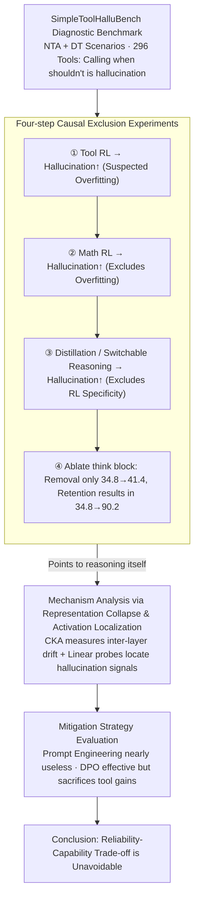

# The Reasoning Trap: How Enhancing LLM Reasoning Amplifies Tool Hallucination

**Conference**: ACL 2026  
**arXiv**: [2510.22977](https://arxiv.org/abs/2510.22977)  
**Code**: [GitHub](https://github.com/albert-y1n/Reasoning_Trap)  
**Area**: Hallucination Detection  
**Keywords**: Tool Hallucination, Reasoning Enhancement, Reinforcement Learning, Reliability-Capability Trade-off, LLM Agents

## TL;DR

This work systematically reveals the "Reasoning Trap" paradox: enhancing LLM reasoning capabilities (whether through RL, distillation, or switchable reasoning modes) systematically amplifies tool hallucinations. This effect is inherently associated with the reasoning process itself rather than RL training, and existing mitigation strategies (Prompt Engineering, DPO) face an inevitable reliability-capability trade-off.

## Background & Motivation

**Background**: LLMs are evolving from text generators into "think-before-acting" agents. Through reasoning enhancement (RL, distillation, etc.), their planning and tool-use capabilities are continuously improved, which is the core path for building reliable AI Agents.

**Limitations of Prior Work**: Stronger reasoning models, such as OpenAI o3, have exhibited a more pronounced tendency toward hallucinations. However, no prior research has systematically examined whether reasoning enhancement itself leads to tool hallucinations—specifically, the model fabricating non-existent tools or incorrectly using irrelevant ones.

**Key Challenge**: Intuitively, stronger reasoning capabilities should lead to higher reliability. However, experimental observations show the opposite—stronger reasoning coexists with higher tool hallucination rates. This is not merely an overfitting issue, as RL training on non-tool-related tasks (such as mathematics) also amplifies tool hallucinations.

**Goal**: This paper aims to answer three core questions: (RQ1) Does reasoning enhancement increase tool hallucinations? (RQ2) What is the underlying mechanism? (RQ3) Can it be effectively mitigated?

**Key Insight**: The authors construct a lightweight diagnostic benchmark, SimpleToolHalluBench, to exclude alternative explanations through controlled experiments, ultimately locating the cause within the reasoning process itself.

**Core Idea**: Reasoning chain training causes models to develop a behavior pattern of "confidently filling the gap." When placed in tool-use scenarios, this pattern naturally manifests as tool hallucinations—models tend to generate plausible-sounding but ungrounded tool calls.

## Method

### Overall Architecture

The study systematically excludes alternative hypotheses in four steps: (1) Verifying that tool-related RL increases hallucinations; (2) Verifying that non-tool RL (mathematics) similarly increases hallucinations (excluding overfitting); (3) Verifying that distillation and switchable reasoning modes also increase hallucinations (excluding RL specificity); (4) Using ablation experiments to separate reasoning steps from RL training itself. After identifying reasoning as the culprit, a mechanism analysis is performed (representation collapse + activation probes), and finally, mitigation strategies are evaluated, exposing their associated costs.

### Key Designs

**1. SimpleToolHalluBench Diagnostic Benchmark: Specifically measuring "whether the model can resist calling when it shouldn't"**

Existing tool benchmarks focus on "whether the model can call tools correctly," but few measure "whether the model will force a call when it shouldn't." SimpleToolHalluBench makes this measurable by designing two controlled scenarios: NTA (No Tool Available—no tools provided, but query requires one) and DT (Distractor Tools—only irrelevant tools provided). With 296 tools and corresponding queries, any tool call under NTA/DT settings is strictly a hallucination, allowing hallucination rates to be cleanly isolated and measured.

**2. Four-step Causal Exclusion Experiments: Driving the cause of tool hallucination step-by-step toward "reasoning itself"**

Observing that "stronger reasoning models hallucinate more" is merely a correlation. The authors establish causality through an exclusion chain. First, tool-related RL increases hallucinations—but this might be overfitting tool data. Second, using pure mathematics RL training still results in increased hallucinations, excluding the overfitting hypothesis. Third, substituting RL with distillation and switchable reasoning modes also yields increased hallucinations, showing it is not specific to RL training. Fourth, ablating the reasoning step directly: removing the `<think>` block only slightly increases hallucinations (34.8→41.4), whereas keeping it causes a surge (34.8→90.2). This identifies the reasoning process itself as the culprit.

**3. Mechanism Analysis of Representation Collapse and Activation Localization: Answering "Why" and "Where"**

After identifying reasoning as the cause, the authors examine internal model dynamics. CKA is used to compare layer representations before and after RL: while in-domain representations are stable (CKA > 0.9), tool-related representations drift significantly in early and intermediate layers (CKA < 0.75), suggesting reasoning training reshapes internal tool processing. Additionally, linear probes locate hallucination signals: correct and hallucinated responses are most linearly separable in late-stage residual streams (separability score > 0.14), while attention and MLP outputs are nearly inseparable. This grounds behavioral phenomena in specific layers and components.

**4. Mitigation Strategy Evaluation: Verifying the choice between reliability and capability**

The authors evaluated two mainstream routes: Prompt Engineering (explicitly requesting "do not use unprovided tools") was largely ineffective, with the NTA hallucination rate only dropping from 90.2 to 87.5. DPO (aligning "honest responses" to preferences and suppressing "hallucinated responses") was effective, dropping NTA from 90.2 to 55.8, but it reduced the SynTool reward from 0.45 to 0.34. Consequently, current mitigations involve a reliability-capability trade-off—suppressing hallucinations necessitates sacrificing gains in tool execution.

## Key Experimental Results

### Main Results

| Model/Config | R_NTA(↓) | R_DT(↓) | Description |
|----------|----------|---------|------|
| Qwen2.5-7B-Instruct | 34.8 | 54.7 | Baseline |
| + ReCall RL (Tool) | 90.2 | 100.0 | Tool RL causes massive increase |
| + GRPO (Math) | ↑ | ↑ | Non-tool RL also increases |
| R1-Distill-Qwen-7B | 74.3 | 78.7 | Distillation increases |
| Qwen3-8B Think Off | 4.1 | 36.2 | Reasoning disabled |
| Qwen3-8B Think On | 5.4 | 56.8 | Reasoning enabled increase |

### Ablation Study

| Config | R_NTA | R_DT | Reward |
|------|-------|------|--------|
| Baseline | 34.8 | 54.7 | 0.22 |
| Direct Tool RL (No Reasoning) | 41.4 | 63.6 | 0.28 |
| Think-then-act RL | 90.2 | 100.0 | 0.45 |
| + Prompt Engineering | 87.5 | 98.9 | 0.44 |
| + DPO | 55.8 | 71.4 | 0.34 |

### Key Findings
- Reasoning enhancement consistently increases tool hallucinations across all tested methods (RL, distillation, switchable modes).
- RL training even on pure math tasks increases tool hallucinations, excluding the overfitting hypothesis.
- Ablations show the reasoning steps (the `<think>` block) itself, rather than RL training, is the core factor.
- Instruction following capability remains stable (IFEval: -2.6%) and tool-calling capability even improves (BFCL: +9.9%), while hallucinations surge—proving tool hallucination is an independent failure mode.
- DPO mitigation is effective but incurs an inevitable capability-reliability trade-off.

## Highlights & Insights
- **Reveals a profound paradox**: Reasoning enhancement makes models "smarter but less honest," posing a fundamental warning to current reasoning scaling research.
- **Textbook-level experimental design**: The four-step exclusion method systematically establishes causal evidence with rigorous logic.
- **Deep mechanism analysis**: CKA representation analysis and activation probing answer not just "what" but "why" and "where."
- **Core Insight**: Tool hallucination is neither overfitting nor instruction-following degradation, but an intrinsic side effect of reasoning enhancement.

## Limitations & Future Work
- **Focus on single-step tool calling**: Real-world agents involve multi-step tool chains where hallucination effects may accumulate.
- **Incomplete causality**: Mechanism analysis reveals correlated patterns but does not provide a complete causal explanation.
- **Limited mitigation strategies**: Only Prompt Engineering and DPO were evaluated; methods like process supervision or Constitutional AI remain unexplored.
- Future work requires joint optimization of capability and reliability training objectives rather than post-hoc fixes.

## Related Work & Insights
- **vs ToolBeHonest**: That work focuses on diagnostic evaluation, whereas this study investigates the relationship between reasoning enhancement and hallucination.
- **vs ReCall**: ReCall is a SOTA agent reasoning RL framework; this paper reveals its "hidden costs."
- **vs DeepSeek-R1**: While R1 transfers reasoning capabilities via distillation, this paper proves that hallucination tendencies are transferred as well.

## Rating
- Novelty: ⭐⭐⭐⭐⭐ First to systematically link reasoning enhancement with tool hallucination; findings are highly significant.
- Experimental Thoroughness: ⭐⭐⭐⭐⭐ Extremely rigorous design with four-step exclusion, mechanism analysis, and mitigation evaluation.
- Writing Quality: ⭐⭐⭐⭐⭐ Clear logical chain; each experiment answers a specific question in a progressive manner.
- Value: ⭐⭐⭐⭐⭐ Provides a fundamental warning for current reasoning scaling paths and is crucial for Agent safety.

<!-- RELATED:START -->

## Related Papers

- [\[NeurIPS 2025\] Reasoning Models Hallucinate More: Factuality-Aware Reinforcement Learning for Large Reasoning Models](../../NeurIPS2025/hallucination/reasoning_models_hallucinate_more_factuality-aware_reinforcement_learning_for_la.md)
- [\[ACL 2026\] Enhancing Hallucination Detection via Future Context](enhancing_hallucination_detection_via_future_context.md)
- [\[ICML 2026\] Harnessing Reasoning Trajectories for Hallucination Detection via Answer-agreement Representation Shaping](../../ICML2026/hallucination/harnessing_reasoning_trajectories_for_hallucination_detection_via_answer-agreeme.md)
- [\[CVPR 2026\] Understanding the Role of Hallucination in Reinforcement Post-Training of Multimodal Reasoning Models](../../CVPR2026/hallucination/understanding_the_role_of_hallucination_in_reinforcement_post-training_of_multim.md)
- [\[ACL 2026\] 为什么 LLM 在结构化知识上产生幻觉：推理过程的机制分析](why_llms_hallucinate_on_structured_knowledge_a_mechanistic_analysis_of_reasoning.md)

<!-- RELATED:END -->
